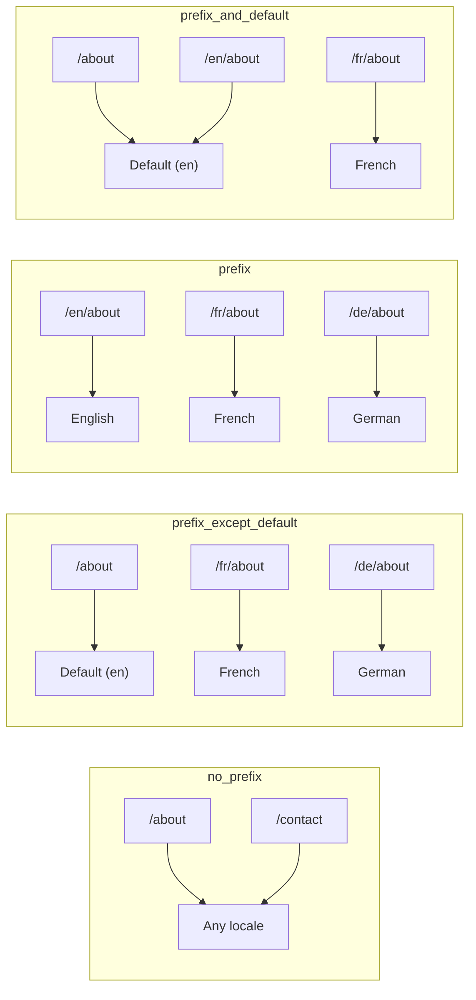
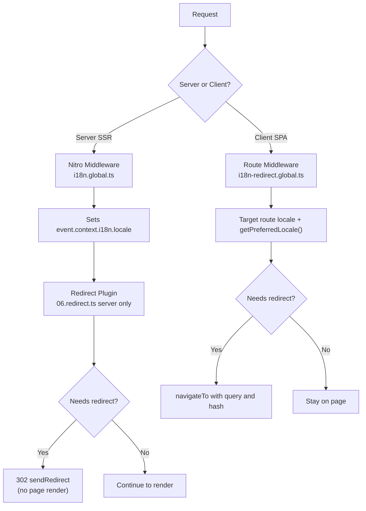

# 🗂️ אסטרטגיות ניתוב ב-Nuxt I18n Micro

## 📖 סקירה

Nuxt I18n Micro שולט כיצד קידומות locale מופיעות ב-URLs באמצעות האפשרות `strategy`. מתחת למכסה, שתי חבילות מיישמות זאת:

- **`@i18n-micro/route-strategy`** — יצירת route בזמן build (מרחיב עמודי Nuxt עם routes מקומיים)
- **`@i18n-micro/path-strategy`** — פתרון נתיב בזמן ריצה, הפניות, מאפייני SEO ויצירת קישורים

מודול Nuxt בוחר את מחלקת האסטרטגיה הנכונה בזמן build ומייצר לה alias דרך `#i18n-strategy`, כך שרק המימוש הנבחר נארז.

## 🚦 אסטרטגיות זמינות

{/* generated:option:strategy — do not edit; run `pnpm run docs:generate` */}

**Type** `Strategies` · **Default** `'prefix_except_default'`

אסטרטגיית ניתוב URL עבור קידומות locale.

- `'no_prefix'` — אין locale ב-URL; locale מאוחסן ב-cookie.
- `'prefix_except_default'` — קידומת לכל ה-locales מלבד ברירת המחדל.
- `'prefix'` — תמיד קידומת, כולל ה-locale ברירת המחדל.
- `'prefix_and_default'` — כמו `prefix`, אך ה-locale ברירת המחדל נגיש גם ללא קידומת.

{/* /generated:option:strategy */}

### השוואת אסטרטגיות



### 🛑 `no_prefix`

ל-URLs אין segment של locale. Locale נקבע על ידי cookies, מצב `useI18nLocale()`, או זיהוי דפדפן.

- **Routes**: `/about`, `/contact` — אותו דפוס URL עבור כל ה-locales (אין קידומת `/en/`, `/fr/`)
- **התמדת locale**: באמצעות `localeCookie` (מוגדר אוטומטית ל-`'user-locale'` אם לא צוין)
- **נתיבים מותאמים אישית**: נתמכים באמצעות [`globalLocaleRoutes`](/guides/configuration#globallocaleroutes) ו-[`defineI18nRoute`](/guides/custom-locale-routes) — slugs מקומיים נוצרים ללא הוספת קידומת locale ל-URLs (למשל `/about` לעומת `/ueber-uns`). Routes מקוננים, aliases, והגבלות לפי locale פשוטים יותר מאשר ב-`prefix_except_default`.

<Tip>
בשימוש ב-`no_prefix`, `localeCookie` מוגדר אוטומטית ל-`'user-locale'` אם לא צוין. זה נדרש כי ה-URL אינו מכיל מידע locale.
</Tip>

```typescript
i18n: {
  strategy: 'no_prefix'
  // localeCookie is automatically set to 'user-locale'
}
```

### 🚧 `prefix_except_default`

לכל ה-routes יש קידומת locale **מלבד** ה-locale ברירת המחדל.

- **Locale ברירת מחדל**: `/about`, `/contact`
- **Locales אחרים**: `/fr/about`, `/de/contact`
- **Locale ברירת מחדל עם קידומת מחזיר 404**: `/en/about` → 404 (כאשר `en` הוא ברירת המחדל)

```typescript
i18n: {
  strategy: 'prefix_except_default' // This is the default
}
```

### 🌍 `prefix`

לכל route יש קידומת locale, כולל ה-locale ברירת המחדל.

- **כל ה-locales**: `/en/about`, `/fr/about`, `/de/about`
- **Root `/`**: מפנה ל-`/\{locale\}/` על בסיס העדפת משתמש

```typescript
i18n: {
  strategy: 'prefix'
}
```

### 🔄 `prefix_and_default`

Locale ברירת מחדל זמין הן עם קידומת והן בלעדיה. Locales שאינם ברירת מחדל תמיד עם קידומת.

- **Locale ברירת מחדל**: הן `/about` והן `/en/about` תקפים
- **Locales אחרים**: `/fr/about`, `/de/about`
- **ללא הפניה מ-`/`**: הן `/` והן `/en/` מגישים את ה-locale ברירת המחדל

```typescript
i18n: {
  strategy: 'prefix_and_default'
}
```

## 🔀 ארכיטקטורת הפניה (v3)

ב-v3, לוגיקת ההפניה מפוצלת לשתי שכבות לביצועים אופטימליים:

### כיצד זה עובד



### צד שרת (ללא Flash)

1. **Nitro middleware** (`i18n.global.ts`) פועל תחילה — מזהה locale מ-URL, cookie, או header `Accept-Language` ומגדיר `event.context.i18n.locale`
2. **תוסף הפניה** (`06.redirect.ts`, שרת בלבד) בודק אם הנתיב הנוכחי דורש הפניה באמצעות `i18nStrategy.getClientRedirect()` ומנפיק 302 **לפני** שום רינדור עמוד מתרחש
3. זה מונע את "error flash" שבו משתמשים רואים לרגע עמוד שגוי לפני ההפניה

### צד לקוח (ניווט SPA)

1. Global route middleware (`i18n-redirect.global.ts`) פועל בכל ניווט לקוח כאשר `redirects` מופעל
2. גוזר את ה-locale המועדף מה-**target route** תחילה, אז חוזר ל-`useI18nLocale().getPreferredLocale()`
3. משתמש ב-`i18nStrategy.getClientRedirect()` כדי להחליט אם הפניה נדרשת
4. משמר `query` ו-`hash` בעת הפניה

### סדר עדיפויות locale

בשרת, תוסף ההפניה קובע את ה-locale המועדף בסדר זה:

1. **`useState('i18n-locale')`** — עדיפות עליונה (מוגדר פרוגרמטית באמצעות `useI18nLocale().setLocale()`)
2. **Cookie** — אם `localeCookie` מוגדר
3. **Header `Accept-Language`** — אם `autoDetectLanguage: true`
4. **`defaultLocale`** — fallback סופי

בלקוח, ה-route middleware מעדיף את ה-locale מה-target route, אז משתמש באותה שרשרת fallback של state/cookie.

### התנהגות הפניה לפי אסטרטגיה

| אסטרטגיה                | התנהגות `GET /`                              | נדרש cookie? |
| ----------------------- | --------------------------------------------- | ---------------- |
| `no_prefix`             | ללא הפניה (locale מ-cookie/state)        | מוגדר אוטומטית         |
| `prefix`                | 302 → `/\{locale\}/`                            | מומלץ      |
| `prefix_except_default` | 302 → `/\{locale\}/` אם locale ≠ ברירת מחדל        | מומלץ      |
| `prefix_and_default`    | ללא הפניה (הן `/` והן `/\{locale\}/` תקפים) | אופציונלי         |

### השבתת הפניות

```typescript
i18n: {
  redirects: false // Disables automatic locale redirects
}
```

כאשר `redirects: false`, הפניות locale אוטומטיות מושבתות:

- **שרת**: תוסף ההפניה (`06.redirect.ts`, שרת בלבד) נשאר רשום אך מדלג על לוגיקת ההפניה. הוא עדיין מבצע **בדיקות 404** לקידומות locale לא תקפות (למשל `/xx/about` שבו `xx` אינו locale תקף) ו**סינכרון cookie** מקידומת URL (למשל ביקור ב-`/fr/about` מסנכרן את ה-cookie ל-`fr`)
- **לקוח**: ה-global route middleware של `i18n-redirect` **אינו רשום** — ללא הפניות אוטומטיות של SPA

## 🍪 התמדת locale מבוססת cookie

<Warning>
בשימוש ב-`prefix` או `prefix_except_default` עם `redirects: true` (ברירת המחדל), אתם **חייבים** להגדיר `localeCookie` כדי שהפניות יעבדו כראוי. ללא cookie, תוסף ההפניה לא יכול לזכור את העדפת ה-locale של המשתמש בין טעינות עמוד.

```typescript
i18n: {
  strategy: 'prefix_except_default',
  localeCookie: 'user-locale' // Required for redirects to work properly
}
```
</Warning>

**כיצד `localeCookie` עובד ב-v3:**

- מנוהל פנימית על ידי `useI18nLocale()` — **אל תגדירו אותו ידנית** באמצעות `useCookie()`
- כאשר משתמש מבקר ב-URL עם קידומת (למשל, `/fr/about`), ה-cookie מסונכרן אוטומטית ל-`fr`
- בביקור הבא ל-`/`, ערך ה-cookie משמש להפניה ל-`/\{locale\}/`
- אם ה-cookie מכיל locale לא תקף (לא ברשימת `locales`), הוא חוזר ל-`defaultLocale`

| אסטרטגיה                | `localeCookie` ברירת מחדל | הערות                                |
| ----------------------- | ---------------------- | ------------------------------------ |
| `no_prefix`             | אוטומטי: `'user-locale'`  | נדרש; מוגדר אוטומטית          |
| `prefix`                | `null` (מושבת)      | הגדירו ל-`'user-locale'` להפניות |
| `prefix_except_default` | `null` (מושבת)      | הגדירו ל-`'user-locale'` להפניות |
| `prefix_and_default`    | `null` (מושבת)      | אופציונלי                             |

## 🔍 `autoDetectLanguage` ו-`autoDetectPath`

### `autoDetectLanguage`

{/* generated:option:autoDetectLanguage — do not edit; run `pnpm run docs:generate` */}

**Type** `boolean` · **Default** `true`

זהה אוטומטית את השפה המועדפת של המשתמש מ-header ה-HTTP `Accept-Language`.
משמש בשילוב עם `autoDetectPath` כדי להחליט מתי מתרחש זיהוי.

{/* /generated:option:autoDetectLanguage */}

הבדיקה פועלת ב-server middleware והיא fallback: cookie או state קיים מנצחים.

```typescript
i18n: {
  autoDetectLanguage: true
}
```

### `autoDetectPath`

{/* generated:option:autoDetectPath — do not edit; run `pnpm run docs:generate` */}

**Type** `string` · **Default** `'/'`

היכן הפניות העדפת cookie / Accept-Language יכולות לפעול (כאשר `redirects` מופעל).

- `'/'` — רק `/` (deep links ב-locale ברירת המחדל נשארים נגישים; ברירת מחדל)
- `'no_prefix'` — רק נתיבים ללא קידומת locale
- `'*'` — כל נתיב, כולל שכתוב של קידומת locale מפורשת
  (למשל `/fr/about` → `/de/about` כאשר ה-cookie מעדיף `de`)

- כל מחרוזת אחרת — התאמת נתיב מדויקת (למשל `'/welcome'`)

ניקוי אסטרטגיית prefixed (למשל `/en` → `/` תחת `prefix_except_default`) אינו מוגדר.

{/* /generated:option:autoDetectPath */}

```typescript
i18n: {
  autoDetectPath: '/' // Default: only root
  // autoDetectPath: '*' // All paths — redirects even /fr/about to /de/about
}
```

<Warning>
עם `autoDetectPath: '*'`, גם URLs עם קידומת locale מפורשת (למשל, `/fr/about`) יופנו אם ה-locale המועדף של המשתמש שונה. זה יכול להיות שימושי להגדרות מבוססות דומיין אך עשוי לבלבל משתמשים שמשתפים URLs.
</Warning>

עם `autoDetectPath: '/'` ברירת מחדל וקוקי locale:

| בקשה | cookie | תוצאה |
| --- | --- | --- |
| `/` | `de` | 302 → `/de` |
| `/about` | `de` | 200, locale ברירת מחדל (ללא שכתוב) |

```typescript
i18n: {
  localeCookie: 'user-locale',
  strategy: 'prefix_except_default',
  // Default — remember language on entry, keep deep links stable
  autoDetectPath: '/',
  // Or redirect on every unprefixed path (but not /de/… → /fr/…):
  // autoDetectPath: 'no_prefix',
}
```

## ⚠️ בעיות ידועות ושיטות עבודה מומלצות

### 1. Hydration Mismatch באסטרטגיית `no_prefix`

בשימוש ב-`no_prefix`, ה-locale נקבע דינמית. אם השרת והלקוח לא מסכימים על ה-locale, תראו hydration mismatch.

**פתרון**: השתמשו ב-`useI18nLocale().setLocale()` בתוסף שרת (עם `order: -10`) כדי להגדיר את ה-locale לפני אתחול i18n:

```ts
// plugins/i18n-loader.server.ts
export default defineNuxtPlugin({
  name: 'i18n-custom-loader',
  enforce: 'pre',
  order: -10,
  setup() {
    const { setLocale } = useI18nLocale()
    setLocale('ja') // Your detection logic here
  },
})
```

ראו [זיהוי שפה מותאם אישית](/guides/custom-language-detection) לדוגמאות מפורטות.

### 2. השתמשו ב-Routes בשם עם `localeRoute`

ניתוב מבוסס נתיב יכול לגרום לבעיות בפתרון route:

```typescript
// May cause issues
$localeRoute('/page')

// Preferred approach
$localeRoute({ name: 'page' })
```

### 3. שימוש ב-`pages: false` עם i18n

בשימוש ב-Nuxt עם `pages: false`:

```typescript
export default defineNuxtConfig({
  pages: false,
  i18n: {
    strategy: 'no_prefix', // Recommended
    disablePageLocales: true, // Required
    localeCookie: 'user-locale', // Required for persistence
  },
})
```

**מגבלות עם `pages: false`:**

- אין הפניות אוטומטיות
- אין זיהוי locale מבוסס URL
- החלפת locale בצד לקוח דורשת טעינה מחדש של עמוד או טעינת תרגומים ידנית

### 4. טיפול ב-Cookie לא תקף

אם cookie מכיל locale לא תקף (לא ברשימת `locales`), המודול חוזר בחן ל-`defaultLocale`. לא נזרקות שגיאות.

## 📝 סיכום שיטות עבודה מומלצות

| המלצה            | פרטים                                                                             |
| ------------------------- | ----------------------------------------------------------------------------------- |
| **הגדירו `localeCookie`**    | הגדירו תמיד לאסטרטגיות prefix עם `redirects: true`                             |
| **השתמשו ב-`useI18nLocale()`** | הדרך המרכזית לנהל מצב locale (מחליף `useState`/`useCookie` ידני) |
| **השתמשו ב-routes בשם**      | `$localeRoute(\{ name: 'page' \})` על פני `$localeRoute('/page')`                       |
| **Locale פרוגרמטי**   | השתמשו ב-`useI18nLocale().setLocale()` בתוסף שרת עם `order: -10`              |
| **הימנעו מ-cookies ידניים**  | אל תשתמשו ב-`useCookie('user-locale')` ישירות — `useI18nLocale()` מנהל זאת      |
