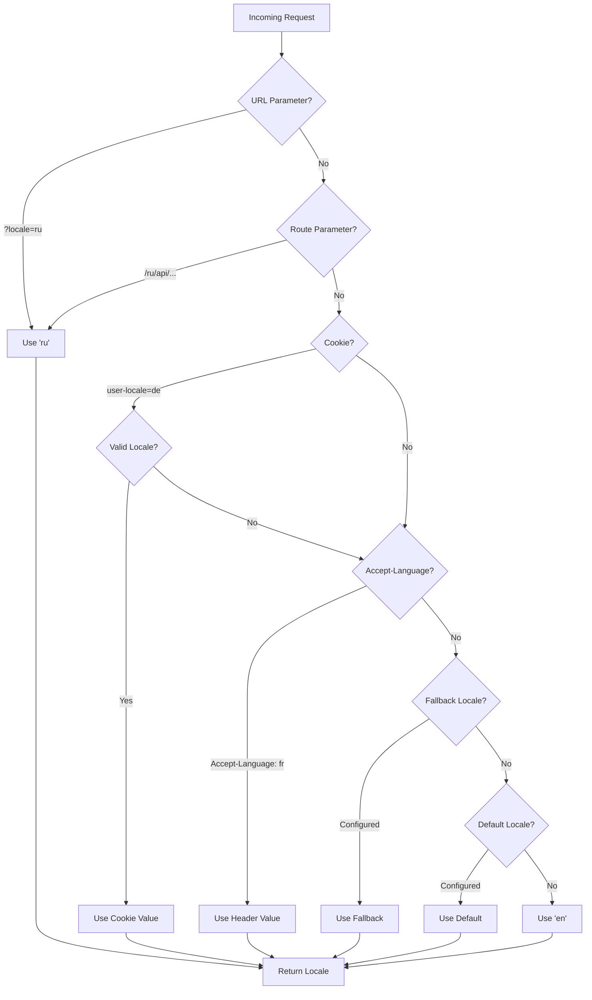

# 🌍 תרגומים ומידע locale בצד שרת ב-Nuxt I18n Micro

## 📖 סקירה

Nuxt I18n Micro תומך בתרגומים ומידע locale בצד השרת, ומאפשר לכם לתרגם תוכן ולגשת לפרטי locale בשרת. זה שימושי במיוחד עבור APIs או אפליקציות מרונדרות בשרת שבהן לוקליזציה נחוצה לפני שהיא מגיעה ללקוח.

התרגומים משתמשים בהודעות locale המוגדרות בקונפיגורציית Nuxt I18n ונפתרים באופן דינמי על בסיס ה-locale שזוהה.

כברירת מחדל (`translationPayloads.mode: 'premerged'`), קבצי root נאפים לתוך כל payload עמוד בזמן build כ-`\{page\}/\{locale\}/data.json`. השרת טוען את אותם קבצים בנויים מראש שהלקוח מביא תחת `/\{apiBaseUrl\}/...`, כך שכל המפתחות (הן משותפים והן ספציפיים לעמוד) זמינים ב-handlers של שרת.

עם `translationPayloads.mode: 'source'`, קבצי מקור קומפקטיים ממוזגים בזמן ריצה כאשר `loadTranslationsFromServer()` (או ה-route `/_locales`) נקרא — ב-**Edge** באמצעות `serverAssets` של Nitro, ב-**Node** מהעותק הציבורי האופציונלי. ראו את [מדריך הביצועים — Serverless Payload Output](/guides/performance#serverless-payload-output) ו-[ארכיטקטורת Cache ואחסון](/api/cache) לפרטים.

לרשימה מאוחדת של APIs של runtime ושרת, ראו את [הפניית API](/api/overview).

## 🛠️ הגדרת Middleware בצד שרת

כדי לאפשר תרגומים ומידע locale בצד שרת, השתמשו בפונקציות ה-middleware המסופקות:

- `useTranslationServerMiddleware` — לתרגום תוכן
- `useLocaleServerMiddleware` — לגישה למידע locale

שתי פונקציות ה-middleware זמינות אוטומטית בכל routes של השרת.

לוגיקת זיהוי ה-locale משותפת בין שתי פונקציות ה-middleware באמצעות פונקציית העזר `detectCurrentLocale` כדי להבטיח עקביות בין המודול.

## ✨ שימוש בתרגומים ב-Handlers של שרת

תוכלו לתרגם תוכן בצורה חלקה בכל `eventHandler` באמצעות שימוש ב-middleware של תרגום.

### דוגמה: שימוש בסיסי בתרגום

```typescript
import { defineEventHandler } from 'h3'

export default defineEventHandler(async (event) => {
  const t = await useTranslationServerMiddleware(event)
  return {
    message: t('greeting'), // Returns the translated value for the key "greeting"
  }
})
```

בדוגמה זו:

- ה-locale של המשתמש מזוהה אוטומטית מפרמטרי query, cookies או headers.
- הפונקציה `t` מאחזרת את התרגום המתאים עבור ה-locale שזוהה.

## 🌍 שימוש במידע locale ב-Handlers של שרת

### שימוש בסיסי במידע locale

```typescript
import { defineEventHandler } from 'h3'

export default defineEventHandler((event) => {
  const localeInfo = useLocaleServerMiddleware(event)

  return {
    success: true,
    data: localeInfo,
    timestamp: new Date().toISOString(),
  }
})
```

### אספקת פרמטרי locale מותאמים אישית

```typescript
import { defineEventHandler } from 'h3'

export default defineEventHandler((event) => {
  // Force specific locale with custom default
  const localeInfo = useLocaleServerMiddleware(event, 'en', 'ru')

  return {
    success: true,
    data: localeInfo,
    timestamp: new Date().toISOString(),
  }
})
```

### מבנה תגובה

ה-middleware של ה-locale מחזיר אובייקט `LocaleInfo` עם המאפיינים הבאים:

```typescript
interface LocaleInfo {
  current: string // Current detected locale code
  default: string // Default locale code
  fallback: string // Fallback locale code
  available: string[] // Array of all available locale codes
  locale: Locale | null // Full locale configuration object
  isDefault: boolean // Whether current locale is the default
  isFallback: boolean // Whether current locale is the fallback
}
```

### תגובה לדוגמה

```json
{
  "success": true,
  "data": {
    "current": "ru",
    "default": "en",
    "fallback": "en",
    "available": ["en", "ru", "de"],
    "locale": {
      "code": "ru",
      "iso": "ru-RU",
      "dir": "ltr",
      "displayName": "Русский"
    },
    "isDefault": false,
    "isFallback": false
  },
  "timestamp": "2024-01-15T10:30:00.000Z"
}
```

## 🌐 אספקת locale מותאם אישית

אם אתם צריכים לציין locale ידנית (למשל, לבדיקות או לבקשות מסוימות), ניתן להעביר אותו ל-middleware של התרגום:

### דוגמה: locale מותאם אישית

```typescript
import { defineEventHandler } from 'h3'

function detectLocale(event): string | null {
  const urlSearchParams = new URLSearchParams(event.node.req.url?.split('?')[1])
  const localeFromQuery = urlSearchParams.get('locale')
  if (localeFromQuery) return localeFromQuery

  return 'en'
}

export default defineEventHandler(async (event) => {
  const t = await useTranslationServerMiddleware(event, 'en', detectLocale(event)) // Force French local, en - default locale
  return {
    message: t('welcome'), // Returns the French translation for "welcome"
  }
})
```

## 📋 לוגיקת זיהוי locale

שתי פונקציות ה-middleware קובעות אוטומטית את ה-locale של המשתמש באמצעות סדר העדיפויות הבא:



1. **פרמטרי URL**: `?locale=ru`
2. **פרמטרי Route**: `/ru/api/endpoint`
3. **Cookies**: cookie של `user-locale`
4. **HTTP Headers**: header של `Accept-Language`
5. **Fallback Locale**: כפי שהוגדר באפשרויות המודול
6. **Default Locale**: כפי שהוגדר באפשרויות המודול
7. **Fallback קשיח**: `'en'`

> **הערה**: לוגיקת זיהוי ה-locale משותפת בין `useLocaleServerMiddleware` ל-`useTranslationServerMiddleware` כדי להבטיח עקביות בין המודול.

## 📋 דוגמאות שימוש מתקדמות

### תגובה מותנית על בסיס locale

```typescript
import { defineEventHandler } from 'h3'

export default defineEventHandler((event) => {
  const { current, isDefault, locale } = useLocaleServerMiddleware(event)

  // Return different content based on locale
  if (current === 'ru') {
    return {
      message: 'Привет, мир!',
      locale: current,
      isDefault,
    }
  }

  if (current === 'de') {
    return {
      message: 'Hallo, Welt!',
      locale: current,
      isDefault,
    }
  }

  // Default English response
  return {
    message: 'Hello, World!',
    locale: current,
    isDefault,
  }
})
```

### זיהוי locale מותאם אישית

```typescript
import { defineEventHandler } from 'h3'

export default defineEventHandler((event) => {
  // Force German locale with English as fallback
  const { current, isDefault, locale } = useLocaleServerMiddleware(event, 'en', 'de')

  return {
    message: 'Hallo, Welt!',
    locale: current,
    isDefault: false, // Will be false since we forced German
  }
})
```

### API מודע ל-locale עם אימות

```typescript
import { defineEventHandler, createError } from 'h3'

export default defineEventHandler((event) => {
  const { current, available, locale } = useLocaleServerMiddleware(event)

  // Validate if the detected locale is supported
  if (!available.includes(current)) {
    throw createError({
      statusCode: 400,
      statusMessage: `Unsupported locale: ${current}. Available locales: ${available.join(', ')}`,
    })
  }

  // Return locale-specific configuration
  return {
    locale: current,
    direction: locale?.dir || 'ltr',
    displayName: locale?.displayName || current,
    availableLocales: available,
  }
})
```

### אינטגרציה עם Middleware של תרגום

תוכלו לשלב מידע locale עם middleware של תרגום עבור בינאום מקיף:

```typescript
import { defineEventHandler } from 'h3'

export default defineEventHandler(async (event) => {
  const localeInfo = useLocaleServerMiddleware(event)
  const t = await useTranslationServerMiddleware(event)

  return {
    locale: localeInfo.current,
    message: t('welcome_message'),
    availableLocales: localeInfo.available,
    isDefault: localeInfo.isDefault,
  }
})
```

## 📝 שיטות עבודה מומלצות

1. **תמיד אמתו locales**: בדקו אם ה-locale שזוהה נמצא ברשימת ה-locales הזמינים שלכם
2. **השתמשו בלוגיקת fallback**: ספקו ברירות מחדל הגיוניות כאשר זיהוי locale נכשל
3. **בצעו cache למידע locale**: לאפליקציות קריטיות מבחינת ביצועים, שקלו לבצע cache לתוצאות זיהוי locale
4. **טפלו במקרי קצה**: התחשבו ב-locales לא נתמכים וספקו תגובות שגיאה מתאימות
5. **שלבו עם תרגומים**: השתמשו במידע locale לצד middleware של תרגום לתמיכה מלאה ב-i18n

## 🚀 שיקולי ביצועים

- שתי פונקציות ה-middleware הן קלות משקל ומתוכננות לביצוע מהיר
- זיהוי locale משתמש בשרשראות fallback יעילות
- לא מבוצעות קריאות API חיצוניות במהלך זיהוי locale
- התוצאות מחושבות באופן סינכרוני לביצועים אופטימליים
