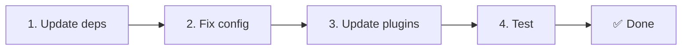

# 📦 שדרוג מ־v2.x ל־v3.x

<Tip>
עיין ב־[הגירה מ־nuxt-i18n](/migration/from-nuxtjs-i18n) — מדריך זה עוסק במעבר ממערכת vue-i18n, ולא מ־nuxt-i18n-micro v2.
</Tip>

v3.0.0 מציג שינויים ארכיטקטוניים יסודיים: חבילות אסטרטגיה, מערכת מטמון חדשה, ניהול שפה מרכזי דרך `useI18nLocale()`, וצינור הפניות מחדש מעוצב מחדש. חלק זה מכסה את כל שינויי התאימות וכיצד לעדכן את הקוד שלך.

## שלבי הגירה



## סיכום שינויים שוברי תאימות

- **מצב שפה** — ‏`useState` / ‏`useCookie` באופן ידני → composable של `useI18nLocale()`
- **גישה לתצורה** — ‏`useRuntimeConfig().public.i18nConfig` → `getI18nConfig()` מ־`#build/i18n.strategy.mjs`
- **רכיב הפניה מחדש** — אפשרות `fallbackRedirectComponentPath` → תוסף הפניה מחדש בשרת + מידלוור מסלול בצד לקוח (אוטומטי)
- **`includeDefaultLocaleRoute`** — נתמך (הוצא משימוש) → הוסר, השתמש באפשרות `strategy`
- **`experimental.hmr`** — תחת `experimental` → אפשרות ברמת השורש
- **`previousPageFallback`** — הוסר לחלוטין (אסטרטגיית מיזוג מצטבר מטפלת בכך אוטומטית)
- **מטמון** — ‏`useStorage('cache')` → singleton של `TranslationStorage` ‏(`Symbol.for` על `globalThis`)
- **העברת SSR** — תצורת זמן ריצה → payload של Nuxt ‏(v3 השתמש ב־`useState`; קטעים נמצאים כעת ב־`payload.data`, עיין ב־[ביצועים](/guides/performance#server-side-payload-transfer))
- **מחלקות אסטרטגיה** — פנימי → חבילות נפרדות ‏(`@i18n-micro/route-strategy`, ‏`@i18n-micro/path-strategy`)

## הוסר: `fallbackRedirectComponentPath`

האפשרות `fallbackRedirectComponentPath` ורכיב ה־fallback‏ `locale-redirect.vue` הוסרו. לוגיקת הפניה מחדש מטופלת כעת על ידי:

1. **מידלוור שרת** ‏(`i18n.global.ts`) — מגדיר את `event.context.i18n.locale`
2. **תוסף הפניה מחדש בשרת** ‏(`06.redirect.ts`, בצד השרת בלבד) — הפניות 302 לפני עיבוד
3. **מידלוור מסלול לקוח** ‏(`i18n-redirect.global.ts`) — הפניות SPA לאחר hydration

```diff
 i18n: {
   strategy: 'prefix_except_default',
-  fallbackRedirectComponentPath: '~/components/MyRedirect.vue',
 }
```

אם הייתה לך לוגיקת הפניה מחדש מותאמת ברכיב ה־fallback, יישם אותה בתוסף שרת במקום:

```ts
// plugins/i18n-loader.server.ts
export default defineNuxtPlugin({
  name: 'i18n-custom-redirect',
  enforce: 'pre',
  order: -10,
  setup() {
    const { setLocale } = useI18nLocale()
    // Your custom detection logic
    setLocale(detectedLocale)
  },
})
```

## הוסר: `includeDefaultLocaleRoute`

השתמש באפשרות `strategy` במקום:

- `includeDefaultLocaleRoute: true` → `strategy: 'prefix'`
- `includeDefaultLocaleRoute: false` → `strategy: 'prefix_except_default'` (ברירת המחדל)

```diff
 i18n: {
-  includeDefaultLocaleRoute: true,
+  strategy: 'prefix',
 }
```

## גישה לתצורה: ‏`getI18nConfig()` מחליף את `useRuntimeConfig`

```diff
- const config = useRuntimeConfig()
- const cookieName = config.public.i18nConfig?.localeCookie || 'user-locale'
+ import { getI18nConfig } from '#build/i18n.strategy.mjs'
+ const { localeCookie: configCookie } = getI18nConfig()
+ const cookieName = configCookie ?? 'user-locale'
```

## ניהול שפה: ‏`useI18nLocale()` מחליף מצב ידני

ב־v2, ייתכן שהשתמשת ב־`useState('i18n-locale')` או `useCookie('user-locale')` ישירות. ב־v3, השתמש ב־composable המרכזי `useI18nLocale()`:

```diff
- const locale = useState('i18n-locale')
- const cookie = useCookie('user-locale')
- locale.value = 'fr'
- cookie.value = 'fr'
+ const { setLocale } = useI18nLocale()
+ setLocale('fr') // Updates both state and cookie atomically
```

עיין ב־[זיהוי שפה מותאם](/guides/custom-language-detection) לדוגמאות מפורטות.

## אפשרויות ניסיוניות הועברו / הוסרו

`hmr` הועבר מ־`experimental` לרמת השורש. `previousPageFallback` הוסר לחלוטין. המודול משתמש כעת באסטרטגיית מיזוג עמוק מצטבר (עומק 2 רמות) שמשמרת אוטומטית תרגומים מהעמוד הקודם במהלך אנימציות מעבר, גם כאשר עמודים חולקים מפתחות מקוננים חופפים. לאחר סיום אנימציית המעבר, הוק `page:transition:finish` מנקה מפתחות של עמודים ישנים מהזיכרון.

```diff
 i18n: {
-  experimental: {
-    hmr: true,
-    previousPageFallback: true
-  }
+  hmr: true,
+  // previousPageFallback removed — handled automatically
 }
```

## ארכיטקטורת הפניה מחדש (v3)

הפניות מחדש מטופלות כעת אוטומטית על ידי שני רכיבים:

1. **בצד שרת** ‏(`06.redirect.ts`, בצד השרת בלבד): רץ במהלך SSR, מנפיק הפניות 302 לפני כל עיבוד עמוד — ללא "הבזק שגיאה"
2. **בצד לקוח** ‏(`i18n-redirect.global.ts`): מידלוור מסלול גלובלי בניווט SPA; משמר מחרוזת query ו־hash

עדיפות שפה עבור הפניות מחדש:

1. `useState('i18n-locale')` — מוגדר דרך `useI18nLocale().setLocale()`
2. עוגייה — אם `localeCookie` מוגדר
3. כותרת `Accept-Language` — אם `autoDetectLanguage: true`
4. `defaultLocale` — fallback

לא נדרשים שינויי קוד בהגדרות סטנדרטיות.

<Warning>
עבור אסטרטגיות `prefix` ו־`prefix_except_default` עם `redirects: true`, הגדר `localeCookie: 'user-locale'` כדי לאפשר התמדה של שפה בין רענוני עמוד. בלעדיה, הפניות מחדש משתמשות רק ב־`Accept-Language` או `defaultLocale`.
</Warning>

## TypeScript: טיפוסי מודול פנימיים (אופציונלי)

אם אתה נתקל בשגיאות טיפוס הקשורות לייבוא פנימי כמו `#i18n-internal/plural`, ‏`#i18n-internal/strategy` או `#i18n-internal/config`, הוסף את הקטע `imports` ל־`package.json` של הפרויקט:

```json
{
  "imports": {
    "#i18n-internal/plural": "nuxt-i18n-micro/internals",
    "#i18n-internal/strategy": "nuxt-i18n-micro/internals",
    "#i18n-internal/config": "nuxt-i18n-micro/internals"
  }
}
```
