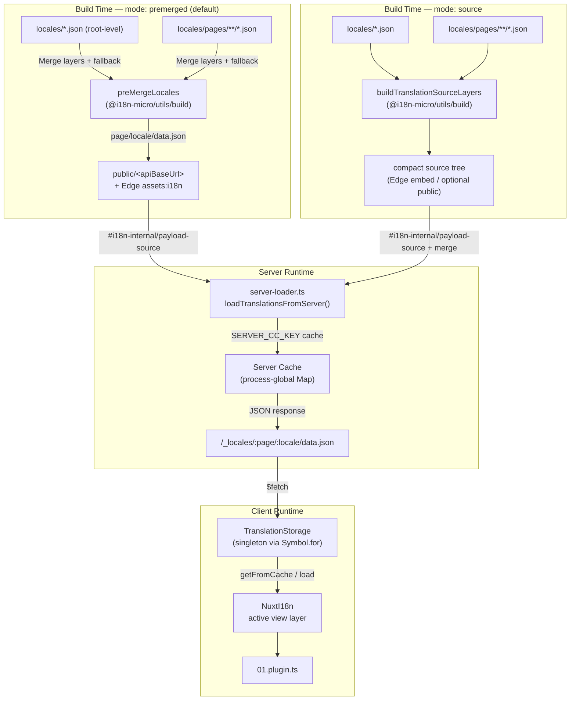

# 🗄️ ट्रांसलेशन कैश और स्टोरेज आर्किटेक्चर

## 📖 अवलोकन

Nuxt I18n Micro v3 ट्रांसलेशन के लिए बहु-परत कैशिंग आर्किटेक्चर का उपयोग करता है। पेलोड लोडिंग `translationPayloads.mode` पर निर्भर करती है:

- **`premerged`** (डिफ़ॉल्ट) — root, page, fallback, और layer फ़ाइलें `@i18n-micro/utils/build` के माध्यम से बिल्ड समय पर `\{page\}/\{locale\}/data.json` में मर्ज की जाती हैं
- **`source`** — कॉम्पैक्ट source फ़ाइलें `@i18n-micro/utils/source-loader` और `@i18n-micro/utils/merge-source` के माध्यम से रनटाइम मर्ज के लिए रखी जाती हैं (Edge उन्हें Nitro `serverAssets` में एम्बेड करता है; कॉपी होने पर Node उन्हें `public/` से पढ़ता है)

यह पेज बताता है कि बिल्ट-इन कैश कैसे काम करता है और कस्टम उपयोग-केसों (एडमिन टूल, बाहरी API, कैश इनवैलिडेशन) के लिए इसे कैसे बढ़ाया जाए।

## 📊 आर्किटेक्चर अवलोकन

### डेटा फ़्लो



## 🧱 कोर घटक

### 1. `TranslationStorage` (क्लाइंट + सर्वर)

**फ़ाइल**: `src/runtime/utils/storage.ts`

एक सिंगलटन क्लास जो क्लाइंट और सर्वर दोनों के लिए एकीकृत ट्रांसलेशन स्टोरेज प्रदान करती है। यह सुनिश्चित करने के लिए `globalThis` पर `Symbol.for('__NUXT_I18N_STORAGE_CACHE__')` का उपयोग करती है कि केवल एक इंस्टेंस मौजूद हो, भले ही कई bundles लोड हों।

**मुख्य मेथड्स:**

| मेथड                                | विवरण                                                                  |
| ----------------------------------- | ---------------------------------------------------------------------- |
| `getFromCache(locale, routeName?)`  | सिंक्रोनस जाँच: कैश में संग्रहित इन-मेमोरी डेटा, या `null` लौटाता है      |
| `load(locale, routeName?, options)` | कैशिंग के साथ Async load: पहले कैश जाँचता है, फिर `$fetch` से लाता है     |
| `clear()`                           | पूरे कैश को साफ़ करता है                                                |

**कैश कुंजी फ़ॉर्मेट**: `\{locale\}:\{routeName\}` (उदाहरण के लिए, `en:index`, `fr:about`)

```typescript
import { translationStorage } from '../utils/storage'

// Synchronous cache check
const cached = translationStorage.getFromCache('en', 'index')

// Async load (with automatic caching)
const result = await translationStorage.load('en', 'index', {
  apiBaseUrl: '_locales',
  baseURL: '/',
  dateBuild: '2024-01-01',
})
// result.data — merged translations
// result.cacheKey — cache key used
```

### ⚙️ नियतात्मक कैश बस्टिंग (`i18n.dateBuild`)

डिफ़ॉल्ट रूप से, यह मॉड्यूल `Date.now()` का उपयोग करके बिल्ड समय पर `dateBuild` जनरेट करता है। फिर इसे जनरेट की गई `#build/i18n.strategy.mjs` में एम्बेड किया जाता है और पुनर्निर्माण के बाद ट्रांसलेशन फ़ेच कैश को अमान्य करने के लिए एक क्वेरी पैरामीटर (`?v=...`) के रूप में उपयोग किया जाता है।

यदि आपको प्रजनन योग्य बिल्ड की आवश्यकता है (उदाहरण के लिए, रोलिंग डिप्लॉयमेंट में chunk cache hit दरों को बेहतर बनाने के लिए), तो `nuxt.config` में एक स्थिर मान सेट करें:

```ts
export default defineNuxtConfig({
  i18n: {
    // Any stable string/number (git SHA, CI build number, release tag, etc.)
    dateBuild: process.env.GIT_SHA ?? 'local-dev',
  },
})
```

### 2. `loadTranslationsFromServer()` (केवल सर्वर)

**फ़ाइल**: `src/runtime/server/utils/server-loader.ts`

एक locale/page के लिए ट्रांसलेशन लोड करता है और `@i18n-micro/hmr/cache-keys` (`SERVER_CC_KEY`) द्वारा कीड process-global `CacheControl` मैप में मर्ज किए गए परिणाम को कैश करता है।

व्यवहार: SSR `#i18n-internal/payload-source` से लोड होता है — **Node** `readFile` `public/<apiBaseUrl>` के तहत (premerged मोड में `\{page\}/\{locale\}/data.json`), **Edge** `assets:i18n`। `premerged` एक फ़ाइल पढ़ता है; `source` `@i18n-micro/utils/source-loader` के माध्यम से root/page/fallback मर्ज करता है।

```typescript
import { loadTranslationsFromServer } from '../server/utils/server-loader'

// Returns { data: Translations, json: string }
const { data, json } = await loadTranslationsFromServer('en', 'index')
```

### 3. क्लाइंट लोड (कोई HTML एम्बेड नहीं)

शब्दकोश `nuxtApp.payload` में **नहीं** लिखे जाते हैं। सर्वर उन्हें SSR रेंडर के लिए मेमोरी में रखता है;
क्लाइंट प्लगइन `switchContext` का `await` करता है, जो `/\{apiBaseUrl\}/:page/:locale/data.json` लोड करता है।
(यह `experimental.preload: false` के साथ `@nuxtjs/i18n` जैसा ही डिफ़ॉल्ट postur है)।

`NuxtI18n` `$t()` और `$has()` द्वारा उपयोग किए जाने वाले सक्रिय view-layer शब्दकोश को रखता है। `NuxtTranslationLoader` locale/route कॉन्टेक्स्ट को स्विच करता है और chunks को उस लेयर में मर्ज करता है।

### 4. सर्वर API रूट

**रूट**: `/_locales/\{page\}/\{locale\}/data.json`

**फ़ाइल**: `src/runtime/server/routes/i18n.ts`

यह Nitro रूट सक्रिय पेलोड मोड के लिए मर्ज किए गए ट्रांसलेशन प्रदान करता है। यह `loadTranslationsFromServer()` कॉल करता है और परिणाम को JSON के रूप में लौटाता है।

प्रोडक्शन में यह इसे भी सेट करता है:

```http
Cache-Control: public, max-age={httpCacheDuration}, immutable
```

डिफ़ॉल्ट `httpCacheDuration` `31536000` (1 वर्ष) है। यह सुरक्षित है क्योंकि क्लाइंट `?v=\{dateBuild\}` कैश-बस्टिंग के साथ पेलोड का अनुरोध करते हैं। हेडर को छोड़ने के लिए `httpCacheDuration: 0` सेट करें। यह हेडर डेवलपमेंट में लागू नहीं होता।

## 📥 विस्तार: कस्टम ट्रांसलेशन लोडिंग

### कैश से पढ़ें (सर्वर रूट)

```ts
// server/api/i18n/load-cache.[post].ts
import { defineEventHandler, readBody } from 'h3'
import { loadTranslationsFromServer } from '#imports'

export default defineEventHandler(async (event) => {
  const { page, locale } = await readBody<{ page: string; locale: string }>(event)
  const { data } = await loadTranslationsFromServer(locale, page)
  return { locale, page, data }
})
```

### ट्रांसलेशन अपडेट करें (फ़ाइल + कैश इनवैलिडेट करें)

```ts
// server/api/i18n/update.[post].ts
import { defineEventHandler, readBody, createError } from 'h3'
import { join } from 'node:path'
import { readFile, writeFile } from 'node:fs/promises'
import { deepMergeTranslations } from '@i18n-micro/utils/deep-merge'

export default defineEventHandler(async (event) => {
  const { path, updates } = await readBody<{ path: string; updates: Record<string, unknown> }>(event)

  if (!path || !updates) {
    throw createError({ statusCode: 400, statusMessage: 'Missing path or updates' })
  }

  const fullPath = join('locales', path)
  let existing: Record<string, unknown> = {}

  try {
    const content = await readFile(fullPath, 'utf-8')
    existing = JSON.parse(content) as Record<string, unknown>
  } catch {
    // File does not exist — create new
  }

  const merged = deepMergeTranslations(existing, updates)
  await writeFile(fullPath, JSON.stringify(merged, null, 2), 'utf-8')

  return { success: true, path, updated: merged }
})
```


## 🧹 कैश साफ़ करना

### प्रोग्रामेटिक कैश साफ़ करना (क्लाइंट)

बिल्ट-इन `$clearCache` मेथड का उपयोग करें:

```vue
<script setup>
const { $clearCache } = useNuxtApp()

// Clears both TranslationStorage and plugin-level cache
$clearCache()
</script>
```

### सर्वर कैश व्यवहार

सर्वर-साइड कैश (`loadTranslationsFromServer`) process-global है और तब तक बना रहता है जब तक:

- सर्वर प्रोसेस रीस्टार्ट होती है
- कोई नया डिप्लॉयमेंट पहचाना जाता है (अलग `dateBuild` मान)

Serverless वातावरण के लिए, प्रत्येक cold start में एक ताज़ा कैश होता है।

## ⚙️ Serverless कॉन्फ़िगरेशन

Serverless वातावरण (Cloudflare Workers, AWS Lambda) के लिए, बिल्ट-इन कैश इन-मेमोरी `Map` ऑब्जेक्ट्स का उपयोग करता है। ट्रांसलेशन कैश के लिए स्वयं किसी बाहरी स्टोरेज कॉन्फ़िगरेशन की आवश्यकता नहीं होती।

हालाँकि, source ट्रांसलेशन फ़ाइलों के लिए Nitro storage को कॉन्फ़िगरेशन की आवश्यकता हो सकती है:

```ts
export default defineNuxtConfig({
  nitro: {
    storage: {
      // Only needed if default file-system storage is unavailable
      'assets:server': {
        driver: 'cloudflare-kv-binding',
        binding: 'MY_KV_NAMESPACE',
      },
    },
  },
})
```

## 💡 v2 से मुख्य अंतर

| पहलू             | v2                            | v3                                                                       |
| ---------------- | ----------------------------- | ------------------------------------------------------------------------ |
| क्लाइंट कैश       | `useStorage('cache')`         | `TranslationStorage` सिंगलटन (globalThis पर Symbol.for)                    |
| SSR ट्रांसफर      | रनटाइम कॉन्फ़िग                | `payload.data` के माध्यम से पूर्ण chunks (v3.0 ने `useState` का उपयोग किया)  |
| सर्वर कैश         | Nitro cache storage           | `Symbol.for` के माध्यम से process-global `Map`                             |
| मर्ज लॉजिक       | क्लाइंट-साइड                   | बिल्ड-टाइम (`premerged`) या रनटाइम (`source`) `@i18n-micro/utils/*` के माध्यम से |
| कैश कुंजी फ़ॉर्मेट | `i18n:merged:\{page\}:\{locale\}` | `\{locale\}:\{routeName\}`                                                   |

## 📚 संबंधित

- [प्रदर्शन गाइड](/guides/performance) — कैशिंग प्रदर्शन को कैसे प्रभावित करती है
- [सर्वर-साइड ट्रांसलेशन](/guides/server-side-translations) — सर्वर रूट्स में ट्रांसलेशन का उपयोग
- [Firebase डिप्लॉयमेंट](/guides/firebase) — डिप्लॉयमेंट-विशिष्ट कैश विचार
