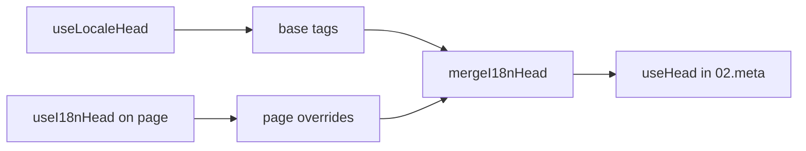

# `useI18nHead` कंपोज़ेबल

`useI18nHead` आपको एक कस्टम मेटा प्लगइन के बिना i18n SEO टैग को **प्रति पेज** अनुकूलित करने देता है। जब `meta: true` होता है, तो मॉड्यूल आपके इनपुट को [`useLocaleHead`](/api/composables/use-locale-head) आउटपुट के ऊपर मर्ज करता है।

सामान्य मामले:

- **CMS / ब्लॉग लेख** — केवल कुछ लोकेल का अनुवाद किया गया है; वैकल्पिक URL प्रति भाषा भिन्न होते हैं (अलग slugs या पथ)।
- **डायनामिक canonical** — canonical URL API से लेख URL से मेल खाना चाहिए, न कि `$switchLocalePath` से।
- **अतिरिक्त Open Graph** — स्वतः-जनरेट `og:locale` / `og:url` के साथ-साथ `og:title`, `og:description`, `og:image`।
- **आंशिक नियंत्रण** — मॉड्यूल-जनरेटेड canonical और `og:url` रखें, लेकिन केवल `hreflang` और `og:locale:alternate` को बदलें।

---

## हस्ताक्षर

{/* generated:symbol:useI18nHead — do not edit; run `pnpm run docs:generate` */}

```ts
useI18nHead(input?: MaybeRefOrGetter<I18nHeadInput | null>): { pageHead: any; resetPageHead: () => void }
```

i18n SEO head टैग के लिए पेज-लेवल ओवरराइड रजिस्टर करें।
`02.meta` प्लगइन द्वारा `useLocaleHead` आउटपुट के ऊपर मर्ज किया जाता है।

| पैरामीटर | प्रकार | विवरण |
| --- | --- | --- |
| `input` *(वैकल्पिक)* | `MaybeRefOrGetter<I18nHeadInput \| null>` |  |

{/* /generated:symbol:useI18nHead */}

## यह पाइपलाइन में कैसे फ़िट होता है



आप एक पेज कंपोनेंट में `useI18nHead` कॉल करते हैं। `02.meta` प्लगइन प्रत्येक `updateMeta()` (रूट परिवर्तन, `$setI18nRouteParams`, क्लाइंट पर `page:finish`) के बाद ओवरराइड्स लागू करता है।

---

## उदाहरण 1 — केवल कुछ लोकेल में ट्रांसलेशन वाला लेख

एक सामान्य पैटर्न: API लौटाता है कि कौन-से लोकेल मौजूद हैं और उनके एब्सोल्यूट या सापेक्ष URL क्या हैं।

```ts
interface Article {
  title: string
  slug: string
  /** Locale code → page URL (absolute or site-relative) */
  locales: Record<string, string>
}
```

```vue
<script setup lang="ts">
const route = useRoute()
const { data: article } = await useFetch<Article>(`/api/articles/${route.params.slug}`)

const localeCodes = computed(() => Object.keys(article.value?.locales ?? {}))

useI18nHead(() => {
  if (!article.value) return null

  return {
    meta: [
      { property: 'og:title', content: article.value.title },
      { property: 'og:type', content: 'article' },
    ],
    replace: {
      hreflang: localeCodes.value.map((locale) => ({
        rel: 'alternate',
        hreflang: locale,
        href: article.value!.locales[locale]!,
      })),
      ogAlternates: localeCodes.value,
    },
  }
})
</script>
```

`ogAlternates` आपके `i18n.locales` कॉन्फ़िग से **लोकेल कोड** लेता है। `og:locale:alternate` के लिए मान `locale.og` या `iso` (Open Graph `en_US` फ़ॉर्मेट) के माध्यम से हल होते हैं।

---

## उदाहरण 2 — प्रति-लोकेल slugs वाला लेख (`$defineI18nRoute` + `$setI18nRouteParams`)

जब URL लोकेलाइज़्ड रूट टेम्पलेट्स और डायनामिक params से बनाए जाते हैं:

```vue
<script setup lang="ts">
const { $defineI18nRoute, $setI18nRouteParams } = useNuxtApp()
const route = useRoute()

const { data: article } = await useFetch(`/api/articles/${route.params.slug}`)

$defineI18nRoute({
  localeRoutes: {
    en: '/blog/[slug]',
    de: '/de/blog/[slug]',
    fr: '/fr/blog/[slug]',
  },
})

if (article.value) {
  $setI18nRouteParams({
    en: { slug: article.value.slugEn },
    de: { slug: article.value.slugDe },
    fr: { slug: article.value.slugFr },
  })

  const availableLocales = article.value.availableLocales as string[]

  useI18nHead({
    meta: [{ property: 'og:title', content: article.value.title }],
    replace: {
      hreflang: availableLocales.map((locale) => ({
        rel: 'alternate',
        hreflang: locale,
        href: article.value!.urls[locale],
      })),
      ogAlternates: availableLocales,
    },
  })
}
</script>
```

मॉड्यूल-जनरेटेड alternates **सभी** कॉन्फ़िगर किए गए लोकेल सूचीबद्ध करते। `replace.hreflang` उन लोकेल तक टैग्स को सीमित करता है जिनके पास वास्तव में अनुवाद है।

---

## उदाहरण 3 — डिफ़ॉल्ट लोकेल लेख URL के लिए कस्टम `x-default`

डिफ़ॉल्ट रूप से, `x-default` `$switchLocalePath` से डिफ़ॉल्ट लोकेल URL की ओर इशारा करता है। लेखों के लिए, इसे डिफ़ॉल्ट अनुवाद URL पर इंगित करें:

```vue
<script setup lang="ts">
const { $defaultLocale } = useNuxtApp()
const article = await loadArticle()

const defaultLocale = $defaultLocale() ?? 'en'
const defaultHref = article.locales[defaultLocale]

useI18nHead({
  replace: {
    hreflang: Object.entries(article.locales).map(([locale, href]) => ({
      rel: 'alternate',
      hreflang: locale,
      href,
    })),
    xDefault: defaultHref ? { rel: 'alternate', hreflang: 'x-default', href: defaultHref } : false,
    ogAlternates: Object.keys(article.locales),
  },
})
</script>
```

---

## उदाहरण 4 — API डेटा से canonical और `og:url` बदलें

जब canonical को CMS-प्रदत्त URL (मल्टी-डोमेन, कस्टम पथ, या पूर्व-निर्मित एब्सोल्यूट URL) से मेल खाना चाहिए:

```vue
<script setup lang="ts">
const article = await loadArticle()
const canonical = article.canonicalUrl // e.g. https://www.example.com/en/blog/my-post

useI18nHead({
  replace: {
    canonical,
    ogUrl: canonical,
    hreflang: buildAlternateLinks(article),
    ogAlternates: Object.keys(article.locales),
  },
  meta: [
    { property: 'og:title', content: article.title },
    { name: 'description', content: article.excerpt },
  ],
})
</script>
```

---

## उदाहरण 5 — ऑटो canonical / `og:url` रखें, केवल alternates बदलें

यदि `$switchLocalePath` + `$setI18nRouteParams` पहले से ही सही canonical और `og:url` उत्पन्न करते हैं, तो केवल डिस्कवरी टैग बदलें:

```vue
<script setup lang="ts">
const article = await loadArticle()

useI18nHead({
  replace: {
    hreflang: buildAlternateLinks(article),
    ogAlternates: Object.keys(article.locales),
  },
})
</script>
```

---

## उदाहरण 6 — कंटेंट विवरण पेज के लिए पूर्ण head (meta + links)

"पेज मेटा" और "वैकल्पिक लिंक" को अलग-अलग हेल्पर्स में विभाजित करने के समान पैटर्न — एक कॉल में संयोजित:

```vue
<script setup lang="ts">
const article = await loadArticle()
const alternates = Object.entries(article.locales).map(([locale, href]) => ({
  rel: 'alternate' as const,
  hreflang: locale,
  href: normalizeSeoUrl(href), // strip ?query and #hash if needed
}))

useI18nHead({
  meta: [
    { property: 'og:title', content: article.title },
    { property: 'og:description', content: article.description },
    { property: 'og:image', content: article.imageUrl },
    { name: 'twitter:card', content: 'summary_large_image' },
    { name: 'twitter:title', content: article.title },
  ],
  replace: {
    canonical: article.canonicalUrl,
    ogUrl: article.canonicalUrl,
    hreflang: alternates,
    ogAlternates: Object.keys(article.locales),
  },
})
</script>
```

```ts
/** Remove query and hash — useful when CMS URLs must be clean for SEO */
function normalizeSeoUrl(href: string): string {
  try {
    const url = new URL(href, 'https://placeholder.local')
    url.search = ''
    url.hash = ''
    return href.startsWith('http') ? url.href : `${url.pathname}`
  } catch {
    return href.split(/[?#]/)[0] ?? href
  }
}
```

---

## उदाहरण 7 — दो कंटेंट प्रकार, समान पैटर्न (news बनाम guides)

समान API आकार, विभिन्न रूट नाम — एक छोटे हेल्पर का पुनः उपयोग करें:

```ts
// composables/useArticleHead.ts
import type { I18nHeadInput } from '@i18n-micro/types'

interface LocalizedContent {
  title: string
  locales: Record<string, string>
  canonicalUrl?: string
}

export function buildArticleHead(content: LocalizedContent): I18nHeadInput {
  const localeCodes = Object.keys(content.locales)
  const canonical = content.canonicalUrl ?? content.locales.en

  return {
    meta: [{ property: 'og:title', content: content.title }],
    replace: {
      canonical,
      ogUrl: canonical,
      hreflang: localeCodes.map((locale) => ({
        rel: 'alternate',
        hreflang: locale,
        href: content.locales[locale]!,
      })),
      ogAlternates: localeCodes,
    },
  }
}
```

```vue
<!-- pages/blog/[slug].vue -->
<script setup lang="ts">
const article = await loadArticle()
useI18nHead(buildArticleHead(article))
</script>
```

```vue
<!-- pages/guides/[slug].vue -->
<script setup lang="ts">
const guide = await loadGuide()
useI18nHead(buildArticleHead(guide))
</script>
```

---

## उदाहरण 8 — बिल्ट-इन alternates अक्षम करें, अपनी सूची प्रदान करें

मॉड्यूल के hreflang जनरेटर को अक्षम करने और कस्टम सूची पास करने के समकक्ष (कोई डुप्लिकेट alternate सेट नहीं):

```vue
<script setup lang="ts">
const article = await loadArticle()

useI18nHead({
  disable: ['hreflang', 'x-default', 'og-alternates'],
  link: Object.entries(article.locales).map(([locale, href]) => ({
    rel: 'alternate',
    hreflang: locale,
    href,
  })),
  replace: {
    ogAlternates: Object.keys(article.locales),
  },
})
</script>
```

या `disable` के बिना `replace.hreflang` को प्राथमिकता दें — यह एक चरण में सभी `rel="alternate"` लिंक को बदल देता है।

---

## उदाहरण 9 — लैंडिंग पेज: केवल अतिरिक्त OG, सभी i18n टैग रखें

```vue
<script setup lang="ts">
const { t } = useI18n()

useI18nHead({
  meta: [
    { property: 'og:title', content: t('landing.ogTitle') },
    { property: 'og:description', content: t('landing.ogDescription') },
  ],
})
</script>
```

---

## उदाहरण 10 — उत्पाद पेज: एकल लोकेल प्रयोग के लिए hreflang अक्षम करें

```vue
<script setup lang="ts">
useI18nHead({
  disable: ['hreflang', 'x-default'],
  // canonical, og:locale, og:url still generated
})
</script>
```

---

## उदाहरण 11 — क्लाइंट-साइड फ़ेच के बाद रिएक्टिव अपडेट्स

```vue
<script setup lang="ts">
const article = ref<Article | null>(null)

onMounted(async () => {
  article.value = await $fetch('/api/articles/latest')
})

useI18nHead(() => {
  if (!article.value) return null
  return {
    meta: [{ property: 'og:title', content: article.value.title }],
    replace: {
      hreflang: Object.entries(article.value.locales).map(([locale, href]) => ({
        rel: 'alternate',
        hreflang: locale,
        href,
      })),
    },
  }
})
</script>
```

`page:finish` पर और `pageHead` स्टेट बदलने पर head रीफ़्रेश होता है।

---

## उदाहरण 12 — रिवर्स प्रॉक्सी के पीछे HTTPS ऑरिजिन

यदि आपने पहले canonical / वैकल्पिक एब्सोल्यूट URL के लिए एक "public origin" कंपोज़ेबल हल किया था, तो इसके बजाय मॉड्यूल कॉन्फ़िग का उपयोग करें:

```ts
// nuxt.config.ts
export default defineNuxtConfig({
  i18n: {
    meta: true,
    // undefined = origin from current request (multi-domain friendly)
    metaBaseUrl: undefined,
    metaTrustForwardedHost: true,
    metaTrustForwardedProto: true,
  },
})
```

फिर `replace.hreflang` / `replace.canonical` में **पथ या पूर्ण URL** पास करें। मॉड्यूल SSR पर `X-Forwarded-Host` / `X-Forwarded-Proto` के साथ `useRequestURL` का उपयोग करता है।

---

## API रेफ़रेंस

### `meta`

अतिरिक्त `<meta>` टैग। `id`, `property`, या `name` द्वारा dedupe किए गए।

### `link`

अतिरिक्त `<link>` टैग। `id` या `rel` + `hreflang` द्वारा dedupe किए गए।

### `htmlAttrs`

`useLocaleHead` (`lang`, `dir`) से `<html>` एट्रिब्यूट्स में मर्ज किया गया।

### `replace`

| कुंजी          | प्रकार                    | प्रभाव                                          |
| -------------- | ------------------------- | ---------------------------------------------- |
| `canonical`    | `string \| false`         | canonical लिंक बदलें या हटाएँ                    |
| `hreflang`     | `I18nHeadLink[] \| false` | सभी `rel="alternate"` लिंक बदलें या हटाएँ         |
| `xDefault`     | `I18nHeadLink \| false`   | `hreflang="x-default"` बदलें या हटाएँ            |
| `ogLocale`     | `string \| false`         | `og:locale` बदलें या हटाएँ                       |
| `ogUrl`        | `string \| false`         | `og:url` बदलें या हटाएँ                          |
| `ogAlternates` | `string[] \| false`       | लोकेल कोड के लिए `og:locale:alternate` पुनः बनाएँ |

### `disable`

| मान              | हटाता है                                 |
| --------------- | ---------------------------------------- |
| `hreflang`      | लोकेल वैकल्पिक लिंक (`x-default` नहीं)     |
| `x-default`     | `hreflang="x-default"` लिंक              |
| `canonical`     | canonical लिंक                            |
| `og`            | `og:locale` और `og:url`                   |
| `og-alternates` | `og:locale:alternate` टैग                 |
| `html`          | `<html>` पर `lang` / `dir`               |

---

## `useLocaleHead` बनाम `useI18nHead`

| कंपोज़ेबल        | दायरा                | कब उपयोग करें                              |
| --------------- | -------------------- | ------------------------------------------ |
| `useLocaleHead` | ग्लोबल / मैन्युअल head | `meta: false`, पूर्ण कस्टम `useHead` सेटअप |
| `useI18nHead`   | प्रति-पेज ओवरराइड्स   | `meta: true`, विशिष्ट पेजों को अनुकूलित करें |

जब `meta: true` हो, तो आपको उन पेजों पर `useLocaleHead` की **आवश्यकता नहीं** है जो केवल `useI18nHead` का उपयोग करते हैं।

---

## कस्टम i18n head प्लगइन से माइग्रेशन

कई प्रोजेक्ट एक कस्टम प्लगइन बनाए रखते हैं जो:

- साझा स्टेट से पेज-विशिष्ट वैकल्पिक लिंक मर्ज करता है;
- डुप्लिकेट क्षेत्रीय `hreflang` एंट्रीज़ को फ़िल्टर करता है;
- `og:locale` मानों को सामान्य करता है;
- SEO URL से क्वेरी स्ट्रिंग को स्ट्रिप करता है।

आप इसे प्रत्येक कंटेंट पेज पर `useI18nHead` और मॉड्यूल डिफ़ॉल्ट्स से बदल सकते हैं।

| पिछला दृष्टिकोण                                       | `useI18nHead` के साथ                                  |
| ----------------------------------------------------- | ---------------------------------------------------- |
| साझा स्टेट + "इस लेख के लिए कौन-से लोकेल मौजूद हैं"   | `replace: \{ ogAlternates: localeCodes \}`             |
| `rel="alternate"` लिंक बनाने वाला अलग हेल्पर           | `replace: \{ hreflang: links \}`                       |
| पेज स्टेट को head में मर्ज करने वाला कस्टम प्लगइन       | `02.meta` में बिल्ट-इन मर्ज                          |
| एब्सोल्यूट URL के लिए कस्टम "public origin"           | `metaBaseUrl` + forwarded headers (देखें उदाहरण 12)   |
| लघु `og:locale` (`en_US` के बजाय `en`)                | `locale.og` सेट करें या `iso` → `en_US` उपयोग करें (OG प्रोटोकॉल) |

**`iso` से `hreflang`:** प्रत्येक लोकेल `hreflang = iso || code` के साथ एक alternate उत्सर्जित करता है। जब `iso` सेट होता है तो रूटिंग `code` का उपयोग कभी नहीं होता (जो `hreflang="mx"` जैसे अमान्य टैग से बचाता है)। बेयर-भाषा फ़ॉलबैक (`es-ES` → साथ ही `es`) के लिए `hreflangBaseLanguage: true` से ऑप्ट-इन करें — जो `iso` से लिया जाता है, `code` से नहीं। पूरी तरह से कस्टम सूची के लिए, `replace.hreflang` का उपयोग करें।

**JSON-LD:** `useI18nHead` संरचित डेटा जनरेट नहीं करता। इसके साथ-साथ `useHead(\{ script: [...] \})` या एक समर्पित JSON-LD हेल्पर रखें।

---

## यह भी देखें

- [SEO गाइड](/guides/seo) — स्वचालित मेटा जनरेशन और पेज-लेवल ओवरराइड्स
- [`useLocaleHead`](/api/composables/use-locale-head) — निम्न-स्तरीय head API
