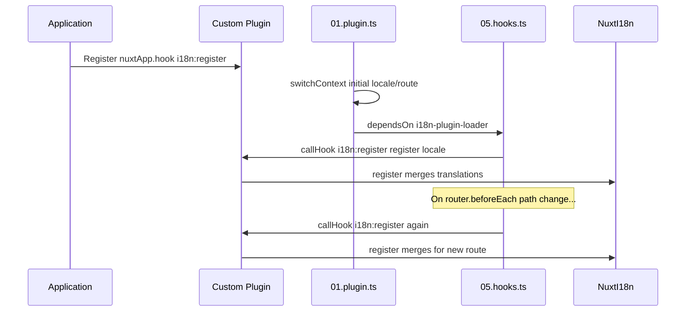

# 📢 इवेंट्स

## 🔄 `i18n:register`

`Nuxt I18n Micro` में `i18n:register` इवेंट आपके एप्लिकेशन के i18n कॉन्टेक्स्ट में ट्रांसलेशन के डायनामिक जोड़ को सक्षम करता है, जिससे अंतरराष्ट्रीयकरण प्रक्रिया सहज और लचीली बन जाती है। यह इवेंट आपको आवश्यकतानुसार नए ट्रांसलेशन को इंटीग्रेट करने की अनुमति देता है, जो आपके एप्लिकेशन की लोकलाइज़ेशन क्षमताओं को बढ़ाता है।

### 📝 इवेंट विवरण

- **उद्देश्य**:
  - एक विशिष्ट लोकेल के लिए मौजूदा सेट में अतिरिक्त ट्रांसलेशन के डायनामिक समावेश की अनुमति देता है।

- **पेलोड**:
  - **`register`**:
    - इवेंट द्वारा प्रदान किया गया एक फ़ंक्शन जो दो आर्ग्युमेंट्स लेता है:
      - **`translations`** (`Translations`):
        - एक ऑब्जेक्ट जिसमें `Translations` इंटरफ़ेस के अनुसार व्यवस्थित ट्रांसलेशन का प्रतिनिधित्व करने वाले key-value जोड़े हैं।
      - **`locale`** (`string`, वैकल्पिक):
        - लोकेल कोड (जैसे `'en'`, `'ru'`) जिसके लिए ट्रांसलेशन रजिस्टर किए जाते हैं। यदि निर्दिष्ट नहीं है, तो इवेंट द्वारा प्रदान की गई लोकेल पर डिफ़ॉल्ट होता है।

- **व्यवहार**:
  - जब ट्रिगर किया जाता है, तो `register` फ़ंक्शन निर्दिष्ट लोकेल के लिए वर्तमान कॉन्टेक्स्ट में नए ट्रांसलेशन को मर्ज करता है, पूरे एप्लिकेशन में उपलब्ध ट्रांसलेशन को अपडेट करता है।

### ⏱️ यह कब फ़ायर होता है

मॉड्यूल का hooks प्लगइन (`05.hooks.ts`, `dependsOn: ['i18n-plugin-loader']`) `nuxtApp.callHook('i18n:register', …)` कॉल करता है:

1. **स्टार्टअप पर एक बार** — मुख्य i18n प्लगइन (`01.plugin.ts`) द्वारा प्रारंभिक रूट के लिए ट्रांसलेशन लोड करने के बाद
2. **नेविगेशन पर** — जब पथ बदलता है तो `router.beforeEach` में, या जब `strategy: 'no_prefix'` हो तो प्रत्येक नेविगेशन पर

एक सामान्य Nuxt प्लगइन में `nuxtApp.hook('i18n:register', …)` के साथ अपना listener रजिस्टर करें। hooks प्लगइन लोडर के तैयार होने के बाद चलता है, इसलिए जब ट्रांसलेशन को विस्तारित करने की आवश्यकता होती है तो आपका callback कॉल किया जाता है।

स्वचालित `i18n:register` कॉल को अक्षम करने के लिए `nuxt.config` में `hooks: false` सेट करें (देखें [कॉन्फ़िगरेशन — `hooks`](/guides/configuration#hooks))।

### 💡 उदाहरण उपयोग

निम्नलिखित उदाहरण दिखाता है कि ट्रांसलेशन को डायनामिक रूप से जोड़ने के लिए `i18n:register` इवेंट का उपयोग कैसे करें:

```typescript
nuxt.hook('i18n:register', async (register: (translations: unknown, locale?: string) => void, locale: string) => {
  register(
    {
      greeting: 'Hello',
      farewell: 'Goodbye',
    },
    locale,
  )
})
```

### 🛠️ स्पष्टीकरण



- **इवेंट को ट्रिगर करना**:
  - hooks प्लगइन (`05.hooks.ts`) मुख्य लोडर के तैयार होने के बाद और प्रासंगिक नेविगेशन पर `i18n:register` फ़ायर करता है।

- **ट्रांसलेशन जोड़ना**:
  - उदाहरण `"greeting"` और `"farewell"` के लिए अंग्रेज़ी ट्रांसलेशन रजिस्टर करता है।
  - `register` फ़ंक्शन प्रदान की गई लोकेल के लिए मौजूदा सेट में इन ट्रांसलेशन को मर्ज करता है।

### 🔗 मुख्य लाभ

- **डायनामिक अपडेट**:
  - अपने पूरे एप्लिकेशन को पुनः डिप्लॉय करने की आवश्यकता के बिना आसानी से ट्रांसलेशन अपडेट या जोड़ें।

- **लोकलाइज़ेशन लचीलापन**:
  - उपयोगकर्ता या एप्लिकेशन आवश्यकताओं के आधार पर वास्तविक समय के लोकलाइज़ेशन समायोजनों का समर्थन करता है।

`i18n:register` इवेंट का उपयोग करके, आप यह सुनिश्चित कर सकते हैं कि आपके एप्लिकेशन की लोकलाइज़ेशन रणनीति लचीली और अनुकूलनीय बनी रहे, समग्र उपयोगकर्ता अनुभव को बढ़ाए।

---

## 🛠️ प्लगइन्स के साथ ट्रांसलेशन संशोधित करना

अपने Nuxt एप्लिकेशन में ट्रांसलेशन को डायनामिक रूप से संशोधित करने के लिए, प्लगइन्स का उपयोग करने की सिफ़ारिश की जाती है। प्लगइन्स लोकलाइज़ेशन अपडेट को संभालने का एक संरचित तरीका प्रदान करते हैं, विशेष रूप से जब मॉड्यूल या बाहरी ट्रांसलेशन फ़ाइलों के साथ काम करते हैं।

### **प्लगइन को रजिस्टर करना**

यदि आप एक मॉड्यूल का उपयोग कर रहे हैं, तो अपने मॉड्यूल के कॉन्फ़िगरेशन में इसे जोड़कर उस प्लगइन को रजिस्टर करें जहाँ ट्रांसलेशन संशोधन होंगे:

```javascript
addPlugin({
  src: resolve('./plugins/extend_locales'),
})
```

यह `./plugins/extend_locales` पर स्थित प्लगइन को रजिस्टर करता है, जो ट्रांसलेशन के डायनामिक लोडिंग और रजिस्ट्रेशन को हैंडल करेगा।

### **प्लगइन को लागू करना**

प्लगइन में, आप लोकेल संशोधनों का प्रबंधन कर सकते हैं। यहाँ Nuxt प्लगइन में एक उदाहरण कार्यान्वयन है:

```typescript
import { defineNuxtPlugin } from '#app'

export default defineNuxtPlugin(async (nuxtApp) => {
  // Function to load translations from JSON files and register them
  const loadTranslations = async (lang: string) => {
    try {
      const translations = await import(`../locales/${lang}.json`)
      return translations.default
    } catch (error) {
      console.error(`Error loading translations for language: ${lang}`, error)
      return null
    }
  }

  // Hook into the 'i18n:register' event to dynamically add translations
  // eslint-disable-next-line @typescript-eslint/ban-ts-comment
  // @ts-expect-error
  nuxtApp.hook('i18n:register', async (register: (translations: unknown, locale?: string) => void, locale: string) => {
    const translations = await loadTranslations(locale)
    if (translations) {
      register(translations, locale)
    }
  })
})
```

### 📝 विस्तृत स्पष्टीकरण

1. **ट्रांसलेशन लोड करना**:

- `loadTranslations` फ़ंक्शन लोकेल के आधार पर ट्रांसलेशन फ़ाइलों को डायनामिक रूप से इंपोर्ट करता है। फ़ाइलें `locales` निर्देशिका में होने की उम्मीद की जाती है और उनका नाम लोकेल कोड (जैसे `en.json`, `de.json`) के अनुसार होता है।
- सफलतापूर्वक लोड होने पर, ट्रांसलेशन लौटाए जाते हैं; अन्यथा, एक त्रुटि लॉग की जाती है।

2. **ट्रांसलेशन रजिस्टर करना**:

- प्लगइन `nuxtApp.hook` का उपयोग करके `i18n:register` इवेंट में हुक करता है।
- जब इवेंट ट्रिगर होता है, तो `register` फ़ंक्शन को लोड किए गए ट्रांसलेशन और संबंधित लोकेल के साथ कॉल किया जाता है।
- यह निर्दिष्ट लोकेल के लिए i18n कॉन्टेक्स्ट में नए ट्रांसलेशन को मर्ज करता है, पूरे एप्लिकेशन में उपलब्ध ट्रांसलेशन को अपडेट करता है।

### 🔗 ट्रांसलेशन संशोधनों के लिए प्लगइन्स का उपयोग करने के लाभ

- **चिंताओं का पृथक्करण**:
  - मुख्य एप्लिकेशन कोड से लोकलाइज़ेशन लॉजिक को अलग करके एनकैप्सुलेट करें, जिससे प्रबंधन और रखरखाव आसान हो।

- **डायनामिक और स्केलेबल**:
  - ट्रांसलेशन को डायनामिक रूप से लोड और रजिस्टर करके, आप पूर्ण एप्लिकेशन रीडिप्लॉयमेंट की आवश्यकता के बिना कंटेंट अपडेट कर सकते हैं, जो अक्सर अपडेट होने वाले या बहुभाषी कंटेंट वाले एप्लिकेशन के लिए विशेष रूप से उपयोगी है।

- **बेहतर लोकलाइज़ेशन लचीलापन**:
  - प्लगइन्स आपको आवश्यकतानुसार ट्रांसलेशन को संशोधित या विस्तारित करने की अनुमति देते हैं, जो उपयोगकर्ता वरीयताओं या व्यवसाय आवश्यकताओं को पूरा करने वाली अधिक अनुकूलनीय और उत्तरदायी लोकलाइज़ेशन रणनीति प्रदान करते हैं।

इस दृष्टिकोण को अपनाकर, आप प्लगइन्स का उपयोग करते हुए एक संरचित और रखरखाव योग्य प्रक्रिया के माध्यम से अपने एप्लिकेशन के लोकलाइज़ेशन को कुशलतापूर्वक विस्तारित और संशोधित कर सकते हैं, बदलती आवश्यकताओं के अनुकूल अंतरराष्ट्रीयकरण रखते हुए और समग्र उपयोगकर्ता अनुभव में सुधार करते हुए।
