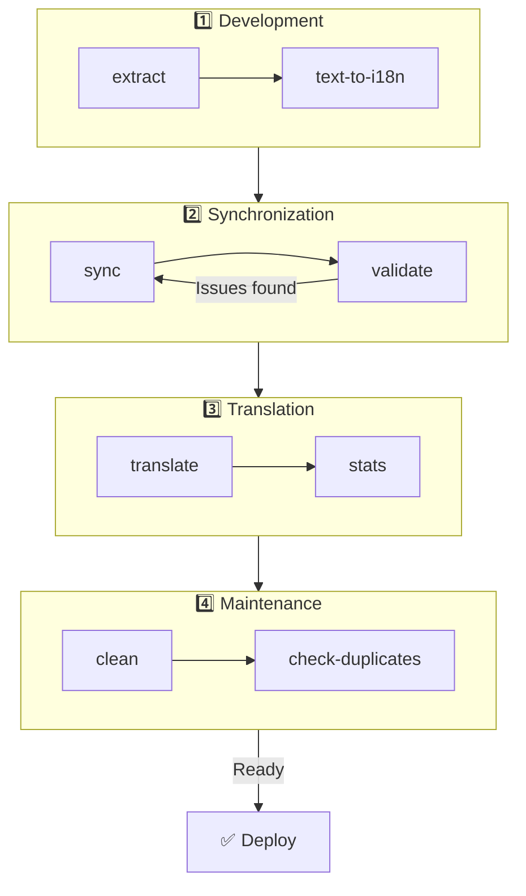

# 🌐 nuxt-i18n-micro-cli गाइड

## 📖 परिचय

`nuxt-i18n-micro-cli` एक कमांड-लाइन उपकरण है जिसे `nuxt-i18n-micro` मॉड्यूल (Nuxt I18n Micro) का उपयोग करके Nuxt.js प्रोजेक्ट्स में स्थानीयकरण और अंतर्राष्ट्रीयकरण प्रक्रिया को सुव्यवस्थित करने के लिए डिज़ाइन किया गया है। यह आपके codebase से अनुवाद keys निकालने, अनुवाद फ़ाइलों का प्रबंधन करने, विभिन्न locales में अनुवाद synchronize करने और बाहरी अनुवाद सेवाओं का उपयोग करके अनुवाद प्रक्रिया को स्वचालित करने के लिए utilities प्रदान करता है।

यह गाइड आपको `nuxt-i18n-micro-cli` को इंस्टॉल करने, कॉन्फ़िगर करने और उपयोग करने के माध्यम से आपकी परियोजना के अनुवादों को प्रभावी ढंग से प्रबंधित करने के लिए मार्गदर्शन करेगी। पैकेज [npmjs.com](https://www.npmjs.com/package/nuxt-i18n-micro-cli) पर।

## 🔧 इंस्टॉलेशन और सेटअप

### 📦 nuxt-i18n-micro-cli इंस्टॉल करना

अपने Nuxt प्रोजेक्ट में वैश्विक रूप से या dev dependency के रूप में इंस्टॉल करें (CI के लिए अनुशंसित):

```bash
# global
npm install -g nuxt-i18n-micro-cli

# or per project
pnpm add -D nuxt-i18n-micro-cli
pnpm exec i18n-micro text-to-i18n --dryRun
```

यदि आपका प्रोजेक्ट Nuxt 4 `app/` डायरेक्टरी (`app/pages`, `app/components`, …) का उपयोग करता है तो **`nuxt-i18n-micro-cli` ≥ 2.1.1** का उपयोग करें। पुराने CLI संस्करण केवल प्रोजेक्ट रूट पर `pages/` को स्कैन करते थे।

### 🛠 अपने प्रोजेक्ट में Initialize करना

इंस्टॉल करने के बाद, आप अपनी Nuxt.js प्रोजेक्ट डायरेक्टरी में `i18n-micro` कमांड चला सकते हैं।

सुनिश्चित करें कि आपका प्रोजेक्ट `nuxt-i18n-micro` के साथ सेट है और `nuxt.config.ts` (या `nuxt.config.js`) में आवश्यक कॉन्फ़िगरेशन है।

### 📄 सामान्य Arguments

- `--cwd`: वर्तमान कार्य निर्देशिका निर्दिष्ट करें (डिफ़ॉल्ट `.`)।
- `--logLevel`: log level सेट करें (`silent`, `info`, `verbose`)।
- `--translationDir`: JSON अनुवाद फ़ाइलों वाली डायरेक्टरी (डिफ़ॉल्ट: `locales`)।

## 📊 CLI Workflow अवलोकन



### Workflow के चरण

| चरण           | कमांड्स                    | उद्देश्य                           |
| --------------- | --------------------------- | --------------------------------- |
| **Development** | `extract`, `text-to-i18n`   | अनुवाद keys ढूँढें और निकालें |
| **Sync**        | `sync`, `validate`          | सुनिश्चित करें कि सभी locales में समान keys हों |
| **Translate**   | `translate`, `stats`        | गुम keys को स्वचालित रूप से अनुवाद करें       |
| **Maintenance** | `clean`, `check-duplicates` | अनुवादों को व्यवस्थित रखें            |

## 📋 कमांड्स

### 🔄 `text-to-i18n` कमांड

CLI पैकेज: [`nuxt-i18n-micro-cli`](https://www.npmjs.com/package/nuxt-i18n-micro-cli)

**विवरण**: Vue/TS/JS फ़ाइलों में hardcoded उपयोगकर्ता-सामने वाले strings को स्कैन करता है, उन्हें `$t('...')` से बदलता है, और नई keys को आपकी JSON अनुवाद फ़ाइल में मर्ज करता है। **Nuxt प्रोजेक्ट रूट** (जहाँ `nuxt.config` रहता है) से चलाएँ।

**उपयोग**:

```bash
i18n-micro text-to-i18n [options]
```

**विकल्प**:

| विकल्प                  | डिफ़ॉल्ट           | विवरण                                                           |
| ----------------------- | ----------------- | --------------------------------------------------------------------- |
| `--translationFile`     | `locales/en.json` | नई keys के लिए JSON फ़ाइल (प्रोजेक्ट रूट के सापेक्ष)।                    |
| `--path`                | —                 | केवल एक फ़ाइल या डायरेक्टरी प्रक्रिया करें (जैसे `app/pages/about.vue`)।      |
| `--context`             | —                 | Key उपसर्ग (जैसे `auth` → `auth.*`)।                                  |
| `--dryRun`              | `false`           | फ़ाइलें लिखे बिना पूर्वावलोकन।                                        |
| `--verbose`             | `false`           | अतिरिक्त लॉगिंग।                                                        |
| `--interactive`         | `false`           | लागू करने से पहले प्रत्येक key की पुष्टि या संपादन करें।                             |
| `--extractOnlyDirs`     | `plugins`         | डायरेक्टरीज़ जहाँ keys निकाली जाती हैं लेकिन स्रोत फ़ाइलें **पुनः लिखी** नहीं जातीं। |
| `--extractOnlyPatterns` | —                 | Glob जैसे extract-only patterns (जैसे `**/*.plugin.ts`)।              |

**उदाहरण**:

```bash
i18n-micro text-to-i18n --translationFile locales/en.json --context auth --dryRun
```

#### कौन-से folders scan किए जाते हैं?

<Info>
CLI **v2.1.1** से, `text-to-i18n` classic root फ़ोल्डर्स और `app/*` समकक्ष दोनों को स्कैन करता है। कमांड को **प्रोजेक्ट रूट** से चलाएँ — `cd app` न करें।
</Info>

निम्नलिखित के अंतर्गत `*.vue`, `*.js`, और `*.ts` एकत्र करता है:

| Nuxt 3 (प्रोजेक्ट रूट) | Nuxt 4 (`app/` डायरेक्टरी) |
| --------------------- | ------------------------- |
| `pages/`              | `app/pages/`              |
| `components/`         | `app/components/`         |
| `plugins/`            | `app/plugins/`            |
| `layouts/`            | `app/layouts/`            |

अन्य फ़ोल्डर्स (`server/`, `composables/`, `middleware/`, …) को छोड़ दिया जाता है जब तक कि आप `--path` का उपयोग नहीं करते। Nuxt 4 के लिए, प्रोजेक्ट रूट से चलाएँ (`cd app` करने की आवश्यकता नहीं)। यदि `i18n.translationDir` `locales/` नहीं है तो `--translationFile` में उसका मिलान करें।

```bash
i18n-micro text-to-i18n --path app/pages
```

#### यह कैसे काम करता है

1. ऊपर की डायरेक्टरीज़ (या `--path` से) से फ़ाइलें एकत्र करें।
2. Literals / template text को `$t('generated.key')` से बदलें (`plugins/` डिफ़ॉल्ट रूप से extract-only है)।
3. मौजूदा entries को हटाए बिना नई keys को `--translationFile` में मर्ज करें।

**उदाहरण Transformations**:

पहले:

```vue
<template>
  <div>
    <h1>Welcome to our site</h1>
    <p>Please sign in to continue</p>
  </div>
</template>
```

बाद में:

```vue
<template>
  <div>
    <h1>{{ $t('pages.home.welcome_to_our_site') }}</h1>
    <p>{{ $t('pages.home.please_sign_in') }}</p>
  </div>
</template>
```

**सर्वोत्तम प्रथाएँ**: पहले dry run करें; पूर्ण run से पहले commit करें; `--translationFile` को `nuxt.config` में `i18n.translationDir` के साथ align करें; bootstrap कोड के लिए `--extractOnlyDirs plugins` रखें।

**सीमाएँ**: अलग npm पैकेज (मॉड्यूल के साथ bundled नहीं); `nuxt.config` को स्वचालित रूप से नहीं पढ़ता; `$t(...)` output करता है; जटिल dynamic strings को इसके बजाय `extract` / `search` की आवश्यकता हो सकती है।

### 📊 `stats` कमांड

**विवरण**: `stats` कमांड का उपयोग आपके Nuxt.js प्रोजेक्ट में प्रत्येक locale के लिए अनुवाद आँकड़े प्रदर्शित करने के लिए किया जाता है। यह आपको यह दिखा कर आपके अनुवादों की प्रगति को समझने में मदद करता है कि उपलब्ध keys की कुल संख्या की तुलना में कितनी keys अनुवादित हैं।

**उपयोग**:

```bash
i18n-micro stats [options]
```

**विकल्प**:

- `--full`: केवल संयुक्त अनुवाद आँकड़े प्रदर्शित करें (डिफ़ॉल्ट: `false`)।

**उदाहरण**:

```bash
i18n-micro stats --full
```

### 🌍 `translate` कमांड

**विवरण**: `translate` कमांड बाहरी अनुवाद सेवाओं का उपयोग करके गुम keys को स्वचालित रूप से अनुवाद करता है। यह कमांड Google Translate, DeepL, और अन्य जैसी सेवाओं से APIs का लाभ उठाकर गुम अनुवादों को भरने की अनुवाद प्रक्रिया को सरल बनाता है।

**उपयोग**:

```bash
i18n-micro translate [options]
```

**विकल्प**:

- `--service`: उपयोग करने के लिए अनुवाद सेवा (जैसे `google`, `deepl`, `yandex`)। यदि निर्दिष्ट नहीं किया जाता है, तो कमांड आपको एक चुनने के लिए prompt करेगा।
- `--token`: चुनी गई अनुवाद सेवा के अनुरूप API key। यदि प्रदान नहीं किया जाता है, तो आपको इसे दर्ज करने के लिए prompt किया जाएगा।
- `--options`: अनुवाद सेवा के लिए अतिरिक्त विकल्प, अल्पविरामों द्वारा अलग किए गए key:value pairs के रूप में प्रदान किए जाते हैं (जैसे `model:gpt-3.5-turbo,max_tokens:1000`)।
- `--replace`: सभी keys का अनुवाद करें, मौजूदा अनुवादों को प्रतिस्थापित करें (डिफ़ॉल्ट: `false`)।

**उदाहरण**:

```bash
i18n-micro translate --service deepl --token YOUR_DEEPL_API_KEY
```

#### 🌐 समर्थित अनुवाद सेवाएँ

`translate` कमांड कई अनुवाद सेवाओं का समर्थन करता है। कुछ समर्थित सेवाएँ हैं:

- **Google Translate** (`google`)
- **DeepL** (`deepl`)
- **Yandex Translate** (`yandex`)
- **OpenAI** (`openai`)
- **Azure Translator** (`azure`)
- **IBM Watson** (`ibm`)
- **Baidu Translate** (`baidu`)
- **LibreTranslate** (`libretranslate`)
- **MyMemory** (`mymemory`)
- **Lingva Translate** (`lingvatranslate`)
- **Papago** (`papago`)
- **Tencent Translate** (`tencent`)
- **Systran Translate** (`systran`)
- **Yandex Cloud Translate** (`yandexcloud`)
- **ModernMT** (`modernmt`)
- **Lilt** (`lilt`)
- **Unbabel** (`unbabel`)
- **Reverso Translate** (`reverso`)

#### ⚙️ सेवा कॉन्फ़िगरेशन

कुछ सेवाओं को विशिष्ट कॉन्फ़िगरेशन या API keys की आवश्यकता होती है। `translate` कमांड का उपयोग करते समय, आप सेवा निर्दिष्ट कर सकते हैं और यदि आवश्यक हो तो आवश्यक `--token` (API key) और अतिरिक्त `--options` प्रदान कर सकते हैं।

उदाहरण के लिए:

```bash
i18n-micro translate --service openai --token YOUR_OPENAI_API_KEY --options openaiModel:gpt-3.5-turbo,max_tokens:1000
```

### 🛠️ `extract` कमांड

**विवरण**: आपके codebase से अनुवाद keys निकालता है और उन्हें scope द्वारा व्यवस्थित करता है।

**उपयोग**:

```bash
i18n-micro extract [options]
```

**विकल्प**:

- `--prod, -p`: production मोड में चलाएँ।

**उदाहरण**:

```bash
i18n-micro extract
```

### 🔄 `sync` कमांड

**विवरण**: locales में अनुवाद फ़ाइलों को synchronize करता है, यह सुनिश्चित करता है कि सभी locales में समान keys हों।

**उपयोग**:

```bash
i18n-micro sync [options]
```

**उदाहरण**:

```bash
i18n-micro sync
```

### ✅ `validate` कमांड

**विवरण**: संदर्भ locale की तुलना में अनुवाद फ़ाइलों को गुम या अतिरिक्त keys के लिए मान्य करता है।

**उपयोग**:

```bash
i18n-micro validate [options]
```

**उदाहरण**:

```bash
i18n-micro validate
```

### 🧹 `clean` कमांड

**विवरण**: अनुवाद फ़ाइलों से अप्रयुक्त अनुवाद keys को हटाता है।

**उपयोग**:

```bash
i18n-micro clean [options]
```

**उदाहरण**:

```bash
i18n-micro clean
```

### 📤 `import` कमांड

**विवरण**: PO फ़ाइलों को वापस JSON format में परिवर्तित करता है और उन्हें अनुवाद डायरेक्टरी में सहेजता है।

**उपयोग**:

```bash
i18n-micro import [options]
```

**विकल्प**:

- `--potsDir`: PO फ़ाइलें रखने वाली डायरेक्टरी (डिफ़ॉल्ट: `pots`)।

**उदाहरण**:

```bash
i18n-micro import --potsDir pots
```

### 📥 `export` कमांड

**विवरण**: बाहरी अनुवाद प्रबंधन के लिए अनुवादों को PO फ़ाइलों में निर्यात करता है।

**उपयोग**:

```bash
i18n-micro export [options]
```

**विकल्प**:

- `--potsDir`: PO फ़ाइलें सहेजने के लिए डायरेक्टरी (डिफ़ॉल्ट: `pots`)।

**उदाहरण**:

```bash
i18n-micro export --potsDir pots
```

### 🗂️ `export-csv` कमांड

**विवरण**: `export-csv` कमांड JSON फ़ाइलों से अनुवाद keys और मानों, उनके फ़ाइल पथों सहित, को CSV format में निर्यात करता है। यह कमांड उन टीमों के लिए उपयोगी है जो spreadsheet सॉफ़्टवेयर में अनुवाद डेटा के साथ काम करना पसंद करती हैं।

**उपयोग**:

```bash
i18n-micro export-csv [options]
```

**विकल्प**:

- `--csvDir`: वह डायरेक्टरी जहाँ निर्यात की गई CSV फ़ाइलें सहेजी जाएँगी।
- `--delimiter`: CSV फ़ाइल के लिए एक delimiter निर्दिष्ट करें (डिफ़ॉल्ट: `,`)।

**उदाहरण**:

```bash
i18n-micro export-csv --csvDir csv_files
```

### 📑 `import-csv` कमांड

**विवरण**: `import-csv` कमांड CSV फ़ाइलों से अनुवाद डेटा आयात करता है, संबंधित JSON फ़ाइलों को अपडेट करता है। यह spreadsheets से bulk अनुवाद अपडेट लागू करने के लिए उपयोगी है।

**उपयोग**:

```bash
i18n-micro import-csv [options]
```

**विकल्प**:

- `--csvDir`: आयात की जाने वाली CSV फ़ाइलों वाली डायरेक्टरी।
- `--delimiter`: CSV फ़ाइल में उपयोग किया गया delimiter निर्दिष्ट करें (डिफ़ॉल्ट: `,`)।

**उदाहरण**:

```bash
i18n-micro import-csv --csvDir csv_files
```

### 🧾 `diff` कमांड

**विवरण**: उसी डायरेक्टरी (subdirectories सहित) में default locale और अन्य locales के बीच अनुवाद फ़ाइलों की तुलना करता है। कमांड default locale में गुम keys और उनके मानों को अन्य locales की तुलना में पहचानता है, जिससे अनुवाद प्रगति या विसंगतियों को track करना आसान हो जाता है।

**उपयोग**:

```bash
i18n-micro diff [options]
```

**उदाहरण**:

```bash
i18n-micro diff
```

### 🔍 `check-duplicates` कमांड

**विवरण**: `check-duplicates` कमांड सभी अनुवाद फ़ाइलों में प्रत्येक locale के भीतर duplicate अनुवाद मानों की जाँच करता है, जिसमें रूट-स्तरीय और पेज-विशिष्ट अनुवाद दोनों शामिल हैं। यह सुनिश्चित करता है कि एक ही भाषा के भीतर अलग-अलग keys समान अनुवाद मान साझा न करें, जिससे आपके अनुवादों में स्पष्टता और स्थिरता बनाए रखने में मदद मिलती है।

**उपयोग**:

```bash
i18n-micro check-duplicates [options]
```

**उदाहरण**:

```bash
i18n-micro check-duplicates
```

**यह कैसे काम करता है**:

- कमांड प्रत्येक locale के लिए रूट-स्तरीय और पेज-विशिष्ट दोनों अनुवाद फ़ाइलों की जाँच करता है।
- यदि कोई अनुवाद मान कई स्थानों पर दिखाई देता है (या तो रूट-स्तरीय अनुवादों के भीतर या विभिन्न पेजों में), तो यह duplicate मानों को उस फ़ाइल और key के साथ रिपोर्ट करता है जहाँ वे पाए जाते हैं।
- यदि कोई duplicate नहीं पाए जाते हैं, तो कमांड पुष्टि करता है कि locale duplicate अनुवाद मानों से मुक्त है।

यह कमांड यह सुनिश्चित करने में मदद करता है कि अनुवाद keys unique मान बनाए रखें, जिससे उसी locale के भीतर आकस्मिक पुनरावृत्ति को रोका जा सके।

### 🔄 `replace-values` कमांड

**विवरण**: `replace-values` कमांड आपको सभी locales में अनुवाद मानों का bulk प्रतिस्थापन करने की अनुमति देता है। यह साधारण text प्रतिस्थापन और regular expressions (regex) का उपयोग करके उन्नत प्रतिस्थापन दोनों का समर्थन करता है। आप regex patterns में capturing groups का भी उपयोग कर सकते हैं और उन्हें प्रतिस्थापन string में reference कर सकते हैं, जो इसे अधिक जटिल प्रतिस्थापन परिदृश्यों के लिए आदर्श बनाता है।

**उपयोग**:

```bash
i18n-micro replace-values [options]
```

**विकल्प**:

- `--search`: अनुवादों में खोजने के लिए text या regex pattern। यह एक आवश्यक विकल्प है।
- `--replace`: पाए गए अनुवादों के लिए उपयोग करने के लिए प्रतिस्थापन text। यह एक आवश्यक विकल्प है।
- `--useRegex`: regular expression pattern का उपयोग करके खोज सक्षम करें (डिफ़ॉल्ट: `false`)।

**उदाहरण 1**: सरल प्रतिस्थापन

सभी locales में string "Hello" को "Hi" से बदलें:

```bash
i18n-micro replace-values --search "Hello" --replace "Hi"
```

**उदाहरण 2**: Regex प्रतिस्थापन

regex खोज सक्षम करें और सभी locales में "Hello" से शुरू होकर संख्याओं (जैसे "Hello123") वाले किसी भी string को "Hi" से बदलें:

```bash
i18n-micro replace-values --search "Hello\\d+" --replace "Hi" --useRegex
```

**उदाहरण 3**: Regex capturing groups का उपयोग

मिलान किए गए string के हिस्से को प्रतिस्थापन में गतिशील रूप से डालने के लिए capturing groups का उपयोग करें। उदाहरण के लिए, "Hello [name]" को नाम बरकरार रखते हुए "Hi [name]" से बदलें:

```bash
i18n-micro replace-values --search "Hello (\\w+)" --replace "Hi $1" --useRegex
```

इस मामले में, `$1` पहले capturing group को संदर्भित करता है, जो "Hello" के बाद `[name]` भाग से मेल खाता है। प्रतिस्थापन मूल string से नाम रखेगा।

**यह कैसे काम करता है**:

- कमांड सभी अनुवाद फ़ाइलों (वैश्विक और पेज-विशिष्ट दोनों) को स्कैन करता है।
- जब खोज string या regex pattern के आधार पर एक मैच पाया जाता है, तो यह मिलान किए गए text को दिए गए प्रतिस्थापन से बदल देता है।
- regex का उपयोग करते समय, capturing groups का उपयोग प्रतिस्थापन string में `$1`, `$2`, आदि द्वारा referencing करके किया जा सकता है।
- सभी परिवर्तनों को लॉग किया जाता है, जो फ़ाइल path, अनुवाद key, और अनुवाद मान की before/after स्थिति दिखाता है।

**लॉगिंग**:
प्रत्येक प्रतिस्थापन के लिए, कमांड इन विवरणों को लॉग करता है:

- Locale और फ़ाइल path
- संशोधित किया जा रहा अनुवाद key
- प्रतिस्थापन के बाद पुराना मान और नया मान
- यदि capturing groups के साथ regex का उपयोग कर रहे हैं, तो लॉग समूह मैच दिखाएँगे और उन्हें कैसे बदला गया।

यह आपको बिल्कुल track करने की अनुमति देता है कि प्रतिस्थापन ऑपरेशन के दौरान कहाँ और क्या परिवर्तन किए गए, आपकी अनुवाद फ़ाइलों में संशोधनों का एक स्पष्ट इतिहास प्रदान करता है।

## 🛠 उदाहरण

- **अनुवाद निकालना**:

  ```bash
  i18n-micro extract
  ```

- **Google Translate का उपयोग करके गुम keys का अनुवाद करना**:

  ```bash
  i18n-micro translate --service google --token YOUR_GOOGLE_API_KEY
  ```

- **सभी keys का अनुवाद करना, मौजूदा अनुवादों को प्रतिस्थापित करना**:

  ```bash
  i18n-micro translate --service deepl --token YOUR_DEEPL_API_KEY --replace
  ```

- **अनुवाद फ़ाइलों को मान्य करना**:

  ```bash
  i18n-micro validate
  ```

- **अप्रयुक्त अनुवाद keys साफ़ करना**:

  ```bash
  i18n-micro clean
  ```

- **अनुवाद फ़ाइलों को synchronize करना**:

  ```bash
  i18n-micro sync
  ```

## ⚙️ कॉन्फ़िगरेशन गाइड

`nuxt-i18n-micro-cli` `nuxt.config.ts` (या `nuxt.config.js`) में आपके Nuxt.js i18n कॉन्फ़िगरेशन पर निर्भर करता है। सुनिश्चित करें कि आपने `nuxt-i18n-micro` मॉड्यूल इंस्टॉल और कॉन्फ़िगर किया है।

### 🔑 nuxt.config.js उदाहरण

```ts
export default defineNuxtConfig({
  modules: ['nuxt-i18n-micro'],
  i18n: {
    locales: [
      { code: 'en', iso: 'en-US' },
      { code: 'fr', iso: 'fr-FR' },
    ],
    defaultLocale: 'en',
    fallbackLocale: 'en',
    translationDir: 'locales', // or 'app/locales' for Nuxt 4 colocation
  },
})
```

सुनिश्चित करें कि `translationDir` `nuxt-i18n-micro-cli` द्वारा उपयोग की जाने वाली डायरेक्टरी से मेल खाता है (डिफ़ॉल्ट `locales` है)।

## 📝 सर्वोत्तम प्रथाएँ

### 🔑 सुसंगत Key नामकरण

भ्रम और दोहराव से बचने के लिए सुनिश्चित करें कि अनुवाद keys सुसंगत और वर्णनात्मक हैं।

### 🧹 नियमित रखरखाव

अप्रयुक्त अनुवाद keys को हटाने और अपनी अनुवाद फ़ाइलों को स्वच्छ रखने के लिए नियमित रूप से `clean` कमांड का उपयोग करें।

### 🛠 अनुवाद Workflow को स्वचालित करें

अनुवाद फ़ाइलों की extraction, translation, validation, और synchronization को स्वचालित करने के लिए `nuxt-i18n-micro-cli` कमांड्स को अपने विकास workflow या CI/CD पाइपलाइन में एकीकृत करें।

### 🛡️ API Keys सुरक्षित करें

अनुवाद सेवाओं का उपयोग करते समय जिनके लिए API keys की आवश्यकता होती है, सुनिश्चित करें कि आपकी keys सुरक्षित रखी जाती हैं और version control सिस्टम में commit नहीं की जाती हैं। पर्यावरण चर या सुरक्षित key प्रबंधन समाधानों का उपयोग करने पर विचार करें।

## 📞 समर्थन और योगदान

यदि आपको कोई समस्या आती है या सुधार के लिए सुझाव हैं, तो प्रोजेक्ट में योगदान करने या प्रोजेक्ट के repository पर एक issue खोलने के लिए स्वतंत्र महसूस करें।

---

इस गाइड का पालन करके, आप `nuxt-i18n-micro-cli` का उपयोग करके अपने Nuxt.js प्रोजेक्ट में अनुवादों को प्रभावी ढंग से प्रबंधित कर सकेंगे, अपने अंतर्राष्ट्रीयकरण प्रयासों को सुव्यवस्थित करते हुए और विभिन्न locales में उपयोगकर्ताओं के लिए एक सहज अनुभव सुनिश्चित करते हुए।
