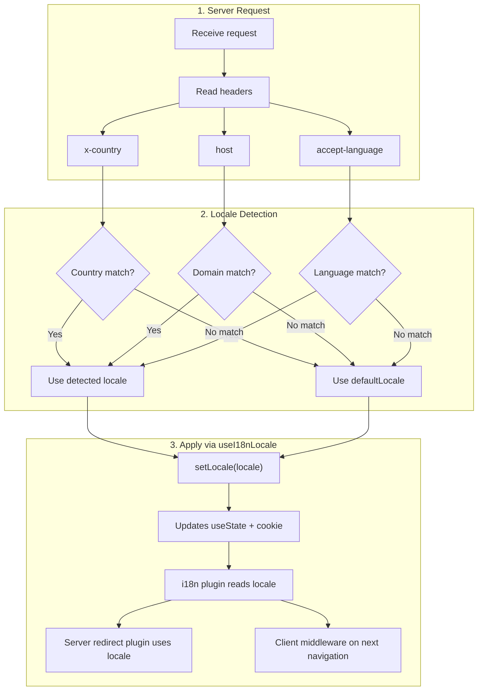

# 🔧 Nuxt I18n Micro में कस्टम भाषा पहचान

## 📖 अवलोकन

Nuxt I18n Micro v3 सभी लोकेल प्रबंधन के लिए एक केंद्रीकृत composable — `useI18nLocale()` — प्रदान करता है। यह v2 के मैन्युअल `useState`/`useCookie` patterns को प्रतिस्थापित करता है। एक server plugin में `useI18nLocale().setLocale()` का उपयोग करके, आप मॉड्यूल के redirect और cookie सिस्टम के साथ पूर्ण अनुकूलता बनाए रखते हुए कोई भी custom detection logic लागू कर सकते हैं।

## 🏗️ आर्किटेक्चर

```mermaid
flowchart TB
    subgraph Plugins["Plugin Execution Order"]
        A["Your plugin<br/>order: -10"] -->|setLocale()| B["01.plugin.ts<br/>order: -5"]
        B --> C["06.redirect.ts server<br/>order: 10"]
    end

    subgraph Client["Client SPA Navigation"]
        D["i18n-redirect.global.ts<br/>route middleware"]
    end

    subgraph State["Locale State"]
        E["useState('i18n-locale')"]
        F["localeCookie"]
    end

    A -->|"setLocale() updates both"| E
    A -->|"setLocale() updates both"| F
    B -->|reads| E
    C -->|reads| E
    C -->|reads| F
    D -->|reads target route +| E
```

**मुख्य सिद्धांत**: `useI18nLocale().setLocale()` को एक server plugin में `order: -10` के साथ कॉल करें। यह `useState('i18n-locale')` और locale cookie दोनों को atomically अपडेट करता है, इसलिए i18n plugin (`order: -5`) और server redirect plugin (`order: 10`) पहले SSR अनुरोध पर सही locale देखते हैं। Client-side auto-redirects बाद के navigations पर वैश्विक route middleware में चलते हैं।

## 🛠️ बिल्ट-इन ऑटो-डिटेक्शन को निष्क्रिय करना

यदि आप locale detection पर पूर्ण नियंत्रण चाहते हैं, तो बिल्ट-इन तंत्र को निष्क्रिय करें:

```ts
export default defineNuxtConfig({
  i18n: {
    autoDetectLanguage: false,
  },
})
```

## ✨ उदाहरण: `useI18nLocale` के साथ Server-Side Detection

यह सभी strategies के लिए **अनुशंसित दृष्टिकोण** है।

### चरण 1: `nuxt.config.ts` कॉन्फ़िगर करें

```ts
export default defineNuxtConfig({
  modules: ['nuxt-i18n-micro'],
  i18n: {
    strategy: 'no_prefix', // Works with ANY strategy
    defaultLocale: 'en',
    localeCookie: 'user-locale',
    autoDetectLanguage: false,
    locales: [
      { code: 'en', iso: 'en-US' },
      { code: 'de', iso: 'de-DE' },
      { code: 'ja', iso: 'ja-JP' },
    ],
  },
})
```

### चरण 2: `plugins/i18n-loader.server.ts` बनाएँ

```ts
import { defineNuxtPlugin, useRequestHeaders } from '#imports'

export default defineNuxtPlugin({
  name: 'i18n-custom-loader',
  enforce: 'pre',
  order: -10, // Execute BEFORE the i18n plugin (which has order -5)

  setup() {
    const { setLocale } = useI18nLocale()
    const headers = useRequestHeaders(['host', 'x-country', 'accept-language'])
    let detectedLocale = 'en'

    // --- YOUR DETECTION LOGIC ---

    // Example 1: By domain
    const host = headers['host']
    if (host?.includes('example.de')) {
      detectedLocale = 'de'
    }
    // Example 2: By custom header
    else if (headers['x-country'] === 'JP') {
      detectedLocale = 'ja'
    }
    // Example 3: By Accept-Language header
    else if (headers['accept-language']?.includes('de')) {
      detectedLocale = 'de'
    }

    // --- APPLY THE LOCALE ---
    setLocale(detectedLocale)
  },
})
```

### यह कैसे काम करता है



1. **Plugin पहले चलता है** (`order: -10`) — headers, domain, या अन्य स्रोतों से locale का पता लगाता है
2. **`setLocale()` दोनों को अपडेट करता है** `useState('i18n-locale')` और cookie — सभी बाद के plugins के लिए तत्काल दृश्यता सुनिश्चित करता है
3. **i18n plugin** (`order: -5`) locale पढ़ता है और सही अनुवाद लोड करता है
4. **Server redirect plugin** (`order: 10`) SSR पर redirect निर्णयों के लिए locale का उपयोग करता है
5. **Client route middleware** (`i18n-redirect`) SPA navigation पर redirects लागू करता है जब URL locale preference से मेल नहीं खाता

## 🌐 Strategy-विशिष्ट व्यवहार

`useI18nLocale().setLocale()` **सभी strategies** के साथ काम करता है। Redirect व्यवहार strategy पर निर्भर करता है:

<Tip>
| Strategy | `setLocale('de')` का प्रभाव |
|----------|---------------------------|
| `no_prefix` | जर्मन में render करता है, URL में कोई परिवर्तन नहीं |
| `prefix` | 302 → `/de/` (server-side redirect) |
| `prefix_except_default` | 302 → `/de/` यदि `de` ≠ default; कोई redirect नहीं यदि `de` = default |
| `prefix_and_default` | कोई redirect नहीं (`/` और `/de/` दोनों मान्य हैं) |
</Tip>

**महत्वपूर्ण नोट्स:**

- Cookie-आधारित locale detection डिफ़ॉल्ट रूप से निष्क्रिय है (`localeCookie: null`)
- cookie persistence सक्षम करने के लिए `localeCookie: 'user-locale'` सेट करें
- यदि cookie/state मान `locales` सूची में नहीं है, तो यह `defaultLocale` पर वापस आ जाता है

## 🏢 उन्नत: Domain-आधारित Detection

Multi-domain सेटअप के लिए जहाँ प्रत्येक domain एक अलग locale की सेवा देता है:

```ts
import { defineNuxtPlugin, useRequestHeaders } from '#imports'

export default defineNuxtPlugin({
  name: 'i18n-domain-loader',
  enforce: 'pre',
  order: -10,

  setup() {
    const { setLocale } = useI18nLocale()
    const headers = useRequestHeaders(['host'])
    const host = headers['host'] || ''

    let detectedLocale = 'en'

    if (host.endsWith('.de') || host.includes('german.')) {
      detectedLocale = 'de'
    } else if (host.endsWith('.fr') || host.includes('french.')) {
      detectedLocale = 'fr'
    } else if (host.endsWith('.jp') || host.includes('japanese.')) {
      detectedLocale = 'ja'
    }

    setLocale(detectedLocale)
  },
})
```

## 🔄 उन्नत: उपयोगकर्ता की Preference का सम्मान करना

यदि उपयोगकर्ता मैन्युअल रूप से भाषा स्विच कर सकते हैं, तो auto-detection के मुकाबले उनकी पसंद का सम्मान करें:

```ts
import { defineNuxtPlugin, useRequestHeaders } from '#imports'

export default defineNuxtPlugin({
  name: 'i18n-smart-loader',
  enforce: 'pre',
  order: -10,

  setup() {
    const { getLocale, setLocale } = useI18nLocale()

    // If user already has a preference (from cookie), respect it
    if (getLocale()) {
      return
    }

    // Otherwise, detect locale from headers
    const headers = useRequestHeaders(['accept-language'])
    let detectedLocale = 'en'

    const acceptLanguage = headers['accept-language'] || ''
    if (acceptLanguage.includes('de')) {
      detectedLocale = 'de'
    } else if (acceptLanguage.includes('ja')) {
      detectedLocale = 'ja'
    }

    setLocale(detectedLocale)
  },
})
```

## ⚙️ केवल-Server या केवल-Client Plugins

यह नियंत्रित करने के लिए कि आपका plugin कहाँ चलता है, [Nuxt filename conventions](https://nuxt.com/docs/getting-started/directory-structure#plugins) का उपयोग करें:

- **केवल-Server**: `i18n-loader.server.ts` — केवल SSR के दौरान चलता है (header-आधारित detection के लिए अनुशंसित)
- **केवल-Client**: `i18n-loader.client.ts` — केवल browser में चलता है (`localStorage` या DOM-आधारित detection के लिए)

<Tip>

</Tip>

## ✅ सारांश

| फ़ीचर                                | विवरण                                                       |
| -------------------------------------- | ----------------------------------------------------------------- |
| `useI18nLocale().setLocale()`          | `useState` + cookie को atomically अपडेट करता है; सभी strategies के साथ काम करता है |
| `useI18nLocale().getLocale()`          | state या cookie से वर्तमान locale लौटाता है                       |
| `useI18nLocale().getPreferredLocale()` | पसंदीदा locale लौटाता है (`locales` सूची के विरुद्ध validated)       |
| Plugin `order: -10`                    | सुनिश्चित करता है कि आपका plugin i18n initialization से पहले चले               |
| `enforce: 'pre'`                       | "pre" plugin समूह में चलता है                                    |

**यह न करें:**

- `useCookie('user-locale')` को सीधे उपयोग करना — `useI18nLocale()` cookies को आंतरिक रूप से प्रबंधित करता है
- `useState('i18n-locale')` को सीधे उपयोग करना — इसके बजाय `useI18nLocale().setLocale()` का उपयोग करें
- `order` >= -5 सेट करना — आपका plugin i18n plugin से पहले चलना चाहिए
