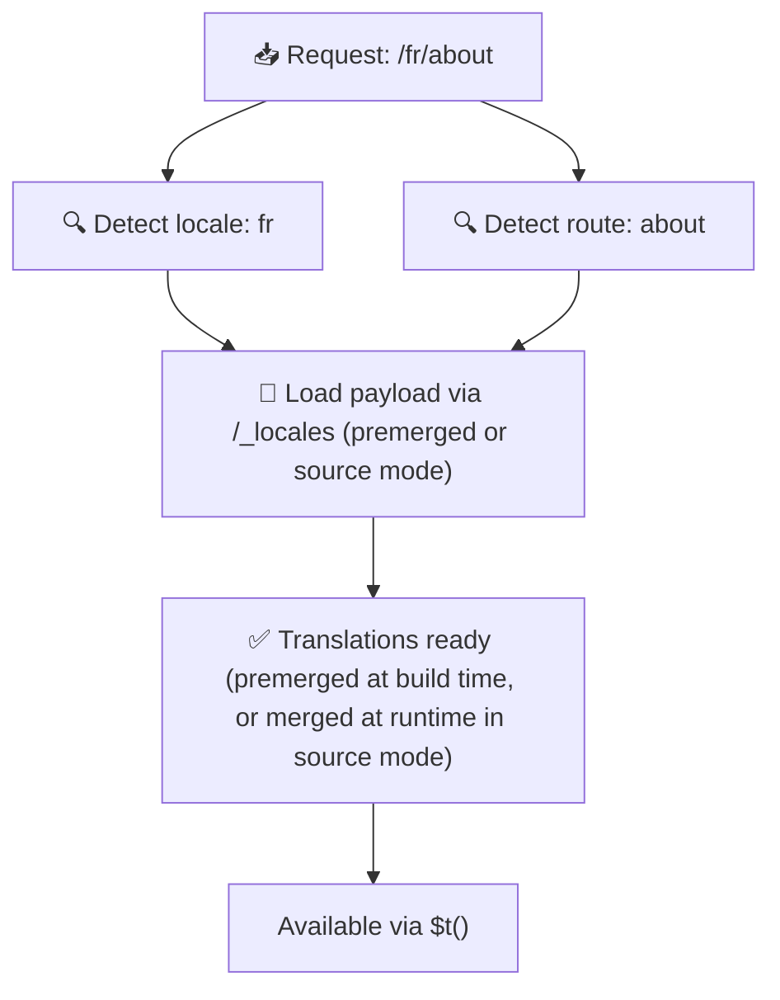

# 📂 फ़ोल्डर संरचना गाइड

## 📖 परिचय

अपनी अनुवाद फ़ाइलों को प्रभावी ढंग से व्यवस्थित करना एक scalable और efficient internationalization (i18n) सिस्टम बनाए रखने के लिए आवश्यक है। `Nuxt I18n Micro` रूट-स्तरीय और पेज-विशिष्ट अनुवादों का प्रबंधन करने के लिए एक स्पष्ट दृष्टिकोण प्रदान करके इस प्रक्रिया को सरल बनाता है। यह गाइड आपको अनुशंसित फ़ोल्डर संरचना के माध्यम से मार्गदर्शन करेगा और समझाएगा कि `Nuxt I18n Micro` इन अनुवादों को कैसे संभालता है।

## 🗂️ अनुशंसित फ़ोल्डर संरचना

`Nuxt I18n Micro` अनुवादों को `pages` डायरेक्टरी के भीतर रूट-स्तरीय फ़ाइलों और पेज-विशिष्ट फ़ाइलों में व्यवस्थित करता है। `translationPayloads.mode: 'premerged'` (डिफ़ॉल्ट) के साथ, रूट-स्तरीय अनुवाद बिल्ड टाइम पर हर पेज फ़ाइल में स्वचालित रूप से मर्ज हो जाते हैं, इसलिए प्रत्येक पेज में रनटाइम मर्जिंग ओवरहेड के बिना अनुवादों का पूरा सेट होता है।

`mode: 'source'` के साथ, source फ़ाइलें Nitro assets में अलग रहती हैं और रनटाइम पर `/_locales` route के माध्यम से मर्ज होती हैं। [Serverless Payload Output](/guides/performance#serverless-payload-output) देखें।

### 🔧 बुनियादी संरचना

यहाँ एक बुनियादी उदाहरण है जिसका आपको पालन करना चाहिए:

```text
locales/
├── pages/
│   ├── index/
│   │   ├── en.json
│   │   ├── fr.json
│   │   └── ar.json
│   ├── about/
│   │   ├── en.json
│   │   ├── fr.json
│   │   └── ar.json
├── en.json
├── fr.json
└── ar.json

```

### 📄 संरचना की व्याख्या

#### 1. 🌍 रूट-स्तरीय अनुवाद फ़ाइलें

- **Path:** `/locales/\{locale\}.json` (जैसे, `/locales/en.json`)
- **उद्देश्य:** इन फ़ाइलों में पूरे एप्लिकेशन में साझा अनुवाद होते हैं (नेविगेशन menus, headers, footers, आदि)। `mode: 'premerged'` (डिफ़ॉल्ट) के साथ, वे बिल्ड टाइम पर हर पेज-विशिष्ट फ़ाइल में स्वचालित रूप से मर्ज हो जाते हैं, इसलिए server प्रति पेज एक single pre-built फ़ाइल लौटाता है।

  **उदाहरण सामग्री (`/locales/en.json`):**

  ```json
  {
    "menu": {
      "home": "Home",
      "about": "About Us",
      "contact": "Contact"
    },
    "footer": {
      "copyright": "© 2024 Your Company"
    }
  }
  ```

#### 2. 📄 पेज-विशिष्ट अनुवाद फ़ाइलें

- **Path:** `/locales/pages/\{routeName\}/\{locale\}.json` (जैसे, `/locales/pages/index/en.json`)
- **उद्देश्य:** इन फ़ाइलों में व्यक्तिगत पेजों के लिए विशिष्ट अनुवाद होते हैं। `mode: 'premerged'` (डिफ़ॉल्ट) के साथ, रूट-स्तरीय अनुवाद बिल्ड टाइम पर आधार के रूप में मर्ज हो जाते हैं, इसलिए प्रत्येक पेज फ़ाइल self-contained बन जाती है।

  **उदाहरण सामग्री (`/locales/pages/index/en.json`):**

  ```json
  {
    "title": "Welcome to Our Website",
    "description": "We offer a wide range of products and services to meet your needs."
  }
  ```

  **उदाहरण सामग्री (`/locales/pages/about/en.json`):**

  ```json
  {
    "title": "About Us",
    "description": "Learn more about our mission, vision, and values."
  }
  ```

### 📂 Dynamic Routes और Nested Paths को संभालना

`Nuxt I18n Micro` एक विशिष्ट renaming convention का उपयोग करके routes में dynamic segments और nested paths को स्वचालित रूप से एक flat फ़ोल्डर संरचना में बदलता है। यह सुनिश्चित करता है कि सभी अनुवाद एक सुसंगत और आसानी से accessible तरीके से संग्रहीत हैं।

#### Dynamic Route अनुवाद फ़ोल्डर संरचना

Dynamic routes, जैसे `/products/[id]`, से निपटते समय, मॉड्यूल dynamic segment `[id]` को फ़ाइल संरचना के भीतर एक static format में बदल देता है।

**Dynamic Routes के लिए उदाहरण फ़ोल्डर संरचना:**

`/products/[id]` जैसे route के लिए, अनुवाद फ़ाइलें `products-id` नामक फ़ोल्डर में संग्रहीत होंगी:

```text
locales/pages/
├── products-id/
│   ├── en.json
│   ├── fr.json
│   └── ar.json

```

**Nested Dynamic Routes के लिए उदाहरण फ़ोल्डर संरचना:**

`/products/key/[id]` जैसे nested route के लिए, अनुवाद फ़ाइलें `products-key-id` नामक फ़ोल्डर में संग्रहीत होंगी:

```text
locales/pages/
├── products-key-id/
│   ├── en.json
│   ├── fr.json
│   └── ar.json

```

**Multi-Level Nested Routes के लिए उदाहरण फ़ोल्डर संरचना:**

`/products/category/[id]/details` जैसे अधिक जटिल nested route के लिए, अनुवाद फ़ाइलें `products-category-id-details` नामक फ़ोल्डर में संग्रहीत होंगी:

```text
locales/pages/
├── products-category-id-details/
│   ├── en.json
│   ├── fr.json
│   └── ar.json

```

### 🛠 डायरेक्टरी संरचना को कस्टमाइज़ करना

यदि आप अनुवादों को एक अलग डायरेक्टरी में संग्रहीत करना पसंद करते हैं, तो `Nuxt I18n Micro` आपको उस डायरेक्टरी को कस्टमाइज़ करने की अनुमति देता है जहाँ अनुवाद फ़ाइलें संग्रहीत होती हैं। आप इसे अपनी `nuxt.config.ts` फ़ाइल में कॉन्फ़िगर कर सकते हैं।

**उदाहरण: अनुवाद डायरेक्टरी को कस्टमाइज़ करना**

```typescript
export default defineNuxtConfig({
  i18n: {
    translationDir: 'i18n', // Custom directory path
  },
})
```

यह `Nuxt I18n Micro` को डिफ़ॉल्ट `/locales` डायरेक्टरी के बजाय `/i18n` डायरेक्टरी में अनुवाद फ़ाइलें खोजने के लिए निर्देशित करेगा।

## ⚙️ अनुवाद कैसे लोड होते हैं

### 🌍 Dynamic Locale Routes

`Nuxt I18n Micro` अनुवादों को कुशलतापूर्वक लोड करने के लिए dynamic locale routes का उपयोग करता है। जब कोई उपयोगकर्ता एक पेज पर जाता है, तो मॉड्यूल उपयुक्त locale निर्धारित करता है और वर्तमान route और locale के आधार पर संबंधित अनुवाद फ़ाइलें लोड करता है।



उदाहरण के लिए:

- `/en/index` पर जाना `/locales/pages/index/en.json` से अनुवाद लोड करेगा।
- `/fr/about` पर जाना `/locales/pages/about/fr.json` से अनुवाद लोड करेगा।

यह पद्धति सुनिश्चित करती है कि केवल आवश्यक अनुवाद लोड हों, server load और client-side प्रदर्शन दोनों को अनुकूलित करते हुए।

### 💾 Caching और Pre-rendering

प्रदर्शन को और बढ़ाने के लिए, `Nuxt I18n Micro` अनुवाद फ़ाइलों की caching और pre-rendering का समर्थन करता है:

- **Caching**: एक बार जब एक अनुवाद फ़ाइल लोड हो जाती है, तो इसे बाद के अनुरोधों के लिए cache किया जाता है, जिससे बार-बार समान डेटा लाने की आवश्यकता कम हो जाती है।
- **Pre-rendering**: बिल्ड प्रक्रिया के दौरान, आप सभी कॉन्फ़िगर किए गए locales और routes के लिए अनुवाद फ़ाइलों को pre-render कर सकते हैं, जिससे उन्हें रनटाइम देरी के बिना सीधे server से serve किया जा सकता है।

## 📝 सर्वोत्तम प्रथाएँ

### 📂 पेज-विशिष्ट फ़ाइलों का बुद्धिमानी से उपयोग करें

अनुवादों को व्यवस्थित रखने के लिए पेज-विशिष्ट फ़ाइलों का लाभ उठाएँ। यह प्रत्येक पेज के अनुवादों को कम और लोड करने में तेज़ रखता है, जो विशेष रूप से जटिल या बड़ी सामग्री वाले पेजों के लिए महत्वपूर्ण है।

### 🔑 अनुवाद Keys को सुसंगत रखें

फ़ाइलों में अपने अनुवाद keys के लिए सुसंगत नामकरण conventions का उपयोग करें। यह स्पष्टता बनाए रखने में मदद करता है और अनुवादों का प्रबंधन करते समय समस्याओं को रोकता है, विशेष रूप से जैसे-जैसे आपका एप्लिकेशन बढ़ता है।

### 🗂️ अनुवादों को संदर्भ द्वारा व्यवस्थित करें

अपनी फ़ाइलों के भीतर संबंधित अनुवादों को एक साथ समूहित करें। उदाहरण के लिए, सभी बटन लेबल को एक `buttons` key के तहत और सभी form-संबंधित texts को एक `forms` key के तहत समूहित करें। यह न केवल पठनीयता में सुधार करता है बल्कि विभिन्न locales में अनुवादों का प्रबंधन करना भी आसान बनाता है।

### ⚠️ Nesting गहराई सीमा (2 स्तर अनुशंसित)

Client-side navigation के दौरान, `Nuxt I18n Micro` छोड़ने और प्रवेश करने वाले पेजों से अनुवादों को संयोजित करने के लिए एक अनुकूलित 2-level deep merge का उपयोग करता है। यह सुनिश्चित करता है कि overlapping nested keys (जैसे, दोनों पेजों में `common.*` के तहत keys हैं) transition animations के दौरान संरक्षित हैं।

**यह मानक `Section → Key → Value` संरचना (2 स्तर) के लिए सही ढंग से काम करता है:**

```json
// Page A translations
{ "common": { "fromA": "Text A" } }

// Page B translations
{ "common": { "fromB": "Text B" } }

// During transition, both are available:
// { "common": { "fromA": "Text A", "fromB": "Text B" } }
```

**हालाँकि, यदि आप 3+ स्तरों के nesting का उपयोग करते हैं, तो transitions के दौरान गहरी keys overwrite हो सकती हैं:**

```json
// Page A translations
{ "auth": { "form": { "login": "Login" } } }

// Page B translations
{ "auth": { "form": { "register": "Register" } } }

// During transition: "login" key is lost
// { "auth": { "form": { "register": "Register" } } }
```

<Tip>

</Tip>

### 🧹 अप्रयुक्त अनुवादों को नियमित रूप से साफ़ करें

समय के साथ, आपका एप्लिकेशन अप्रयुक्त अनुवाद keys जमा कर सकता है, विशेष रूप से यदि features हटाए या पुनर्गठित किए जाते हैं। अपनी अनुवाद फ़ाइलों को कम और maintainable रखने के लिए समय-समय पर उनकी समीक्षा करें और उन्हें साफ़ करें।
