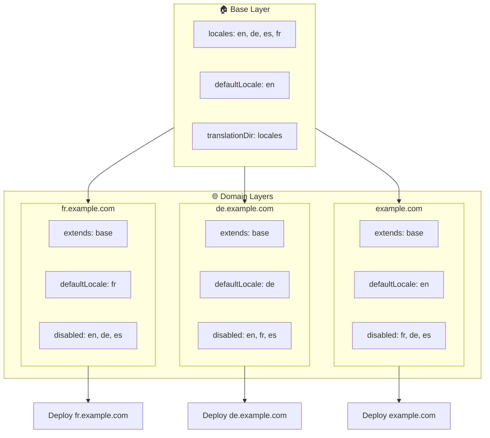

# 🌍 Layers का उपयोग करके `Nuxt I18n Micro` के साथ Multi-Domain Locales सेटअप करना

## 📝 परिचय

`Nuxt I18n Micro` में layers का लाभ उठाकर, आप एक लचीला और maintainable multi-domain localization सेटअप बना सकते हैं। यह दृष्टिकोण न केवल जटिल कार्यक्षमताओं की आवश्यकता को समाप्त करके domain प्रबंधन को सरल बनाता है बल्कि कुशल load distribution और कम प्रोजेक्ट जटिलता की भी अनुमति देता है। विभिन्न locales के लिए अलग-अलग प्रोजेक्ट्स चलाकर, आपका एप्लिकेशन आसानी से scale कर सकता है और कई domains में विभिन्न locale आवश्यकताओं के अनुकूल हो सकता है, वैश्विक एप्लिकेशन के लिए एक मजबूत और scalable समाधान प्रदान करते हुए।

## 🎯 उद्देश्य

एक ऐसा सेटअप बनाना जहाँ विभिन्न domains child layers में configurations को कस्टमाइज़ करके विशिष्ट locales की सेवा दें। यह पद्धति Nuxt की layering प्रणाली का लाभ उठाती है, जिससे आप प्रत्येक domain के लिए बेस कॉन्फ़िगरेशन बनाए रख सकते हैं जबकि इसे विस्तारित या संशोधित कर सकते हैं।

### Multi-Domain आर्किटेक्चर



## 🛠 Multi-Domain Locales को लागू करने के चरण

### 1. **Base Layer बनाएँ**

एक बेस कॉन्फ़िगरेशन layer बनाकर शुरू करें जिसमें आपके एप्लिकेशन के लिए सभी सामान्य locale सेटिंग्स शामिल हों। यह कॉन्फ़िगरेशन अन्य domain-विशिष्ट configurations के लिए आधार के रूप में कार्य करेगा।

#### **Base Layer कॉन्फ़िगरेशन**

बेस कॉन्फ़िगरेशन फ़ाइल `base/nuxt.config.ts` बनाएँ:

```typescript
// base/nuxt.config.ts

export default defineNuxtConfig({
  i18n: {
    locales: [
      { code: 'en', iso: 'en-US', dir: 'ltr' },
      { code: 'de', iso: 'de-DE', dir: 'ltr' },
      { code: 'es', iso: 'es-ES', dir: 'ltr' },
    ],
    defaultLocale: 'en',
    translationDir: 'locales',
    meta: true,
    autoDetectLanguage: true,
  },
})
```

### 2. **Domain-विशिष्ट Child Layers बनाएँ**

प्रत्येक domain के लिए, एक child layer बनाएँ जो उस domain की विशिष्ट आवश्यकताओं को पूरा करने के लिए बेस कॉन्फ़िगरेशन को संशोधित करती है। आप एक विशिष्ट domain के लिए आवश्यक न होने वाले locales को निष्क्रिय कर सकते हैं।

#### **उदाहरण: फ्रेंच Domain के लिए कॉन्फ़िगरेशन**

फ्रेंच domain के लिए `fr/nuxt.config.ts` में एक child layer कॉन्फ़िगरेशन बनाएँ:

```typescript
// fr/nuxt.config.ts

export default defineNuxtConfig({
  extends: '../base', // Inherit from the base configuration

  i18n: {
    locales: [
      { code: 'en', iso: 'en-US', dir: 'ltr', disabled: true }, // Disable English
      { code: 'fr', iso: 'fr-FR', dir: 'ltr' }, // Add and enable the French locale
      { code: 'de', iso: 'de-DE', dir: 'ltr', disabled: true }, // Disable German
      { code: 'es', iso: 'es-ES', dir: 'ltr', disabled: true }, // Disable Spanish
    ],
    defaultLocale: 'fr', // Set French as the default locale
    autoDetectLanguage: false, // Disable automatic language detection
  },
})
```

#### **उदाहरण: जर्मन Domain के लिए कॉन्फ़िगरेशन**

इसी प्रकार, जर्मन domain के लिए `de/nuxt.config.ts` में एक child layer कॉन्फ़िगरेशन बनाएँ:

```typescript
// de/nuxt.config.ts

export default defineNuxtConfig({
  extends: '../base', // Inherit from the base configuration

  i18n: {
    locales: [
      { code: 'en', iso: 'en-US', dir: 'ltr', disabled: true }, // Disable English
      { code: 'fr', iso: 'fr-FR', dir: 'ltr', disabled: true }, // Disable French
      { code: 'de', iso: 'de-DE', dir: 'ltr' }, // Use the German locale
      { code: 'es', iso: 'es-ES', dir: 'ltr', disabled: true }, // Disable Spanish
    ],
    defaultLocale: 'de', // Set German as the default locale
    autoDetectLanguage: false, // Disable automatic language detection
  },
})
```

### 3. **प्रत्येक Domain के लिए एप्लिकेशन Deploy करें**

प्रत्येक domain के लिए उपयुक्त कॉन्फ़िगरेशन के साथ एप्लिकेशन Deploy करें। उदाहरण के लिए:

- `fr` layer कॉन्फ़िगरेशन को `fr.example.com` पर deploy करें।
- `de` layer कॉन्फ़िगरेशन को `de.example.com` पर deploy करें।

### 4. **विभिन्न Locales के लिए कई प्रोजेक्ट्स सेटअप करें**

प्रत्येक locale और domain के लिए, आपको एप्लिकेशन का एक अलग instance चलाना होगा। यह सुनिश्चित करता है कि प्रत्येक domain सही locale कॉन्फ़िगरेशन की सेवा देता है, load distribution को अनुकूलित करता है और प्रोजेक्ट की संरचना को सरल बनाता है। प्रत्येक locale के अनुरूप कई प्रोजेक्ट्स चलाकर, आप configurations के बीच एक स्वच्छ पृथक्करण बनाए रख सकते हैं और समग्र सेटअप की जटिलता को कम कर सकते हैं।

### 5. **Domain के आधार पर Routing कॉन्फ़िगर करें**

सुनिश्चित करें कि आपकी routing उस domain के आधार पर उपयोगकर्ताओं को सही प्रोजेक्ट पर निर्देशित करने के लिए कॉन्फ़िगर की गई है जिसे वे access कर रहे हैं। यह सुनिश्चित करेगा कि प्रत्येक domain उपयुक्त locale की सेवा देता है, उपयोगकर्ता अनुभव को बढ़ाता है और विभिन्न क्षेत्रों में स्थिरता बनाए रखता है।

### 6. **Deploy और सत्यापित करें**

Layers कॉन्फ़िगर करने और उन्हें उनके संबंधित domains पर deploy करने के बाद, सुनिश्चित करें कि प्रत्येक domain सही locale की सेवा दे रहा है। एप्लिकेशन का पूरी तरह से परीक्षण करें ताकि यह पुष्टि हो सके कि domain के आधार पर सही locale लोड होती है।

## 📝 सर्वोत्तम प्रथाएँ

- **बेस कॉन्फ़िगरेशन को सामान्य रखें**: बेस कॉन्फ़िगरेशन में सभी domains पर लागू सामान्य सेटिंग्स शामिल होनी चाहिए।
- **Domain-विशिष्ट Logic को अलग करें**: स्पष्टता और चिंताओं के पृथक्करण को बनाए रखने के लिए domain-विशिष्ट configurations को उनके संबंधित layers में रखें।

## 🎉 निष्कर्ष

`Nuxt I18n Micro` में layers का लाभ उठाकर, आप एक लचीला और maintainable multi-domain localization सेटअप बना सकते हैं। यह दृष्टिकोण न केवल जटिल domain प्रबंधन कार्यक्षमताओं की आवश्यकता को समाप्त करता है बल्कि आपको load को कुशलतापूर्वक वितरित करने और प्रोजेक्ट की जटिलता को कम करने की भी अनुमति देता है। विभिन्न locales के लिए अलग-अलग प्रोजेक्ट्स चलाना सुनिश्चित करता है कि आपका एप्लिकेशन आसानी से scale कर सकता है और विभिन्न domains में अलग-अलग locale आवश्यकताओं के अनुकूल हो सकता है, वैश्विक एप्लिकेशन के लिए एक मजबूत और scalable समाधान प्रदान करते हुए।
