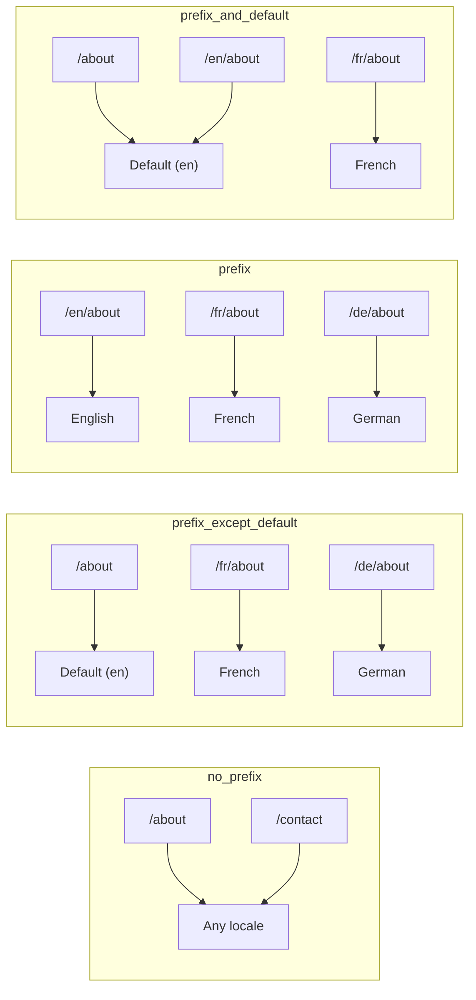
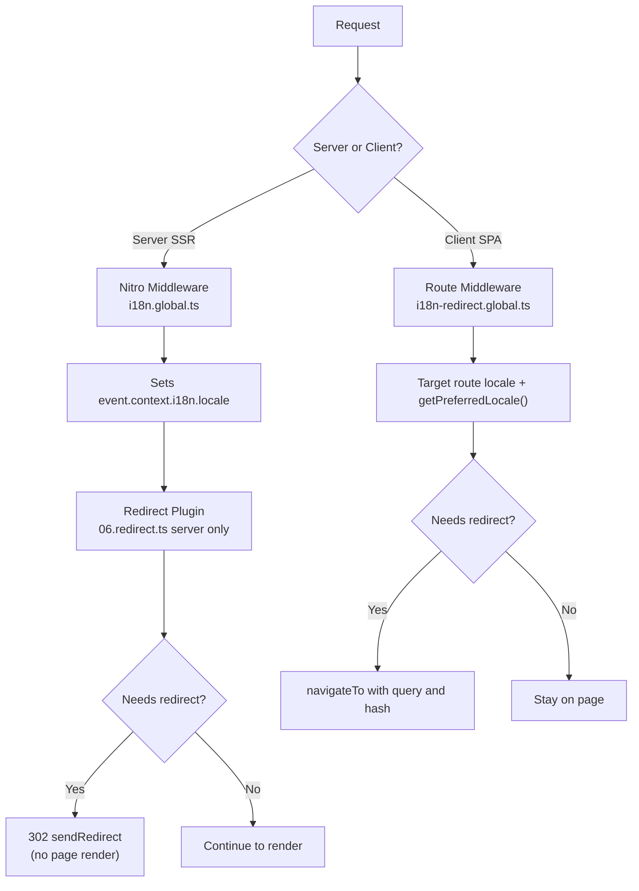

# 🗂️ Nuxt I18n Micro में रूटिंग रणनीतियाँ

## 📖 अवलोकन

Nuxt I18n Micro `strategy` विकल्प के माध्यम से नियंत्रित करता है कि URLs में लोकेल prefixes कैसे दिखाई देते हैं। अंदरूनी तौर पर, दो packages इसे लागू करते हैं:

- **`@i18n-micro/route-strategy`** — बिल्ड-टाइम route जनरेशन (Nuxt pages को localized routes के साथ विस्तारित करता है)
- **`@i18n-micro/path-strategy`** — रनटाइम path resolution, redirects, SEO attributes, और link जनरेशन

Nuxt मॉड्यूल बिल्ड टाइम पर सही strategy class का चयन करता है और इसे `#i18n-strategy` के माध्यम से alias करता है, इसलिए केवल चुना गया implementation ही bundle होता है।

## 🚦 उपलब्ध रणनीतियाँ

{/* generated:option:strategy — do not edit; run `pnpm run docs:generate` */}

**Type** `Strategies` · **Default** `'prefix_except_default'`

लोकेल prefixes के लिए URL रूटिंग रणनीति।

- `'no_prefix'` — URL में कोई locale नहीं; locale cookie में संग्रहीत।
- `'prefix_except_default'` — default को छोड़कर सभी locales को prefix करें।
- `'prefix'` — हमेशा prefix करें, default locale सहित।
- `'prefix_and_default'` — `prefix` की तरह, लेकिन default locale prefix के बिना भी accessible है।

{/* /generated:option:strategy */}

### रणनीति तुलना



### 🛑 `no_prefix`

URLs में कोई locale segment नहीं होता। Locale cookies, `useI18nLocale()` state, या browser detection द्वारा निर्धारित किया जाता है।

- **Routes**: `/about`, `/contact` — सभी locales के लिए समान URL pattern (कोई `/en/`, `/fr/` prefix नहीं)
- **Locale persistence**: `localeCookie` के माध्यम से (यदि निर्दिष्ट नहीं है तो स्वचालित रूप से `'user-locale'` पर सेट)
- **Custom paths**: [`globalLocaleRoutes`](/guides/configuration#globallocaleroutes) और [`defineI18nRoute`](/guides/custom-locale-routes) के माध्यम से समर्थित — URLs में locale prefix जोड़े बिना localized slugs जनरेट किए जाते हैं (जैसे `/about` बनाम `/ueber-uns`)। नेस्टेड routes, aliases, और per-locale restrictions `prefix_except_default` की तुलना में सरल हैं।

<Tip>
`no_prefix` का उपयोग करते समय, यदि निर्दिष्ट नहीं है तो `localeCookie` स्वचालित रूप से `'user-locale'` पर सेट हो जाता है। यह आवश्यक है क्योंकि URL में कोई locale जानकारी नहीं होती।
</Tip>

```typescript
i18n: {
  strategy: 'no_prefix'
  // localeCookie is automatically set to 'user-locale'
}
```

### 🚧 `prefix_except_default`

सभी routes में एक locale prefix होता है **सिवाय** default locale के।

- **Default locale**: `/about`, `/contact`
- **अन्य locales**: `/fr/about`, `/de/contact`
- **prefix के साथ default locale 404 लौटाता है**: `/en/about` → 404 (जब `en` default हो)

```typescript
i18n: {
  strategy: 'prefix_except_default' // This is the default
}
```

### 🌍 `prefix`

हर route में एक locale prefix होता है, default locale सहित।

- **सभी locales**: `/en/about`, `/fr/about`, `/de/about`
- **Root `/`**: उपयोगकर्ता preference के आधार पर `/\{locale\}/` पर redirect करता है

```typescript
i18n: {
  strategy: 'prefix'
}
```

### 🔄 `prefix_and_default`

Default locale prefix के साथ और बिना दोनों उपलब्ध है। Non-default locales में हमेशा एक prefix होता है।

- **Default locale**: `/about` और `/en/about` दोनों मान्य हैं
- **अन्य locales**: `/fr/about`, `/de/about`
- **`/` से कोई redirect नहीं**: `/` और `/en/` दोनों default locale की सेवा देते हैं

```typescript
i18n: {
  strategy: 'prefix_and_default'
}
```

## 🔀 Redirect Architecture (v3)

v3 में, इष्टतम प्रदर्शन के लिए redirect logic को दो layers में विभाजित किया गया है:

### यह कैसे काम करता है



### Server-Side (कोई Flash नहीं)

1. **Nitro middleware** (`i18n.global.ts`) पहले चलता है — URL, cookie, या `Accept-Language` header से locale का पता लगाता है और `event.context.i18n.locale` सेट करता है
2. **Redirect plugin** (`06.redirect.ts`, केवल-server) `i18nStrategy.getClientRedirect()` का उपयोग करके जाँच करता है कि क्या वर्तमान path को redirect की आवश्यकता है और किसी भी page rendering से **पहले** एक 302 जारी करता है
3. यह "error flash" को रोकता है जहाँ उपयोगकर्ता redirect से पहले संक्षिप्त रूप से गलत page देखते हैं

### Client-Side (SPA Navigation)

1. वैश्विक route middleware (`i18n-redirect.global.ts`) प्रत्येक client navigation पर चलता है जब `redirects` सक्षम है
2. पहले **लक्षित route** से पसंदीदा locale निकालता है, फिर `useI18nLocale().getPreferredLocale()` पर वापस जाता है
3. यह तय करने के लिए `i18nStrategy.getClientRedirect()` का उपयोग करता है कि क्या redirect की आवश्यकता है
4. Redirect करते समय `query` और `hash` को संरक्षित करता है

### Locale प्राथमिकता क्रम

Server पर, redirect plugin पसंदीदा locale को इस क्रम में निर्धारित करता है:

1. **`useState('i18n-locale')`** — उच्चतम प्राथमिकता (`useI18nLocale().setLocale()` के माध्यम से प्रोग्रामेटिक रूप से सेट)
2. **Cookie** — यदि `localeCookie` कॉन्फ़िगर किया गया है
3. **`Accept-Language` header** — यदि `autoDetectLanguage: true`
4. **`defaultLocale`** — अंतिम fallback

Client पर, route middleware लक्षित route से locale को प्राथमिकता देता है, फिर उसी state/cookie fallback श्रृंखला का उपयोग करता है।

### Strategy के अनुसार Redirect व्यवहार

| Strategy                | `GET /` व्यवहार                              | Cookie आवश्यक? |
| ----------------------- | --------------------------------------------- | ---------------- |
| `no_prefix`             | कोई redirect नहीं (cookie/state से locale)        | स्वतः-सेट         |
| `prefix`                | 302 → `/\{locale\}/`                            | अनुशंसित      |
| `prefix_except_default` | 302 → `/\{locale\}/` यदि locale ≠ default        | अनुशंसित      |
| `prefix_and_default`    | कोई redirect नहीं (`/` और `/\{locale\}/` दोनों मान्य) | वैकल्पिक         |

### Redirects को निष्क्रिय करना

```typescript
i18n: {
  redirects: false // Disables automatic locale redirects
}
```

जब `redirects: false`, स्वचालित locale redirects निष्क्रिय हो जाते हैं:

- **Server**: redirect plugin (`06.redirect.ts`, केवल-server) पंजीकृत रहता है लेकिन redirect logic छोड़ देता है। यह अभी भी अमान्य locale prefixes (जैसे `/xx/about` जहाँ `xx` एक मान्य locale नहीं है) के लिए **404 checks** और URL prefix से **cookie synchronization** (जैसे `/fr/about` पर जाना cookie को `fr` पर sync करता है) करता है
- **Client**: `i18n-redirect` वैश्विक route middleware **पंजीकृत नहीं होता** — कोई SPA auto-redirects नहीं

## 🍪 Cookie-आधारित Locale Persistence

<Warning>
`prefix` या `prefix_except_default` का उपयोग `redirects: true` (डिफ़ॉल्ट) के साथ करते समय, redirects को सही ढंग से काम करने के लिए आपको `localeCookie` **अवश्य** सेट करना चाहिए। एक cookie के बिना, redirect plugin page reloads में उपयोगकर्ता की locale preference को याद नहीं रख सकता।

```typescript
i18n: {
  strategy: 'prefix_except_default',
  localeCookie: 'user-locale' // Required for redirects to work properly
}
```
</Warning>

**v3 में `localeCookie` कैसे काम करता है:**

- `useI18nLocale()` द्वारा आंतरिक रूप से प्रबंधित — **इसे मैन्युअल रूप से `useCookie()` के माध्यम से सेट न करें**
- जब कोई उपयोगकर्ता एक prefixed URL (जैसे `/fr/about`) पर जाता है, तो cookie स्वचालित रूप से `fr` पर sync हो जाता है
- अगली बार `/` पर जाने पर, cookie मान का उपयोग `/\{locale\}/` पर redirect करने के लिए किया जाता है
- यदि cookie में एक अमान्य locale होता है (`locales` सूची में नहीं), तो यह `defaultLocale` पर वापस आ जाता है

| Strategy                | `localeCookie` डिफ़ॉल्ट | नोट्स                                |
| ----------------------- | ---------------------- | ------------------------------------ |
| `no_prefix`             | Auto: `'user-locale'`  | आवश्यक; स्वचालित रूप से सेट          |
| `prefix`                | `null` (निष्क्रिय)      | redirects के लिए `'user-locale'` सेट करें |
| `prefix_except_default` | `null` (निष्क्रिय)      | redirects के लिए `'user-locale'` सेट करें |
| `prefix_and_default`    | `null` (निष्क्रिय)      | वैकल्पिक                             |

## 🔍 `autoDetectLanguage` और `autoDetectPath`

### `autoDetectLanguage`

{/* generated:option:autoDetectLanguage — do not edit; run `pnpm run docs:generate` */}

**Type** `boolean` · **Default** `true`

`Accept-Language` HTTP header से उपयोगकर्ता की पसंदीदा भाषा का स्वचालित रूप से पता लगाता है।
यह तय करने के लिए `autoDetectPath` के साथ संयोजन में उपयोग किया जाता है कि detection कब होती है।

{/* /generated:option:autoDetectLanguage */}

यह check server middleware में चलता है और एक fallback है: एक cookie या मौजूदा state जीतती है।

```typescript
i18n: {
  autoDetectLanguage: true
}
```

### `autoDetectPath`

{/* generated:option:autoDetectPath — do not edit; run `pnpm run docs:generate` */}

**Type** `string` · **Default** `'/'`

Cookie / Accept-Language preference redirects कहाँ चल सकते हैं (जब `redirects` सक्षम हो)।

- `'/'` — केवल `/` (default locale में deep links accessible रहते हैं; डिफ़ॉल्ट)
- `'no_prefix'` — केवल locale prefix के बिना paths
- `'*'` — हर path, एक स्पष्ट locale prefix को फिर से लिखने सहित
  (जैसे `/fr/about` → `/de/about` जब cookie `de` को प्राथमिकता देती है)

- कोई अन्य string — सटीक path match (जैसे `'/welcome'`)

Prefixed strategy cleanup (जैसे `prefix_except_default` के तहत `/en` → `/`) गेट नहीं की जाती।

{/* /generated:option:autoDetectPath */}

```typescript
i18n: {
  autoDetectPath: '/' // Default: only root
  // autoDetectPath: '*' // All paths — redirects even /fr/about to /de/about
}
```

<Warning>
`autoDetectPath: '*'` के साथ, यहाँ तक कि एक स्पष्ट locale prefix वाले URLs (जैसे `/fr/about`) को redirect किया जाएगा यदि उपयोगकर्ता की पसंदीदा locale भिन्न है। यह domain-आधारित सेटअप के लिए उपयोगी हो सकता है लेकिन URLs साझा करने वाले उपयोगकर्ताओं को भ्रमित कर सकता है।
</Warning>

डिफ़ॉल्ट `autoDetectPath: '/'` और एक locale cookie के साथ:

| request | cookie | result |
| --- | --- | --- |
| `/` | `de` | 302 → `/de` |
| `/about` | `de` | 200, default locale (no rewrite) |

```typescript
i18n: {
  localeCookie: 'user-locale',
  strategy: 'prefix_except_default',
  // Default — remember language on entry, keep deep links stable
  autoDetectPath: '/',
  // Or redirect on every unprefixed path (but not /de/… → /fr/…):
  // autoDetectPath: 'no_prefix',
}
```

## ⚠️ ज्ञात समस्याएँ और सर्वोत्तम प्रथाएँ

### 1. `no_prefix` Strategy में Hydration Mismatch

`no_prefix` का उपयोग करते समय, locale गतिशील रूप से निर्धारित होती है। यदि server और client locale पर असहमत हैं, तो आप एक hydration mismatch देखेंगे।

**समाधान**: i18n initialization से पहले locale सेट करने के लिए एक server plugin में (`order: -10` के साथ) `useI18nLocale().setLocale()` का उपयोग करें:

```ts
// plugins/i18n-loader.server.ts
export default defineNuxtPlugin({
  name: 'i18n-custom-loader',
  enforce: 'pre',
  order: -10,
  setup() {
    const { setLocale } = useI18nLocale()
    setLocale('ja') // Your detection logic here
  },
})
```

विस्तृत उदाहरणों के लिए [कस्टम भाषा पहचान](/guides/custom-language-detection) देखें।

### 2. `localeRoute` के साथ Named Routes का उपयोग करें

Path-आधारित रूटिंग route resolution के साथ समस्याएँ पैदा कर सकती है:

```typescript
// May cause issues
$localeRoute('/page')

// Preferred approach
$localeRoute({ name: 'page' })
```

### 3. i18n के साथ `pages: false` का उपयोग

Nuxt के साथ `pages: false` का उपयोग करते समय:

```typescript
export default defineNuxtConfig({
  pages: false,
  i18n: {
    strategy: 'no_prefix', // Recommended
    disablePageLocales: true, // Required
    localeCookie: 'user-locale', // Required for persistence
  },
})
```

**`pages: false` के साथ सीमाएँ:**

- कोई स्वचालित redirects नहीं
- कोई URL-आधारित locale detection नहीं
- Client-side locale switching के लिए page reload या मैन्युअल अनुवाद लोडिंग आवश्यक

### 4. अमान्य Cookie Handling

यदि एक cookie में एक अमान्य locale होता है (`locales` सूची में नहीं), तो मॉड्यूल सुरुचिपूर्ण ढंग से `defaultLocale` पर वापस आ जाता है। कोई त्रुटि नहीं फेंकी जाती है।

## 📝 सर्वोत्तम प्रथाओं का सारांश

| अनुशंसा            | विवरण                                                                             |
| ------------------------- | ----------------------------------------------------------------------------------- |
| **`localeCookie` सेट करें**    | `redirects: true` के साथ prefix strategies के लिए हमेशा सेट करें                             |
| **`useI18nLocale()` का उपयोग करें** | locale state प्रबंधित करने का केंद्रीकृत तरीका (मैन्युअल `useState`/`useCookie` को प्रतिस्थापित करता है) |
| **Named routes का उपयोग करें**      | `$localeRoute('/page')` के बजाय `$localeRoute(\{ name: 'page' \})`                       |
| **प्रोग्रामेटिक locale**   | `order: -10` वाले server plugin में `useI18nLocale().setLocale()` का उपयोग करें              |
| **मैन्युअल cookies से बचें**  | सीधे `useCookie('user-locale')` का उपयोग न करें — `useI18nLocale()` इसे प्रबंधित करता है      |
