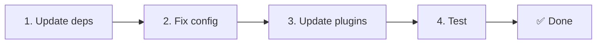

# 📦 v2.x से v3.x पर अपग्रेड करना

<Tip>
[nuxt-i18n से माइग्रेशन](/migration/from-nuxtjs-i18n) देखें — वह गाइड vue-i18n इकोसिस्टम से माइग्रेट करने पर केंद्रित है, न कि nuxt-i18n-micro v2 से।
</Tip>

v3.0.0 मौलिक आर्किटेक्चरल बदलाव लाता है: रणनीति पैकेज, एक नया कैशिंग सिस्टम, `useI18nLocale()` के माध्यम से केंद्रीकृत लोकेल प्रबंधन, और पुनः-डिज़ाइन की गई रीडायरेक्ट पाइपलाइन। यह अनुभाग सभी ब्रेकिंग बदलावों को कवर करता है और यह भी बताता है कि आपके कोड को कैसे अपडेट करें।

## माइग्रेशन चरण



## ब्रेकिंग बदलावों का सारांश

- **लोकेल स्टेट** — `useState` / `useCookie` मैन्युअली → `useI18nLocale()` कंपोज़ेबल
- **कॉन्फ़िग एक्सेस** — `useRuntimeConfig().public.i18nConfig` → `#build/i18n.strategy.mjs` से `getI18nConfig()`
- **रीडायरेक्ट कंपोनेंट** — `fallbackRedirectComponentPath` विकल्प → सर्वर रीडायरेक्ट प्लगइन + क्लाइंट रूट मिडलवेयर (स्वचालित)
- **`includeDefaultLocaleRoute`** — समर्थित (deprecated) → हटा दिया गया, `strategy` विकल्प का उपयोग करें
- **`experimental.hmr`** — `experimental` के अंतर्गत → रूट-लेवल विकल्प
- **`previousPageFallback`** — पूरी तरह से हटा दिया गया (क्युमुलेटिव मर्ज रणनीति इसे स्वचालित रूप से संभालती है)
- **कैशिंग** — `useStorage('cache')` → `TranslationStorage` सिंगलटन (`globalThis` पर `Symbol.for`)
- **SSR ट्रांसफर** — रनटाइम कॉन्फ़िग → Nuxt पेलोड (v3 ने `useState` का उपयोग किया; चंक्स अब `payload.data` में रहते हैं, देखें [प्रदर्शन](/guides/performance#server-side-payload-transfer))
- **रणनीति क्लासेस** — आंतरिक → अलग पैकेज (`@i18n-micro/route-strategy`, `@i18n-micro/path-strategy`)

## हटाया गया: `fallbackRedirectComponentPath`

`fallbackRedirectComponentPath` विकल्प और `locale-redirect.vue` फ़ॉलबैक कंपोनेंट हटा दिए गए हैं। रीडायरेक्ट लॉजिक अब इनके द्वारा हैंडल किया जाता है:

1. **सर्वर मिडलवेयर** (`i18n.global.ts`) — `event.context.i18n.locale` सेट करता है
2. **सर्वर रीडायरेक्ट प्लगइन** (`06.redirect.ts`, केवल सर्वर) — रेंडर से पहले 302 रीडायरेक्ट
3. **क्लाइंट रूट मिडलवेयर** (`i18n-redirect.global.ts`) — हाइड्रेशन के बाद SPA रीडायरेक्ट

```diff
 i18n: {
   strategy: 'prefix_except_default',
-  fallbackRedirectComponentPath: '~/components/MyRedirect.vue',
 }
```

यदि आपके पास फ़ॉलबैक कंपोनेंट में कस्टम रीडायरेक्ट लॉजिक था, तो उसे इसके बजाय सर्वर प्लगइन में लागू करें:

```ts
// plugins/i18n-loader.server.ts
export default defineNuxtPlugin({
  name: 'i18n-custom-redirect',
  enforce: 'pre',
  order: -10,
  setup() {
    const { setLocale } = useI18nLocale()
    // Your custom detection logic
    setLocale(detectedLocale)
  },
})
```

## हटाया गया: `includeDefaultLocaleRoute`

इसके बजाय `strategy` विकल्प का उपयोग करें:

- `includeDefaultLocaleRoute: true` → `strategy: 'prefix'`
- `includeDefaultLocaleRoute: false` → `strategy: 'prefix_except_default'` (डिफ़ॉल्ट)

```diff
 i18n: {
-  includeDefaultLocaleRoute: true,
+  strategy: 'prefix',
 }
```

## कॉन्फ़िग एक्सेस: `getI18nConfig()` `useRuntimeConfig` की जगह लेता है

```diff
- const config = useRuntimeConfig()
- const cookieName = config.public.i18nConfig?.localeCookie || 'user-locale'
+ import { getI18nConfig } from '#build/i18n.strategy.mjs'
+ const { localeCookie: configCookie } = getI18nConfig()
+ const cookieName = configCookie ?? 'user-locale'
```

## लोकेल प्रबंधन: `useI18nLocale()` मैन्युअल स्टेट की जगह लेता है

v2 में, आपने `useState('i18n-locale')` या `useCookie('user-locale')` का सीधे उपयोग किया होगा। v3 में, केंद्रीकृत `useI18nLocale()` कंपोज़ेबल का उपयोग करें:

```diff
- const locale = useState('i18n-locale')
- const cookie = useCookie('user-locale')
- locale.value = 'fr'
- cookie.value = 'fr'
+ const { setLocale } = useI18nLocale()
+ setLocale('fr') // Updates both state and cookie atomically
```

विस्तृत उदाहरणों के लिए [कस्टम भाषा डिटेक्शन](/guides/custom-language-detection) देखें।

## एक्सपेरिमेंटल विकल्प स्थानांतरित / हटाए गए

`hmr` `experimental` से रूट-लेवल पर स्थानांतरित हुआ है। `previousPageFallback` को पूरी तरह से हटा दिया गया है — मॉड्यूल अब एक क्युमुलेटिव डीप मर्ज रणनीति (2-लेवल गहराई) का उपयोग करता है जो पेज ट्रांज़िशन एनिमेशन के दौरान पिछले पेज से ट्रांसलेशन को स्वचालित रूप से संरक्षित करता है, तब भी जब पेज ओवरलैपिंग नेस्टेड कीज़ साझा करते हैं। ट्रांज़िशन एनिमेशन पूरा होने के बाद, `page:transition:finish` हुक मेमोरी से पुराने-पेज की कुंजियों को साफ़ करता है।

```diff
 i18n: {
-  experimental: {
-    hmr: true,
-    previousPageFallback: true
-  }
+  hmr: true,
+  // previousPageFallback removed — handled automatically
 }
```

## रीडायरेक्ट आर्किटेक्चर (v3)

रीडायरेक्ट अब दो कंपोनेंट्स द्वारा स्वचालित रूप से हैंडल किए जाते हैं:

1. **सर्वर-साइड** (`06.redirect.ts`, केवल सर्वर): SSR के दौरान चलता है, किसी भी पेज रेंडरिंग से पहले 302 रीडायरेक्ट जारी करता है। कोई "error flash" नहीं।
2. **क्लाइंट-साइड** (`i18n-redirect.global.ts`): SPA नेविगेशन पर ग्लोबल रूट मिडलवेयर; क्वेरी स्ट्रिंग और हैश को संरक्षित करता है।

रीडायरेक्ट के लिए लोकेल प्राथमिकता:

1. `useState('i18n-locale')` — `useI18nLocale().setLocale()` के माध्यम से सेट किया गया
2. कुकी — यदि `localeCookie` कॉन्फ़िगर है
3. `Accept-Language` हेडर — यदि `autoDetectLanguage: true`
4. `defaultLocale` — फ़ॉलबैक

मानक सेटअप के लिए कोई कोड बदलाव आवश्यक नहीं है।

<Warning>
`prefix` और `prefix_except_default` रणनीतियों के लिए `redirects: true` के साथ, पेज रीलोड के बीच लोकेल स्थिरता सक्षम करने के लिए `localeCookie: 'user-locale'` सेट करें। इसके बिना, रीडायरेक्ट केवल `Accept-Language` या `defaultLocale` का उपयोग करते हैं।
</Warning>

## TypeScript: आंतरिक मॉड्यूल टाइप्स (वैकल्पिक)

यदि आपको `#i18n-internal/plural`, `#i18n-internal/strategy`, या `#i18n-internal/config` जैसे आंतरिक इंपोर्ट से संबंधित टाइप एरर मिलती हैं, तो अपने प्रोजेक्ट के `package.json` में `imports` अनुभाग जोड़ें:

```json
{
  "imports": {
    "#i18n-internal/plural": "nuxt-i18n-micro/internals",
    "#i18n-internal/strategy": "nuxt-i18n-micro/internals",
    "#i18n-internal/config": "nuxt-i18n-micro/internals"
  }
}
```
