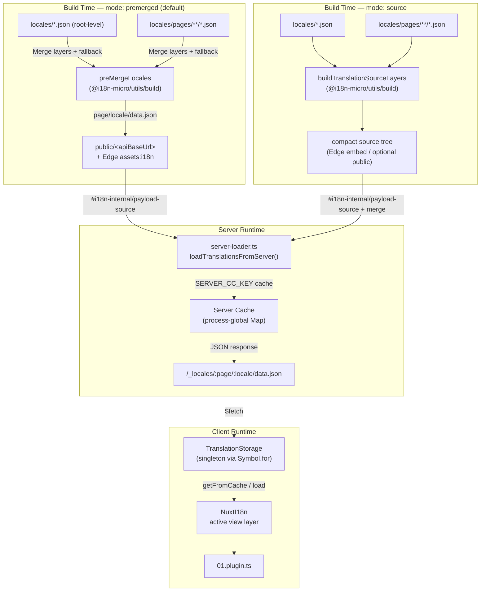

# 🗄️ Fordítási gyorsítótár és tárolási architektúra

## 📖 Áttekintés

A Nuxt I18n Micro v3 többrétegű gyorsítótárazási architektúrát használ a fordításokhoz. A payload betöltés a `translationPayloads.mode` értékétől függ:

- **`premerged`** (alapértelmezett) — a gyökér, oldal, tartalék és rétegfájlok build időben összeolvadnak a `@i18n-micro/utils/build` segítségével a `\{page\}/\{locale\}/data.json` fájlba
- **`source`** — a kompakt forrásfájlok megmaradnak futásidejű összeolvasztáshoz a `@i18n-micro/utils/source-loader` és `@i18n-micro/utils/merge-source` segítségével (az Edge beágyazza őket a Nitro `serverAssets`-be. A Node a `public/` mappából olvassa, ha át van másolva)

Ez az oldal leírja, hogyan működik a beépített gyorsítótár, és hogyan bővítheted egyéni használati esetekhez (admin eszközök, külső API-k, gyorsítótár érvénytelenítés).

## 📊 Architektúra áttekintés

### Adatfolyam



## 🧱 Alapkomponensek

### 1. `TranslationStorage` (kliens + szerver)

**Fájl**: `src/runtime/utils/storage.ts`

Egy singleton osztály, amely egységes fordítási tárolást biztosít mind a kliens, mind a szerver számára. A `Symbol.for('__NUXT_I18N_STORAGE_CACHE__')` szimbólumot használja a `globalThis`-en, hogy biztosítsa, csak egy példány létezik, még akkor is, ha több csomag be van töltve.

**Fő metódusok:**

| Metódus                             | Leírás                                                                  |
| ----------------------------------- | ----------------------------------------------------------------------- |
| `getFromCache(locale, routeName?)`  | Szinkron ellenőrzés: visszaadja a gyorsítótárban lévő memóriabeli adatokat, vagy `null`-t |
| `load(locale, routeName?, options)` | Aszinkron betöltés gyorsítótárazással: először a gyorsítótárat ellenőrzi, majd `$fetch` segítségével letölti |
| `clear()`                           | Törli a teljes gyorsítótárat                                            |

**Gyorsítótár kulcs formátum**: `\{locale\}:\{routeName\}` (pl. `en:index`, `fr:about`)

```typescript
import { translationStorage } from '../utils/storage'

// Synchronous cache check
const cached = translationStorage.getFromCache('en', 'index')

// Async load (with automatic caching)
const result = await translationStorage.load('en', 'index', {
  apiBaseUrl: '_locales',
  baseURL: '/',
  dateBuild: '2024-01-01',
})
// result.data — merged translations
// result.cacheKey — cache key used
```

### ⚙️ Determinisztikus gyorsítótár érvénytelenítés (`i18n.dateBuild`)

Alapértelmezés szerint ez a modul build időben generálja a `dateBuild` értékét a `Date.now()` használatával. Ezt aztán beágyazza a generált `#build/i18n.strategy.mjs` fájlba, és lekérdezési paraméterként (`?v=...`) használja a fordítási fetch gyorsítótárak érvénytelenítéséhez az újraépítések után.

Ha reprodukálható buildekre van szükséged (például a chunk gyorsítótár találati arányának javítására rolling telepítésekben), állíts be stabil értéket a `nuxt.config` fájlban:

```ts
export default defineNuxtConfig({
  i18n: {
    // Any stable string/number (git SHA, CI build number, release tag, etc.)
    dateBuild: process.env.GIT_SHA ?? 'local-dev',
  },
})
```

### 2. `loadTranslationsFromServer()` (csak szerver)

**Fájl**: `src/runtime/server/utils/server-loader.ts`

Egy területi beállításhoz/oldalhoz betölti a fordításokat, és az összeolvasztott eredményt egy folyamat-globális `CacheControl` térképbe cache-eli, amelyet a `@i18n-micro/hmr/cache-keys` (`SERVER_CC_KEY`) kulcsol.

Viselkedés: Az SSR a `#i18n-internal/payload-source`-ból tölt be. **Node**-on `readFile` a `public/<apiBaseUrl>` alatt (`\{page\}/\{locale\}/data.json` premerged módban), **Edge**-en `assets:i18n`. A `premerged` egy fájlt olvas. A `source` összeolvasztja a gyökér/oldal/tartalék fájlokat a `@i18n-micro/utils/source-loader` segítségével.

```typescript
import { loadTranslationsFromServer } from '../server/utils/server-loader'

// Returns { data: Translations, json: string }
const { data, json } = await loadTranslationsFromServer('en', 'index')
```

### 3. Kliens betöltés (nincs HTML beágyazás)

A szótárak **nem** kerülnek beírásra a `nuxtApp.payload`-ba. A szerver memóriában tartja őket az SSR rendereléshez. A kliens bővítmény `await`-eli a `switchContext`-et, amely betölti a `/\{apiBaseUrl\}/:page/:locale/data.json` fájlt (ugyanaz az alapértelmezett tartás, mint a `@nuxtjs/i18n` `experimental.preload: false` beállításnál).

A `NuxtI18n` tartja az aktív nézetréteg szótárt, amelyet a `$t()` és `$has()` használ. A `NuxtTranslationLoader` váltja a területi/útvonal kontextust, és beolvasztja a darabokat abba a rétegbe.

### 4. Szerver API útvonal

**Útvonal**: `/_locales/\{page\}/\{locale\}/data.json`

**Fájl**: `src/runtime/server/routes/i18n.ts`

Ez a Nitro útvonal az aktív payload módhoz szolgáltatja az összeolvasztott fordításokat. A `loadTranslationsFromServer()` metódust hívja, és az eredményt JSON-ként adja vissza.

Éles környezetben a következőt is beállítja:

```http
Cache-Control: public, max-age={httpCacheDuration}, immutable
```

Az alapértelmezett `httpCacheDuration` `31536000` (1 év). Ez biztonságos, mert a kliensek a payloadokat `?v=\{dateBuild\}` gyorsítótár-frissítéssel kérik. Állítsd `httpCacheDuration: 0` értékre a fejléc kihagyásához. A fejléc nem alkalmazható fejlesztés során.

## 📥 Bővítés: Egyéni fordítás betöltés

### Olvasás gyorsítótárból (szerver útvonal)

```ts
// server/api/i18n/load-cache.[post].ts
import { defineEventHandler, readBody } from 'h3'
import { loadTranslationsFromServer } from '#imports'

export default defineEventHandler(async (event) => {
  const { page, locale } = await readBody<{ page: string; locale: string }>(event)
  const { data } = await loadTranslationsFromServer(locale, page)
  return { locale, page, data }
})
```

### Fordítások frissítése (fájl + gyorsítótár érvénytelenítés)

```ts
// server/api/i18n/update.[post].ts
import { defineEventHandler, readBody, createError } from 'h3'
import { join } from 'node:path'
import { readFile, writeFile } from 'node:fs/promises'
import { deepMergeTranslations } from '@i18n-micro/utils/deep-merge'

export default defineEventHandler(async (event) => {
  const { path, updates } = await readBody<{ path: string; updates: Record<string, unknown> }>(event)

  if (!path || !updates) {
    throw createError({ statusCode: 400, statusMessage: 'Missing path or updates' })
  }

  const fullPath = join('locales', path)
  let existing: Record<string, unknown> = {}

  try {
    const content = await readFile(fullPath, 'utf-8')
    existing = JSON.parse(content) as Record<string, unknown>
  } catch {
    // File does not exist — create new
  }

  const merged = deepMergeTranslations(existing, updates)
  await writeFile(fullPath, JSON.stringify(merged, null, 2), 'utf-8')

  return { success: true, path, updated: merged }
})
```


## 🧹 Gyorsítótár törlése

### Programozott gyorsítótár törlés (kliens)

Használd a beépített `$clearCache` metódust:

```vue
<script setup>
const { $clearCache } = useNuxtApp()

// Clears both TranslationStorage and plugin-level cache
$clearCache()
</script>
```

### Szerveroldali gyorsítótár viselkedés

A szerveroldali gyorsítótár (`loadTranslationsFromServer`) folyamat-globális, és a következőkig fennmarad:

- A szerver folyamat újraindul
- Új telepítés észlelése (eltérő `dateBuild` érték)

Szerver nélküli környezetekben minden hidegindítás friss gyorsítótárat kap.

## ⚙️ Szerver nélküli konfiguráció

Szerver nélküli környezetekben (Cloudflare Workers, AWS Lambda) a beépített gyorsítótár memóriabeli `Map` objektumokat használ. A fordítási gyorsítótárhoz magához nem szükséges külső tárolási konfiguráció.

Azonban a Nitro tároló a forrás fordítási fájlokhoz konfigurálást igényelhet:

```ts
export default defineNuxtConfig({
  nitro: {
    storage: {
      // Only needed if default file-system storage is unavailable
      'assets:server': {
        driver: 'cloudflare-kv-binding',
        binding: 'MY_KV_NAMESPACE',
      },
    },
  },
})
```

## 💡 Fő különbségek a v2-hez képest

| Szempont         | v2                            | v3                                                                       |
| ---------------- | ----------------------------- | ------------------------------------------------------------------------ |
| Kliens gyorsítótár     | `useStorage('cache')`         | `TranslationStorage` singleton (Symbol.for a globalThis-en)                |
| SSR átvitel     | Runtime konfiguráció                | Teljes darabok a `payload.data`-n át (v3.0 használt `useState`-et)                    |
| Szerver gyorsítótár     | Nitro cache tárolás           | Folyamat-globális `Map` a `Symbol.for` segítségével                                    |
| Összeolvasztási logika      | Kliensoldalon                   | Build időben (`premerged`) vagy futásidőben (`source`) a `@i18n-micro/utils/*` segítségével |
| Gyorsítótár kulcs formátum | `i18n:merged:\{page\}:\{locale\}` | `\{locale\}:\{routeName\}`                                                   |

## 📚 Kapcsolódó

- [Teljesítmény útmutató](/guides/performance) — Hogyan hat a gyorsítótárazás a teljesítményre
- [Szerveroldali fordítások](/guides/server-side-translations) — Fordítások használata szerver útvonalakon
- [Firebase telepítés](/guides/firebase) — Telepítés-specifikus gyorsítótár szempontok
