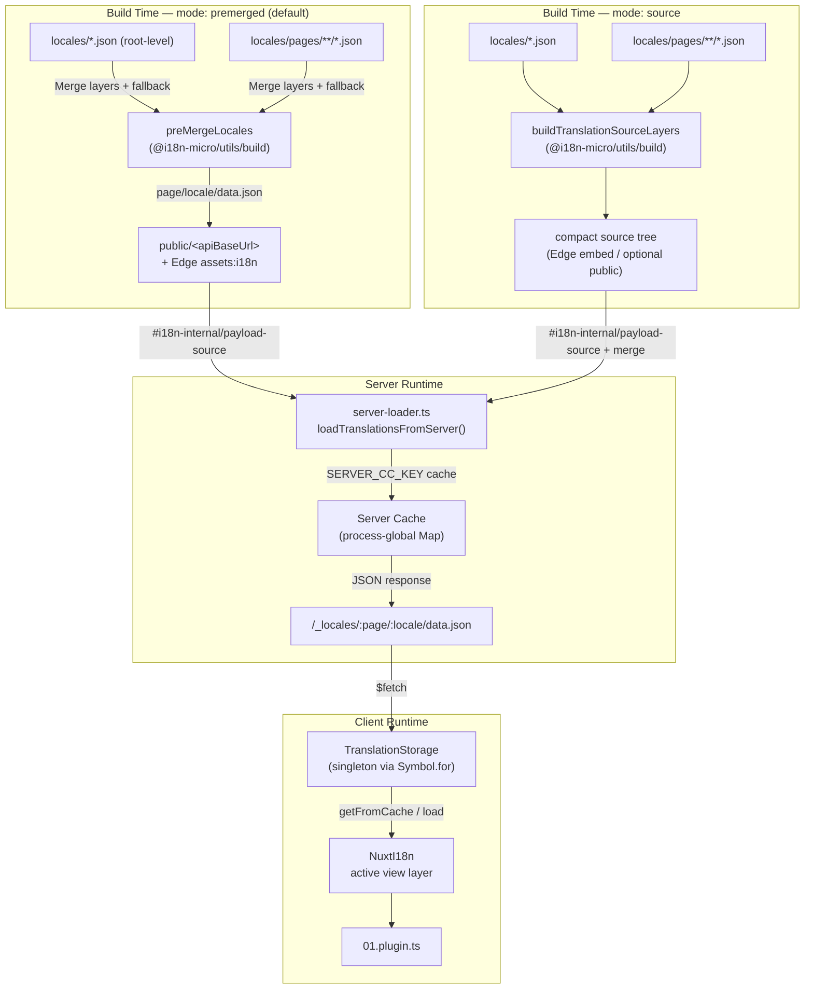

# 🗄️ Fordítási gyorsítótár és tárolási architektúra

## 📖 Áttekintés

A `Nuxt I18n Micro` v3 többrétegű gyorsítótár-architektúrát használ a fordításokhoz. A payloadok betöltése a `translationPayloads.mode` beállítástól függ:

- **`premerged`** (alapértelmezett) — a gyökér-, oldal-, tartalék- és rétegfájlokat build-időben egyesítjük a `@i18n-micro/utils/build`-en át `\{page\}/\{locale\}/data.json`-be
- **`source`** — kompakt forrásfájlokat őrzünk meg futásidejű egyesítésre a `@i18n-micro/utils/source-loader` és `@i18n-micro/utils/merge-source` segítségével (Edge-en Nitro `serverAssets`-be ágyazva; Node-on a `public/`-ból olvasva, ha oda másoltuk)

Ez az oldal a beépített gyorsítótár működését és annak egyedi célokra (adminfelületek, külső API-k, gyorsítótár-invalidáció) való kiterjesztését ismerteti.

## 📊 Architektúra áttekintése

### Adatáramlás



## 🧱 Fő komponensek

### 1. `TranslationStorage` (kliens + szerver)

**Fájl**: `src/runtime/utils/storage.ts`

Singleton osztály, amely egységes fordítási tárolást biztosít mind a kliens, mind a szerver számára. A `globalThis`-en `Symbol.for('__NUXT_I18N_STORAGE_CACHE__')`-t használ, hogy még több csomagban is csak egyetlen példány létezzen.

**Fő metódusok:**

| Metódus                             | Leírás                                                                 |
| ----------------------------------- | ---------------------------------------------------------------------- |
| `getFromCache(locale, routeName?)`  | Szinkron ellenőrzés: visszaadja a memóriában lévő gyorsítótár-adatot vagy `null`-t |
| `load(locale, routeName?, options)` | Aszinkron betöltés gyorsítótárral: először a gyorsítótárat ellenőrzi, majd `$fetch`-csel tölt |
| `clear()`                           | Törli a teljes gyorsítótárat                                           |

**Gyorsítótárkulcs-formátum**: `\{locale\}:\{routeName\}` (pl. `en:index`, `fr:about`)

```typescript
import { translationStorage } from '../utils/storage'

// Synchronous cache check
const cached = translationStorage.getFromCache('en', 'index')

// Async load (with automatic caching)
const result = await translationStorage.load('en', 'index', {
  apiBaseUrl: '_locales',
  baseURL: '/',
  dateBuild: '2024-01-01',
})
// result.data — merged translations
// result.cacheKey — cache key used
```

### ⚙️ Determinisztikus cache-busting (`i18n.dateBuild`)

Alapértelmezés szerint ez a modul build-időben `Date.now()`-val generálja a `dateBuild`-et. Ezt beágyazza a generált `#build/i18n.strategy.mjs`-be, és lekérdezésparaméterként (`?v=...`) használja a fordítás-fetch gyorsítótárak érvénytelenítésére újraépítés után.

Ha reprodukálható buildekre van szükséged (például a chunk-cache találati arányának javításához görgetéses telepítéseknél), állíts be stabil értéket a `nuxt.config`-ban:

```ts
export default defineNuxtConfig({
  i18n: {
    // Any stable string/number (git SHA, CI build number, release tag, etc.)
    dateBuild: process.env.GIT_SHA ?? 'local-dev',
  },
})
```

### 2. `loadTranslationsFromServer()` (csak szerver)

**Fájl**: `src/runtime/server/utils/server-loader.ts`

Betölti a fordításokat egy terület/oldal párhoz, és az egyesített eredményt egy folyamatszintű `CacheControl` mapben tárolja, amelyet a `@i18n-micro/hmr/cache-keys` (`SERVER_CC_KEY`) kulcsol.

Viselkedés: az SSR a `#i18n-internal/payload-source`-ból tölt — **Node** `readFile` a `public/<apiBaseUrl>` alatt (`\{page\}/\{locale\}/data.json` premerged módban), **Edge** `assets:i18n`. A `premerged` egyetlen fájlt olvas; a `source` egyesíti a gyökér/oldal/tartalék rétegeket a `@i18n-micro/utils/source-loader`-en keresztül.

```typescript
import { loadTranslationsFromServer } from '../server/utils/server-loader'

// Returns { data: Translations, json: string }
const { data, json } = await loadTranslationsFromServer('en', 'index')
```

### 3. Kliens-betöltés (nincs HTML-be ágyazás)

A szótárakat **nem** írjuk a `nuxtApp.payload`-ba. A szerver memóriában tartja őket az SSR-rendereléshez;
a klienspluginben `await`-eljük a `switchContext`-et, amely betölti a `/\{apiBaseUrl\}/:page/:locale/data.json`-t
(ugyanaz az alapállás, mint a `@nuxtjs/i18n`-nél `experimental.preload: false` mellett).

A `NuxtI18n` az aktív view-réteg szótárát tartja, amit a `$t()` és a `$has()` használ. A `NuxtTranslationLoader` váltja a terület/útvonal kontextust, és beolvasztja a chunkokat abba a rétegbe.

### 4. Szerver API-útvonal

**Útvonal**: `/_locales/\{page\}/\{locale\}/data.json`

**Fájl**: `src/runtime/server/routes/i18n.ts`

Ez a Nitro-útvonal az aktív payload-módhoz szolgáltatja az egyesített fordításokat. Meghívja a `loadTranslationsFromServer()`-t, és az eredményt JSON-ként adja vissza.

Produkciós módban a következőt is beállítja:

```http
Cache-Control: public, max-age={httpCacheDuration}, immutable
```

Az alapértelmezett `httpCacheDuration` `31536000` (1 év). Ez biztonságos, mert a kliensek `?v=\{dateBuild\}` cache-bustinggal kérik a payloadokat. A `httpCacheDuration: 0` beállítás elhagyja a fejlécet. Fejlesztésben nincs alkalmazva.

## 📥 Bővítés: egyedi fordításbetöltés

### Olvasás a gyorsítótárból (szerverútvonal)

```ts
// server/api/i18n/load-cache.[post].ts
import { defineEventHandler, readBody } from 'h3'
import { loadTranslationsFromServer } from '#imports'

export default defineEventHandler(async (event) => {
  const { page, locale } = await readBody<{ page: string; locale: string }>(event)
  const { data } = await loadTranslationsFromServer(locale, page)
  return { locale, page, data }
})
```

### Fordítások frissítése (fájl + gyorsítótár érvénytelenítése)

```ts
// server/api/i18n/update.[post].ts
import { defineEventHandler, readBody, createError } from 'h3'
import { join } from 'node:path'
import { readFile, writeFile } from 'node:fs/promises'
import { deepMergeTranslations } from '@i18n-micro/utils/deep-merge'

export default defineEventHandler(async (event) => {
  const { path, updates } = await readBody<{ path: string; updates: Record<string, unknown> }>(event)

  if (!path || !updates) {
    throw createError({ statusCode: 400, statusMessage: 'Missing path or updates' })
  }

  const fullPath = join('locales', path)
  let existing: Record<string, unknown> = {}

  try {
    const content = await readFile(fullPath, 'utf-8')
    existing = JSON.parse(content) as Record<string, unknown>
  } catch {
    // File does not exist — create new
  }

  const merged = deepMergeTranslations(existing, updates)
  await writeFile(fullPath, JSON.stringify(merged, null, 2), 'utf-8')

  return { success: true, path, updated: merged }
})
```

<Tip>

</Tip>

## 🧹 Gyorsítótár törlése

### Programozott gyorsítótár-törlés (kliens)

Használd a beépített `$clearCache` metódust:

```vue
<script setup>
const { $clearCache } = useNuxtApp()

// Clears both TranslationStorage and plugin-level cache
$clearCache()
</script>
```

### Szerveroldali gyorsítótár viselkedése

A szerveroldali gyorsítótár (`loadTranslationsFromServer`) folyamatszintű, és addig áll fenn, amíg:

- A szerverfolyamat újraindul
- Új telepítést észlelünk (eltérő `dateBuild` érték)

Szerver nélküli környezetekben minden hidegindításnál friss gyorsítótár van.

## ⚙️ Szerver nélküli konfiguráció

Szerver nélküli környezetekben (Cloudflare Workers, AWS Lambda) a beépített gyorsítótár memóriabeli `Map` objektumokat használ. Magához a fordítási gyorsítótárhoz nem kell külső tárolási beállítás.

A Nitro-tárolás a forrás-fordítási fájlokhoz azonban igényelhet konfigurációt:

```ts
export default defineNuxtConfig({
  nitro: {
    storage: {
      // Only needed if default file-system storage is unavailable
      'assets:server': {
        driver: 'cloudflare-kv-binding',
        binding: 'MY_KV_NAMESPACE',
      },
    },
  },
})
```

## 💡 Fő különbségek a v2-höz képest

| Szempont          | v2                            | v3                                                                       |
| ----------------- | ----------------------------- | ------------------------------------------------------------------------ |
| Kliens-gyorsítótár | `useStorage('cache')`         | `TranslationStorage` singleton (Symbol.for a globalThis-en)              |
| SSR-átvitel       | Runtime config                | Teljes chunkok `payload.data`-n át (v3.0 `useState`-et használt)         |
| Szerver-gyorsítótár | Nitro cache storage           | Folyamatszintű `Map` `Symbol.for`-on át                                  |
| Egyesítési logika  | Kliensoldali                   | Build-időben (`premerged`) vagy futásidőben (`source`) a `@i18n-micro/utils/*`-on át |
| Gyorsítótárkulcs-formátum | `i18n:merged:\{page\}:\{locale\}` | `\{locale\}:\{routeName\}`                                              |

## 📚 Kapcsolódó

- [Teljesítmény útmutató](/guides/performance) — hogyan hat a gyorsítótárazás a teljesítményre
- [Szerveroldali fordítások](/guides/server-side-translations) — fordítások használata szerverútvonalakban
- [Firebase-telepítés](/guides/firebase) — telepítés-specifikus gyorsítótár-megfontolások
