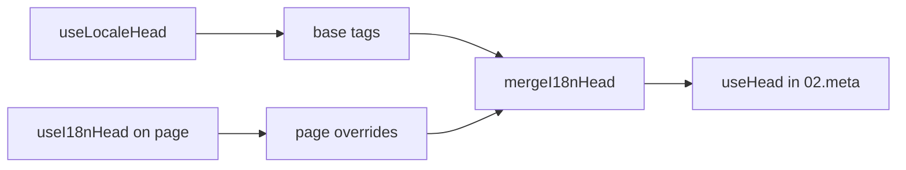

# `useI18nHead` composable

A `useI18nHead` lehetővé teszi az i18n SEO-címkék **oldalankénti** testreszabását egyedi meta-plugin nélkül. Ha `meta: true`, a modul a bemenetedet a [`useLocaleHead`](/api/composables/use-locale-head) kimenetére rétegzi.

Tipikus esetek:

- **CMS / blogcikkek** — csak egyes területekre van fordítás; az alternatív URL-ek nyelvenként eltérnek (más slug vagy útvonal).
- **Dinamikus canonical** — a kanonikus URL-nek az API-ból származó cikk-URL-hez kell illeszkednie, nem a `$switchLocalePath`-hoz.
- **Extra Open Graph** — `og:title`, `og:description`, `og:image` az automatikusan generált `og:locale` / `og:url` mellett.
- **Részleges kontroll** — hagyd meg a modul által generált canonicalt és `og:url`-t, de csak a `hreflang` és `og:locale:alternate` értékeket cseréld.

---

## Szignatúra

{/* generated:symbol:useI18nHead — do not edit; run `pnpm run docs:generate` */}

```ts
useI18nHead(input?: MaybeRefOrGetter<I18nHeadInput | null>): { pageHead: any; resetPageHead: () => void }
```

Oldalszintű felülírások regisztrálása az i18n SEO fejcímkékhez.
A `02.meta` plugin a `useLocaleHead` kimenetére rétegzi.

| Paraméter | Típus | Leírás |
| --- | --- | --- |
| `input` *(opcionális)* | `MaybeRefOrGetter<I18nHeadInput \| null>` |  |

{/* /generated:symbol:useI18nHead */}

## Hogyan illeszkedik a folyamatba



A `useI18nHead`-et egy oldal-komponensben hívod meg. A `02.meta` plugin minden `updateMeta()` után alkalmazza a felülírásokat (útvonalváltás, `$setI18nRouteParams`, `page:finish` a kliensen).

---

## 1. példa — Cikk csak egyes területekre lefordítva

Gyakori minta: az API visszaadja, mely területek léteznek, és azok abszolút vagy relatív URL-jét.

```ts
interface Article {
  title: string
  slug: string
  /** Locale code → page URL (absolute or site-relative) */
  locales: Record<string, string>
}
```

```vue
<script setup lang="ts">
const route = useRoute()
const { data: article } = await useFetch<Article>(`/api/articles/${route.params.slug}`)

const localeCodes = computed(() => Object.keys(article.value?.locales ?? {}))

useI18nHead(() => {
  if (!article.value) return null

  return {
    meta: [
      { property: 'og:title', content: article.value.title },
      { property: 'og:type', content: 'article' },
    ],
    replace: {
      hreflang: localeCodes.value.map((locale) => ({
        rel: 'alternate',
        hreflang: locale,
        href: article.value!.locales[locale]!,
      })),
      ogAlternates: localeCodes.value,
    },
  }
})
</script>
```

Az `ogAlternates` az `i18n.locales` konfigurációdból származó **területkódokat** vár. Az `og:locale:alternate` értékeit a `locale.og` vagy az `iso` alapján oldjuk fel (Open Graph `en_US` formátum).

---

## 2. példa — Területenkénti slug-ú cikk (`$defineI18nRoute` + `$setI18nRouteParams`)

Amikor az URL-eket lokalizált útvonalsablonokból és dinamikus paraméterekből építjük:

```vue
<script setup lang="ts">
const { $defineI18nRoute, $setI18nRouteParams } = useNuxtApp()
const route = useRoute()

const { data: article } = await useFetch(`/api/articles/${route.params.slug}`)

$defineI18nRoute({
  localeRoutes: {
    en: '/blog/[slug]',
    de: '/de/blog/[slug]',
    fr: '/fr/blog/[slug]',
  },
})

if (article.value) {
  $setI18nRouteParams({
    en: { slug: article.value.slugEn },
    de: { slug: article.value.slugDe },
    fr: { slug: article.value.slugFr },
  })

  const availableLocales = article.value.availableLocales as string[]

  useI18nHead({
    meta: [{ property: 'og:title', content: article.value.title }],
    replace: {
      hreflang: availableLocales.map((locale) => ({
        rel: 'alternate',
        hreflang: locale,
        href: article.value!.urls[locale],
      })),
      ogAlternates: availableLocales,
    },
  })
}
</script>
```

A modul által generált alternatívák **az összes** konfigurált területet felsorolnák. A `replace.hreflang` a címkéket azokra a területekre szűkíti, amelyekhez ténylegesen van fordítás.

---

## 3. példa — Egyedi `x-default` a cikk alapértelmezett területéhez

Alapértelmezés szerint az `x-default` a `$switchLocalePath` alapértelmezett területéhez tartozó URL-re mutat. Cikkeknél mutasson az alapértelmezett fordítás URL-jére:

```vue
<script setup lang="ts">
const { $defaultLocale } = useNuxtApp()
const article = await loadArticle()

const defaultLocale = $defaultLocale() ?? 'en'
const defaultHref = article.locales[defaultLocale]

useI18nHead({
  replace: {
    hreflang: Object.entries(article.locales).map(([locale, href]) => ({
      rel: 'alternate',
      hreflang: locale,
      href,
    })),
    xDefault: defaultHref ? { rel: 'alternate', hreflang: 'x-default', href: defaultHref } : false,
    ogAlternates: Object.keys(article.locales),
  },
})
</script>
```

---

## 4. példa — Canonical és `og:url` cseréje az API-adatokból

Ha a canonicalnak egy CMS által megadott URL-hez kell illeszkednie (több domain, egyedi útvonal vagy előre elkészített abszolút URL):

```vue
<script setup lang="ts">
const article = await loadArticle()
const canonical = article.canonicalUrl // e.g. https://www.example.com/en/blog/my-post

useI18nHead({
  replace: {
    canonical,
    ogUrl: canonical,
    hreflang: buildAlternateLinks(article),
    ogAlternates: Object.keys(article.locales),
  },
  meta: [
    { property: 'og:title', content: article.title },
    { name: 'description', content: article.excerpt },
  ],
})
</script>
```

---

## 5. példa — Automatikus canonical / `og:url` megtartása, csak az alternatívák cseréje

Ha a `$switchLocalePath` + `$setI18nRouteParams` már helyes canonicalt és `og:url`-t állít elő, csak a felfedezési címkéket cseréld:

```vue
<script setup lang="ts">
const article = await loadArticle()

useI18nHead({
  replace: {
    hreflang: buildAlternateLinks(article),
    ogAlternates: Object.keys(article.locales),
  },
})
</script>
```

---

## 6. példa — Teljes head egy tartalomrészletező oldalhoz (meta + linkek)

Hasonló mintázat ahhoz, mint amikor „oldal-meta” és „alternatív linkek” külön segédekre vannak bontva — egyetlen hívásba egyesítve:

```vue
<script setup lang="ts">
const article = await loadArticle()
const alternates = Object.entries(article.locales).map(([locale, href]) => ({
  rel: 'alternate' as const,
  hreflang: locale,
  href: normalizeSeoUrl(href), // strip ?query and #hash if needed
}))

useI18nHead({
  meta: [
    { property: 'og:title', content: article.title },
    { property: 'og:description', content: article.description },
    { property: 'og:image', content: article.imageUrl },
    { name: 'twitter:card', content: 'summary_large_image' },
    { name: 'twitter:title', content: article.title },
  ],
  replace: {
    canonical: article.canonicalUrl,
    ogUrl: article.canonicalUrl,
    hreflang: alternates,
    ogAlternates: Object.keys(article.locales),
  },
})
</script>
```

```ts
/** Remove query and hash — useful when CMS URLs must be clean for SEO */
function normalizeSeoUrl(href: string): string {
  try {
    const url = new URL(href, 'https://placeholder.local')
    url.search = ''
    url.hash = ''
    return href.startsWith('http') ? url.href : `${url.pathname}`
  } catch {
    return href.split(/[?#]/)[0] ?? href
  }
}
```

---

## 7. példa — Két tartalomtípus, azonos minta (hírek vs. útmutatók)

Azonos API-forma, eltérő útvonalnevek — használj újra egy kis segédet:

```ts
// composables/useArticleHead.ts
import type { I18nHeadInput } from '@i18n-micro/types'

interface LocalizedContent {
  title: string
  locales: Record<string, string>
  canonicalUrl?: string
}

export function buildArticleHead(content: LocalizedContent): I18nHeadInput {
  const localeCodes = Object.keys(content.locales)
  const canonical = content.canonicalUrl ?? content.locales.en

  return {
    meta: [{ property: 'og:title', content: content.title }],
    replace: {
      canonical,
      ogUrl: canonical,
      hreflang: localeCodes.map((locale) => ({
        rel: 'alternate',
        hreflang: locale,
        href: content.locales[locale]!,
      })),
      ogAlternates: localeCodes,
    },
  }
}
```

```vue
<!-- pages/blog/[slug].vue -->
<script setup lang="ts">
const article = await loadArticle()
useI18nHead(buildArticleHead(article))
</script>
```

```vue
<!-- pages/guides/[slug].vue -->
<script setup lang="ts">
const guide = await loadGuide()
useI18nHead(buildArticleHead(guide))
</script>
```

---

## 8. példa — Beépített alternatívák letiltása, saját lista biztosítása

Ez egyenértékű a modul hreflang-generátorának letiltásával és egyedi lista átadásával (nincs duplikált alternate-halmaz):

```vue
<script setup lang="ts">
const article = await loadArticle()

useI18nHead({
  disable: ['hreflang', 'x-default', 'og-alternates'],
  link: Object.entries(article.locales).map(([locale, href]) => ({
    rel: 'alternate',
    hreflang: locale,
    href,
  })),
  replace: {
    ogAlternates: Object.keys(article.locales),
  },
})
</script>
```

Vagy előnyben részesítheted a `replace.hreflang`-et `disable` nélkül — ez egy lépésben lecseréli az összes `rel="alternate"` linket.

---

## 9. példa — Landing oldal: csak extra OG, minden i18n-címkét megtartva

```vue
<script setup lang="ts">
const { t } = useI18n()

useI18nHead({
  meta: [
    { property: 'og:title', content: t('landing.ogTitle') },
    { property: 'og:description', content: t('landing.ogDescription') },
  ],
})
</script>
```

---

## 10. példa — Termékoldal: hreflang letiltása egy területi kísérlethez

```vue
<script setup lang="ts">
useI18nHead({
  disable: ['hreflang', 'x-default'],
  // canonical, og:locale, og:url still generated
})
</script>
```

---

## 11. példa — Reaktív frissítés kliensoldali fetch után

```vue
<script setup lang="ts">
const article = ref<Article | null>(null)

onMounted(async () => {
  article.value = await $fetch('/api/articles/latest')
})

useI18nHead(() => {
  if (!article.value) return null
  return {
    meta: [{ property: 'og:title', content: article.value.title }],
    replace: {
      hreflang: Object.entries(article.value.locales).map(([locale, href]) => ({
        rel: 'alternate',
        hreflang: locale,
        href,
      })),
    },
  }
})
</script>
```

A fejrész frissül `page:finish` eseménykor és amikor a `pageHead` állapot változik.

---

## 12. példa — HTTPS-eredet fordított proxy mögött

Ha korábban „publikus eredet” composable-t oldottál fel a canonical / alternate abszolút URL-ekhez, helyette használj modul-konfigurációt:

```ts
// nuxt.config.ts
export default defineNuxtConfig({
  i18n: {
    meta: true,
    // undefined = origin from current request (multi-domain friendly)
    metaBaseUrl: undefined,
    metaTrustForwardedHost: true,
    metaTrustForwardedProto: true,
  },
})
```

Ezután adj át **útvonalakat vagy teljes URL-eket** a `replace.hreflang` / `replace.canonical` értékekben. A modul SSR-en a `useRequestURL`-t használja az `X-Forwarded-Host` / `X-Forwarded-Proto` fejlécekkel.

---

## API-referencia

### `meta`

További `<meta>` címkék. Deduplikálva `id`, `property` vagy `name` alapján.

### `link`

További `<link>` címkék. Deduplikálva `id` vagy `rel` + `hreflang` alapján.

### `htmlAttrs`

Egyesítve a `useLocaleHead` `<html>` attribútumaival (`lang`, `dir`).

### `replace`

| Kulcs          | Típus                     | Hatás                                          |
| -------------- | ------------------------- | ---------------------------------------------- |
| `canonical`    | `string \| false`         | Cseréli vagy eltávolítja a canonical linket    |
| `hreflang`     | `I18nHeadLink[] \| false` | Cseréli vagy eltávolítja az összes `rel="alternate"` linket |
| `xDefault`     | `I18nHeadLink \| false`   | Cseréli vagy eltávolítja a `hreflang="x-default"`-et |
| `ogLocale`     | `string \| false`         | Cseréli vagy eltávolítja az `og:locale`-t      |
| `ogUrl`        | `string \| false`         | Cseréli vagy eltávolítja az `og:url`-t         |
| `ogAlternates` | `string[] \| false`       | Újraépíti az `og:locale:alternate`-eket a területkódokhoz |

### `disable`

| Érték           | Eltávolítja                              |
| --------------- | ---------------------------------------- |
| `hreflang`      | Területi alternate linkek (az `x-default` nem) |
| `x-default`     | `hreflang="x-default"` link              |
| `canonical`     | Canonical link                           |
| `og`            | `og:locale` és `og:url`                  |
| `og-alternates` | `og:locale:alternate` címkék             |
| `html`          | `lang` / `dir` a `<html>` elemen         |

---

## `useLocaleHead` vs. `useI18nHead`

| Composable      | Hatókör              | Mikor használd                             |
| --------------- | -------------------- | ------------------------------------------ |
| `useLocaleHead` | Globális / manuális head | `meta: false`, teljesen egyedi `useHead` beállítás |
| `useI18nHead`   | Oldalankénti felülírás | `meta: true`, adott oldalak testreszabása  |

Ha `meta: true`, **nem** kell `useLocaleHead` olyan oldalakon, amelyek csak a `useI18nHead`-et használják.

---

## Migrálás egyedi i18n head pluginről

Sok projekt fenntart egy egyedi plugint, amely:

- oldalspecifikus alternate linkeket egyesít megosztott állapotból;
- kiszűri a duplikált regionális `hreflang` bejegyzéseket;
- normalizálja az `og:locale` értékeket;
- eltávolítja a lekérdezés-sztringeket az SEO URL-ekből.

Ezt lecserélheted a tartalmi oldalakon lévő `useI18nHead`-re és a modul alapértékeire.

| Korábbi megközelítés                                  | `useI18nHead`-del                                    |
| ----------------------------------------------------- | ---------------------------------------------------- |
| Megosztott állapot + „mely területek léteznek ehhez a cikkhez” | `replace: \{ ogAlternates: localeCodes \}`             |
| Külön segéd `rel="alternate"` linkek építéséhez       | `replace: \{ hreflang: links \}`                       |
| Egyedi plugin, ami az oldal állapotát a headbe fűzi   | Beépített egyesítés a `02.meta`-ban                  |
| Egyedi „publikus eredet” abszolút URL-ekhez           | `metaBaseUrl` + továbbított fejlécek (lásd 12. példa) |
| Rövid `og:locale` (`en` a `en_US` helyett)            | Állítsd be a `locale.og`-t vagy használd az `iso`-t → `en_US` (OG protokoll) |

**`hreflang` az `iso`-ból:** minden terület egyetlen alternatívát bocsát ki `hreflang = iso || code` értékkel. Az útválasztási `code`-ot sosem használjuk, ha az `iso` be van állítva (elkerüli az érvénytelen címkéket, például `hreflang="mx"`). A csupasz nyelvi tartalékokra (`es-ES` → `es` is) a `hreflangBaseLanguage: true`-val iratkozhatsz fel — az `iso`-ból származtatva, nem a `code`-ból. Teljesen egyedi listákhoz használd a `replace.hreflang`-et.

**JSON-LD:** a `useI18nHead` nem generál strukturált adatot. Tartsd meg mellette a `useHead(\{ script: [...] \})`-t vagy egy dedikált JSON-LD segédet.

---

## Lásd még

- [SEO-útmutató](/guides/seo) — automatikus meta-generálás és oldalszintű felülírások
- [`useLocaleHead`](/api/composables/use-locale-head) — alacsonyszintű head API
