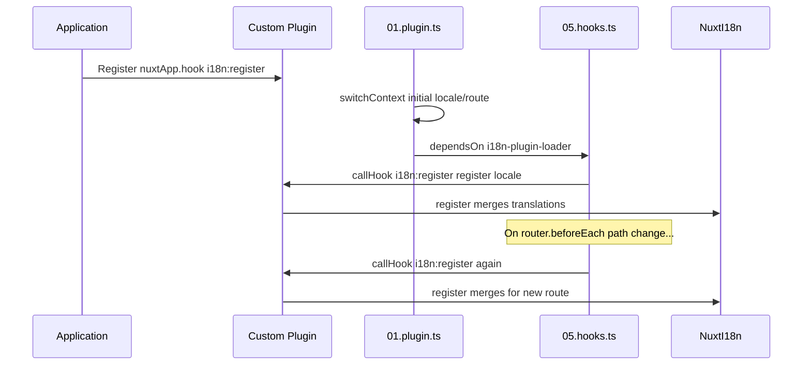

# 📢 Események

## 🔄 `i18n:register`

A `Nuxt I18n Micro` `i18n:register` eseménye lehetővé teszi, hogy dinamikusan adj hozzá fordításokat az alkalmazásod i18n-kontextusához, így a nemzetköziesítés zökkenőmentes és rugalmas marad. Ezzel az eseménnyel új fordításokat integrálhatsz igény szerint, javítva az alkalmazásod lokalizációs képességeit.

### 📝 Az esemény részletei

- **Cél**:
  - Lehetővé teszi további fordítások dinamikus beolvasztását az adott területhez tartozó meglévő halmazba.

- **Payload**:
  - **`register`**:
    - Az esemény által biztosított függvény, amely két argumentumot vár:
      - **`translations`** (`Translations`):
        - Kulcs-érték párokat tartalmazó objektum a fordításokkal, a `Translations` interfész szerint szervezve.
      - **`locale`** (`string`, opcionális):
        - A területkód (pl. `'en'`, `'ru'`), amelyre a fordításokat regisztráljuk. Ha nincs megadva, az esemény által biztosított területre esik vissza.

- **Viselkedés**:
  - Meghívásakor a `register` függvény az új fordításokat beolvasztja az adott terület aktuális kontextusába, frissítve az alkalmazásban elérhető fordításokat.

### ⏱️ Mikor sül el

A modul hooks pluginje (`05.hooks.ts`, `dependsOn: ['i18n-plugin-loader']`) hívja meg a `nuxtApp.callHook('i18n:register', …)`-t:

1. **Egyszer indításkor** — miután a fő i18n plugin (`01.plugin.ts`) betöltötte a fordításokat a kezdeti útvonalhoz
2. **Navigáláskor** — a `router.beforeEach`-ben, ha az útvonal változik, vagy minden navigáláskor, ha `strategy: 'no_prefix'`

A figyelődet egy normál Nuxt pluginben regisztráld a `nuxtApp.hook('i18n:register', …)`-al. A hooks plugin a loader után fut, így a callbacked akkor hívódik, amikor a fordításokat bővíteni kell.

Az automatikus `i18n:register` hívásokat a `hooks: false` beállítással kapcsolhatod ki a `nuxt.config`-ban (lásd [Konfiguráció — `hooks`](/guides/configuration#hooks)).

### 💡 Példa a használatra

Az alábbi példa bemutatja, hogyan használhatod az `i18n:register` eseményt fordítások dinamikus hozzáadásához:

```typescript
nuxt.hook('i18n:register', async (register: (translations: unknown, locale?: string) => void, locale: string) => {
  register(
    {
      greeting: 'Hello',
      farewell: 'Goodbye',
    },
    locale,
  )
})
```

### 🛠️ Magyarázat



- **Az esemény kiváltása**:
  - A hooks plugin (`05.hooks.ts`) `i18n:register`-t bocsát ki, miután a fő loader készen van, és a releváns navigációkkor.

- **Fordítások hozzáadása**:
  - A példa angol fordításokat regisztrál a `"greeting"` és `"farewell"` kulcsokhoz.
  - A `register` függvény beolvasztja ezeket a fordításokat az adott területhez tartozó meglévő halmazba.

### 🔗 Fő előnyök

- **Dinamikus frissítések**:
  - Fordítások könnyen frissíthetők vagy bővíthetők anélkül, hogy az egész alkalmazást újra kellene telepíteni.

- **Lokalizációs rugalmasság**:
  - Támogatja a valós idejű lokalizációs kiigazításokat a felhasználó vagy az alkalmazás igényei alapján.

Az `i18n:register` eseménnyel az alkalmazásod lokalizációs stratégiája rugalmas és alkalmazkodó marad, javítva a felhasználói élményt.

---

## 🛠️ Fordítások módosítása pluginekkel

A Nuxt-alkalmazásod fordításainak dinamikus módosításához pluginek használata ajánlott. A pluginek strukturált módot biztosítanak a lokalizációs frissítések kezelésére, különösen modulokkal vagy külső fordítási fájlokkal dolgozva.

### **A plugin regisztrálása**

Ha modult használsz, add hozzá a plugint a modul konfigurációjához ott, ahol a fordítási módosítások történni fognak:

```javascript
addPlugin({
  src: resolve('./plugins/extend_locales'),
})
```

Ez regisztrálja a `./plugins/extend_locales` alatt található plugint, amely a fordítások dinamikus betöltését és regisztrálását fogja kezelni.

### **A plugin implementálása**

A pluginben kezelheted a területi módosításokat. Íme egy példa Nuxt-plugin implementációra:

```typescript
import { defineNuxtPlugin } from '#app'

export default defineNuxtPlugin(async (nuxtApp) => {
  // Function to load translations from JSON files and register them
  const loadTranslations = async (lang: string) => {
    try {
      const translations = await import(`../locales/${lang}.json`)
      return translations.default
    } catch (error) {
      console.error(`Error loading translations for language: ${lang}`, error)
      return null
    }
  }

  // Hook into the 'i18n:register' event to dynamically add translations
  // eslint-disable-next-line @typescript-eslint/ban-ts-comment
  // @ts-expect-error
  nuxtApp.hook('i18n:register', async (register: (translations: unknown, locale?: string) => void, locale: string) => {
    const translations = await loadTranslations(locale)
    if (translations) {
      register(translations, locale)
    }
  })
})
```

### 📝 Részletes magyarázat

1. **Fordítások betöltése**:

- A `loadTranslations` függvény dinamikusan importálja a fordítási fájlokat a terület alapján. A fájlok a `locales` könyvtárban vannak, és területkód szerint elnevezve (pl. `en.json`, `de.json`).
- Sikeres betöltés esetén a fordításokat visszaadja; egyébként hibát naplóz.

2. **Fordítások regisztrálása**:

- A plugin az `i18n:register` eseményre iratkozik fel a `nuxtApp.hook` segítségével.
- Az esemény kiváltásakor a `register` függvényt a betöltött fordításokkal és a megfelelő területtel hívjuk meg.
- Ez beolvasztja az új fordításokat a megadott terület i18n-kontextusába, frissítve az alkalmazásban elérhető fordításokat.

### 🔗 Pluginek használatának előnyei a fordítások módosításához

- **Felelősségek szétválasztása**:
  - A lokalizációs logika elkülönül a fő alkalmazáskódtól, így a kezelés és a karbantartás egyszerűbb.

- **Dinamikus és skálázható**:
  - A fordítások dinamikus betöltésével és regisztrálásával frissítheted a tartalmat teljes újratelepítés nélkül, ami különösen hasznos gyakran frissülő vagy többnyelvű tartalommal dolgozó alkalmazásoknál.

- **Fokozott lokalizációs rugalmasság**:
  - A pluginek lehetővé teszik a fordítások szükség szerinti módosítását vagy bővítését, alkalmazkodóbb és reagálóbb lokalizációs stratégiát biztosítva, ami megfelel a felhasználói preferenciáknak vagy üzleti követelményeknek.

Ezzel a megközelítéssel hatékonyan bővítheted és módosíthatod az alkalmazásod lokalizációját strukturált és karbantartható folyamattal, plugineken keresztül, így a nemzetköziesítés alkalmazkodó marad a változó igényekhez, és javítja a felhasználói élményt.
