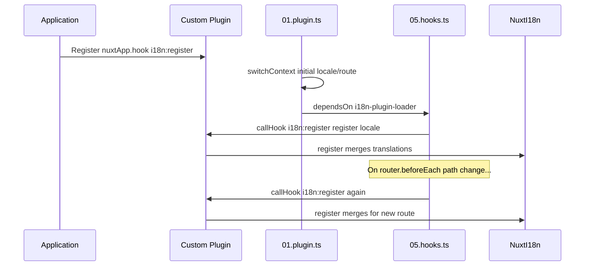

# 📢 Események

## 🔄 `i18n:register`

Az `i18n:register` esemény a `Nuxt I18n Micro`-ban lehetővé teszi a fordítások dinamikus hozzáadását az alkalmazásod i18n kontextusához, zökkenőmentessé és rugalmassá téve a nemzetköziesítési folyamatot. Ez az esemény lehetővé teszi új fordítások integrálását szükség szerint, javítva az alkalmazásod honosítási képességeit.

### 📝 Eseményrészletek

- **Cél**:
  - Lehetővé teszi további fordítások dinamikus beépítését a meglévő halmazba egy adott területi beállításhoz.

- **Payload**:
  - **`register`**:
    - Egy függvény, amelyet az esemény biztosít, és amely két argumentumot vesz fel:
      - **`translations`** (`Translations`):
        - Egy objektum, amely kulcs-érték párokat tartalmaz a fordítások képviseletéhez, a `Translations` interfész szerint szervezve.
      - **`locale`** (`string`, opcionális):
        - A területi kód (pl. `'en'`, `'ru'`), amelyhez a fordítások regisztrálva vannak. Ha nincs megadva, az esemény által biztosított területi beállítás lesz az alapértelmezett.

- **Viselkedés**:
  - Amikor aktiválódik, a `register` függvény beolvasztja az új fordításokat az adott területi beállítás aktuális kontextusába, frissítve az elérhető fordításokat az alkalmazásban.

### ⏱️ Mikor sül el

A modul hooks bővítménye (`05.hooks.ts`, `dependsOn: ['i18n-plugin-loader']`) meghívja a `nuxtApp.callHook('i18n:register', …)`-t:

1. **Egyszer indításkor** — miután a fő i18n bővítmény (`01.plugin.ts`) betöltötte a fordításokat a kezdeti útvonalhoz
2. **Navigációkor** — a `router.beforeEach`-ben, amikor az útvonal megváltozik, vagy minden navigációkor, ha a `strategy: 'no_prefix'`

Regisztráld a figyelőt egy normál Nuxt bővítményben a `nuxtApp.hook('i18n:register', …)` segítségével. A hooks bővítmény azután fut, hogy a betöltő készen áll, tehát a visszahívásod akkor hívódik meg, amikor a fordításokat ki kell bővíteni.

Állítsd `hooks: false` értékre a `nuxt.config`-ban az automatikus `i18n:register` hívások letiltásához (lásd [Konfiguráció — `hooks`](/guides/configuration#hooks)).

### 💡 Példa használat

A következő példa bemutatja, hogyan használhatod az `i18n:register` eseményt a fordítások dinamikus hozzáadásához:

```typescript
nuxt.hook('i18n:register', async (register: (translations: unknown, locale?: string) => void, locale: string) => {
  register(
    {
      greeting: 'Hello',
      farewell: 'Goodbye',
    },
    locale,
  )
})
```

### 🛠️ Magyarázat



- **Az esemény kiváltása**:
  - A hooks bővítmény (`05.hooks.ts`) elsüti az `i18n:register` eseményt, miután a fő betöltő készen áll, és a releváns navigációk esetén.

- **Fordítások hozzáadása**:
  - A példa angol fordításokat regisztrál a `"greeting"` és `"farewell"` kulcsokhoz.
  - A `register` függvény beolvasztja ezeket a fordításokat a megadott területi beállítás meglévő halmazába.

### 🔗 Fő előnyök

- **Dinamikus frissítések**:
  - Egyszerűen frissítheted vagy hozzáadhatsz fordításokat anélkül, hogy újra kellene telepítened az egész alkalmazást.

- **Honosítási rugalmasság**:
  - Valós idejű honosítási beállításokat támogat a felhasználó vagy az alkalmazás igényei alapján.

Az `i18n:register` esemény használatával biztosíthatod, hogy az alkalmazásod honosítási stratégiája rugalmas és alkalmazkodóképes maradjon, javítva az általános felhasználói élményt.

---

## 🛠️ Fordítások módosítása bővítményekkel

Ahhoz, hogy a Nuxt alkalmazásodban dinamikusan módosítsd a fordításokat, bővítmények használata ajánlott. A bővítmények strukturált módot biztosítanak a honosítási frissítések kezelésére, különösen modulok vagy külső fordítási fájlok használata esetén.

### **A bővítmény regisztrálása**

Ha modult használsz, regisztráld a bővítményt, ahol a fordításmódosítások történnek, hozzáadva a modul konfigurációjához:

```javascript
addPlugin({
  src: resolve('./plugins/extend_locales'),
})
```

Ez regisztrálja a `./plugins/extend_locales` helyen található bővítményt, amely a fordítások dinamikus betöltését és regisztrálását kezeli.

### **A bővítmény implementálása**

A bővítményben kezelheted a területi beállítás módosításait. Íme egy példa implementáció Nuxt bővítményben:

```typescript
import { defineNuxtPlugin } from '#app'

export default defineNuxtPlugin(async (nuxtApp) => {
  // Function to load translations from JSON files and register them
  const loadTranslations = async (lang: string) => {
    try {
      const translations = await import(`../locales/${lang}.json`)
      return translations.default
    } catch (error) {
      console.error(`Error loading translations for language: ${lang}`, error)
      return null
    }
  }

  // Hook into the 'i18n:register' event to dynamically add translations
  // eslint-disable-next-line @typescript-eslint/ban-ts-comment
  // @ts-expect-error
  nuxtApp.hook('i18n:register', async (register: (translations: unknown, locale?: string) => void, locale: string) => {
    const translations = await loadTranslations(locale)
    if (translations) {
      register(translations, locale)
    }
  })
})
```

### 📝 Részletes magyarázat

1. **Fordítások betöltése**:

- A `loadTranslations` függvény dinamikusan importál fordítási fájlokat a területi beállítás alapján. A fájloknak a `locales` könyvtárban kell lenniük, és a területi kódok szerint elnevezve (pl. `en.json`, `de.json`).
- Sikeres betöltés esetén a fordítások visszakerülnek, egyébként hiba naplózódik.

2. **Fordítások regisztrálása**:

- A bővítmény bekapcsolódik az `i18n:register` eseménybe a `nuxtApp.hook` segítségével.
- Amikor az esemény kiváltódik, a `register` függvényt a betöltött fordításokkal és a megfelelő területi beállítással hívja meg.
- Ez beolvasztja az új fordításokat az i18n kontextusba a megadott területi beállításhoz, frissítve az elérhető fordításokat az egész alkalmazásban.

### 🔗 A bővítmények használatának előnyei fordításmódosításokhoz

- **Felelősségek szétválasztása**:
  - A honosítási logikát a fő alkalmazáskódtól elkülönítve zárja be, megkönnyítve a kezelést és karbantartást.

- **Dinamikus és skálázható**:
  - A fordítások dinamikus betöltésével és regisztrálásával frissítheted a tartalmat anélkül, hogy teljes alkalmazás-újratelepítésre lenne szükség, ami különösen hasznos a gyakran frissített vagy többnyelvű tartalommal rendelkező alkalmazásokhoz.

- **Fokozott honosítási rugalmasság**:
  - A bővítmények lehetővé teszik a fordítások módosítását vagy kibővítését igény szerint, alkalmazkodóképesebb és reagálóbb honosítási stratégiát biztosítva, amely megfelel a felhasználói preferenciáknak vagy az üzleti követelményeknek.

Ezzel a megközelítéssel hatékonyan bővítheted és módosíthatod az alkalmazásod honosítását strukturált és karbantartható folyamaton keresztül bővítmények segítségével, tartva a nemzetköziesítést alkalmazkodóképesnek a változó igényekhez, és javítva az általános felhasználói élményt.
