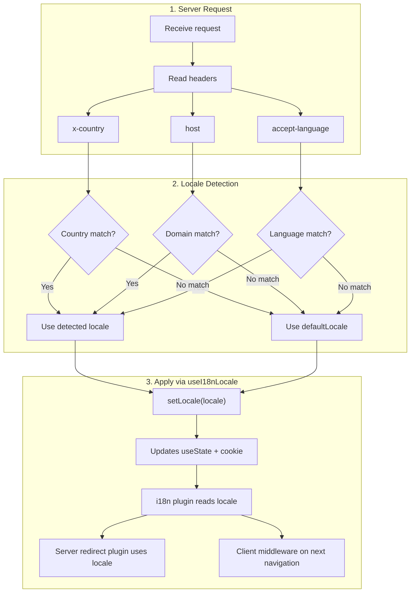

# 🔧 Egyedi nyelvfelismerés a Nuxt I18n Micróban

## 📖 Áttekintés

A Nuxt I18n Micro v3 központosított composable-t — `useI18nLocale()` — biztosít az összes területkezeléshez. Ez felváltja a v2 kézi `useState`/`useCookie` mintáit. A `useI18nLocale().setLocale()` szerver-pluginben való használatával bármilyen egyedi felismerési logikát megvalósíthatsz, miközben megmarad a teljes kompatibilitás a modul átirányítási és süti-rendszerével.

## 🏗️ Architektúra

```mermaid
flowchart TB
    subgraph Plugins["Plugin Execution Order"]
        A["Your plugin<br/>order: -10"] -->|setLocale()| B["01.plugin.ts<br/>order: -5"]
        B --> C["06.redirect.ts server<br/>order: 10"]
    end

    subgraph Client["Client SPA Navigation"]
        D["i18n-redirect.global.ts<br/>route middleware"]
    end

    subgraph State["Locale State"]
        E["useState('i18n-locale')"]
        F["localeCookie"]
    end

    A -->|"setLocale() updates both"| E
    A -->|"setLocale() updates both"| F
    B -->|reads| E
    C -->|reads| E
    C -->|reads| F
    D -->|reads target route +| E
```

**Alapelv**: A `useI18nLocale().setLocale()`-t szerver-pluginben hívd meg `order: -10`-zel. Ez atomikusan frissíti a `useState('i18n-locale')`-t és a területi sütit is, így az i18n plugin (`order: -5`) és a szerver átirányítási plugin (`order: 10`) az első SSR-kérésnél már a helyes területet látja. A kliensoldali automatikus átirányítások a globális útvonal-middleware-ben futnak a további navigációk során.

## 🛠️ A beépített automatikus felismerés kikapcsolása

Ha teljes kontrollt szeretnél a területfelismerés fölött, kapcsold ki a beépített mechanizmust:

```ts
export default defineNuxtConfig({
  i18n: {
    autoDetectLanguage: false,
  },
})
```

## ✨ Példa: szerveroldali felismerés `useI18nLocale`-lel

Ez a **javasolt megközelítés** minden stratégiához.

### 1. lépés: A `nuxt.config.ts` konfigurálása

```ts
export default defineNuxtConfig({
  modules: ['nuxt-i18n-micro'],
  i18n: {
    strategy: 'no_prefix', // Works with ANY strategy
    defaultLocale: 'en',
    localeCookie: 'user-locale',
    autoDetectLanguage: false,
    locales: [
      { code: 'en', iso: 'en-US' },
      { code: 'de', iso: 'de-DE' },
      { code: 'ja', iso: 'ja-JP' },
    ],
  },
})
```

### 2. lépés: Hozd létre a `plugins/i18n-loader.server.ts`-t

```ts
import { defineNuxtPlugin, useRequestHeaders } from '#imports'

export default defineNuxtPlugin({
  name: 'i18n-custom-loader',
  enforce: 'pre',
  order: -10, // Execute BEFORE the i18n plugin (which has order -5)

  setup() {
    const { setLocale } = useI18nLocale()
    const headers = useRequestHeaders(['host', 'x-country', 'accept-language'])
    let detectedLocale = 'en'

    // --- YOUR DETECTION LOGIC ---

    // Example 1: By domain
    const host = headers['host']
    if (host?.includes('example.de')) {
      detectedLocale = 'de'
    }
    // Example 2: By custom header
    else if (headers['x-country'] === 'JP') {
      detectedLocale = 'ja'
    }
    // Example 3: By Accept-Language header
    else if (headers['accept-language']?.includes('de')) {
      detectedLocale = 'de'
    }

    // --- APPLY THE LOCALE ---
    setLocale(detectedLocale)
  },
})
```

### Hogyan működik



1. **A plugin fut először** (`order: -10`) — felismeri a területet fejlécekből, domainből vagy egyéb forrásokból
2. **A `setLocale()` mindkettőt frissíti**: a `useState('i18n-locale')`-t és a sütit — azonnal láthatóvá teszi minden későbbi plugin számára
3. **Az i18n plugin** (`order: -5`) olvassa a területet, és betölti a helyes fordításokat
4. **A szerver átirányítási plugin** (`order: 10`) a területet használja az átirányítási döntésekhez SSR-en
5. **A kliens útvonal-middleware** (`i18n-redirect`) SPA-navigáció esetén átirányít, amikor az URL területe nem egyezik a preferenciával

## 🌐 Stratégiaspecifikus viselkedés

A `useI18nLocale().setLocale()` **minden stratégiával** működik. Az átirányítási viselkedés a stratégiától függ:

<Tip>
| Strategy | Effect of `setLocale('de')` |
|----------|---------------------------|
| `no_prefix` | Renders in German, no URL change |
| `prefix` | 302 → `/de/` (server-side redirect) |
| `prefix_except_default` | 302 → `/de/` if `de` ≠ default; no redirect if `de` = default |
| `prefix_and_default` | No redirect (both `/` and `/de/` are valid) |
</Tip>

**Fontos megjegyzések:**

- A sütialapú területfelismerés alapértelmezetten kikapcsolt (`localeCookie: null`)
- Állítsd `localeCookie: 'user-locale'`-ra a sütis megőrzés bekapcsolásához
- Ha a süti/state érték nincs a `locales` listában, a `defaultLocale`-re esik vissza

## 🏢 Haladó: domain-alapú felismerés

Több domainű beállításokhoz, ahol minden domain más területet szolgál ki:

```ts
import { defineNuxtPlugin, useRequestHeaders } from '#imports'

export default defineNuxtPlugin({
  name: 'i18n-domain-loader',
  enforce: 'pre',
  order: -10,

  setup() {
    const { setLocale } = useI18nLocale()
    const headers = useRequestHeaders(['host'])
    const host = headers['host'] || ''

    let detectedLocale = 'en'

    if (host.endsWith('.de') || host.includes('german.')) {
      detectedLocale = 'de'
    } else if (host.endsWith('.fr') || host.includes('french.')) {
      detectedLocale = 'fr'
    } else if (host.endsWith('.jp') || host.includes('japanese.')) {
      detectedLocale = 'ja'
    }

    setLocale(detectedLocale)
  },
})
```

## 🔄 Haladó: a felhasználói preferencia tiszteletben tartása

Ha a felhasználók manuálisan válthatnak nyelvet, tiszteld a választásukat az automatikus felismeréssel szemben:

```ts
import { defineNuxtPlugin, useRequestHeaders } from '#imports'

export default defineNuxtPlugin({
  name: 'i18n-smart-loader',
  enforce: 'pre',
  order: -10,

  setup() {
    const { getLocale, setLocale } = useI18nLocale()

    // If user already has a preference (from cookie), respect it
    if (getLocale()) {
      return
    }

    // Otherwise, detect locale from headers
    const headers = useRequestHeaders(['accept-language'])
    let detectedLocale = 'en'

    const acceptLanguage = headers['accept-language'] || ''
    if (acceptLanguage.includes('de')) {
      detectedLocale = 'de'
    } else if (acceptLanguage.includes('ja')) {
      detectedLocale = 'ja'
    }

    setLocale(detectedLocale)
  },
})
```

## ⚙️ Csak szerver vagy csak kliens pluginek

Használd a [Nuxt fájlnév-konvenciókat](https://nuxt.com/docs/getting-started/directory-structure#plugins), hogy szabályozd, hol fusson a pluginod:

- **Csak szerver**: `i18n-loader.server.ts` — csak SSR alatt fut (fejléc-alapú felismeréshez ajánlott)
- **Csak kliens**: `i18n-loader.client.ts` — csak a böngészőben fut (`localStorage`- vagy DOM-alapú felismeréshez)

<Tip>

</Tip>

## ✅ Összefoglalás

| Jellemző                               | Leírás                                                            |
| -------------------------------------- | ----------------------------------------------------------------- |
| `useI18nLocale().setLocale()`          | Atomikusan frissíti a `useState`-et és a sütit; minden stratégiával működik |
| `useI18nLocale().getLocale()`          | Az aktuális területet adja vissza a state-ből vagy sütiből        |
| `useI18nLocale().getPreferredLocale()` | A preferált területet adja vissza (a `locales` listához érvényesítve) |
| Plugin `order: -10`                    | Biztosítja, hogy a pluginod az i18n inicializálás előtt fut       |
| `enforce: 'pre'`                       | A „pre” plugincsoportban fut                                      |

**NE:**

- Ne használd közvetlenül a `useCookie('user-locale')`-t — a `useI18nLocale()` belsőleg kezeli a sütiket
- Ne használd közvetlenül a `useState('i18n-locale')`-t — helyette a `useI18nLocale().setLocale()`-t
- Ne állíts `order` >= -5 értéket — a pluginod az i18n plugin előtt kell fusson
