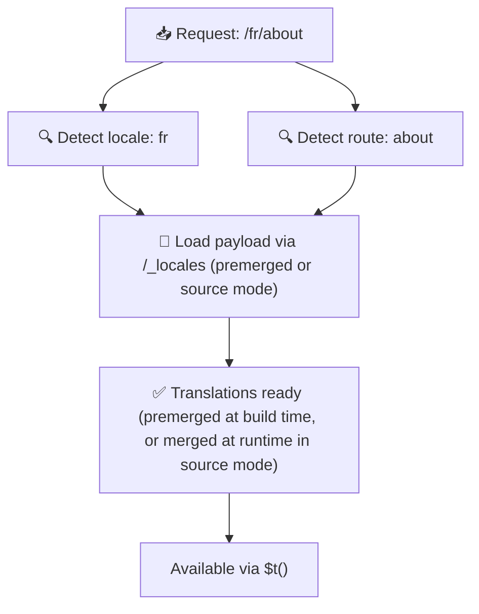

# 📂 Mappaszerkezeti útmutató

## 📖 Bevezetés

A fordítási fájlok hatékony szervezése kulcsfontosságú a skálázható és eredményes nemzetköziesítés (i18n) fenntartásához. A `Nuxt I18n Micro` egyszerűsíti ezt a folyamatot azzal, hogy világos megközelítést kínál a gyökér- és oldalspecifikus fordítások kezeléséhez. Ez az útmutató bemutatja az ajánlott mappaszerkezetet, és elmagyarázza, hogyan kezeli a `Nuxt I18n Micro` a fordításokat.

## 🗂️ Ajánlott mappaszerkezet

A `Nuxt I18n Micro` a fordításokat gyökérszintű fájlokra és a `pages` könyvtárban lévő oldalspecifikus fájlokra bontja. A `translationPayloads.mode: 'premerged'` (alapértelmezett) esetén a gyökérszintű fordítások build-időben minden oldalspecifikus fájlba beolvadnak, így minden oldal teljes fordításkészlettel rendelkezik, futásidejű egyesítési többletköltség nélkül.

`mode: 'source'` esetén a forrásfájlok külön maradnak a Nitro assets-ekben, és futásidőben egyesülnek a `/_locales` útvonalon keresztül. Lásd a [Serverless payload kimenet](/guides/performance#serverless-payload-output) részt.

### 🔧 Alapszerkezet

Íme egy alap példa a követendő mappaszerkezetre:

```text
locales/
├── pages/
│   ├── index/
│   │   ├── en.json
│   │   ├── fr.json
│   │   └── ar.json
│   ├── about/
│   │   ├── en.json
│   │   ├── fr.json
│   │   └── ar.json
├── en.json
├── fr.json
└── ar.json

```

### 📄 A szerkezet magyarázata

#### 1. 🌍 Gyökérszintű fordítási fájlok

- **Útvonal:** `/locales/\{locale\}.json` (pl. `/locales/en.json`)
- **Cél:** Ezek a fájlok az egész alkalmazásban megosztott fordításokat tartalmazzák (navigációs menük, fejlécek, láblécek stb.). `mode: 'premerged'` esetén (alapértelmezett) build-időben minden oldalspecifikus fájlba automatikusan beolvadnak, így a szerver minden oldalhoz egyetlen előre elkészített fájlt ad vissza.

  **Példa tartalom (`/locales/en.json`):**

  ```json
  {
    "menu": {
      "home": "Home",
      "about": "About Us",
      "contact": "Contact"
    },
    "footer": {
      "copyright": "© 2024 Your Company"
    }
  }
  ```

#### 2. 📄 Oldalspecifikus fordítási fájlok

- **Útvonal:** `/locales/pages/\{routeName\}/\{locale\}.json` (pl. `/locales/pages/index/en.json`)
- **Cél:** Ezek a fájlok egyes oldalakhoz tartozó fordításokat tartalmaznak. `mode: 'premerged'` esetén (alapértelmezett) a gyökérszintű fordítások alapul beolvadnak build-időben, így minden oldalfájl önmagában is teljessé válik.

  **Példa tartalom (`/locales/pages/index/en.json`):**

  ```json
  {
    "title": "Welcome to Our Website",
    "description": "We offer a wide range of products and services to meet your needs."
  }
  ```

  **Példa tartalom (`/locales/pages/about/en.json`):**

  ```json
  {
    "title": "About Us",
    "description": "Learn more about our mission, vision, and values."
  }
  ```

### 📂 Dinamikus útvonalak és beágyazott utak kezelése

A `Nuxt I18n Micro` automatikusan lapos mappaszerkezetté alakítja a dinamikus szegmenseket és a beágyazott utakat egy meghatározott átnevezési konvenció szerint. Ez biztosítja, hogy minden fordítás konzisztens és könnyen elérhető módon legyen tárolva.

#### Dinamikus útvonalak fordítási mappaszerkezete

Amikor dinamikus útvonalakkal dolgozol, például `/products/[id]`, a modul a `[id]` dinamikus szegmenset statikus formába alakítja a fájlszerkezeten belül.

**Példa mappaszerkezet dinamikus útvonalakhoz:**

Egy `/products/[id]` útvonalhoz a fordítási fájlok a `products-id` nevű mappában lennének:

```text
locales/pages/
├── products-id/
│   ├── en.json
│   ├── fr.json
│   └── ar.json

```

**Példa mappaszerkezet beágyazott dinamikus útvonalakhoz:**

Egy beágyazott útvonalhoz, mint a `/products/key/[id]`, a fordítási fájlok a `products-key-id` mappában lennének:

```text
locales/pages/
├── products-key-id/
│   ├── en.json
│   ├── fr.json
│   └── ar.json

```

**Példa mappaszerkezet többszintű beágyazott útvonalakhoz:**

Egy összetettebb beágyazott útvonalhoz, mint a `/products/category/[id]/details`, a fordítási fájlok a `products-category-id-details` mappában lennének:

```text
locales/pages/
├── products-category-id-details/
│   ├── en.json
│   ├── fr.json
│   └── ar.json

```

### 🛠 A könyvtárszerkezet testreszabása

Ha inkább más könyvtárban szeretnéd tárolni a fordításokat, a `Nuxt I18n Micro` lehetővé teszi a könyvtár testreszabását. Ezt a `nuxt.config.ts` fájlodban állíthatod be.

**Példa: a fordítási könyvtár testreszabása**

```typescript
export default defineNuxtConfig({
  i18n: {
    translationDir: 'i18n', // Custom directory path
  },
})
```

Ez arra utasítja a `Nuxt I18n Micro`-t, hogy az alapértelmezett `/locales` helyett az `/i18n` könyvtárban keresse a fordítási fájlokat.

## ⚙️ Hogyan töltődnek be a fordítások

### 🌍 Dinamikus területi útvonalak

A `Nuxt I18n Micro` dinamikus területi útvonalakat használ a fordítások hatékony betöltésére. Amikor egy felhasználó ellátogat egy oldalra, a modul meghatározza a megfelelő területet, és az aktuális útvonal és terület alapján betölti a megfelelő fordítási fájlokat.



Például:

- A `/en/index` meglátogatása a `/locales/pages/index/en.json` fájlból tölti be a fordításokat.
- A `/fr/about` meglátogatása a `/locales/pages/about/fr.json` fájlból tölti be a fordításokat.

Ez a módszer biztosítja, hogy csak a szükséges fordítások töltődjenek be, optimalizálva a szerver terhelését és a kliens oldali teljesítményt is.

### 💾 Gyorsítótár és előrenderelés

A teljesítmény további növelése érdekében a `Nuxt I18n Micro` támogatja a fordítási fájlok gyorsítótárazását és előrenderelését:

- **Gyorsítótárazás**: Miután egy fordítási fájl betöltődik, gyorsítótárba kerül a további kérésekhez, csökkentve az azonos adatok ismételt lekérésének szükségességét.
- **Előrenderelés**: A build folyamat során előre rendelheted az összes konfigurált területhez és útvonalhoz tartozó fordítási fájlokat, hogy azok közvetlenül a szerverről szolgálódjanak ki, futásidejű késleltetés nélkül.

## 📝 Legjobb gyakorlatok

### 📂 Használd az oldalspecifikus fájlokat okosan

Élj az oldalspecifikus fájlok lehetőségével a fordítások rendezéséhez. Ez soványan és gyorsan betölthetően tartja az egyes oldalak fordításait, ami különösen összetett vagy nagy tartalmú oldalaknál fontos.

### 🔑 Legyenek konzisztensek a fordításkulcsok

Használj egységes elnevezési konvenciókat a fordításkulcsokra a fájlok között. Ez segít az áttekinthetőségben, és megelőzi a problémákat a fordítások kezelésénél, különösen ahogy az alkalmazás nő.

### 🗂️ Csoportosítsd a fordításokat kontextus szerint

A kapcsolódó fordításokat csoportosítsd a fájlokon belül. Például minden gombfeliratot egy `buttons` kulcs alá, minden űrlaphoz kapcsolódó szöveget egy `forms` kulcs alá. Ez nemcsak az olvashatóságot javítja, hanem a fordítások kezelését is könnyebbé teszi különböző területek között.

### ⚠️ Beágyazási mélységi korlát (2 szint ajánlott)

Kliensoldali navigáció során a `Nuxt I18n Micro` optimalizált, 2 szintű mély merge-t használ a kilépő és belépő oldal fordításainak összefésüléséhez. Ez biztosítja, hogy az átfedő beágyazott kulcsok (pl. mindkét oldalnak van kulcsa `common.*` alatt) megmaradjanak az átmeneti animációk alatt.

**Ez helyesen működik a szabványos `Szakasz → Kulcs → Érték` szerkezetnél (2 szint):**

```json
// Page A translations
{ "common": { "fromA": "Text A" } }

// Page B translations
{ "common": { "fromB": "Text B" } }

// During transition, both are available:
// { "common": { "fromA": "Text A", "fromB": "Text B" } }
```

**Ha viszont 3 vagy több szintű beágyazást használsz, a mélyebb kulcsok felülíródhatnak az átmenetek alatt:**

```json
// Page A translations
{ "auth": { "form": { "login": "Login" } } }

// Page B translations
{ "auth": { "form": { "register": "Register" } } }

// During transition: "login" key is lost
// { "auth": { "form": { "register": "Register" } } }
```

<Tip>

</Tip>

### 🧹 Rendszeresen takarítsd ki a nem használt fordításokat

Idővel az alkalmazásod nem használt fordításkulcsokat halmozhat fel, különösen ha funkciók megszűnnek vagy átalakulnak. Rendszeresen nézd át és tisztítsd meg a fordítási fájlokat, hogy soványak és karbantarthatók maradjanak.
