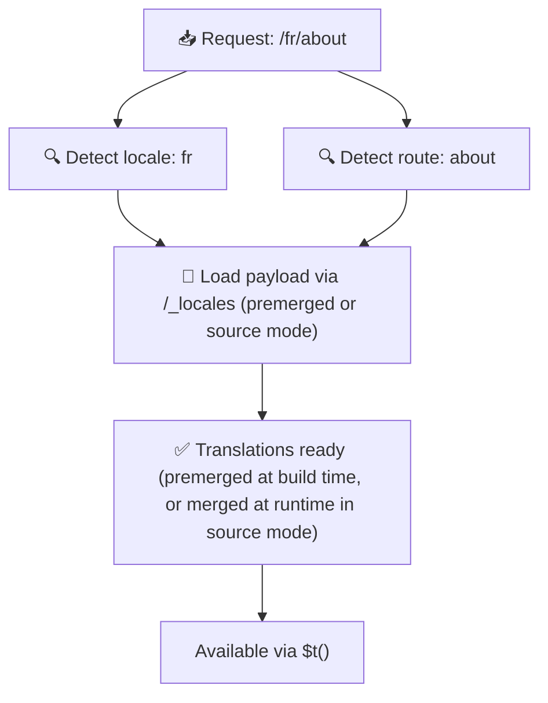

# 📂 Mappaszerkezeti útmutató

## 📖 Bevezetés

A fordítási fájlok hatékony szervezése elengedhetetlen a skálázható és hatékony nemzetköziesítési (i18n) rendszer fenntartásához. A `Nuxt I18n Micro` egyszerűsíti ezt a folyamatot, világos megközelítést kínálva a gyökérszintű és oldalspecifikus fordítások kezeléséhez. Ez az útmutató végigvezet az ajánlott mappaszerkezeten, és elmagyarázza, hogyan kezeli a `Nuxt I18n Micro` ezeket a fordításokat.

## 🗂️ Ajánlott mappaszerkezet

A `Nuxt I18n Micro` a fordításokat gyökérszintű és oldalspecifikus fájlokba szervezi a `pages` könyvtárban. A `translationPayloads.mode: 'premerged'` (alapértelmezett) beállítással a gyökérszintű fordítások automatikusan beolvadnak minden oldalfájlba build időben, tehát minden oldal teljes fordításkészlettel rendelkezik futásidejű összeolvasztási terhelés nélkül.

`mode: 'source'` beállítással a forrásfájlok különállók maradnak a Nitro assetekben, és futásidőben olvadnak össze a `/_locales` útvonalon. Lásd [Szerver nélküli payload kimenet](/guides/performance#serverless-payload-output).

### 🔧 Alapstruktúra

Íme egy alapvető példa a mappaszerkezetre, amelyet követned kell:

```text
locales/
├── pages/
│   ├── index/
│   │   ├── en.json
│   │   ├── fr.json
│   │   └── ar.json
│   ├── about/
│   │   ├── en.json
│   │   ├── fr.json
│   │   └── ar.json
├── en.json
├── fr.json
└── ar.json

```

### 📄 A szerkezet magyarázata

#### 1. 🌍 Gyökérszintű fordítási fájlok

- **Útvonal:** `/locales/\{locale\}.json` (pl. `/locales/en.json`)
- **Cél:** Ezek a fájlok az egész alkalmazásban megosztott fordításokat tartalmazzák (navigációs menük, fejlécek, láblécek stb.). A `mode: 'premerged'` (alapértelmezett) beállítással build időben automatikusan beolvadnak minden oldalspecifikus fájlba, tehát a szerver oldalanként egyetlen előre elkészített fájlt ad vissza.

  **Példa tartalom (`/locales/en.json`):**

  ```json
  {
    "menu": {
      "home": "Home",
      "about": "About Us",
      "contact": "Contact"
    },
    "footer": {
      "copyright": "© 2024 Your Company"
    }
  }
  ```

#### 2. 📄 Oldalspecifikus fordítási fájlok

- **Útvonal:** `/locales/pages/\{routeName\}/\{locale\}.json` (pl. `/locales/pages/index/en.json`)
- **Cél:** Ezek a fájlok az egyes oldalakra jellemző fordításokat tartalmazzák. A `mode: 'premerged'` (alapértelmezett) beállítással a gyökérszintű fordítások alapként olvadnak be build időben, tehát minden oldal fájl önmagában elegendő lesz.

  **Példa tartalom (`/locales/pages/index/en.json`):**

  ```json
  {
    "title": "Welcome to Our Website",
    "description": "We offer a wide range of products and services to meet your needs."
  }
  ```

  **Példa tartalom (`/locales/pages/about/en.json`):**

  ```json
  {
    "title": "About Us",
    "description": "Learn more about our mission, vision, and values."
  }
  ```

### 📂 Dinamikus útvonalak és beágyazott útvonalak kezelése

A `Nuxt I18n Micro` automatikusan lapos mappaszerkezetté alakítja az útvonalakban lévő dinamikus szegmenseket és beágyazott útvonalakat egy speciális átnevezési konvenció használatával. Ez biztosítja, hogy minden fordítás konzisztens és könnyen elérhető módon legyen tárolva.

#### Dinamikus útvonal fordítási mappaszerkezet

Amikor dinamikus útvonalakkal foglalkozol, például `/products/[id]`, a modul a `[id]` dinamikus szegmenst statikus formátumra konvertálja a fájlstruktúrában.

**Példa mappaszerkezet dinamikus útvonalakhoz:**

Egy `/products/[id]` útvonalhoz a fordítási fájlok egy `products-id` nevű mappában lennének tárolva:

```text
locales/pages/
├── products-id/
│   ├── en.json
│   ├── fr.json
│   └── ar.json

```

**Példa mappaszerkezet beágyazott dinamikus útvonalakhoz:**

Egy `/products/key/[id]` beágyazott útvonalhoz a fordítási fájlok egy `products-key-id` nevű mappában lennének tárolva:

```text
locales/pages/
├── products-key-id/
│   ├── en.json
│   ├── fr.json
│   └── ar.json

```

**Példa mappaszerkezet többszintű beágyazott útvonalakhoz:**

Egy összetettebb beágyazott útvonalhoz, mint a `/products/category/[id]/details`, a fordítási fájlok egy `products-category-id-details` nevű mappában lennének tárolva:

```text
locales/pages/
├── products-category-id-details/
│   ├── en.json
│   ├── fr.json
│   └── ar.json

```

### 🛠 A könyvtárszerkezet testreszabása

Ha inkább másik könyvtárban szeretnéd tárolni a fordításokat, a `Nuxt I18n Micro` lehetővé teszi annak a könyvtárnak a testreszabását, ahol a fordítási fájlok tárolódnak. Ezt a `nuxt.config.ts` fájlodban konfigurálhatod.

**Példa: A fordítási könyvtár testreszabása**

```typescript
export default defineNuxtConfig({
  i18n: {
    translationDir: 'i18n', // Custom directory path
  },
})
```

Ez arra utasítja a `Nuxt I18n Micro`-t, hogy a fordítási fájlokat az `/i18n` könyvtárban keresse az alapértelmezett `/locales` könyvtár helyett.

## ⚙️ Hogyan töltődnek be a fordítások

### 🌍 Dinamikus területi útvonalak

A `Nuxt I18n Micro` dinamikus területi útvonalakat használ a fordítások hatékony betöltéséhez. Amikor egy felhasználó meglátogat egy oldalt, a modul meghatározza a megfelelő területi beállítást, és betölti a megfelelő fordítási fájlokat az aktuális útvonal és területi beállítás alapján.



Például:

- Az `/en/index` meglátogatása a `/locales/pages/index/en.json`-ból tölti be a fordításokat.
- Az `/fr/about` meglátogatása a `/locales/pages/about/fr.json`-ból tölti be a fordításokat.

Ez a módszer biztosítja, hogy csak a szükséges fordítások töltődnek be, optimalizálva mind a szerverterhelést, mind a kliensoldali teljesítményt.

### 💾 Gyorsítótárazás és előrenderelés

A teljesítmény további javítása érdekében a `Nuxt I18n Micro` támogatja a fordítási fájlok gyorsítótárazását és előrenderelését:

- **Gyorsítótárazás**: Miután egy fordítási fájl betöltődik, gyorsítótárazódik a későbbi kérésekhez, csökkentve az ismételt adatlekérés szükségességét.
- **Előrenderelés**: A build folyamat során előre renderelheted a fordítási fájlokat minden konfigurált területi beállításhoz és útvonalhoz, lehetővé téve, hogy közvetlenül a szerverről szolgáljanak ki futásidejű késleltetések nélkül.

## 📝 Legjobb gyakorlatok

### 📂 Bölcsen használd az oldalspecifikus fájlokat

Használd ki az oldalspecifikus fájlokat a fordítások szervezetten tartására. Ez az egyes oldalak fordításait karcsúvá és gyors betöltésűvé teszi, ami különösen fontos összetett vagy nagy tartalmú oldalakhoz.

### 🔑 Tartsd konzisztensen a fordítási kulcsokat

Használj konzisztens elnevezési konvenciókat a fordítási kulcsokra a fájlok között. Ez segít fenntartani a világosságot, és megakadályozza a problémákat a fordítások kezelésekor, különösen ahogy az alkalmazásod növekszik.

### 🗂️ Szervezd a fordításokat kontextus szerint

Csoportosítsd a kapcsolódó fordításokat a fájlokon belül. Például csoportosítsd az összes gombfeliratot egy `buttons` kulcs alatt, és minden űrlappal kapcsolatos szöveget egy `forms` kulcs alatt. Ez nemcsak javítja az olvashatóságot, hanem megkönnyíti a fordítások kezelését is a különböző területi beállítások között.

### ⚠️ Beágyazási mélységi korlát (2 szint ajánlott)

Kliensoldali navigáció során a `Nuxt I18n Micro` optimalizált 2 szintű mély összeolvasztást használ a távozó és belépő oldalak fordításainak kombinálásához. Ez biztosítja, hogy az átfedő beágyazott kulcsok (pl. mindkét oldalnak van kulcsa `common.*` alatt) megőrződnek az átmeneti animációk során.

**Ez helyesen működik a standard `Section → Key → Value` szerkezethez (2 szint):**

```json
// Page A translations
{ "common": { "fromA": "Text A" } }

// Page B translations
{ "common": { "fromB": "Text B" } }

// During transition, both are available:
// { "common": { "fromA": "Text A", "fromB": "Text B" } }
```

**Ha azonban 3+ beágyazási szintet használsz, a mélyebb kulcsok felülíródhatnak átmenetek során:**

```json
// Page A translations
{ "auth": { "form": { "login": "Login" } } }

// Page B translations
{ "auth": { "form": { "register": "Register" } } }

// During transition: "login" key is lost
// { "auth": { "form": { "register": "Register" } } }
```


### 🧹 Rendszeresen takarítsd el a nem használt fordításokat

Idővel az alkalmazásod nem használt fordítási kulcsokat halmozhat fel, különösen, ha funkciók el vannak távolítva vagy át vannak strukturálva. Rendszeresen tekintsd át és tisztítsd meg a fordítási fájlokat, hogy karcsúak és karbantarthatók maradjanak.
