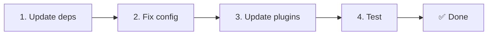

# 📦 Frissítés v2.x-ről v3.x-re

<Tip>
Lásd a [Migráció a nuxt-i18n-ről](/migration/from-nuxtjs-i18n) útmutatót — az a vue-i18n ökoszisztémáról szóló költözésről szól, nem a nuxt-i18n-micro v2-ről.
</Tip>

A v3.0.0 alapvető architekturális változásokat hoz: stratégia-csomagok, új gyorsítótár-rendszer, központosított területkezelés a `useI18nLocale()`-en át, és újratervezett átirányítási folyamat. Ez a szakasz minden töréssel járó változást és a kódfrissítést tárgyalja.

## Migrációs lépések



## Töréssel járó változások összefoglalása

- **Területi állapot** — `useState` / `useCookie` manuálisan → `useI18nLocale()` composable
- **Konfigurációhozzáférés** — `useRuntimeConfig().public.i18nConfig` → `getI18nConfig()` a `#build/i18n.strategy.mjs`-ből
- **Átirányítási komponens** — `fallbackRedirectComponentPath` opció → szerver átirányítási plugin + kliens útvonal-middleware (automatikus)
- **`includeDefaultLocaleRoute`** — támogatott (elavult) → eltávolítva, használd a `strategy` opciót
- **`experimental.hmr`** — `experimental` alatt → gyökérszintű opció
- **`previousPageFallback`** — teljesen eltávolítva (a kumulatív merge-stratégia ezt automatikusan kezeli)
- **Gyorsítótárazás** — `useStorage('cache')` → `TranslationStorage` singleton (`Symbol.for` a `globalThis`-en)
- **SSR-átvitel** — Runtime config → Nuxt payload (a v3 `useState`-et használt; a chunkok most a `payload.data`-ban élnek, lásd [Teljesítmény](/guides/performance#server-side-payload-transfer))
- **Stratégia-osztályok** — belső → különálló csomagok (`@i18n-micro/route-strategy`, `@i18n-micro/path-strategy`)

## Eltávolítva: `fallbackRedirectComponentPath`

A `fallbackRedirectComponentPath` opció és a `locale-redirect.vue` tartalék komponens eltávolításra került. Az átirányítási logikát most a következő komponensek kezelik:

1. **Szerver middleware** (`i18n.global.ts`) — beállítja az `event.context.i18n.locale` értéket
2. **Szerver átirányítási plugin** (`06.redirect.ts`, csak szerver) — 302 átirányítás renderelés előtt
3. **Kliens útvonal-middleware** (`i18n-redirect.global.ts`) — SPA-átirányítás hidratáció után

```diff
 i18n: {
   strategy: 'prefix_except_default',
-  fallbackRedirectComponentPath: '~/components/MyRedirect.vue',
 }
```

Ha egyedi átirányítási logikád volt a tartalék komponensben, valósítsd meg helyette szerver-pluginben:

```ts
// plugins/i18n-loader.server.ts
export default defineNuxtPlugin({
  name: 'i18n-custom-redirect',
  enforce: 'pre',
  order: -10,
  setup() {
    const { setLocale } = useI18nLocale()
    // Your custom detection logic
    setLocale(detectedLocale)
  },
})
```

## Eltávolítva: `includeDefaultLocaleRoute`

Helyette használd a `strategy` opciót:

- `includeDefaultLocaleRoute: true` → `strategy: 'prefix'`
- `includeDefaultLocaleRoute: false` → `strategy: 'prefix_except_default'` (az alapértelmezett)

```diff
 i18n: {
-  includeDefaultLocaleRoute: true,
+  strategy: 'prefix',
 }
```

## Konfigurációhozzáférés: `getI18nConfig()` váltja fel a `useRuntimeConfig`-ot

```diff
- const config = useRuntimeConfig()
- const cookieName = config.public.i18nConfig?.localeCookie || 'user-locale'
+ import { getI18nConfig } from '#build/i18n.strategy.mjs'
+ const { localeCookie: configCookie } = getI18nConfig()
+ const cookieName = configCookie ?? 'user-locale'
```

## Területkezelés: `useI18nLocale()` váltja fel a manuális állapotot

A v2-ben lehet, hogy közvetlenül a `useState('i18n-locale')`-t vagy a `useCookie('user-locale')`-t használtad. A v3-ban a központosított `useI18nLocale()` composable-t használd:

```diff
- const locale = useState('i18n-locale')
- const cookie = useCookie('user-locale')
- locale.value = 'fr'
- cookie.value = 'fr'
+ const { setLocale } = useI18nLocale()
+ setLocale('fr') // Updates both state and cookie atomically
```

Részletes példákat az [Egyedi nyelvfelismerés](/guides/custom-language-detection) útmutatóban találsz.

## Kísérleti opciók áthelyezve / eltávolítva

A `hmr` az `experimental`-ból gyökérszintű opcióvá vált. A `previousPageFallback` teljesen eltávolításra került — a modul most kumulatív mély merge stratégiát (2 szintű mélység) használ, amely automatikusan megőrzi az előző oldal fordításait az átmeneti animációk alatt is, még akkor is, ha az oldalak beágyazott kulcsai átfednek. Az átmeneti animáció végeztével a `page:transition:finish` hook kitakarítja a régi oldal kulcsait a memóriából.

```diff
 i18n: {
-  experimental: {
-    hmr: true,
-    previousPageFallback: true
-  }
+  hmr: true,
+  // previousPageFallback removed — handled automatically
 }
```

## Átirányítási architektúra (v3)

Az átirányításokat most két komponens automatikusan kezeli:

1. **Szerveroldal** (`06.redirect.ts`, csak szerver): SSR alatt fut, 302 átirányítást ad ki bármilyen renderelés előtt — nincs „hiba-villanás”
2. **Kliensoldal** (`i18n-redirect.global.ts`): globális útvonal-middleware SPA-navigációkor; megőrzi a query stringet és a hash-t

Területi prioritás az átirányításokhoz:

1. `useState('i18n-locale')` — a `useI18nLocale().setLocale()`-lel beállítva
2. Süti — ha `localeCookie` be van állítva
3. `Accept-Language` fejléc — ha `autoDetectLanguage: true`
4. `defaultLocale` — tartalék

Szabványos beállításokhoz nincs szükség kódmódosításra.

<Warning>
A `prefix` és `prefix_except_default` stratégiákhoz `redirects: true` mellett állítsd be a `localeCookie: 'user-locale'`-t, hogy a terület megőrződjön oldalfrissítések között. Enélkül az átirányítások csak az `Accept-Language`-t vagy a `defaultLocale`-t használják.
</Warning>

## TypeScript: belső modul-típusok (opcionális)

Ha típushibákat kapsz olyan belső importoknál, mint a `#i18n-internal/plural`, `#i18n-internal/strategy` vagy `#i18n-internal/config`, add hozzá az `imports` szakaszt a projekted `package.json`-jához:

```json
{
  "imports": {
    "#i18n-internal/plural": "nuxt-i18n-micro/internals",
    "#i18n-internal/strategy": "nuxt-i18n-micro/internals",
    "#i18n-internal/config": "nuxt-i18n-micro/internals"
  }
}
```

<Tip>

</Tip>
