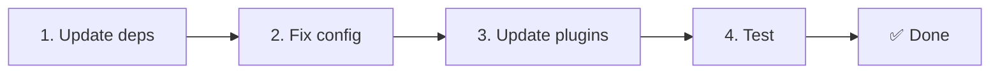

# 📦 Frissítés v2.x-ről v3.x-re

<Tip>
Lásd [Migráció a nuxt-i18n-ről](/migration/from-nuxtjs-i18n) — az az útmutató a vue-i18n ökoszisztémáról való áttérést fedi le, nem a nuxt-i18n-micro v2-ről.
</Tip>

A v3.0.0 alapvető architekturális változásokat vezet be: stratégia csomagok, új gyorsítótár rendszer, központosított területi beállítás kezelés a `useI18nLocale()` segítségével, és újratervezett átirányítási pipeline. Ez a szakasz minden törésváltozást és a kódfrissítés módját fedi.

## Migrációs lépések



## Törésváltozások összefoglalása

- **Területi állapot** — `useState` / `useCookie` manuálisan → `useI18nLocale()` composable
- **Konfiguráció elérése** — `useRuntimeConfig().public.i18nConfig` → `getI18nConfig()` a `#build/i18n.strategy.mjs`-ből
- **Átirányítási komponens** — `fallbackRedirectComponentPath` opció → Szerver átirányítási bővítmény + kliens útvonal middleware (automatikus)
- **`includeDefaultLocaleRoute`** — Támogatott (elavult) → Eltávolítva, használd a `strategy` opciót
- **`experimental.hmr`** — `experimental` alatt → Gyökérszintű opció
- **`previousPageFallback`** — Teljesen eltávolítva (a kumulatív összeolvasztási stratégia automatikusan kezeli)
- **Gyorsítótár** — `useStorage('cache')` → `TranslationStorage` singleton (`Symbol.for` a `globalThis`-en)
- **SSR átvitel** — Runtime konfiguráció → Nuxt payload (v3 használt `useState`-et; a darabok most a `payload.data`-ban élnek, lásd [Teljesítmény](/guides/performance#server-side-payload-transfer))
- **Stratégia osztályok** — Belső → Külön csomagok (`@i18n-micro/route-strategy`, `@i18n-micro/path-strategy`)

## Eltávolítva: `fallbackRedirectComponentPath`

A `fallbackRedirectComponentPath` opciót és a `locale-redirect.vue` tartalék komponenst eltávolítottuk. Az átirányítási logikát most a következők kezelik:

1. **Szerver middleware** (`i18n.global.ts`) — beállítja az `event.context.i18n.locale`-t
2. **Szerver átirányítási bővítmény** (`06.redirect.ts`, csak szerver) — 302 átirányítások a renderelés előtt
3. **Kliens útvonal middleware** (`i18n-redirect.global.ts`) — SPA átirányítások a hidratáció után

```diff
 i18n: {
   strategy: 'prefix_except_default',
-  fallbackRedirectComponentPath: '~/components/MyRedirect.vue',
 }
```

Ha egyéni átirányítási logikád volt a tartalék komponensben, implementáld inkább szerver bővítményben:

```ts
// plugins/i18n-loader.server.ts
export default defineNuxtPlugin({
  name: 'i18n-custom-redirect',
  enforce: 'pre',
  order: -10,
  setup() {
    const { setLocale } = useI18nLocale()
    // Your custom detection logic
    setLocale(detectedLocale)
  },
})
```

## Eltávolítva: `includeDefaultLocaleRoute`

Használd helyette a `strategy` opciót:

- `includeDefaultLocaleRoute: true` → `strategy: 'prefix'`
- `includeDefaultLocaleRoute: false` → `strategy: 'prefix_except_default'` (az alapértelmezett)

```diff
 i18n: {
-  includeDefaultLocaleRoute: true,
+  strategy: 'prefix',
 }
```

## Konfiguráció elérése: `getI18nConfig()` felváltja a `useRuntimeConfig`-ot

```diff
- const config = useRuntimeConfig()
- const cookieName = config.public.i18nConfig?.localeCookie || 'user-locale'
+ import { getI18nConfig } from '#build/i18n.strategy.mjs'
+ const { localeCookie: configCookie } = getI18nConfig()
+ const cookieName = configCookie ?? 'user-locale'
```

## Területi kezelés: `useI18nLocale()` felváltja a manuális állapotot

A v2-ben talán közvetlenül a `useState('i18n-locale')`-t vagy a `useCookie('user-locale')`-t használtad. A v3-ban használd a központosított `useI18nLocale()` composable-t:

```diff
- const locale = useState('i18n-locale')
- const cookie = useCookie('user-locale')
- locale.value = 'fr'
- cookie.value = 'fr'
+ const { setLocale } = useI18nLocale()
+ setLocale('fr') // Updates both state and cookie atomically
```

Lásd [Egyéni nyelvfelismerés](/guides/custom-language-detection) a részletes példákért.

## Kísérleti opciók áthelyezve / eltávolítva

A `hmr` átkerült az `experimental`-ből a gyökérszintre. A `previousPageFallback` teljesen eltávolításra került. A modul most kumulatív mély összeolvasztási stratégiát használ (2 szintű mélység), amely automatikusan megőrzi az előző oldal fordításait az átmeneti animációk során, még akkor is, ha az oldalak átfedő beágyazott kulcsokkal rendelkeznek. Miután az átmeneti animáció befejeződik, a `page:transition:finish` hook eltakarítja a régi oldal kulcsait a memóriából.

```diff
 i18n: {
-  experimental: {
-    hmr: true,
-    previousPageFallback: true
-  }
+  hmr: true,
+  // previousPageFallback removed — handled automatically
 }
```

## Átirányítási architektúra (v3)

Az átirányításokat most két komponens kezeli automatikusan:

1. **Szerveroldali** (`06.redirect.ts`, csak szerver): SSR során fut, 302 átirányításokat bocsát ki bármilyen oldalrendezés előtt. Nincs "hibavillanás".
2. **Kliensoldali** (`i18n-redirect.global.ts`): Globális útvonal middleware az SPA navigáción. Megőrzi a lekérdezési karakterláncot és a hash-t.

Területi prioritás az átirányításokhoz:

1. `useState('i18n-locale')` — a `useI18nLocale().setLocale()` segítségével beállítva
2. Süti — ha a `localeCookie` konfigurálva van
3. `Accept-Language` fejléc — ha `autoDetectLanguage: true`
4. `defaultLocale` — tartalék

Standard beállításokhoz nem szükséges kódmódosítás.

<Warning>
A `prefix` és `prefix_except_default` stratégiákhoz `redirects: true` beállítással állítsd be a `localeCookie: 'user-locale'`-t, hogy engedélyezd a területi beállítás megőrzését oldalújratöltések között. Enélkül az átirányítások csak az `Accept-Language`-et vagy a `defaultLocale`-t használják.
</Warning>

## TypeScript: Belső modul típusok (opcionális)

Ha típushibákkal találkozol a belső importokkal kapcsolatban, például `#i18n-internal/plural`, `#i18n-internal/strategy` vagy `#i18n-internal/config`, add hozzá az `imports` szakaszt a projekted `package.json` fájljához:

```json
{
  "imports": {
    "#i18n-internal/plural": "nuxt-i18n-micro/internals",
    "#i18n-internal/strategy": "nuxt-i18n-micro/internals",
    "#i18n-internal/config": "nuxt-i18n-micro/internals"
  }
}
```
