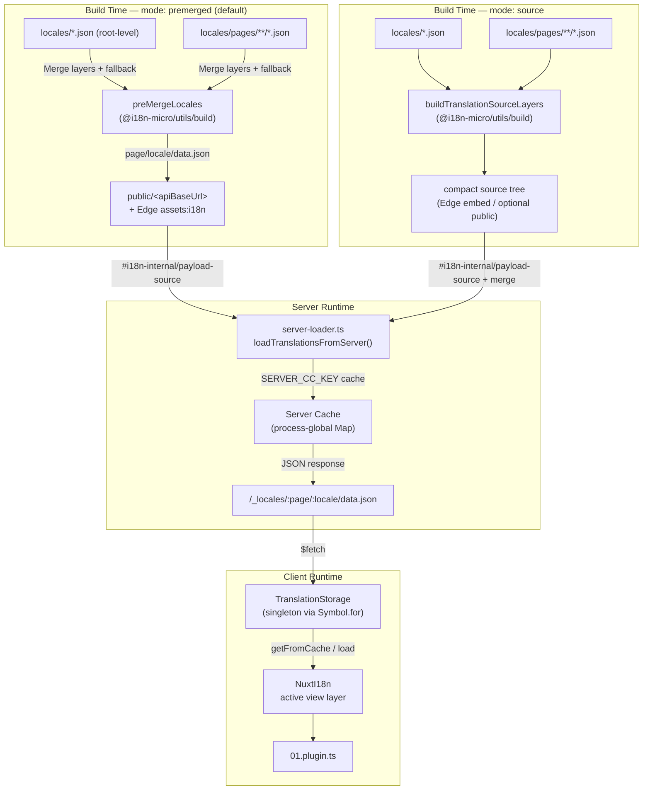

# 🗄️ Arsitektur Cache & Penyimpanan Terjemahan

## 📖 Ikhtisar

Nuxt I18n Micro v3 menggunakan arsitektur caching multi-layer untuk terjemahan. Pemuatan payload bergantung pada `translationPayloads.mode`:

- **`premerged`** (default) — file root, halaman, fallback, dan layer digabungkan saat build melalui `@i18n-micro/utils/build` menjadi `\{page\}/\{locale\}/data.json`
- **`source`** — file sumber ringkas dipertahankan untuk merge runtime melalui `@i18n-micro/utils/source-loader` dan `@i18n-micro/utils/merge-source` (Edge menyematkannya di `serverAssets` Nitro; Node membacanya dari `public/` saat disalin)

Halaman ini menjelaskan cara kerja cache bawaan dan cara memperluasnya untuk kasus penggunaan kustom (alat admin, API eksternal, invalidasi cache).

## 📊 Ikhtisar Arsitektur

### Aliran Data



## 🧱 Komponen Inti

### 1. `TranslationStorage` (Klien + Server)

**File**: `src/runtime/utils/storage.ts`

Kelas singleton yang menyediakan penyimpanan terjemahan terpadu untuk klien dan server. Menggunakan `Symbol.for('__NUXT_I18N_STORAGE_CACHE__')` pada `globalThis` untuk memastikan hanya ada satu instance, bahkan saat beberapa bundle dimuat.

**Method utama:**

| Method                              | Deskripsi                                                            |
| ----------------------------------- | ---------------------------------------------------------------------- |
| `getFromCache(locale, routeName?)`  | Pemeriksaan sinkron: mengembalikan data cache in-memory, atau `null`            |
| `load(locale, routeName?, options)` | Pemuatan async dengan caching: memeriksa cache terlebih dahulu, lalu mengambil melalui `$fetch` |
| `clear()`                           | Membersihkan seluruh cache                                                |

**Format kunci cache**: `\{locale\}:\{routeName\}` (mis. `en:index`, `fr:about`)

```typescript
import { translationStorage } from '../utils/storage'

// Synchronous cache check
const cached = translationStorage.getFromCache('en', 'index')

// Async load (with automatic caching)
const result = await translationStorage.load('en', 'index', {
  apiBaseUrl: '_locales',
  baseURL: '/',
  dateBuild: '2024-01-01',
})
// result.data — merged translations
// result.cacheKey — cache key used
```

### ⚙️ Cache Busting Deterministik (`i18n.dateBuild`)

Secara default, modul ini menghasilkan `dateBuild` saat build menggunakan `Date.now()`. Nilai tersebut kemudian disematkan ke `#build/i18n.strategy.mjs` yang dihasilkan dan digunakan sebagai parameter query (`?v=...`) untuk menginvalidasi cache fetch terjemahan setelah rebuild.

Jika Anda memerlukan build yang dapat direproduksi (misalnya, untuk meningkatkan cache hit chunk pada rolling deployment), setel nilai yang stabil pada `nuxt.config`:

```ts
export default defineNuxtConfig({
  i18n: {
    // Any stable string/number (git SHA, CI build number, release tag, etc.)
    dateBuild: process.env.GIT_SHA ?? 'local-dev',
  },
})
```

### 2. `loadTranslationsFromServer()` (Khusus Server)

**File**: `src/runtime/server/utils/server-loader.ts`

Memuat terjemahan untuk lokal/halaman dan meng-cache hasil gabungan pada peta `CacheControl` global proses yang dikunci oleh `@i18n-micro/hmr/cache-keys` (`SERVER_CC_KEY`).

Perilaku: SSR memuat dari `#i18n-internal/payload-source` — **Node** `readFile` di bawah `public/<apiBaseUrl>` (`\{page\}/\{locale\}/data.json` pada mode premerged), **Edge** `assets:i18n`. `premerged` membaca satu file; `source` menggabungkan root/page/fallback melalui `@i18n-micro/utils/source-loader`.

```typescript
import { loadTranslationsFromServer } from '../server/utils/server-loader'

// Returns { data: Translations, json: string }
const { data, json } = await loadTranslationsFromServer('en', 'index')
```

### 3. Pemuatan Klien (tanpa embed HTML)

Kamus **tidak** ditulis ke `nuxtApp.payload`. Server menyimpannya di memori untuk render SSR;
plugin klien `await` pada `switchContext`, yang memuat `/\{apiBaseUrl\}/:page/:locale/data.json`
(sikap default yang sama dengan `@nuxtjs/i18n` dengan `experimental.preload: false`).

`NuxtI18n` menyimpan kamus lapisan tampilan aktif yang digunakan oleh `$t()` dan `$has()`. `NuxtTranslationLoader` mengganti konteks lokal/rute dan menggabungkan chunk ke dalam lapisan tersebut.

### 4. Rute API Server

**Rute**: `/_locales/\{page\}/\{locale\}/data.json`

**File**: `src/runtime/server/routes/i18n.ts`

Rute Nitro ini menyajikan terjemahan yang digabungkan untuk mode payload aktif. Ia memanggil `loadTranslationsFromServer()` dan mengembalikan hasilnya sebagai JSON.

Pada produksi, ia juga menyetel:

```http
Cache-Control: public, max-age={httpCacheDuration}, immutable
```

`httpCacheDuration` default adalah `31536000` (1 tahun). Ini aman karena klien meminta payload dengan cache-busting `?v=\{dateBuild\}`. Setel `httpCacheDuration: 0` untuk menghilangkan header. Header ini tidak diterapkan pada development.

## 📥 Perluas: Pemuatan Terjemahan Kustom

### Baca dari cache (rute server)

```ts
// server/api/i18n/load-cache.[post].ts
import { defineEventHandler, readBody } from 'h3'
import { loadTranslationsFromServer } from '#imports'

export default defineEventHandler(async (event) => {
  const { page, locale } = await readBody<{ page: string; locale: string }>(event)
  const { data } = await loadTranslationsFromServer(locale, page)
  return { locale, page, data }
})
```

### Perbarui terjemahan (file + invalidasi cache)

```ts
// server/api/i18n/update.[post].ts
import { defineEventHandler, readBody, createError } from 'h3'
import { join } from 'node:path'
import { readFile, writeFile } from 'node:fs/promises'
import { deepMergeTranslations } from '@i18n-micro/utils/deep-merge'

export default defineEventHandler(async (event) => {
  const { path, updates } = await readBody<{ path: string; updates: Record<string, unknown> }>(event)

  if (!path || !updates) {
    throw createError({ statusCode: 400, statusMessage: 'Missing path or updates' })
  }

  const fullPath = join('locales', path)
  let existing: Record<string, unknown> = {}

  try {
    const content = await readFile(fullPath, 'utf-8')
    existing = JSON.parse(content) as Record<string, unknown>
  } catch {
    // File does not exist — create new
  }

  const merged = deepMergeTranslations(existing, updates)
  await writeFile(fullPath, JSON.stringify(merged, null, 2), 'utf-8')

  return { success: true, path, updated: merged }
})
```

<Tip>

</Tip>

## 🧹 Membersihkan Cache

### Pembersihan cache secara programatik (klien)

Gunakan method bawaan `$clearCache`:

```vue
<script setup>
const { $clearCache } = useNuxtApp()

// Clears both TranslationStorage and plugin-level cache
$clearCache()
</script>
```

### Perilaku cache server

Cache sisi server (`loadTranslationsFromServer`) bersifat global proses dan bertahan hingga:

- Proses server dimulai ulang
- Deployment baru terdeteksi (nilai `dateBuild` berbeda)

Untuk lingkungan serverless, setiap cold start memiliki cache baru.

## ⚙️ Konfigurasi Serverless

Untuk lingkungan serverless (Cloudflare Workers, AWS Lambda), cache bawaan menggunakan objek `Map` in-memory. Tidak diperlukan konfigurasi penyimpanan eksternal untuk cache terjemahan itu sendiri.

Namun, penyimpanan Nitro untuk file terjemahan sumber mungkin memerlukan konfigurasi:

```ts
export default defineNuxtConfig({
  nitro: {
    storage: {
      // Only needed if default file-system storage is unavailable
      'assets:server': {
        driver: 'cloudflare-kv-binding',
        binding: 'MY_KV_NAMESPACE',
      },
    },
  },
})
```

## 💡 Perbedaan Utama dari v2

| Aspek           | v2                            | v3                                                                       |
| ---------------- | ----------------------------- | ------------------------------------------------------------------------ |
| Cache klien     | `useStorage('cache')`         | Singleton `TranslationStorage` (Symbol.for pada globalThis)                |
| Transfer SSR     | Runtime config                | Chunk penuh melalui `payload.data` (v3.0 menggunakan `useState`)                    |
| Cache server     | Nitro cache storage           | `Map` global proses melalui `Symbol.for`                                    |
| Logika merge      | Sisi klien                   | Saat build (`premerged`) atau saat runtime (`source`) melalui `@i18n-micro/utils/*` |
| Format kunci cache | `i18n:merged:\{page\}:\{locale\}` | `\{locale\}:\{routeName\}`                                                   |

## 📚 Terkait

- [Panduan Performa](/guides/performance) — Bagaimana caching memengaruhi performa
- [Terjemahan Sisi Server](/guides/server-side-translations) — Menggunakan terjemahan pada rute server
- [Deployment Firebase](/guides/firebase) — Pertimbangan cache khusus deployment
