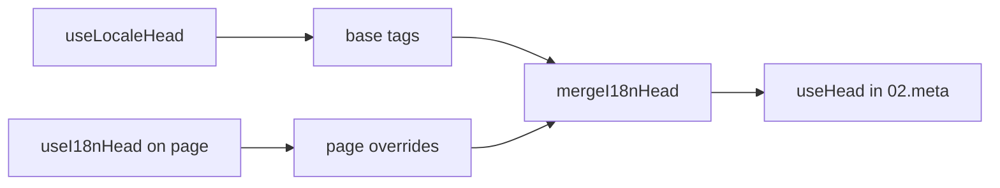

# Composable `useI18nHead`

`useI18nHead` memungkinkan Anda menyesuaikan tag SEO i18n **per halaman** tanpa plugin meta kustom. Saat `meta: true`, modul menggabungkan input Anda di atas output [`useLocaleHead`](/api/composables/use-locale-head).

Kasus tipikal:

- **Artikel CMS / blog** — hanya beberapa lokal yang diterjemahkan; URL alternatif berbeda per bahasa (slug atau jalur berbeda).
- **Canonical dinamis** — URL canonical harus cocok dengan URL artikel dari API, bukan `$switchLocalePath`.
- **Open Graph tambahan** — `og:title`, `og:description`, `og:image` di samping `og:locale` / `og:url` yang dihasilkan otomatis.
- **Kontrol parsial** — pertahankan canonical dan `og:url` yang dihasilkan modul, tetapi ganti hanya `hreflang` dan `og:locale:alternate`.

---

## Signature

{/* generated:symbol:useI18nHead — do not edit; run `pnpm run docs:generate` */}

```ts
useI18nHead(input?: MaybeRefOrGetter<I18nHeadInput | null>): { pageHead: any; resetPageHead: () => void }
```

Daftarkan penggantian tingkat halaman untuk tag head SEO i18n. Digabungkan di atas output `useLocaleHead` oleh plugin `02.meta`.

| Parameter | Tipe | Deskripsi |
| --- | --- | --- |
| `input` *(opsional)* | `MaybeRefOrGetter<I18nHeadInput \| null>` |  |

{/* /generated:symbol:useI18nHead */}

## Bagaimana ini cocok dalam pipeline



Anda memanggil `useI18nHead` di komponen halaman. Plugin `02.meta` menerapkan penggantian setelah setiap `updateMeta()` (perubahan rute, `$setI18nRouteParams`, `page:finish` di klien).

---

## Contoh 1 — Artikel dengan terjemahan hanya di beberapa lokal

Pola umum: API mengembalikan lokal mana yang ada dan URL absolut atau relatifnya.

```ts
interface Article {
  title: string
  slug: string
  /** Locale code → page URL (absolute or site-relative) */
  locales: Record<string, string>
}
```

```vue
<script setup lang="ts">
const route = useRoute()
const { data: article } = await useFetch<Article>(`/api/articles/${route.params.slug}`)

const localeCodes = computed(() => Object.keys(article.value?.locales ?? {}))

useI18nHead(() => {
  if (!article.value) return null

  return {
    meta: [
      { property: 'og:title', content: article.value.title },
      { property: 'og:type', content: 'article' },
    ],
    replace: {
      hreflang: localeCodes.value.map((locale) => ({
        rel: 'alternate',
        hreflang: locale,
        href: article.value!.locales[locale]!,
      })),
      ogAlternates: localeCodes.value,
    },
  }
})
</script>
```

`ogAlternates` menerima **kode lokal** dari konfigurasi `i18n.locales` Anda. Nilai untuk `og:locale:alternate` diselesaikan melalui `locale.og` atau `iso` (format Open Graph `en_US`).

---

## Contoh 2 — Artikel dengan slug per lokal (`$defineI18nRoute` + `$setI18nRouteParams`)

Saat URL dibangun dari template rute yang dilokalkan dan parameter dinamis:

```vue
<script setup lang="ts">
const { $defineI18nRoute, $setI18nRouteParams } = useNuxtApp()
const route = useRoute()

const { data: article } = await useFetch(`/api/articles/${route.params.slug}`)

$defineI18nRoute({
  localeRoutes: {
    en: '/blog/[slug]',
    de: '/de/blog/[slug]',
    fr: '/fr/blog/[slug]',
  },
})

if (article.value) {
  $setI18nRouteParams({
    en: { slug: article.value.slugEn },
    de: { slug: article.value.slugDe },
    fr: { slug: article.value.slugFr },
  })

  const availableLocales = article.value.availableLocales as string[]

  useI18nHead({
    meta: [{ property: 'og:title', content: article.value.title }],
    replace: {
      hreflang: availableLocales.map((locale) => ({
        rel: 'alternate',
        hreflang: locale,
        href: article.value!.urls[locale],
      })),
      ogAlternates: availableLocales,
    },
  })
}
</script>
```

Alternatif yang dihasilkan modul akan mencantumkan **semua** lokal yang dikonfigurasi. `replace.hreflang` membatasi tag ke lokal yang benar-benar memiliki terjemahan.

---

## Contoh 3 — `x-default` kustom untuk URL artikel lokal default

Secara default, `x-default` menunjuk ke URL lokal default dari `$switchLocalePath`. Untuk artikel, arahkan ke URL terjemahan default:

```vue
<script setup lang="ts">
const { $defaultLocale } = useNuxtApp()
const article = await loadArticle()

const defaultLocale = $defaultLocale() ?? 'en'
const defaultHref = article.locales[defaultLocale]

useI18nHead({
  replace: {
    hreflang: Object.entries(article.locales).map(([locale, href]) => ({
      rel: 'alternate',
      hreflang: locale,
      href,
    })),
    xDefault: defaultHref ? { rel: 'alternate', hreflang: 'x-default', href: defaultHref } : false,
    ogAlternates: Object.keys(article.locales),
  },
})
</script>
```

---

## Contoh 4 — Ganti canonical dan `og:url` dari data API

Saat canonical harus cocok dengan URL yang disediakan CMS (multi-domain, jalur kustom, atau URL absolut yang dibangun sebelumnya):

```vue
<script setup lang="ts">
const article = await loadArticle()
const canonical = article.canonicalUrl // e.g. https://www.example.com/en/blog/my-post

useI18nHead({
  replace: {
    canonical,
    ogUrl: canonical,
    hreflang: buildAlternateLinks(article),
    ogAlternates: Object.keys(article.locales),
  },
  meta: [
    { property: 'og:title', content: article.title },
    { name: 'description', content: article.excerpt },
  ],
})
</script>
```

---

## Contoh 5 — Pertahankan canonical / `og:url` otomatis, ganti hanya alternatif

Jika `$switchLocalePath` + `$setI18nRouteParams` sudah menghasilkan canonical dan `og:url` yang benar, ganti hanya tag penemuan:

```vue
<script setup lang="ts">
const article = await loadArticle()

useI18nHead({
  replace: {
    hreflang: buildAlternateLinks(article),
    ogAlternates: Object.keys(article.locales),
  },
})
</script>
```

---

## Contoh 6 — Head penuh untuk halaman detail konten (meta + tautan)

Pola serupa dengan memisahkan "meta halaman" dan "tautan alternatif" ke pembantu terpisah — digabungkan dalam satu panggilan:

```vue
<script setup lang="ts">
const article = await loadArticle()
const alternates = Object.entries(article.locales).map(([locale, href]) => ({
  rel: 'alternate' as const,
  hreflang: locale,
  href: normalizeSeoUrl(href), // strip ?query and #hash if needed
}))

useI18nHead({
  meta: [
    { property: 'og:title', content: article.title },
    { property: 'og:description', content: article.description },
    { property: 'og:image', content: article.imageUrl },
    { name: 'twitter:card', content: 'summary_large_image' },
    { name: 'twitter:title', content: article.title },
  ],
  replace: {
    canonical: article.canonicalUrl,
    ogUrl: article.canonicalUrl,
    hreflang: alternates,
    ogAlternates: Object.keys(article.locales),
  },
})
</script>
```

```ts
/** Remove query and hash — useful when CMS URLs must be clean for SEO */
function normalizeSeoUrl(href: string): string {
  try {
    const url = new URL(href, 'https://placeholder.local')
    url.search = ''
    url.hash = ''
    return href.startsWith('http') ? url.href : `${url.pathname}`
  } catch {
    return href.split(/[?#]/)[0] ?? href
  }
}
```

---

## Contoh 7 — Dua jenis konten, pola yang sama (berita vs panduan)

Bentuk API yang sama, nama rute berbeda — gunakan kembali pembantu kecil:

```ts
// composables/useArticleHead.ts
import type { I18nHeadInput } from '@i18n-micro/types'

interface LocalizedContent {
  title: string
  locales: Record<string, string>
  canonicalUrl?: string
}

export function buildArticleHead(content: LocalizedContent): I18nHeadInput {
  const localeCodes = Object.keys(content.locales)
  const canonical = content.canonicalUrl ?? content.locales.en

  return {
    meta: [{ property: 'og:title', content: content.title }],
    replace: {
      canonical,
      ogUrl: canonical,
      hreflang: localeCodes.map((locale) => ({
        rel: 'alternate',
        hreflang: locale,
        href: content.locales[locale]!,
      })),
      ogAlternates: localeCodes,
    },
  }
}
```

```vue
<!-- pages/blog/[slug].vue -->
<script setup lang="ts">
const article = await loadArticle()
useI18nHead(buildArticleHead(article))
</script>
```

```vue
<!-- pages/guides/[slug].vue -->
<script setup lang="ts">
const guide = await loadGuide()
useI18nHead(buildArticleHead(guide))
</script>
```

---

## Contoh 8 — Nonaktifkan alternatif bawaan, sediakan daftar Anda sendiri

Setara dengan menonaktifkan generator hreflang modul dan meneruskan daftar kustom (tanpa set alternatif duplikat):

```vue
<script setup lang="ts">
const article = await loadArticle()

useI18nHead({
  disable: ['hreflang', 'x-default', 'og-alternates'],
  link: Object.entries(article.locales).map(([locale, href]) => ({
    rel: 'alternate',
    hreflang: locale,
    href,
  })),
  replace: {
    ogAlternates: Object.keys(article.locales),
  },
})
</script>
```

Atau lebih memilih `replace.hreflang` tanpa `disable` — ini menggantikan semua tautan `rel="alternate"` dalam satu langkah.

---

## Contoh 9 — Halaman landing: hanya OG tambahan, pertahankan semua tag i18n

```vue
<script setup lang="ts">
const { t } = useI18n()

useI18nHead({
  meta: [
    { property: 'og:title', content: t('landing.ogTitle') },
    { property: 'og:description', content: t('landing.ogDescription') },
  ],
})
</script>
```

---

## Contoh 10 — Halaman produk: nonaktifkan hreflang untuk eksperimen lokal tunggal

```vue
<script setup lang="ts">
useI18nHead({
  disable: ['hreflang', 'x-default'],
  // canonical, og:locale, og:url still generated
})
</script>
```

---

## Contoh 11 — Pembaruan reaktif setelah fetch sisi klien

```vue
<script setup lang="ts">
const article = ref<Article | null>(null)

onMounted(async () => {
  article.value = await $fetch('/api/articles/latest')
})

useI18nHead(() => {
  if (!article.value) return null
  return {
    meta: [{ property: 'og:title', content: article.value.title }],
    replace: {
      hreflang: Object.entries(article.value.locales).map(([locale, href]) => ({
        rel: 'alternate',
        hreflang: locale,
        href,
      })),
    },
  }
})
</script>
```

Head disegarkan pada `page:finish` dan saat state `pageHead` berubah.

---

## Contoh 12 — Asal HTTPS di belakang reverse proxy

Jika Anda sebelumnya menyelesaikan composable "public origin" untuk URL absolut canonical / alternatif, gunakan konfigurasi modul sebagai gantinya:

```ts
// nuxt.config.ts
export default defineNuxtConfig({
  i18n: {
    meta: true,
    // undefined = origin from current request (multi-domain friendly)
    metaBaseUrl: undefined,
    metaTrustForwardedHost: true,
    metaTrustForwardedProto: true,
  },
})
```

Kemudian berikan **jalur atau URL lengkap** di `replace.hreflang` / `replace.canonical`. Modul menggunakan `useRequestURL` dengan `X-Forwarded-Host` / `X-Forwarded-Proto` di SSR.

---

## Referensi API

### `meta`

Tag `<meta>` tambahan. Duplikat dihapus berdasarkan `id`, `property`, atau `name`.

### `link`

Tag `<link>` tambahan. Duplikat dihapus berdasarkan `id` atau `rel` + `hreflang`.

### `htmlAttrs`

Digabungkan ke atribut `<html>` dari `useLocaleHead` (`lang`, `dir`).

### `replace`

| Kunci          | Tipe                      | Efek                                            |
| -------------- | ------------------------- | ----------------------------------------------- |
| `canonical`    | `string \| false`         | Ganti atau hapus tautan canonical               |
| `hreflang`     | `I18nHeadLink[] \| false` | Ganti atau hapus semua tautan `rel="alternate"` |
| `xDefault`     | `I18nHeadLink \| false`   | Ganti atau hapus `hreflang="x-default"`         |
| `ogLocale`     | `string \| false`         | Ganti atau hapus `og:locale`                    |
| `ogUrl`        | `string \| false`         | Ganti atau hapus `og:url`                       |
| `ogAlternates` | `string[] \| false`       | Bangun ulang `og:locale:alternate` untuk kode lokal |

### `disable`

| Nilai           | Menghapus                                |
| --------------- | ---------------------------------------- |
| `hreflang`      | Tautan alternatif lokal (bukan `x-default`) |
| `x-default`     | Tautan `hreflang="x-default"`            |
| `canonical`     | Tautan canonical                         |
| `og`            | `og:locale` dan `og:url`                 |
| `og-alternates` | Tag `og:locale:alternate`                |
| `html`          | `lang` / `dir` pada `<html>`             |

---

## `useLocaleHead` vs `useI18nHead`

| Composable      | Cakupan              | Kapan menggunakan                          |
| --------------- | -------------------- | ------------------------------------------ |
| `useLocaleHead` | Global / head manual | `meta: false`, pengaturan `useHead` kustom penuh |
| `useI18nHead`   | Penggantian per halaman | `meta: true`, sesuaikan halaman tertentu   |

Saat `meta: true`, Anda **tidak** perlu `useLocaleHead` di halaman yang hanya menggunakan `useI18nHead`.

---

## Migrasi dari plugin head i18n kustom

Banyak proyek memelihara plugin kustom yang:

- menggabungkan tautan alternatif khusus halaman dari state bersama;
- memfilter entri `hreflang` regional duplikat;
- menormalisasi nilai `og:locale`;
- menghapus string kueri dari URL SEO.

Anda dapat menggantinya dengan `useI18nHead` di setiap halaman konten dan default modul.

| Pendekatan sebelumnya                                 | Dengan `useI18nHead`                                 |
| ----------------------------------------------------- | ---------------------------------------------------- |
| State bersama + "lokal mana yang ada untuk artikel ini" | `replace: \{ ogAlternates: localeCodes \}`             |
| Pembantu terpisah yang membangun tautan `rel="alternate"` | `replace: \{ hreflang: links \}`                       |
| Plugin kustom menggabungkan state halaman ke head     | Penggabungan bawaan di `02.meta`                     |
| "Public origin" kustom untuk URL absolut              | `metaBaseUrl` + header yang diteruskan (lihat Contoh 12) |
| `og:locale` pendek (`en` alih-alih `en_US`)           | Atur `locale.og` atau gunakan `iso` → `en_US` (protokol OG) |

**`hreflang` dari `iso`:** setiap lokal memancarkan satu alternatif dengan `hreflang = iso || code`. Perutean `code` tidak pernah digunakan saat `iso` diatur (menghindari tag tidak valid seperti `hreflang="mx"`). Ikut serta ke fallback bahasa telanjang (`es-ES` → juga `es`) dengan `hreflangBaseLanguage: true` — berasal dari `iso`, bukan `code`. Untuk daftar yang sepenuhnya kustom, gunakan `replace.hreflang`.

**JSON-LD:** `useI18nHead` tidak menghasilkan data terstruktur. Simpan `useHead(\{ script: [...] \})` atau pembantu JSON-LD khusus di sampingnya.

---

## Lihat juga

- [Panduan SEO](/guides/seo) — pembuatan meta otomatis dan penggantian tingkat halaman
- [`useLocaleHead`](/api/composables/use-locale-head) — API head tingkat rendah
