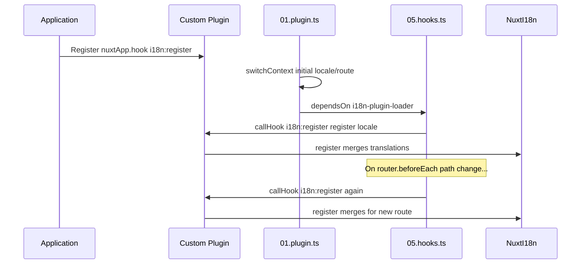

# 📢 Event

## 🔄 `i18n:register`

Event `i18n:register` di `Nuxt I18n Micro` memungkinkan penambahan terjemahan secara dinamis ke konteks i18n aplikasi Anda, membuat proses internasionalisasi menjadi mulus dan fleksibel. Event ini memungkinkan Anda mengintegrasikan terjemahan baru sesuai kebutuhan, meningkatkan kemampuan lokalisasi aplikasi Anda.

### 📝 Detail Event

- **Tujuan**:
  - Memungkinkan penggabungan dinamis terjemahan tambahan ke dalam set yang ada untuk lokal tertentu.

- **Payload**:
  - **`register`**:
    - Fungsi yang disediakan oleh event yang menerima dua argumen:
      - **`translations`** (`Translations`):
        - Objek yang berisi pasangan kunci-nilai yang merepresentasikan terjemahan, terorganisasi sesuai dengan interface `Translations`.
      - **`locale`** (`string`, opsional):
        - Kode lokal (mis. `'en'`, `'ru'`) tempat terjemahan didaftarkan. Default ke lokal yang disediakan oleh event jika tidak ditentukan.

- **Perilaku**:
  - Saat dipicu, fungsi `register` menggabungkan terjemahan baru ke dalam konteks saat ini untuk lokal yang ditentukan, memperbarui terjemahan yang tersedia di seluruh aplikasi.

### ⏱️ Kapan Terpicu

Plugin hook modul (`05.hooks.ts`, `dependsOn: ['i18n-plugin-loader']`) memanggil `nuxtApp.callHook('i18n:register', …)`:

1. **Sekali saat startup** — setelah plugin i18n utama (`01.plugin.ts`) memuat terjemahan untuk rute awal
2. **Pada navigasi** — di `router.beforeEach` saat jalur berubah, atau pada setiap navigasi saat `strategy: 'no_prefix'`

Daftarkan listener Anda di plugin Nuxt normal dengan `nuxtApp.hook('i18n:register', …)`. Plugin hook berjalan setelah loader siap, sehingga callback Anda dipanggil saat terjemahan perlu diperluas.

Setel `hooks: false` di `nuxt.config` untuk menonaktifkan panggilan `i18n:register` otomatis (lihat [Konfigurasi — `hooks`](/guides/configuration#hooks)).

### 💡 Contoh Penggunaan

Contoh berikut menunjukkan cara menggunakan event `i18n:register` untuk menambahkan terjemahan secara dinamis:

```typescript
nuxt.hook('i18n:register', async (register: (translations: unknown, locale?: string) => void, locale: string) => {
  register(
    {
      greeting: 'Hello',
      farewell: 'Goodbye',
    },
    locale,
  )
})
```

### 🛠️ Penjelasan



- **Memicu Event**:
  - Plugin hook (`05.hooks.ts`) menembakkan `i18n:register` setelah loader utama siap dan pada navigasi yang relevan.

- **Menambahkan Terjemahan**:
  - Contoh mendaftarkan terjemahan bahasa Inggris untuk `"greeting"` dan `"farewell"`.
  - Fungsi `register` menggabungkan terjemahan ini ke dalam set yang ada untuk lokal yang disediakan.

### 🔗 Manfaat Utama

- **Pembaruan Dinamis**:
  - Mudah memperbarui atau menambahkan terjemahan tanpa perlu me-redeploy seluruh aplikasi Anda.

- **Fleksibilitas Lokalisasi**:
  - Mendukung penyesuaian lokalisasi real-time berdasarkan kebutuhan pengguna atau aplikasi.

Dengan menggunakan event `i18n:register`, Anda dapat memastikan strategi lokalisasi aplikasi Anda tetap fleksibel dan adaptif, meningkatkan pengalaman pengguna secara keseluruhan.

---

## 🛠️ Memodifikasi Terjemahan dengan Plugin

Untuk memodifikasi terjemahan secara dinamis pada aplikasi Nuxt Anda, penggunaan plugin direkomendasikan. Plugin menyediakan cara yang terstruktur untuk menangani pembaruan lokalisasi, terutama saat bekerja dengan modul atau file terjemahan eksternal.

### **Mendaftarkan Plugin**

Jika Anda menggunakan modul, daftarkan plugin tempat modifikasi terjemahan akan terjadi dengan menambahkannya ke konfigurasi modul Anda:

```javascript
addPlugin({
  src: resolve('./plugins/extend_locales'),
})
```

Ini mendaftarkan plugin yang berada di `./plugins/extend_locales`, yang akan menangani pemuatan dan pendaftaran terjemahan secara dinamis.

### **Mengimplementasikan Plugin**

Dalam plugin, Anda dapat mengelola modifikasi lokal. Berikut contoh implementasi pada plugin Nuxt:

```typescript
import { defineNuxtPlugin } from '#app'

export default defineNuxtPlugin(async (nuxtApp) => {
  // Function to load translations from JSON files and register them
  const loadTranslations = async (lang: string) => {
    try {
      const translations = await import(`../locales/${lang}.json`)
      return translations.default
    } catch (error) {
      console.error(`Error loading translations for language: ${lang}`, error)
      return null
    }
  }

  // Hook into the 'i18n:register' event to dynamically add translations
  // eslint-disable-next-line @typescript-eslint/ban-ts-comment
  // @ts-expect-error
  nuxtApp.hook('i18n:register', async (register: (translations: unknown, locale?: string) => void, locale: string) => {
    const translations = await loadTranslations(locale)
    if (translations) {
      register(translations, locale)
    }
  })
})
```

### 📝 Penjelasan Rinci

1. **Memuat Terjemahan**:

- Fungsi `loadTranslations` secara dinamis mengimpor file terjemahan berdasarkan lokalnya. File diharapkan berada di direktori `locales` dan dinamai sesuai kode lokal (mis. `en.json`, `de.json`).
- Saat pemuatan berhasil, terjemahan dikembalikan; jika tidak, kesalahan dicatat.

2. **Mendaftarkan Terjemahan**:

- Plugin terhubung ke event `i18n:register` menggunakan `nuxtApp.hook`.
- Saat event dipicu, fungsi `register` dipanggil dengan terjemahan yang dimuat dan lokal yang sesuai.
- Ini menggabungkan terjemahan baru ke dalam konteks i18n untuk lokal yang ditentukan, memperbarui terjemahan yang tersedia di seluruh aplikasi.

### 🔗 Manfaat Menggunakan Plugin untuk Modifikasi Terjemahan

- **Pemisahan Tanggung Jawab**:
  - Enkapsulasi logika lokalisasi terpisah dari kode aplikasi utama, membuat manajemen dan pemeliharaan lebih mudah.

- **Dinamis dan Skalabel**:
  - Dengan memuat dan mendaftarkan terjemahan secara dinamis, Anda dapat memperbarui konten tanpa memerlukan re-deployment aplikasi penuh, yang sangat berguna untuk aplikasi dengan konten yang sering diperbarui atau multibahasa.

- **Fleksibilitas Lokalisasi yang Ditingkatkan**:
  - Plugin memungkinkan Anda memodifikasi atau memperluas terjemahan sesuai kebutuhan, menyediakan strategi lokalisasi yang lebih adaptif dan responsif yang memenuhi preferensi pengguna atau kebutuhan bisnis.

Dengan menerapkan pendekatan ini, Anda dapat memperluas dan memodifikasi lokalisasi aplikasi Anda secara efisien melalui proses yang terstruktur dan dapat dipelihara menggunakan plugin, menjaga internasionalisasi tetap adaptif terhadap kebutuhan yang berubah dan meningkatkan pengalaman pengguna secara keseluruhan.
