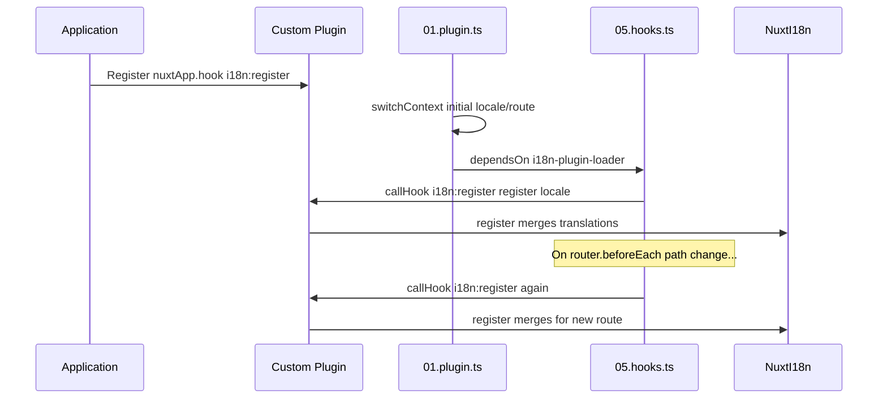

# 📢 Event

## 🔄 `i18n:register`

Event `i18n:register` di `Nuxt I18n Micro` memungkinkan penambahan terjemahan secara dinamis ke konteks i18n aplikasi Anda, membuat proses internasionalisasi berjalan mulus dan fleksibel. Event ini memungkinkan Anda mengintegrasikan terjemahan baru sesuai kebutuhan, meningkatkan kemampuan lokalisasi aplikasi Anda.

### 📝 Detail event

- **Tujuan**:
  - Memungkinkan penggabungan dinamis terjemahan tambahan ke dalam kumpulan yang ada untuk lokal tertentu.

- **Payload**:
  - **`register`**:
    - Fungsi yang disediakan oleh event yang menerima dua argumen:
      - **`translations`** (`Translations`):
        - Objek yang berisi pasangan kunci-nilai yang mewakili terjemahan, disusun sesuai dengan antarmuka `Translations`.
      - **`locale`** (`string`, opsional):
        - Kode lokal (misalnya, `'en'`, `'ru'`) yang mana terjemahan didaftarkan. Default ke lokal yang disediakan oleh event jika tidak ditentukan.

- **Perilaku**:
  - Saat dipicu, fungsi `register` menggabungkan terjemahan baru ke dalam konteks saat ini untuk lokal yang ditentukan, memperbarui terjemahan yang tersedia di seluruh aplikasi.

### ⏱️ Kapan event ini dipicu

Plugin hooks modul (`05.hooks.ts`, `dependsOn: ['i18n-plugin-loader']`) memanggil `nuxtApp.callHook('i18n:register', …)`:

1. **Sekali saat startup** — setelah plugin i18n utama (`01.plugin.ts`) memuat terjemahan untuk rute awal
2. **Saat navigasi** — di `router.beforeEach` saat path berubah, atau pada setiap navigasi saat `strategy: 'no_prefix'`

Daftarkan listener Anda di plugin Nuxt biasa dengan `nuxtApp.hook('i18n:register', …)`. Plugin hooks berjalan setelah loader siap, jadi callback Anda dipanggil saat terjemahan perlu diperluas.

Atur `hooks: false` di `nuxt.config` untuk menonaktifkan panggilan `i18n:register` otomatis (lihat [Konfigurasi — `hooks`](/guides/configuration#hooks)).

### 💡 Contoh penggunaan

Contoh berikut menunjukkan cara menggunakan event `i18n:register` untuk menambahkan terjemahan secara dinamis:

```typescript
nuxt.hook('i18n:register', async (register: (translations: unknown, locale?: string) => void, locale: string) => {
  register(
    {
      greeting: 'Hello',
      farewell: 'Goodbye',
    },
    locale,
  )
})
```

### 🛠️ Penjelasan



- **Memicu event**:
  - Plugin hooks (`05.hooks.ts`) memicu `i18n:register` setelah loader utama siap dan pada navigasi yang relevan.

- **Menambahkan terjemahan**:
  - Contoh mendaftarkan terjemahan bahasa Inggris untuk `"greeting"` dan `"farewell"`.
  - Fungsi `register` menggabungkan terjemahan ini ke kumpulan yang ada untuk lokal yang disediakan.

### 🔗 Manfaat utama

- **Pembaruan dinamis**:
  - Dengan mudah memperbarui atau menambahkan terjemahan tanpa perlu menerapkan ulang seluruh aplikasi Anda.

- **Fleksibilitas lokalisasi**:
  - Mendukung penyesuaian lokalisasi waktu nyata berdasarkan kebutuhan pengguna atau aplikasi.

Dengan menggunakan event `i18n:register`, Anda dapat memastikan bahwa strategi lokalisasi aplikasi Anda tetap fleksibel dan mudah beradaptasi, meningkatkan pengalaman pengguna secara keseluruhan.

---

## 🛠️ Memodifikasi terjemahan dengan plugin

Untuk memodifikasi terjemahan secara dinamis di aplikasi Nuxt Anda, disarankan menggunakan plugin. Plugin menyediakan cara terstruktur untuk menangani pembaruan lokalisasi, terutama saat bekerja dengan modul atau file terjemahan eksternal.

### **Mendaftarkan plugin**

Jika Anda menggunakan modul, daftarkan plugin tempat modifikasi terjemahan akan terjadi dengan menambahkannya ke konfigurasi modul Anda:

```javascript
addPlugin({
  src: resolve('./plugins/extend_locales'),
})
```

Ini mendaftarkan plugin yang terletak di `./plugins/extend_locales`, yang akan menangani pemuatan dan pendaftaran terjemahan secara dinamis.

### **Menerapkan plugin**

Di plugin, Anda dapat mengelola modifikasi lokal. Berikut contoh implementasi di plugin Nuxt:

```typescript
import { defineNuxtPlugin } from '#app'

export default defineNuxtPlugin(async (nuxtApp) => {
  // Function to load translations from JSON files and register them
  const loadTranslations = async (lang: string) => {
    try {
      const translations = await import(`../locales/${lang}.json`)
      return translations.default
    } catch (error) {
      console.error(`Error loading translations for language: ${lang}`, error)
      return null
    }
  }

  // Hook into the 'i18n:register' event to dynamically add translations
  // eslint-disable-next-line @typescript-eslint/ban-ts-comment
  // @ts-expect-error
  nuxtApp.hook('i18n:register', async (register: (translations: unknown, locale?: string) => void, locale: string) => {
    const translations = await loadTranslations(locale)
    if (translations) {
      register(translations, locale)
    }
  })
})
```

### 📝 Penjelasan rinci

1. **Memuat terjemahan**:

- Fungsi `loadTranslations` mengimpor file terjemahan secara dinamis berdasarkan lokal. File diharapkan berada di direktori `locales` dan diberi nama sesuai kode lokal (misalnya, `en.json`, `de.json`).
- Saat berhasil dimuat, terjemahan dikembalikan; jika tidak, kesalahan dicatat.

2. **Mendaftarkan terjemahan**:

- Plugin masuk ke event `i18n:register` menggunakan `nuxtApp.hook`.
- Saat event dipicu, fungsi `register` dipanggil dengan terjemahan yang dimuat dan lokal yang sesuai.
- Ini menggabungkan terjemahan baru ke dalam konteks i18n untuk lokal yang ditentukan, memperbarui terjemahan yang tersedia di seluruh aplikasi.

### 🔗 Manfaat menggunakan plugin untuk modifikasi terjemahan

- **Pemisahan tanggung jawab**:
  - Enkapsulasi logika lokalisasi secara terpisah dari kode aplikasi utama, membuat manajemen dan pemeliharaan lebih mudah.

- **Dinamis dan dapat diskalakan**:
  - Dengan memuat dan mendaftarkan terjemahan secara dinamis, Anda dapat memperbarui konten tanpa memerlukan penerapan ulang aplikasi secara penuh, yang sangat berguna untuk aplikasi dengan konten yang sering diperbarui atau multibahasa.

- **Fleksibilitas lokalisasi yang ditingkatkan**:
  - Plugin memungkinkan Anda memodifikasi atau memperluas terjemahan sesuai kebutuhan, memberikan strategi lokalisasi yang lebih adaptif dan responsif yang memenuhi preferensi pengguna atau persyaratan bisnis.

Dengan mengadopsi pendekatan ini, Anda dapat memperluas dan memodifikasi lokalisasi aplikasi Anda secara efisien melalui proses terstruktur dan mudah dipelihara menggunakan plugin, menjaga internasionalisasi tetap adaptif terhadap kebutuhan yang berubah dan meningkatkan pengalaman pengguna secara keseluruhan.
