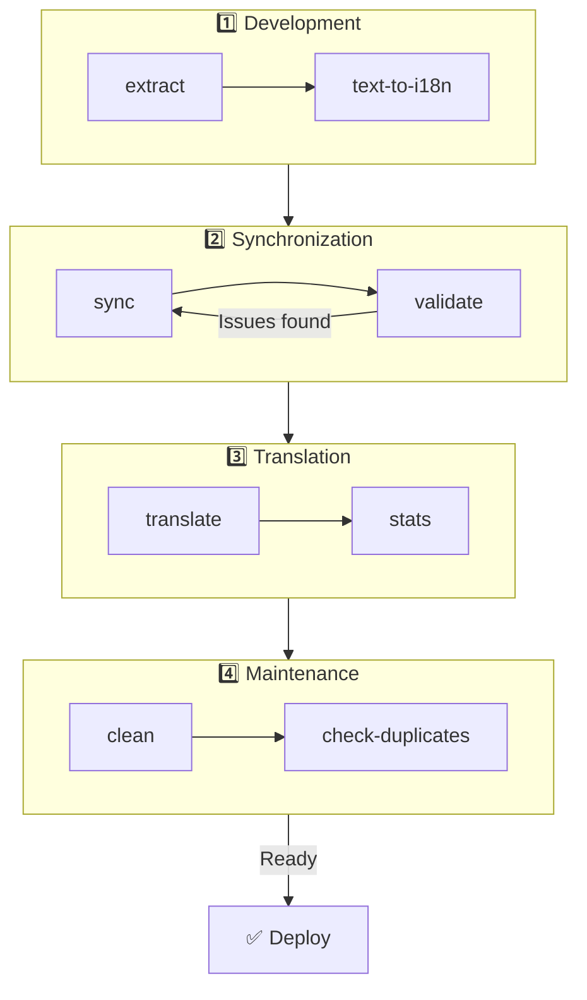

# 🌐 Panduan nuxt-i18n-micro-cli

## 📖 Pengantar

`nuxt-i18n-micro-cli` adalah command-line tool designed to streamline the localization dan internationalization process in Nuxt.js projects using the `nuxt-i18n-micro` module (Nuxt I18n Micro). It menyediakan utilities to extract translation keys dari your codebase, manage translation files, synchronize translations across locales, dan automate the translation process using external translation services.

Panduan ini will walk you through installing, configuring, dan using `nuxt-i18n-micro-cli` to effectively manage your project's translations. Package on [npmjs.com](https://www.npmjs.com/package/nuxt-i18n-micro-cli).

## 🔧 Instalasi dan Setup

### 📦 Installing nuxt-i18n-micro-cli

Install globally atau as a dev dependency in your Nuxt project (recommended untuk CI):

```bash
# global
npm install -g nuxt-i18n-micro-cli

# or per project
pnpm add -D nuxt-i18n-micro-cli
pnpm exec i18n-micro text-to-i18n --dryRun
```

Use **`nuxt-i18n-micro-cli` ≥ 2.1.1** if your project uses the Nuxt 4 `app/` directory (`app/pages`, `app/components`, …). Older CLI versions only scanned `pages/` pada project root.

### 🛠 Initializing in Your Project

After installing, you can run `i18n-micro` commands in your Nuxt.js project directory.

Pastikan bahwa your project diatur up dengan `nuxt-i18n-micro` dan has the necessary configuration in `nuxt.config.ts` (or `nuxt.config.js`).

### 📄 Common Arguments

- `--cwd`: Specify the current working directory (defaults to `.`).
- `--logLevel`: Set the log level (`silent`, `info`, `verbose`).
- `--translationDir`: Directory containing JSON translation files (default: `locales`).

## 📊 CLI Workflow Overview



### Workflow Steps

| Phase           | Commands                    | Purpose                           |
| --------------- | --------------------------- | --------------------------------- |
| **Development** | `extract`, `text-to-i18n`   | Find dan extract translation keys |
| **Sync**        | `sync`, `validate`          | Ensure all locales have same keys |
| **Translate**   | `translate`, `stats`        | Auto-translate missing keys       |
| **Maintenance** | `clean`, `check-duplicates` | Keep translations tidy            |

## 📋 Commands

### 🔄 `text-to-i18n` Command

CLI package: [`nuxt-i18n-micro-cli`](https://www.npmjs.com/package/nuxt-i18n-micro-cli)

**Deskripsi**: Scans Vue/TS/JS files untuk hardcoded user-facing strings, replaces them dengan `$t('...')`, dan merges new keys into your JSON translation file. Run dari the **Nuxt project root** (where `nuxt.config` lives).

**Penggunaan**:

```bash
i18n-micro text-to-i18n [options]
```

**Opsi**:

| Option                  | Default           | Description                                                           |
| ----------------------- | ----------------- | --------------------------------------------------------------------- |
| `--translationFile`     | `locales/en.json` | JSON file untuk new keys (relative to project root).                    |
| `--path`                | —                 | Process one file atau directory only (e.g. `app/pages/about.vue`).      |
| `--context`             | —                 | Key prefix (e.g. `auth` → `auth.*`).                                  |
| `--dryRun`              | `false`           | Preview tanpa writing files.                                        |
| `--verbose`             | `false`           | Extra logging.                                                        |
| `--interactive`         | `false`           | Confirm atau edit each key before applying.                             |
| `--extractOnlyDirs`     | `plugins`         | Dirs where keys are extracted tetapi source files are **not** rewritten. |
| `--extractOnlyPatterns` | —                 | Glob-like extract-only patterns (e.g. `**/*.plugin.ts`).              |

**Contoh**:

```bash
i18n-micro text-to-i18n --translationFile locales/en.json --context auth --dryRun
```

#### Which folders are scanned?

<Info>
Since CLI **v2.1.1**, `text-to-i18n` scans both classic root folders dan `app/*` equivalents. Run the command dari the **project root** — do not `cd app`.
</Info>

Collects `*.vue`, `*.js`, dan `*.ts` under:

| Nuxt 3 (project root) | Nuxt 4 (`app/` directory) |
| --------------------- | ------------------------- |
| `pages/`              | `app/pages/`              |
| `components/`         | `app/components/`         |
| `plugins/`            | `app/plugins/`            |
| `layouts/`            | `app/layouts/`            |

Other folders (`server/`, `composables/`, `middleware/`, …) are skipped unless you use `--path`. For Nuxt 4, run dari the project root (no need to `cd app`). Match `i18n.translationDir` in `--translationFile` if it is not `locales/`.

```bash
i18n-micro text-to-i18n --path app/pages
```

#### Cara kerjanya

1. Collect files dari the directories above (or dari `--path`).
2. Replace literals / template text dengan `$t('generated.key')` (`plugins/` is extract-only secara default).
3. Merge new keys into `--translationFile` tanpa removing existing entries.

**Example Transformations**:

Before:

```vue
<template>
  <div>
    <h1>Welcome to our site</h1>
    <p>Please sign in to continue</p>
  </div>
</template>
```

After:

```vue
<template>
  <div>
    <h1>{{ $t('pages.home.welcome_to_our_site') }}</h1>
    <p>{{ $t('pages.home.please_sign_in') }}</p>
  </div>
</template>
```

**Best practices**: dry run first; commit before a full run; align `--translationFile` dengan `i18n.translationDir` in `nuxt.config`; keep `--extractOnlyDirs plugins` untuk bootstrap code.

**Limitations**: separate npm package (not bundled dengan the module); does not read `nuxt.config` automatically; outputs `$t(...)`; complex dynamic strings may need `extract` / `search` instead.

### 📊 `stats` Command

**Deskripsi**: The `stats` command digunakan to display translation statistics untuk each locale in your Nuxt.js project. It membantu Anda understand the progress of your translations by showing how many keys are translated compared ke total number of keys available.

**Penggunaan**:

```bash
i18n-micro stats [options]
```

**Opsi**:

- `--full`: Display combined translations statistics only (default: `false`).

**Contoh**:

```bash
i18n-micro stats --full
```

### 🌍 `translate` Command

**Deskripsi**: The `translate` command automatically translates missing keys using external translation services. This command simplifies the translation process by leveraging APIs dari services like Google Translate, DeepL, dan others to fill in missing translations.

**Penggunaan**:

```bash
i18n-micro translate [options]
```

**Opsi**:

- `--service`: Translation service to use (e.g., `google`, `deepl`, `yandex`). If not specified, the command will prompt you to select one.
- `--token`: API key corresponding ke chosen translation service. If not provided, you akan prompted to enter it.
- `--options`: Additional options untuk the translation service, provided as key:value pairs, separated by commas (e.g., `model:gpt-3.5-turbo,max_tokens:1000`).
- `--replace`: Translate all keys, replacing existing translations (default: `false`).

**Contoh**:

```bash
i18n-micro translate --service deepl --token YOUR_DEEPL_API_KEY
```

#### 🌐 Supported Translation Services

The `translate` command mendukung multiple translation services. Some of the supported services are:

- **Google Translate** (`google`)
- **DeepL** (`deepl`)
- **Yandex Translate** (`yandex`)
- **OpenAI** (`openai`)
- **Azure Translator** (`azure`)
- **IBM Watson** (`ibm`)
- **Baidu Translate** (`baidu`)
- **LibreTranslate** (`libretranslate`)
- **MyMemory** (`mymemory`)
- **Lingva Translate** (`lingvatranslate`)
- **Papago** (`papago`)
- **Tencent Translate** (`tencent`)
- **Systran Translate** (`systran`)
- **Yandex Cloud Translate** (`yandexcloud`)
- **ModernMT** (`modernmt`)
- **Lilt** (`lilt`)
- **Unbabel** (`unbabel`)
- **Reverso Translate** (`reverso`)

#### ⚙️ Service Configuration

Some services require specific configurations atau API keys. Saat menggunakan the `translate` command, you can specify the service dan provide the required `--token` (API key) dan additional `--options` if needed.

Sebagai contoh:

```bash
i18n-micro translate --service openai --token YOUR_OPENAI_API_KEY --options openaiModel:gpt-3.5-turbo,max_tokens:1000
```

### 🛠️ `extract` Command

**Deskripsi**: Extracts translation keys dari your codebase dan organizes them by scope.

**Penggunaan**:

```bash
i18n-micro extract [options]
```

**Opsi**:

- `--prod, -p`: Run in production mode.

**Contoh**:

```bash
i18n-micro extract
```

### 🔄 `sync` Command

**Deskripsi**: Synchronizes translation files across locales, ensuring all locales have the same keys.

**Penggunaan**:

```bash
i18n-micro sync [options]
```

**Contoh**:

```bash
i18n-micro sync
```

### ✅ `validate` Command

**Deskripsi**: Validates translation files untuk missing atau extra keys compared ke reference locale.

**Penggunaan**:

```bash
i18n-micro validate [options]
```

**Contoh**:

```bash
i18n-micro validate
```

### 🧹 `clean` Command

**Deskripsi**: Removes unused translation keys dari translation files.

**Penggunaan**:

```bash
i18n-micro clean [options]
```

**Contoh**:

```bash
i18n-micro clean
```

### 📤 `import` Command

**Deskripsi**: Converts PO files back to JSON format dan saves them di translation directory.

**Penggunaan**:

```bash
i18n-micro import [options]
```

**Opsi**:

- `--potsDir`: Directory containing PO files (default: `pots`).

**Contoh**:

```bash
i18n-micro import --potsDir pots
```

### 📥 `export` Command

**Deskripsi**: Exports translations to PO files untuk external translation management.

**Penggunaan**:

```bash
i18n-micro export [options]
```

**Opsi**:

- `--potsDir`: Directory to save PO files (default: `pots`).

**Contoh**:

```bash
i18n-micro export --potsDir pots
```

### 🗂️ `export-csv` Command

**Deskripsi**: The `export-csv` command exports translation keys dan values dari JSON files, including their file paths, into a CSV format. This command is useful untuk teams who prefer working dengan translation data in spreadsheet software.

**Penggunaan**:

```bash
i18n-micro export-csv [options]
```

**Opsi**:

- `--csvDir`: Directory where the exported CSV files akan saved.
- `--delimiter`: Specify a delimiter untuk the CSV file (default: `,`).

**Contoh**:

```bash
i18n-micro export-csv --csvDir csv_files
```

### 📑 `import-csv` Command

**Deskripsi**: The `import-csv` command imports translation data dari CSV files, updating the corresponding JSON files. Ini berguna untuk applying bulk translation updates dari spreadsheets.

**Penggunaan**:

```bash
i18n-micro import-csv [options]
```

**Opsi**:

- `--csvDir`: Directory containing the CSV files to be imported.
- `--delimiter`: Specify a delimiter used di CSV file (default: `,`).

**Contoh**:

```bash
i18n-micro import-csv --csvDir csv_files
```

### 🧾 `diff` Command

**Deskripsi**: Compares translation files between the default locale dan other locales within the same directory (including subdirectories). The command identifies missing keys dan their values di default locale compared to other locales, making it easier to track translation progress atau discrepancies.

**Penggunaan**:

```bash
i18n-micro diff [options]
```

**Contoh**:

```bash
i18n-micro diff
```

### 🔍 `check-duplicates` Command

**Deskripsi**: The `check-duplicates` command checks untuk duplicate translation values within each locale across all translation files, including both root-level dan page-specific translations. It ensures that different keys within the same language do not share identical translation values, helping maintain clarity dan consistency in your translations.

**Penggunaan**:

```bash
i18n-micro check-duplicates [options]
```

**Contoh**:

```bash
i18n-micro check-duplicates
```

**How it works**:

- The command checks both root-level dan page-specific translation files untuk each locale.
- If a translation value appears in multiple locations (either within root-level translations atau across different pages), it reports the duplicate values along dengan the file dan key where they are found.
- If no duplicates are found, the command confirms that the locale is free of duplicated translation values.

This command helps ensure that translation keys maintain unique values, preventing accidental repetition within the same locale.

### 🔄 `replace-values` Command

**Deskripsi**: The `replace-values` command memungkinkan Anda perform bulk replacements of translation values across all locales. It mendukung both simple text replacements dan advanced replacements using regular expressions (regex). Anda dapat also use capturing groups in regex patterns dan reference them di replacement string, making it ideal untuk more complex replacement scenarios.

**Penggunaan**:

```bash
i18n-micro replace-values [options]
```

**Opsi**:

- `--search`: The text atau regex pattern to search untuk in translations. This adalah required option.
- `--replace`: The replacement text to be digunakan untuk the found translations. This adalah required option.
- `--useRegex`: Enable search using a regular expression pattern (default: `false`).

**Example 1**: Simple replacement

Replace the string "Hello" dengan "Hi" across all locales:

```bash
i18n-micro replace-values --search "Hello" --replace "Hi"
```

**Example 2**: Regex replacement

Enable regex search dan replace any string starting dengan "Hello" followed by numbers (e.g., "Hello123") dengan "Hi" across all locales:

```bash
i18n-micro replace-values --search "Hello\\d+" --replace "Hi" --useRegex
```

**Example 3**: Using regex capturing groups

Use capturing groups to dynamically insert part of the matched string into the replacement. Sebagai contoh, replace "Hello [name]" dengan "Hi [name]" while keeping the name intact:

```bash
i18n-micro replace-values --search "Hello (\\w+)" --replace "Hi $1" --useRegex
```

Dalam kasus ini, `$1` refers ke first capturing group, which matches the `[name]` part after "Hello". The replacement will keep the name dari the original string.

**How it works**:

- The command scans through all translation files (both global dan page-specific).
- Saat sebuah match is found based on the search string atau regex pattern, it replaces the matched text dengan the provided replacement.
- Saat menggunakan regex, capturing groups dapat used di replacement string by referencing them dengan `$1`, `$2`, etc.
- All changes are logged, showing the file path, translation key, dan the before/after state of the translation value.

**Logging**:
For each replacement, the command logs details including:

- Locale dan file path
- The translation key being modified
- The old value dan the new value after replacement
- If using regex dengan capturing groups, the logs will show the group matches dan how they were replaced.

Ini memungkinkan you to track exactly where dan what changes were made during the replacement operation, providing a clear history of modifications across your translation files.

## 🛠 Examples

- **Extracting translations**:

  ```bash
  i18n-micro extract
  ```

- **Translating missing keys using Google Translate**:

  ```bash
  i18n-micro translate --service google --token YOUR_GOOGLE_API_KEY
  ```

- **Translating all keys, replacing existing translations**:

  ```bash
  i18n-micro translate --service deepl --token YOUR_DEEPL_API_KEY --replace
  ```

- **Validating translation files**:

  ```bash
  i18n-micro validate
  ```

- **Cleaning unused translation keys**:

  ```bash
  i18n-micro clean
  ```

- **Synchronizing translation files**:

  ```bash
  i18n-micro sync
  ```

## ⚙️ Konfigurasi Guide

`nuxt-i18n-micro-cli` relies on your Nuxt.js i18n configuration in `nuxt.config.ts` (or `nuxt.config.js`). Ensure you have the `nuxt-i18n-micro` module installed dan configured.

### 🔑 nuxt.config.js Example

```ts
export default defineNuxtConfig({
  modules: ['nuxt-i18n-micro'],
  i18n: {
    locales: [
      { code: 'en', iso: 'en-US' },
      { code: 'fr', iso: 'fr-FR' },
    ],
    defaultLocale: 'en',
    fallbackLocale: 'en',
    translationDir: 'locales', // or 'app/locales' for Nuxt 4 colocation
  },
})
```

Pastikan bahwa the `translationDir` matches the directory used by `nuxt-i18n-micro-cli` (default is `locales`).

## 📝 Best Practices

### 🔑 Consistent Key Naming

Ensure translation keys are consistent dan descriptive to avoid confusion dan duplication.

### 🧹 Regular Maintenance

Use the `clean` command regularly to remove unused translation keys dan keep your translation files clean.

### 🛠 Automate Translation Workflow

Integrate `nuxt-i18n-micro-cli` commands into your development workflow atau CI/CD pipeline to automate extraction, translation, validation, dan synchronization of translation files.

### 🛡️ Secure API Keys

Saat menggunakan translation services that require API keys, ensure your keys are kept secure dan not committed to version control systems. Consider using environment variables atau secure key management solutions.

## 📞 Support dan Contributions

If you encounter issues atau have suggestions untuk improvements, feel free to contribute ke project atau open an issue on the project's repository.

---

By following this guide, you'll be able to effectively manage translations in your Nuxt.js project using `nuxt-i18n-micro-cli`, streamlining your internationalization efforts dan ensuring a smooth experience untuk users in different locales.
