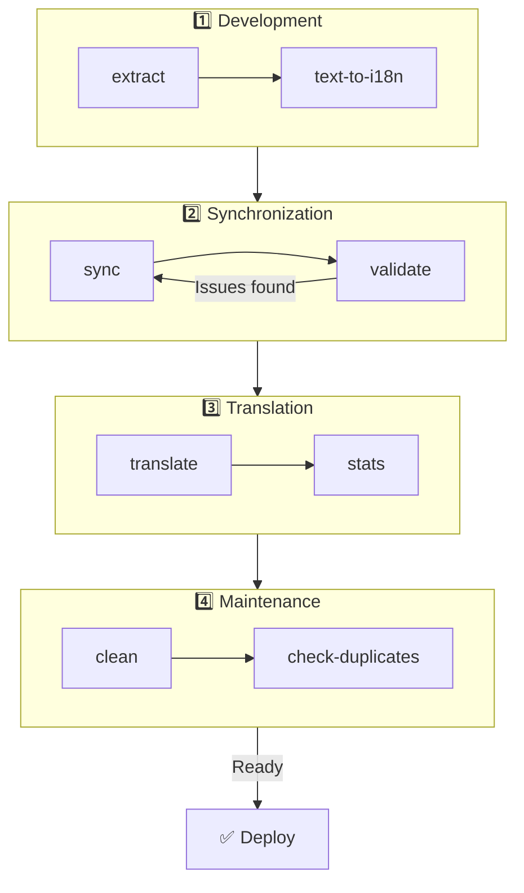

# 🌐 Panduan nuxt-i18n-micro-cli

## 📖 Pendahuluan

`nuxt-i18n-micro-cli` adalah alat command-line yang dirancang untuk merampingkan proses lokalisasi dan internasionalisasi di proyek Nuxt.js yang menggunakan modul `nuxt-i18n-micro` (Nuxt I18n Micro). Ia menyediakan utilitas untuk mengekstrak kunci terjemahan dari basis kode Anda, mengelola file terjemahan, menyinkronkan terjemahan di berbagai lokal, dan mengotomatiskan proses terjemahan menggunakan layanan terjemahan eksternal.

Panduan ini akan memandu Anda menginstal, mengonfigurasi, dan menggunakan `nuxt-i18n-micro-cli` untuk mengelola terjemahan proyek Anda dengan efektif. Paket di [npmjs.com](https://www.npmjs.com/package/nuxt-i18n-micro-cli).

## 🔧 Instalasi dan Pengaturan

### 📦 Menginstal nuxt-i18n-micro-cli

Instal secara global atau sebagai dev dependency di proyek Nuxt Anda (direkomendasikan untuk CI):

```bash
# global
npm install -g nuxt-i18n-micro-cli

# or per project
pnpm add -D nuxt-i18n-micro-cli
pnpm exec i18n-micro text-to-i18n --dryRun
```

Gunakan **`nuxt-i18n-micro-cli` ≥ 2.1.1** jika proyek Anda menggunakan direktori `app/` Nuxt 4 (`app/pages`, `app/components`, …). Versi CLI yang lebih lama hanya memindai `pages/` di root proyek.

### 🛠 Menginisialisasi di Proyek Anda

Setelah instalasi, Anda dapat menjalankan perintah `i18n-micro` di direktori proyek Nuxt.js Anda.

Pastikan proyek Anda sudah diatur dengan `nuxt-i18n-micro` dan memiliki konfigurasi yang diperlukan pada `nuxt.config.ts` (atau `nuxt.config.js`).

### 📄 Argumen Umum

- `--cwd`: Menentukan direktori kerja saat ini (default `.`).
- `--logLevel`: Menetapkan level log (`silent`, `info`, `verbose`).
- `--translationDir`: Direktori yang berisi file terjemahan JSON (default: `locales`).

## 📊 Ikhtisar Alur Kerja CLI



### Langkah Alur Kerja

| Fase           | Perintah                    | Tujuan                           |
| --------------- | --------------------------- | --------------------------------- |
| **Development** | `extract`, `text-to-i18n`   | Menemukan dan mengekstrak kunci terjemahan |
| **Sync**        | `sync`, `validate`          | Memastikan semua lokal memiliki kunci yang sama |
| **Translate**   | `translate`, `stats`        | Menerjemahkan otomatis kunci yang hilang       |
| **Maintenance** | `clean`, `check-duplicates` | Menjaga terjemahan tetap rapi            |

## 📋 Perintah

### 🔄 Perintah `text-to-i18n`

Paket CLI: [`nuxt-i18n-micro-cli`](https://www.npmjs.com/package/nuxt-i18n-micro-cli)

**Deskripsi**: Memindai file Vue/TS/JS untuk mencari string berkode keras yang dihadapkan ke pengguna, menggantinya dengan `$t('...')`, dan menggabungkan kunci baru ke file JSON terjemahan Anda. Jalankan dari **root proyek Nuxt** (tempat `nuxt.config` berada).

**Penggunaan**:

```bash
i18n-micro text-to-i18n [options]
```

**Opsi**:

| Opsi                  | Default           | Deskripsi                                                           |
| ----------------------- | ----------------- | --------------------------------------------------------------------- |
| `--translationFile`     | `locales/en.json` | File JSON untuk kunci baru (relatif terhadap root proyek).                    |
| `--path`                | —                 | Memproses satu file atau direktori saja (mis. `app/pages/about.vue`).      |
| `--context`             | —                 | Awalan kunci (mis. `auth` → `auth.*`).                                  |
| `--dryRun`              | `false`           | Melihat pratinjau tanpa menulis file.                                        |
| `--verbose`             | `false`           | Logging tambahan.                                                        |
| `--interactive`         | `false`           | Konfirmasi atau edit setiap kunci sebelum menerapkan.                             |
| `--extractOnlyDirs`     | `plugins`         | Direktori yang kuncinya diekstrak tetapi file sumbernya **tidak** ditulis ulang. |
| `--extractOnlyPatterns` | —                 | Pola mirip glob khusus ekstrak (mis. `**/*.plugin.ts`).              |

**Contoh**:

```bash
i18n-micro text-to-i18n --translationFile locales/en.json --context auth --dryRun
```

#### Folder apa saja yang dipindai?

<Info>
Sejak CLI **v2.1.1**, `text-to-i18n` memindai folder root klasik dan padanan `app/*`. Jalankan perintah dari **root proyek** — jangan `cd app`.
</Info>

Mengumpulkan `*.vue`, `*.js`, dan `*.ts` di bawah:

| Nuxt 3 (root proyek) | Nuxt 4 (direktori `app/`) |
| --------------------- | ------------------------- |
| `pages/`              | `app/pages/`              |
| `components/`         | `app/components/`         |
| `plugins/`            | `app/plugins/`            |
| `layouts/`            | `app/layouts/`            |

Folder lain (`server/`, `composables/`, `middleware/`, …) dilewati kecuali Anda menggunakan `--path`. Untuk Nuxt 4, jalankan dari root proyek (tidak perlu `cd app`). Sesuaikan `i18n.translationDir` di `--translationFile` jika bukan `locales/`.

```bash
i18n-micro text-to-i18n --path app/pages
```

#### Cara Kerjanya

1. Mengumpulkan file dari direktori di atas (atau dari `--path`).
2. Mengganti literal / teks template dengan `$t('generated.key')` (`plugins/` bersifat khusus ekstrak secara default).
3. Menggabungkan kunci baru ke `--translationFile` tanpa menghapus entri yang ada.

**Contoh Transformasi**:

Sebelum:

```vue
<template>
  <div>
    <h1>Welcome to our site</h1>
    <p>Please sign in to continue</p>
  </div>
</template>
```

Sesudah:

```vue
<template>
  <div>
    <h1>{{ $t('pages.home.welcome_to_our_site') }}</h1>
    <p>{{ $t('pages.home.please_sign_in') }}</p>
  </div>
</template>
```

**Praktik terbaik**: lakukan dry run terlebih dahulu; commit sebelum eksekusi penuh; selaraskan `--translationFile` dengan `i18n.translationDir` di `nuxt.config`; pertahankan `--extractOnlyDirs plugins` untuk kode bootstrap.

**Keterbatasan**: paket npm terpisah (tidak dibundel dengan modul); tidak membaca `nuxt.config` secara otomatis; menghasilkan `$t(...)`; string dinamis yang kompleks mungkin memerlukan `extract` / `search` sebagai gantinya.

### 📊 Perintah `stats`

**Deskripsi**: Perintah `stats` digunakan untuk menampilkan statistik terjemahan untuk setiap lokal di proyek Nuxt.js Anda. Perintah ini membantu Anda memahami kemajuan terjemahan Anda dengan menunjukkan berapa banyak kunci yang telah diterjemahkan dibandingkan dengan total kunci yang tersedia.

**Penggunaan**:

```bash
i18n-micro stats [options]
```

**Opsi**:

- `--full`: Menampilkan statistik terjemahan gabungan saja (default: `false`).

**Contoh**:

```bash
i18n-micro stats --full
```

### 🌍 Perintah `translate`

**Deskripsi**: Perintah `translate` secara otomatis menerjemahkan kunci yang hilang menggunakan layanan terjemahan eksternal. Perintah ini menyederhanakan proses terjemahan dengan memanfaatkan API dari layanan seperti Google Translate, DeepL, dan lainnya untuk mengisi terjemahan yang hilang.

**Penggunaan**:

```bash
i18n-micro translate [options]
```

**Opsi**:

- `--service`: Layanan terjemahan yang digunakan (mis. `google`, `deepl`, `yandex`). Jika tidak ditentukan, perintah akan meminta Anda memilih salah satu.
- `--token`: Kunci API yang sesuai dengan layanan terjemahan yang dipilih. Jika tidak disediakan, Anda akan diminta memasukkannya.
- `--options`: Opsi tambahan untuk layanan terjemahan, disediakan sebagai pasangan key:value, dipisahkan koma (mis. `model:gpt-3.5-turbo,max_tokens:1000`).
- `--replace`: Menerjemahkan semua kunci, menggantikan terjemahan yang ada (default: `false`).

**Contoh**:

```bash
i18n-micro translate --service deepl --token YOUR_DEEPL_API_KEY
```

#### 🌐 Layanan Terjemahan yang Didukung

Perintah `translate` mendukung banyak layanan terjemahan. Beberapa layanan yang didukung adalah:

- **Google Translate** (`google`)
- **DeepL** (`deepl`)
- **Yandex Translate** (`yandex`)
- **OpenAI** (`openai`)
- **Azure Translator** (`azure`)
- **IBM Watson** (`ibm`)
- **Baidu Translate** (`baidu`)
- **LibreTranslate** (`libretranslate`)
- **MyMemory** (`mymemory`)
- **Lingva Translate** (`lingvatranslate`)
- **Papago** (`papago`)
- **Tencent Translate** (`tencent`)
- **Systran Translate** (`systran`)
- **Yandex Cloud Translate** (`yandexcloud`)
- **ModernMT** (`modernmt`)
- **Lilt** (`lilt`)
- **Unbabel** (`unbabel`)
- **Reverso Translate** (`reverso`)

#### ⚙️ Konfigurasi Layanan

Beberapa layanan memerlukan konfigurasi khusus atau kunci API. Saat menggunakan perintah `translate`, Anda dapat menentukan layanan dan menyediakan `--token` (kunci API) yang diperlukan serta `--options` tambahan jika perlu.

Sebagai contoh:

```bash
i18n-micro translate --service openai --token YOUR_OPENAI_API_KEY --options openaiModel:gpt-3.5-turbo,max_tokens:1000
```

### 🛠️ Perintah `extract`

**Deskripsi**: Mengekstrak kunci terjemahan dari basis kode Anda dan mengorganisirnya berdasarkan cakupan.

**Penggunaan**:

```bash
i18n-micro extract [options]
```

**Opsi**:

- `--prod, -p`: Berjalan dalam mode produksi.

**Contoh**:

```bash
i18n-micro extract
```

### 🔄 Perintah `sync`

**Deskripsi**: Menyinkronkan file terjemahan di berbagai lokal, memastikan semua lokal memiliki kunci yang sama.

**Penggunaan**:

```bash
i18n-micro sync [options]
```

**Contoh**:

```bash
i18n-micro sync
```

### ✅ Perintah `validate`

**Deskripsi**: Memvalidasi file terjemahan untuk kunci yang hilang atau ekstra dibandingkan lokal referensi.

**Penggunaan**:

```bash
i18n-micro validate [options]
```

**Contoh**:

```bash
i18n-micro validate
```

### 🧹 Perintah `clean`

**Deskripsi**: Menghapus kunci terjemahan yang tidak digunakan dari file terjemahan.

**Penggunaan**:

```bash
i18n-micro clean [options]
```

**Contoh**:

```bash
i18n-micro clean
```

### 📤 Perintah `import`

**Deskripsi**: Mengonversi file PO kembali ke format JSON dan menyimpannya di direktori terjemahan.

**Penggunaan**:

```bash
i18n-micro import [options]
```

**Opsi**:

- `--potsDir`: Direktori yang berisi file PO (default: `pots`).

**Contoh**:

```bash
i18n-micro import --potsDir pots
```

### 📥 Perintah `export`

**Deskripsi**: Mengekspor terjemahan ke file PO untuk manajemen terjemahan eksternal.

**Penggunaan**:

```bash
i18n-micro export [options]
```

**Opsi**:

- `--potsDir`: Direktori untuk menyimpan file PO (default: `pots`).

**Contoh**:

```bash
i18n-micro export --potsDir pots
```

### 🗂️ Perintah `export-csv`

**Deskripsi**: Perintah `export-csv` mengekspor kunci dan nilai terjemahan dari file JSON, termasuk jalur file-nya, ke format CSV. Perintah ini berguna untuk tim yang lebih suka bekerja dengan data terjemahan di perangkat lunak spreadsheet.

**Penggunaan**:

```bash
i18n-micro export-csv [options]
```

**Opsi**:

- `--csvDir`: Direktori tempat file CSV yang diekspor akan disimpan.
- `--delimiter`: Menentukan delimiter untuk file CSV (default: `,`).

**Contoh**:

```bash
i18n-micro export-csv --csvDir csv_files
```

### 📑 Perintah `import-csv`

**Deskripsi**: Perintah `import-csv` mengimpor data terjemahan dari file CSV, memperbarui file JSON yang sesuai. Ini berguna untuk menerapkan pembaruan terjemahan massal dari spreadsheet.

**Penggunaan**:

```bash
i18n-micro import-csv [options]
```

**Opsi**:

- `--csvDir`: Direktori yang berisi file CSV untuk diimpor.
- `--delimiter`: Menentukan delimiter yang digunakan dalam file CSV (default: `,`).

**Contoh**:

```bash
i18n-micro import-csv --csvDir csv_files
```

### 🧾 Perintah `diff`

**Deskripsi**: Membandingkan file terjemahan antara lokal default dan lokal lainnya dalam direktori yang sama (termasuk subdirektori). Perintah ini mengidentifikasi kunci yang hilang dan nilainya pada lokal default dibandingkan lokal lain, sehingga memudahkan pelacakan kemajuan terjemahan atau ketidaksesuaian.

**Penggunaan**:

```bash
i18n-micro diff [options]
```

**Contoh**:

```bash
i18n-micro diff
```

### 🔍 Perintah `check-duplicates`

**Deskripsi**: Perintah `check-duplicates` memeriksa nilai terjemahan yang duplikat di setiap lokal di semua file terjemahan, termasuk terjemahan tingkat root maupun per halaman. Ini memastikan kunci-kunci berbeda dalam bahasa yang sama tidak berbagi nilai terjemahan yang identik, membantu menjaga kejelasan dan konsistensi terjemahan Anda.

**Penggunaan**:

```bash
i18n-micro check-duplicates [options]
```

**Contoh**:

```bash
i18n-micro check-duplicates
```

**Cara kerjanya**:

- Perintah memeriksa file terjemahan tingkat root dan per halaman untuk setiap lokal.
- Jika sebuah nilai terjemahan muncul di beberapa lokasi (baik di dalam terjemahan tingkat root atau di berbagai halaman), perintah melaporkan nilai duplikat tersebut bersama file dan kunci tempat ditemukannya.
- Jika tidak ditemukan duplikat, perintah mengonfirmasi bahwa lokal tersebut bebas dari nilai terjemahan yang terduplikasi.

Perintah ini membantu memastikan kunci terjemahan mempertahankan nilai unik, mencegah pengulangan yang tidak disengaja dalam lokal yang sama.

### 🔄 Perintah `replace-values`

**Deskripsi**: Perintah `replace-values` memungkinkan Anda melakukan penggantian nilai terjemahan secara massal di semua lokal. Ia mendukung penggantian teks sederhana maupun penggantian lanjutan menggunakan ekspresi reguler (regex). Anda juga dapat menggunakan capturing groups pada pola regex dan mereferensikannya di string penggantian, sehingga ideal untuk skenario penggantian yang lebih kompleks.

**Penggunaan**:

```bash
i18n-micro replace-values [options]
```

**Opsi**:

- `--search`: Teks atau pola regex yang dicari pada terjemahan. Ini adalah opsi wajib.
- `--replace`: Teks pengganti yang digunakan untuk terjemahan yang ditemukan. Ini adalah opsi wajib.
- `--useRegex`: Mengaktifkan pencarian menggunakan pola ekspresi reguler (default: `false`).

**Contoh 1**: Penggantian sederhana

Ganti string "Hello" dengan "Hi" di semua lokal:

```bash
i18n-micro replace-values --search "Hello" --replace "Hi"
```

**Contoh 2**: Penggantian regex

Aktifkan pencarian regex dan ganti string apa pun yang diawali dengan "Hello" diikuti angka (mis. "Hello123") dengan "Hi" di semua lokal:

```bash
i18n-micro replace-values --search "Hello\\d+" --replace "Hi" --useRegex
```

**Contoh 3**: Menggunakan capturing groups regex

Gunakan capturing groups untuk secara dinamis menyisipkan bagian dari string yang cocok ke string pengganti. Sebagai contoh, ganti "Hello [name]" dengan "Hi [name]" sambil mempertahankan nama:

```bash
i18n-micro replace-values --search "Hello (\\w+)" --replace "Hi $1" --useRegex
```

Dalam kasus ini, `$1` merujuk pada capturing group pertama, yang cocok dengan bagian `[name]` setelah "Hello". Penggantian akan mempertahankan nama dari string asli.

**Cara kerjanya**:

- Perintah memindai semua file terjemahan (baik global maupun per halaman).
- Saat kecocokan ditemukan berdasarkan string pencarian atau pola regex, ia mengganti teks yang cocok dengan penggantian yang disediakan.
- Saat menggunakan regex, capturing groups dapat digunakan di string pengganti dengan merujuknya menggunakan `$1`, `$2`, dst.
- Semua perubahan dicatat, menunjukkan jalur file, kunci terjemahan, dan status sebelum/sesudah nilai terjemahan.

**Logging**:
Untuk setiap penggantian, perintah mencatat detail termasuk:

- Lokal dan jalur file
- Kunci terjemahan yang dimodifikasi
- Nilai lama dan nilai baru setelah penggantian
- Jika menggunakan regex dengan capturing groups, log akan menampilkan hasil pencocokan grup dan bagaimana mereka digantikan.

Ini memungkinkan Anda melacak persis di mana dan apa saja perubahan yang dilakukan selama operasi penggantian, memberikan riwayat modifikasi yang jelas di seluruh file terjemahan.

## 🛠 Contoh

- **Mengekstrak terjemahan**:

  ```bash
  i18n-micro extract
  ```

- **Menerjemahkan kunci yang hilang menggunakan Google Translate**:

  ```bash
  i18n-micro translate --service google --token YOUR_GOOGLE_API_KEY
  ```

- **Menerjemahkan semua kunci, menggantikan terjemahan yang ada**:

  ```bash
  i18n-micro translate --service deepl --token YOUR_DEEPL_API_KEY --replace
  ```

- **Memvalidasi file terjemahan**:

  ```bash
  i18n-micro validate
  ```

- **Membersihkan kunci terjemahan yang tidak digunakan**:

  ```bash
  i18n-micro clean
  ```

- **Menyinkronkan file terjemahan**:

  ```bash
  i18n-micro sync
  ```

## ⚙️ Panduan Konfigurasi

`nuxt-i18n-micro-cli` bergantung pada konfigurasi i18n Nuxt.js Anda di `nuxt.config.ts` (atau `nuxt.config.js`). Pastikan Anda telah menginstal dan mengonfigurasi modul `nuxt-i18n-micro`.

### 🔑 Contoh nuxt.config.js

```ts
export default defineNuxtConfig({
  modules: ['nuxt-i18n-micro'],
  i18n: {
    locales: [
      { code: 'en', iso: 'en-US' },
      { code: 'fr', iso: 'fr-FR' },
    ],
    defaultLocale: 'en',
    fallbackLocale: 'en',
    translationDir: 'locales', // or 'app/locales' for Nuxt 4 colocation
  },
})
```

Pastikan `translationDir` cocok dengan direktori yang digunakan oleh `nuxt-i18n-micro-cli` (default `locales`).

## 📝 Praktik Terbaik

### 🔑 Penamaan Kunci yang Konsisten

Pastikan kunci terjemahan konsisten dan deskriptif untuk menghindari kebingungan dan duplikasi.

### 🧹 Pemeliharaan Rutin

Gunakan perintah `clean` secara berkala untuk menghapus kunci terjemahan yang tidak digunakan dan menjaga file terjemahan Anda tetap bersih.

### 🛠 Otomatiskan Alur Kerja Terjemahan

Integrasikan perintah `nuxt-i18n-micro-cli` ke alur kerja pengembangan atau pipeline CI/CD Anda untuk mengotomatiskan ekstraksi, terjemahan, validasi, dan sinkronisasi file terjemahan.

### 🛡️ Amankan Kunci API

Saat menggunakan layanan terjemahan yang memerlukan kunci API, pastikan kunci Anda tetap aman dan tidak di-commit ke sistem kontrol versi. Pertimbangkan penggunaan variabel lingkungan atau solusi manajemen kunci yang aman.

## 📞 Dukungan dan Kontribusi

Jika Anda menemui masalah atau memiliki saran untuk perbaikan, jangan ragu untuk berkontribusi pada proyek atau membuka issue di repositori proyek.

---

Dengan mengikuti panduan ini, Anda akan dapat mengelola terjemahan di proyek Nuxt.js Anda menggunakan `nuxt-i18n-micro-cli` secara efektif, merampingkan upaya internasionalisasi Anda dan memastikan pengalaman yang lancar bagi pengguna di berbagai lokal.
