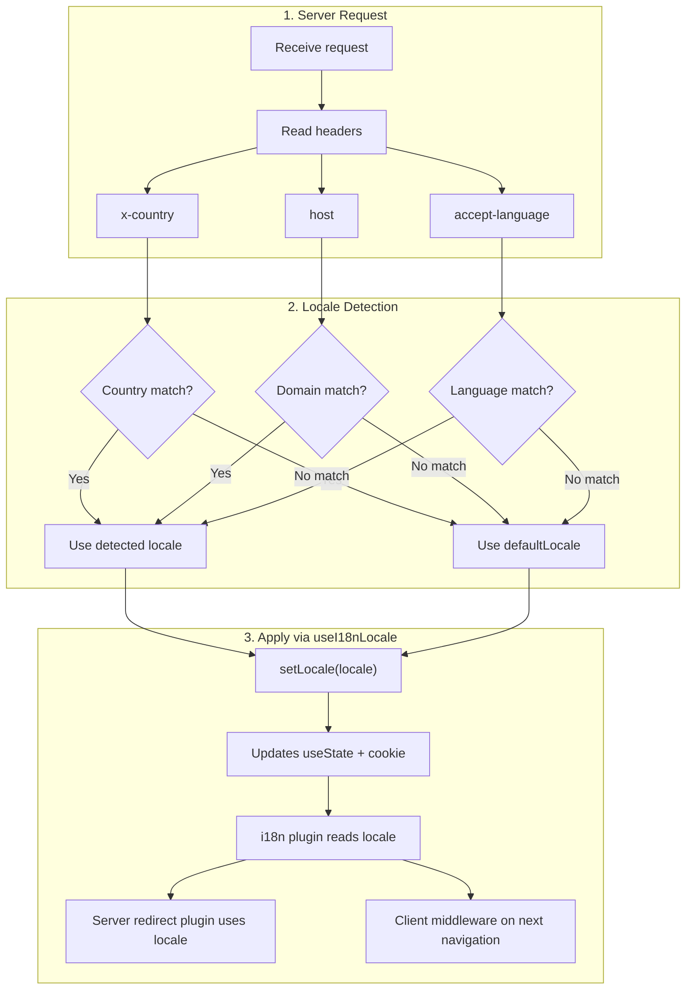

# 🔧 Deteksi Bahasa Kustom di Nuxt I18n Micro

## 📖 Ikhtisar

Nuxt I18n Micro v3 menyediakan composable terpusat — `useI18nLocale()` — untuk semua manajemen lokal. Ini menggantikan pola manual `useState`/`useCookie` dari v2. Dengan menggunakan `useI18nLocale().setLocale()` dalam plugin server, Anda dapat mengimplementasikan logika deteksi kustom apa pun sambil menjaga kompatibilitas penuh dengan sistem pengalihan dan cookie modul.

## 🏗️ Arsitektur

```mermaid
flowchart TB
    subgraph Plugins["Plugin Execution Order"]
        A["Your plugin<br/>order: -10"] -->|setLocale()| B["01.plugin.ts<br/>order: -5"]
        B --> C["06.redirect.ts server<br/>order: 10"]
    end

    subgraph Client["Client SPA Navigation"]
        D["i18n-redirect.global.ts<br/>route middleware"]
    end

    subgraph State["Locale State"]
        E["useState('i18n-locale')"]
        F["localeCookie"]
    end

    A -->|"setLocale() updates both"| E
    A -->|"setLocale() updates both"| F
    B -->|reads| E
    C -->|reads| E
    C -->|reads| F
    D -->|reads target route +| E
```

**Prinsip utama**: Panggil `useI18nLocale().setLocale()` di plugin server dengan `order: -10`. Ini memperbarui `useState('i18n-locale')` dan cookie lokal secara atomik, sehingga plugin i18n (`order: -5`) dan plugin pengalihan server (`order: 10`) melihat lokal yang benar pada permintaan SSR pertama. Auto-redirect sisi klien berjalan pada middleware rute global pada navigasi berikutnya.

## 🛠️ Menonaktifkan Auto-Detection Bawaan

Jika Anda ingin kendali penuh atas deteksi lokal, nonaktifkan mekanisme bawaan:

```ts
export default defineNuxtConfig({
  i18n: {
    autoDetectLanguage: false,
  },
})
```

## ✨ Contoh: Deteksi Sisi Server dengan `useI18nLocale`

Ini adalah **pendekatan yang direkomendasikan** untuk semua strategi.

### Langkah 1: Konfigurasi `nuxt.config.ts`

```ts
export default defineNuxtConfig({
  modules: ['nuxt-i18n-micro'],
  i18n: {
    strategy: 'no_prefix', // Works with ANY strategy
    defaultLocale: 'en',
    localeCookie: 'user-locale',
    autoDetectLanguage: false,
    locales: [
      { code: 'en', iso: 'en-US' },
      { code: 'de', iso: 'de-DE' },
      { code: 'ja', iso: 'ja-JP' },
    ],
  },
})
```

### Langkah 2: Buat `plugins/i18n-loader.server.ts`

```ts
import { defineNuxtPlugin, useRequestHeaders } from '#imports'

export default defineNuxtPlugin({
  name: 'i18n-custom-loader',
  enforce: 'pre',
  order: -10, // Execute BEFORE the i18n plugin (which has order -5)

  setup() {
    const { setLocale } = useI18nLocale()
    const headers = useRequestHeaders(['host', 'x-country', 'accept-language'])
    let detectedLocale = 'en'

    // --- YOUR DETECTION LOGIC ---

    // Example 1: By domain
    const host = headers['host']
    if (host?.includes('example.de')) {
      detectedLocale = 'de'
    }
    // Example 2: By custom header
    else if (headers['x-country'] === 'JP') {
      detectedLocale = 'ja'
    }
    // Example 3: By Accept-Language header
    else if (headers['accept-language']?.includes('de')) {
      detectedLocale = 'de'
    }

    // --- APPLY THE LOCALE ---
    setLocale(detectedLocale)
  },
})
```

### Cara Kerjanya



1. **Plugin berjalan lebih dulu** (`order: -10`) — mendeteksi lokal dari header, domain, atau sumber lainnya
2. **`setLocale()` memperbarui keduanya** `useState('i18n-locale')` dan cookie — memastikan visibilitas langsung ke semua plugin berikutnya
3. **Plugin i18n** (`order: -5`) membaca lokal dan memuat terjemahan yang benar
4. **Plugin pengalihan server** (`order: 10`) menggunakan lokal untuk keputusan pengalihan pada SSR
5. **Middleware rute klien** (`i18n-redirect`) menerapkan pengalihan pada navigasi SPA saat lokal URL tidak cocok dengan preferensi

## 🌐 Perilaku Spesifik Strategi

`useI18nLocale().setLocale()` bekerja dengan **semua strategi**. Perilaku pengalihan bergantung pada strateginya:

<Tip>
| Strategi | Efek `setLocale('de')` |
|----------|---------------------------|
| `no_prefix` | Merender dalam bahasa Jerman, tanpa perubahan URL |
| `prefix` | 302 → `/de/` (pengalihan sisi server) |
| `prefix_except_default` | 302 → `/de/` jika `de` ≠ default; tanpa pengalihan jika `de` = default |
| `prefix_and_default` | Tanpa pengalihan (baik `/` dan `/de/` valid) |
</Tip>

**Catatan penting:**

- Deteksi lokal berbasis cookie dinonaktifkan secara default (`localeCookie: null`)
- Setel `localeCookie: 'user-locale'` untuk mengaktifkan persistensi cookie
- Jika nilai cookie/state tidak ada dalam daftar `locales`, akan jatuh kembali ke `defaultLocale`

## 🏢 Lanjutan: Deteksi Berbasis Domain

Untuk pengaturan multi-domain di mana setiap domain menyajikan lokal yang berbeda:

```ts
import { defineNuxtPlugin, useRequestHeaders } from '#imports'

export default defineNuxtPlugin({
  name: 'i18n-domain-loader',
  enforce: 'pre',
  order: -10,

  setup() {
    const { setLocale } = useI18nLocale()
    const headers = useRequestHeaders(['host'])
    const host = headers['host'] || ''

    let detectedLocale = 'en'

    if (host.endsWith('.de') || host.includes('german.')) {
      detectedLocale = 'de'
    } else if (host.endsWith('.fr') || host.includes('french.')) {
      detectedLocale = 'fr'
    } else if (host.endsWith('.jp') || host.includes('japanese.')) {
      detectedLocale = 'ja'
    }

    setLocale(detectedLocale)
  },
})
```

## 🔄 Lanjutan: Menghormati Preferensi Pengguna

Jika pengguna dapat mengganti bahasa secara manual, hormati pilihan mereka daripada auto-detection:

```ts
import { defineNuxtPlugin, useRequestHeaders } from '#imports'

export default defineNuxtPlugin({
  name: 'i18n-smart-loader',
  enforce: 'pre',
  order: -10,

  setup() {
    const { getLocale, setLocale } = useI18nLocale()

    // If user already has a preference (from cookie), respect it
    if (getLocale()) {
      return
    }

    // Otherwise, detect locale from headers
    const headers = useRequestHeaders(['accept-language'])
    let detectedLocale = 'en'

    const acceptLanguage = headers['accept-language'] || ''
    if (acceptLanguage.includes('de')) {
      detectedLocale = 'de'
    } else if (acceptLanguage.includes('ja')) {
      detectedLocale = 'ja'
    }

    setLocale(detectedLocale)
  },
})
```

## ⚙️ Plugin Khusus Server atau Khusus Klien

Gunakan [konvensi nama file Nuxt](https://nuxt.com/docs/getting-started/directory-structure#plugins) untuk mengontrol di mana plugin Anda berjalan:

- **Khusus Server**: `i18n-loader.server.ts` — hanya berjalan selama SSR (direkomendasikan untuk deteksi berbasis header)
- **Khusus Klien**: `i18n-loader.client.ts` — hanya berjalan di peramban (untuk deteksi berbasis `localStorage` atau DOM)

<Tip>

</Tip>

## ✅ Ringkasan

| Fitur                                | Deskripsi                                                       |
| -------------------------------------- | ----------------------------------------------------------------- |
| `useI18nLocale().setLocale()`          | Memperbarui `useState` + cookie secara atomik; bekerja dengan semua strategi |
| `useI18nLocale().getLocale()`          | Mengembalikan lokal saat ini dari state atau cookie                       |
| `useI18nLocale().getPreferredLocale()` | Mengembalikan lokal yang disukai (divalidasi terhadap daftar `locales`)       |
| Plugin `order: -10`                    | Memastikan plugin Anda berjalan sebelum inisialisasi i18n               |
| `enforce: 'pre'`                       | Berjalan pada grup plugin "pre"                                    |

**JANGAN:**

- Gunakan `useCookie('user-locale')` secara langsung — `useI18nLocale()` mengelola cookie secara internal
- Gunakan `useState('i18n-locale')` secara langsung — gunakan `useI18nLocale().setLocale()` sebagai gantinya
- Setel `order` >= -5 — plugin Anda harus berjalan sebelum plugin i18n
