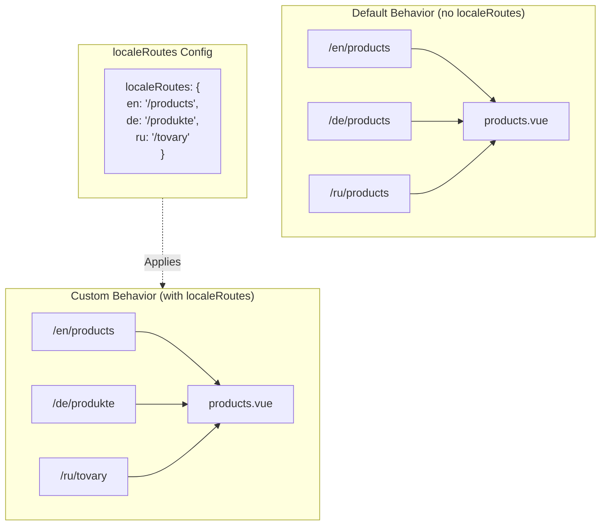

# 🔗 Rute Terlokalisasi Kustom dengan `localeRoutes` di `Nuxt I18n Micro`

## 📖 Pengenalan `localeRoutes`

Fitur `localeRoutes` di `Nuxt I18n Micro` memungkinkan Anda mendefinisikan rute kustom untuk lokal tertentu, menawarkan fleksibilitas dan kontrol atas struktur perutean aplikasi Anda. Fitur ini sangat berguna saat lokal tertentu memerlukan struktur URL yang berbeda, jalur yang disesuaikan, atau perlu mengikuti konvensi regional atau linguistik tertentu.

## 🚀 Kasus Penggunaan Utama `localeRoutes`

Kasus penggunaan utama untuk `localeRoutes` adalah menyediakan rute yang berbeda untuk lokal yang berbeda, meningkatkan pengalaman pengguna dengan memastikan URL intuitif dan relevan dengan audiens target. Misalnya, Anda mungkin memiliki jalur yang berbeda untuk versi bahasa Inggris dan Rusia dari sebuah halaman, di mana lokal Rusia mengikuti format URL yang terlokalisasi.

### 📄 Contoh: Mendefinisikan `localeRoutes` pada `$defineI18nRoute`

Berikut contoh bagaimana Anda dapat mendefinisikan rute kustom untuk lokal tertentu menggunakan `localeRoutes` pada fungsi `$defineI18nRoute` Anda:

```typescript
import { useNuxtApp } from '#imports'

const { $defineI18nRoute } = useNuxtApp()

$defineI18nRoute({
  localeRoutes: {
    ru: '/localesubpage', // Custom route path for the Russian locale
    de: '/lokaleseite', // Custom route path for the German locale
  },
})
```

> [!IMPORTANT]
> `$defineI18nRoute` bukan fungsi global. Dalam `script setup`, ambil dari `useNuxtApp()` terlebih dahulu, kemudian panggil.

### 🔄 Cara Kerja `localeRoutes`



- **Perilaku Default**: Tanpa `localeRoutes`, semua lokal menggunakan struktur rute umum yang didefinisikan oleh jalur utama.
- **Perilaku Kustom**: Dengan `localeRoutes`, lokal tertentu dapat memiliki rutenya sendiri, menimpa jalur default dengan rute khusus lokal yang didefinisikan pada konfigurasi.

## 🌱 Kasus Penggunaan `localeRoutes`

### 📄 Contoh: Menggunakan `localeRoutes` di Halaman

Berikut komponen Vue sederhana yang mendemonstrasikan penggunaan `$defineI18nRoute` dengan `localeRoutes`:

```vue
<template>
  <div>
    <!-- Display greeting message based on the current locale -->
    <p>{{ $t('greeting') }}</p>

    <!-- Navigation links -->
    <div>
      <NuxtLink :to="$localeRoute({ name: 'index' })"> Go to Index </NuxtLink>
      |
      <NuxtLink :to="$localeRoute({ name: 'about' })"> Go to About Page </NuxtLink>
    </div>
  </div>
</template>

<script setup>
import { useNuxtApp } from '#imports'

const { $getLocale, $switchLocale, $getLocales, $localeRoute, $t, $defineI18nRoute } = useNuxtApp()

// Define translations and custom routes for specific locales
$defineI18nRoute({
  localeRoutes: {
    ru: '/localesubpage', // Custom route path for Russian locale
  },
})
</script>
```

### 🛠️ Menggunakan `localeRoutes` dalam Konteks Berbeda

- **Halaman Landing**: Gunakan rute kustom untuk melokalkan URL halaman landing, memastikan URL selaras dengan kampanye pemasaran.
- **Situs Dokumentasi**: Sediakan rute yang berbeda untuk setiap lokal agar lebih cocok dengan struktur konten terlokalisasi.
- **Situs E-commerce**: Sesuaikan URL produk atau kategori per lokal untuk peningkatan SEO dan pengalaman pengguna.

## Menggunakan Navigasi dengan `localeRoutes`

Karena rute terlokalisasi tidak langsung cocok dengan nama file di direktori halaman, Anda perlu merujuk navigasi Anda melalui objek daripada nama.

```vue
<template>
  /**
   * Exemple page: /pages/about-us.vue
   * EN /about-us
   * ES /sobre-nosotros
   * FR /a-propos
   */

  // Using NuxtLink
  <NuxtLink :to="$localeRoute({ name: 'about-us' })">
    Go to About Page
  </NuxtLink>

  // Using I18nLink
  <I18nLink :to="{ name: 'about-us' }">
    Go to About Page
  </NuxtLink>

  // The string literal navigation wouldn't work for any locale but english
  <I18nLink to="/about-us">
    Go to About Page
  </NuxtLink>
</template>
```

### Penamaan Halaman Bersarang

Secara default, halaman Anda diberi nama berdasarkan nama file & jalurnya. Berikut arti dari hal tersebut:

- `/pages/about-us.vue` dapat diakses dengan `$localeRoute(\{ name: 'about-us' \})`
- `/pages/about-us/physical-stores.vue` dapat diakses dengan `$localeRoute(\{ name: 'about-us-physical-stores' \})`

Untuk menimpa perilaku ini, beri nama halaman Anda secara eksplisit dengan `definePageMeta`.

```vue
// /pages/about-us/physical-stores.vue
<script setup>
definePageMeta({
  name: 'our-stores'
})
```

Halaman ini sekarang dapat direferensikan dengan `$localeRoute` atau `I18nLink` menggunakan namanya `:to='\{ name: "our-stores" \}'`.

## 🎯 Rute Dinamis dengan Slug dan `$setI18nRouteParams`

Saat bekerja dengan rute dinamis yang berisi slug atau parameter, Anda dapat menggunakan `localeRoutes` dengan segmen dinamis dan `$setI18nRouteParams` untuk menyediakan slug khusus lokal untuk setiap lokal.

### Parameter Rute Dinamis pada `localeRoutes`

Anda dapat mendefinisikan rute dinamis menggunakan sintaks parameter rute Nuxt (`[...slug]` untuk rute catch-all, `[param]` untuk parameter tunggal, atau `:param()` untuk parameter bernama):

```vue
<script setup lang="ts">
import { useNuxtApp, useRoute, useFetch, createError } from '#imports'

const { $defineI18nRoute, $setI18nRouteParams } = useNuxtApp()

// Define custom routes with dynamic segments
$defineI18nRoute({
  localeRoutes: {
    en: '/our-products/[...slug]',
    es: '/nuestros-productos/[...slug]',
  },
})
</script>
```

### Menetapkan Parameter Rute Khusus Lokal

Fungsi `$setI18nRouteParams` memungkinkan Anda menyetel nilai parameter yang berbeda (seperti slug) untuk setiap lokal. Ini sangat berguna saat konten Anda memiliki URL khusus lokal.

**Penting**: `$setI18nRouteParams` sebaiknya dipanggil setelah mengambil data yang berisi slug khusus lokal, biasanya di dalam `useFetch` atau `useAsyncData`.

```vue
<script setup lang="ts">
import { useNuxtApp, useRoute, useFetch, createError } from '#imports'

interface Product {
  title: string
  price: string
  urlEn: string // English slug
  urlEs: string // Spanish slug
}

const { $defineI18nRoute, $setI18nRouteParams } = useNuxtApp()

const route = useRoute()
const slug = Array.isArray(route.params.slug) ? route.params.slug[0] : route.params.slug

// Fetch product data that includes locale-specific slugs
const { data: product, error } = await useFetch<Product>(`/api/product/${slug}`)
if (error.value)
  throw createError({
    statusCode: error.value?.statusCode,
    statusMessage: error.value?.statusMessage,
    fatal: true,
  })

// Define custom routes with dynamic segments
$defineI18nRoute({
  localeRoutes: {
    en: '/our-products/[...slug]',
    es: '/nuestros-productos/[...slug]',
  },
})

// Set different slugs for different locales
if (product.value) {
  $setI18nRouteParams({
    en: { slug: product.value.urlEn },
    es: { slug: product.value.urlEs },
  })
}
</script>
```

### Contoh Lengkap: Halaman Produk dengan Slug Khusus Lokal

Berikut contoh lengkap yang menunjukkan cara menggunakan `localeRoutes` dan `$setI18nRouteParams` bersama untuk halaman detail produk:

```vue
<template>
  <div v-if="product">
    <h1>{{ product.title }}</h1>
    <p>{{ $t('price') }}: {{ product.price }}</p>
    <div class="locale-switcher">
      <a :href="$switchLocalePath('en')">English</a>
      <a :href="$switchLocalePath('es')">Español</a>
    </div>
  </div>
</template>

<script setup lang="ts">
import { useNuxtApp, useRoute, useFetch, createError } from '#imports'

interface Product {
  title: string
  price: string
  urlEn: string
  urlEs: string
}

const { $t, $defineI18nRoute, $setI18nRouteParams, $switchLocalePath } = useNuxtApp()

// Set page name for easier navigation
definePageMeta({ name: 'product-slug' })

const route = useRoute()
const slug = Array.isArray(route.params.slug) ? route.params.slug[0] : route.params.slug

// Fetch product data
const { data: product, error } = await useFetch<Product>(`/api/product/${slug}`)
if (error.value)
  throw createError({
    statusCode: error.value?.statusCode,
    statusMessage: error.value?.statusMessage,
    fatal: true,
  })

// Define locale-specific routes with dynamic segments
$defineI18nRoute({
  localeRoutes: {
    en: '/our-products/[...slug]',
    es: '/nuestros-productos/[...slug]',
  },
})

// Set locale-specific slugs so $switchLocalePath works correctly
if (product.value) {
  $setI18nRouteParams({
    en: { slug: product.value.urlEn },
    es: { slug: product.value.urlEs },
  })
}
</script>
```

### Contoh: Halaman Daftar Produk

Saat menghubungkan ke rute dinamis dari halaman daftar, gunakan nama rute dengan parameter:

```vue
<template>
  <div>
    <h1>{{ $t('title') }}</h1>
    <ul>
      <li v-for="product in products?.[$getLocale()] || []" :key="product.id">
        <I18nLink :to="{ name: 'product-slug', params: { slug: product.url } }"> {{ product.title }} – {{ product.price }} </I18nLink>
      </li>
    </ul>
  </div>
</template>

<script setup lang="ts">
import { useNuxtApp, useFetch, createError } from '#imports'

interface Product {
  id: string
  title: string
  price: string
  url: string
}

type ProductsByLocale = Record<string, Product[]>

const { $t, $defineI18nRoute, $getLocale } = useNuxtApp()

const { data: products, error } = await useFetch<ProductsByLocale>('/api/product')
if (error.value)
  throw createError({
    statusCode: error.value?.statusCode,
    statusMessage: error.value?.statusMessage,
    fatal: true,
  })

$defineI18nRoute({
  locales: {
    en: {
      title: 'Our Product Range',
      description: 'Discover our collection of high-quality products.',
    },
    es: {
      title: 'Nuestra Gama de Productos',
      description: 'Descubra nuestra colección de productos de alta calidad.',
    },
  },
  localeRoutes: {
    en: '/our-products',
    es: '/nuestros-productos',
  },
})
</script>
```

### Cara Kerjanya

1. **Definisi Rute**: `localeRoutes` mendefinisikan struktur jalur dasar untuk setiap lokal, termasuk segmen dinamis seperti `[...slug]` atau `[id]`.

2. **Menetapkan Parameter**: `$setI18nRouteParams` menyetel nilai parameter aktual untuk setiap lokal. Saat pengguna beralih lokal menggunakan `$switchLocalePath`, modul menggunakan parameter ini untuk membangun URL yang benar.

3. **Format Parameter**: Objek parameter harus mengikuti struktur:

   ```typescript
   {
     [localeCode]: {
       [paramName]: paramValue
     }
   }
   ```

4. **Navigasi**: Gunakan `I18nLink` atau `$localeRoute` dengan nama rute dan parameter untuk bernavigasi antar versi terlokalisasi dari rute dinamis.

### Catatan Penting

- **Waktu**: `$setI18nRouteParams` sebaiknya dipanggil setelah mengambil data yang berisi slug khusus lokal, biasanya di dalam `useFetch` atau `useAsyncData`.

- **Nama Parameter**: Nama parameter di `$setI18nRouteParams` harus cocok dengan nama parameter rute (mis. `slug` untuk `[...slug]` atau `id` untuk `[id]`).

- **Nama Rute**: Saat menggunakan `definePageMeta(\{ name: 'route-name' \})`, gunakan nama ini saat menghubungkan ke rute dengan `I18nLink` atau `$localeRoute`.

- **Rute Catch-all**: Untuk rute catch-all (`[...slug]`), parameter slug harus berupa array atau string yang akan dikonversi menjadi array.

## 🧩 Rute programatik (`pages:extend`) — #244

Rute yang dibuat di `pages:extend` tidak memiliki tempat untuk `defineI18nRoute()`, dan beberapa rute sering berbagi satu wrapper SFC. Pemindaian berbasis file kemudian menggabungkannya ke satu entri.

**Jangan** letakkan jalur terlokalisasi pada `route.meta` (jalur tersebut akan terkirim di tabel rute klien). Simpan satu registri dan proyeksikan dua kali:

1. ke `pages:extend` (membuat rute Nuxt)
2. ke `i18n.globalLocaleRoutes` dengan kunci **nama** rute (bukan jalur file)

Gunakan `splitLocaleRoutes` dari `@i18n-micro/utils/split-locale-routes`:

```typescript
import { splitLocaleRoutes } from '@i18n-micro/utils/split-locale-routes'

const dynamic = splitLocaleRoutes([
  {
    name: 'products_tag',
    path: '/products/:tag',
    file: '~/pages/_dynamic.vue',
    paths: { fr: '/produits/:tag', de: '/produkte/:tag' },
  },
  {
    name: 'products_category',
    path: '/products/category/:category',
    file: '~/pages/_dynamic.vue',
    paths: { fr: '/produits/categorie/:category' },
  },
  // Disable localization for a programmatic route:
  // { name: 'internal', path: '/internal', file: '~/pages/_dynamic.vue', paths: false },
])

export default defineNuxtConfig({
  hooks: {
    'pages:extend'(pages) {
      pages.push(...dynamic.pages)
    },
  },
  i18n: {
    globalLocaleRoutes: dynamic.globalLocaleRoutes,
  },
})
```

Kedua bagian tetap sinkron; wrapper bersama tidak lagi saling menimpa. `globalLocaleRoutes` saja tidak cukup — ia hanya menyesuaikan jalur untuk rute yang sudah ada dalam tabel halaman Nuxt.

## 📝 Praktik Terbaik dalam Menggunakan `localeRoutes`

- **🚀 Gunakan untuk Lokal yang Relevan**: Terapkan `localeRoutes` terutama saat struktur URL secara signifikan memengaruhi pengalaman pengguna atau SEO. Hindari penggunaan berlebihan untuk perbedaan kecil.
- **🔧 Jaga Konsistensi**: Pertahankan pola perutean yang konsisten di seluruh lokal kecuali ada alasan kuat untuk berbeda. Pendekatan ini membantu menjaga kejelasan dan mengurangi kompleksitas.
- **📚 Dokumentasikan Rute Kustom**: Dokumentasikan dengan jelas setiap rute kustom yang Anda definisikan dengan `localeRoutes`, terutama pada aplikasi modular, untuk memastikan anggota tim memahami logika perutean.
