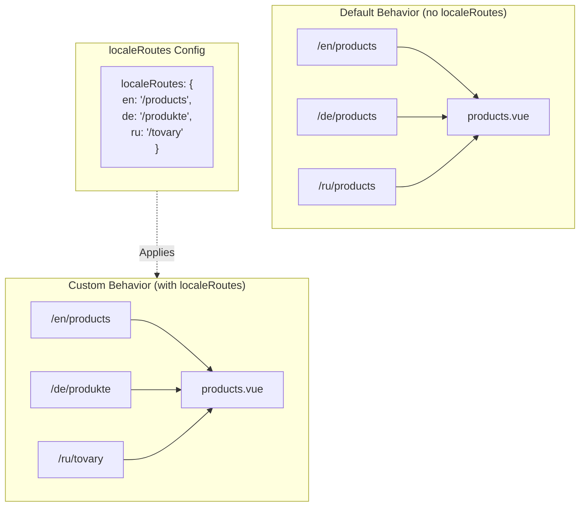

# 🔗 Custom Localized Routes dengan `localeRoutes` in `Nuxt I18n Micro`

## 📖 Pengantar to `localeRoutes`

The `localeRoutes` feature in `Nuxt I18n Micro` memungkinkan Anda define custom routes untuk specific locales, offering flexibility dan control over the routing structure of your application. This feature is particularly useful when certain locales require different URL structures, tailored paths, atau need to follow specific regional atau linguistic conventions.

## 🚀 Primary Use Case of `localeRoutes`

The primary use case untuk `localeRoutes` is to provide distinct routes untuk different locales, enhancing the user experience by ensuring URLs are intuitive dan relevant ke target audience. Sebagai contoh, you might have different paths untuk English dan Russian versions of a page, where the Russian locale follows a localized URL format.

### 📄 Example: Defining `localeRoutes` in `$defineI18nRoute`

Here’s an example of how you might define custom routes untuk specific locales using `localeRoutes` in your `$defineI18nRoute` function:

```typescript
import { useNuxtApp } from '#imports'

const { $defineI18nRoute } = useNuxtApp()

$defineI18nRoute({
  localeRoutes: {
    ru: '/localesubpage', // Custom route path for the Russian locale
    de: '/lokaleseite', // Custom route path for the German locale
  },
})
```

> [!IMPORTANT]
> `$defineI18nRoute` is not a global function. In `script setup`, get it dari `useNuxtApp()` first, then call it.

### 🔄 How `localeRoutes` Work



- **Default Behavior**: Without `localeRoutes`, all locales use a common route structure defined oleh primary path.
- **Custom Behavior**: With `localeRoutes`, specific locales can have their own routes, overriding the default path dengan locale-specific routes defined di configuration.

## 🌱 Use Cases untuk `localeRoutes`

### 📄 Example: Using `localeRoutes` in a Page

Here’s a simple Vue component demonstrating the use of `$defineI18nRoute` dengan `localeRoutes`:

```vue
<template>
  <div>
    <!-- Display greeting message based on the current locale -->
    <p>{{ $t('greeting') }}</p>

    <!-- Navigation links -->
    <div>
      <NuxtLink :to="$localeRoute({ name: 'index' })"> Go to Index </NuxtLink>
      |
      <NuxtLink :to="$localeRoute({ name: 'about' })"> Go to About Page </NuxtLink>
    </div>
  </div>
</template>

<script setup>
import { useNuxtApp } from '#imports'

const { $getLocale, $switchLocale, $getLocales, $localeRoute, $t, $defineI18nRoute } = useNuxtApp()

// Define translations and custom routes for specific locales
$defineI18nRoute({
  localeRoutes: {
    ru: '/localesubpage', // Custom route path for Russian locale
  },
})
</script>
```

### 🛠️ Using `localeRoutes` in Different Contexts

- **Landing Pages**: Use custom routes to localize URLs untuk landing pages, ensuring they align dengan marketing campaigns.
- **Documentation Sites**: Provide distinct routes untuk each locale to better match the localized content structure.
- **E-commerce Sites**: Tailor product atau category URLs per locale untuk improved SEO dan user experience.

## Using Navigation dengan `localeRoutes`

As localised routes don't directly match filenames di page directory, you need to reference your navigation by object rather than by name.

```vue
<template>
  /**
   * Exemple page: /pages/about-us.vue
   * EN /about-us
   * ES /sobre-nosotros
   * FR /a-propos
   */

  // Using NuxtLink
  <NuxtLink :to="$localeRoute({ name: 'about-us' })">
    Go to About Page
  </NuxtLink>

  // Using I18nLink
  <I18nLink :to="{ name: 'about-us' }">
    Go to About Page
  </NuxtLink>

  // The string literal navigation wouldn't work for any locale but english
  <I18nLink to="/about-us">
    Go to About Page
  </NuxtLink>
</template>
```

### Nested Page Naming

Secara default, your pages are named based on their file & path name. Here's what it means:

- `/pages/about-us.vue` dapat accessed dengan `$localeRoute(\{ name: 'about-us' \})`
- `/pages/about-us/physical-stores.vue` dapat accessed dengan `$localeRoute(\{ name: 'about-us-physical-stores' \})`

To override this behaviour, explicitly name your page dengan `definePageMeta`.

```vue
// /pages/about-us/physical-stores.vue
<script setup>
definePageMeta({
  name: 'our-stores'
})
```

Halaman ini can now be referenced dengan either `$localeRoute` atau `I18nLink` by its name `:to='\{ name: "our-stores" \}'`.

## 🎯 Dynamic Routes dengan Slugs dan `$setI18nRouteParams`

When working dengan dynamic routes that contain slugs atau parameters, you can use `localeRoutes` dengan dynamic segments dan `$setI18nRouteParams` to provide locale-specific slugs untuk each locale.

### Dynamic Route Parameters in `localeRoutes`

Anda dapat define dynamic routes using Nuxt's route parameter syntax (`[...slug]` untuk catch-all routes, `[param]` untuk single parameters, atau `:param()` untuk named parameters):

```vue
<script setup lang="ts">
import { useNuxtApp, useRoute, useFetch, createError } from '#imports'

const { $defineI18nRoute, $setI18nRouteParams } = useNuxtApp()

// Define custom routes with dynamic segments
$defineI18nRoute({
  localeRoutes: {
    en: '/our-products/[...slug]',
    es: '/nuestros-productos/[...slug]',
  },
})
</script>
```

### Setting Locale-Specific Route Parameters

The `$setI18nRouteParams` function memungkinkan Anda set different parameter values (like slugs) untuk each locale. This is especially useful when your content has locale-specific URLs.

**Penting**: `$setI18nRouteParams` harus dipanggil after fetching data that contains locale-specific slugs, typically inside `useFetch` atau `useAsyncData`.

```vue
<script setup lang="ts">
import { useNuxtApp, useRoute, useFetch, createError } from '#imports'

interface Product {
  title: string
  price: string
  urlEn: string // English slug
  urlEs: string // Spanish slug
}

const { $defineI18nRoute, $setI18nRouteParams } = useNuxtApp()

const route = useRoute()
const slug = Array.isArray(route.params.slug) ? route.params.slug[0] : route.params.slug

// Fetch product data that includes locale-specific slugs
const { data: product, error } = await useFetch<Product>(`/api/product/${slug}`)
if (error.value)
  throw createError({
    statusCode: error.value?.statusCode,
    statusMessage: error.value?.statusMessage,
    fatal: true,
  })

// Define custom routes with dynamic segments
$defineI18nRoute({
  localeRoutes: {
    en: '/our-products/[...slug]',
    es: '/nuestros-productos/[...slug]',
  },
})

// Set different slugs for different locales
if (product.value) {
  $setI18nRouteParams({
    en: { slug: product.value.urlEn },
    es: { slug: product.value.urlEs },
  })
}
</script>
```

### Complete Example: Product Pages dengan Locale-Specific Slugs

Berikut complete example showing how to use `localeRoutes` dan `$setI18nRouteParams` together untuk a product detail page:

```vue
<template>
  <div v-if="product">
    <h1>{{ product.title }}</h1>
    <p>{{ $t('price') }}: {{ product.price }}</p>
    <div class="locale-switcher">
      <a :href="$switchLocalePath('en')">English</a>
      <a :href="$switchLocalePath('es')">Español</a>
    </div>
  </div>
</template>

<script setup lang="ts">
import { useNuxtApp, useRoute, useFetch, createError } from '#imports'

interface Product {
  title: string
  price: string
  urlEn: string
  urlEs: string
}

const { $t, $defineI18nRoute, $setI18nRouteParams, $switchLocalePath } = useNuxtApp()

// Set page name for easier navigation
definePageMeta({ name: 'product-slug' })

const route = useRoute()
const slug = Array.isArray(route.params.slug) ? route.params.slug[0] : route.params.slug

// Fetch product data
const { data: product, error } = await useFetch<Product>(`/api/product/${slug}`)
if (error.value)
  throw createError({
    statusCode: error.value?.statusCode,
    statusMessage: error.value?.statusMessage,
    fatal: true,
  })

// Define locale-specific routes with dynamic segments
$defineI18nRoute({
  localeRoutes: {
    en: '/our-products/[...slug]',
    es: '/nuestros-productos/[...slug]',
  },
})

// Set locale-specific slugs so $switchLocalePath works correctly
if (product.value) {
  $setI18nRouteParams({
    en: { slug: product.value.urlEn },
    es: { slug: product.value.urlEs },
  })
}
</script>
```

### Contoh: Product List Page

When linking to dynamic routes dari a list page, use the route name dengan parameters:

```vue
<template>
  <div>
    <h1>{{ $t('title') }}</h1>
    <ul>
      <li v-for="product in products?.[$getLocale()] || []" :key="product.id">
        <I18nLink :to="{ name: 'product-slug', params: { slug: product.url } }"> {{ product.title }} – {{ product.price }} </I18nLink>
      </li>
    </ul>
  </div>
</template>

<script setup lang="ts">
import { useNuxtApp, useFetch, createError } from '#imports'

interface Product {
  id: string
  title: string
  price: string
  url: string
}

type ProductsByLocale = Record<string, Product[]>

const { $t, $defineI18nRoute, $getLocale } = useNuxtApp()

const { data: products, error } = await useFetch<ProductsByLocale>('/api/product')
if (error.value)
  throw createError({
    statusCode: error.value?.statusCode,
    statusMessage: error.value?.statusMessage,
    fatal: true,
  })

$defineI18nRoute({
  locales: {
    en: {
      title: 'Our Product Range',
      description: 'Discover our collection of high-quality products.',
    },
    es: {
      title: 'Nuestra Gama de Productos',
      description: 'Descubra nuestra colección de productos de alta calidad.',
    },
  },
  localeRoutes: {
    en: '/our-products',
    es: '/nuestros-productos',
  },
})
</script>
```

### How It Works

1. **Route Definition**: `localeRoutes` defines the base path structure untuk each locale, including dynamic segments like `[...slug]` atau `[id]`.

2. **Parameter Setting**: `$setI18nRouteParams` sets the actual parameter values untuk each locale. Saat sebuah user switches locales using `$switchLocalePath`, the module uses these parameters to construct the correct URL.

3. **Parameter Format**: The parameter object should match the structure:

   ```typescript
   {
     [localeCode]: {
       [paramName]: paramValue
     }
   }
   ```

4. **Navigation**: Use `I18nLink` atau `$localeRoute` dengan the route name dan parameters to navigate between localized versions of dynamic routes.

### Important Notes

- **Timing**: `$setI18nRouteParams` harus dipanggil after fetching data that contains locale-specific slugs, typically inside `useFetch` atau `useAsyncData`.

- **Parameter Names**: The parameter names in `$setI18nRouteParams` must match the route parameter names (e.g., `slug` untuk `[...slug]` atau `id` untuk `[id]`).

- **Route Names**: Saat menggunakan `definePageMeta(\{ name: 'route-name' \})`, use this name when linking ke route dengan `I18nLink` atau `$localeRoute`.

- **Catch-all Routes**: For catch-all routes (`[...slug]`), the slug parameter harus an array atau a string that akan converted to an array.

## 🧩 Programmatic routes (`pages:extend`) — #244

Routes created in `pages:extend` have no place untuk `defineI18nRoute()`, dan several routes often share one wrapper SFC. File-keyed scanning then collapses them onto a single entry.

Do **not** put localized paths in `route.meta` (they would ship di client route table). Keep one registry dan project it twice:

1. into `pages:extend` (membuat the Nuxt routes)
2. into `i18n.globalLocaleRoutes` keyed by route **name** (not file path)

Use `splitLocaleRoutes` dari `@i18n-micro/utils/split-locale-routes`:

```typescript
import { splitLocaleRoutes } from '@i18n-micro/utils/split-locale-routes'

const dynamic = splitLocaleRoutes([
  {
    name: 'products_tag',
    path: '/products/:tag',
    file: '~/pages/_dynamic.vue',
    paths: { fr: '/produits/:tag', de: '/produkte/:tag' },
  },
  {
    name: 'products_category',
    path: '/products/category/:category',
    file: '~/pages/_dynamic.vue',
    paths: { fr: '/produits/categorie/:category' },
  },
  // Disable localization for a programmatic route:
  // { name: 'internal', path: '/internal', file: '~/pages/_dynamic.vue', paths: false },
])

export default defineNuxtConfig({
  hooks: {
    'pages:extend'(pages) {
      pages.push(...dynamic.pages)
    },
  },
  i18n: {
    globalLocaleRoutes: dynamic.globalLocaleRoutes,
  },
})
```

Both halves stay in sync; shared wrappers no longer overwrite each other. `globalLocaleRoutes` alone is not enough — it only customizes paths untuk routes that already exist di Nuxt page table.

## 📝 Best Practices untuk Using `localeRoutes`

- **🚀 Use untuk Relevant Locales**: Apply `localeRoutes` primarily where the URL structure significantly impacts the user experience atau SEO. Avoid overuse untuk minor differences.
- **🔧 Maintain Consistency**: Keep a consistent routing pattern across locales unless there's a strong reason to deviate. Thadalahpproach helps in maintaining clarity dan reducing complexity.
- **📚 Document Custom Routes**: Clearly document any custom routes you define dengan `localeRoutes`, especially in modular applications, to ensure team members understand the routing logic.
