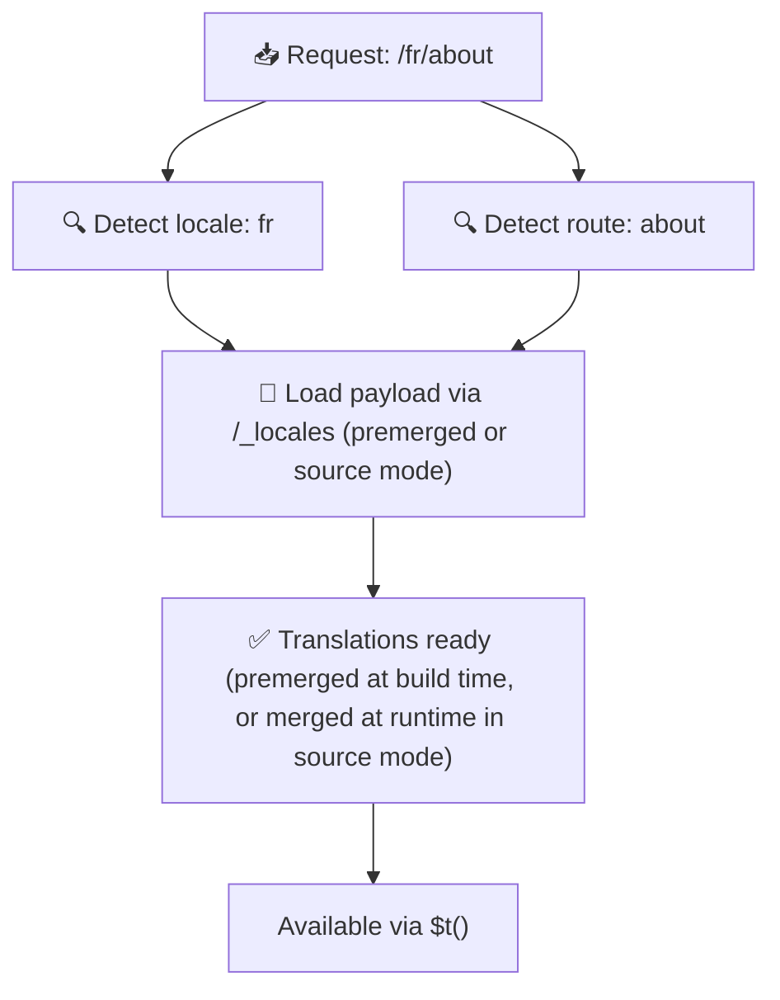

# 📂 Folder Structure Guide

## 📖 Pengantar

Organizing your translation files effectively is essential untuk maintaining a scalable dan efficient internationalization (i18n) system. `Nuxt I18n Micro` simplifies this process by offering a clear approach to managing root-level dan page-specific translations. Panduan ini will walk you through the recommended folder structure dan explain how `Nuxt I18n Micro` menangani these translations.

## 🗂️ Recommended Folder Structure

`Nuxt I18n Micro` organizes translations into root-level files dan page-specific files within the `pages` directory. With `translationPayloads.mode: 'premerged'` (default), root-level translations are automatically merged into every page file at build time, so each page has a complete set of translations tanpa runtime merging overhead.

With `mode: 'source'`, source files stay separate in Nitro assets dan are merged at runtime via the `/_locales` route. See [Serverless Payload Output](/guides/performance#serverless-payload-output).

### 🔧 Basic Structure

Here’s a basic example of the folder structure you should follow:

```text
locales/
├── pages/
│   ├── index/
│   │   ├── en.json
│   │   ├── fr.json
│   │   └── ar.json
│   ├── about/
│   │   ├── en.json
│   │   ├── fr.json
│   │   └── ar.json
├── en.json
├── fr.json
└── ar.json

```

### 📄 Penjelasan of Structure

#### 1. 🌍 Root-Level Translation Files

- **Path:** `/locales/\{locale\}.json` (e.g., `/locales/en.json`)
- **Tujuan:** These files contain translations shared across the entire application (navigation menus, headers, footers, etc.). With `mode: 'premerged'` (default), they are automatically merged into every page-specific file at build time, so the server mengembalikan a single pre-built file per page.

  **Example Content (`/locales/en.json`):**

  ```json
  {
    "menu": {
      "home": "Home",
      "about": "About Us",
      "contact": "Contact"
    },
    "footer": {
      "copyright": "© 2024 Your Company"
    }
  }
  ```

#### 2. 📄 Page-Specific Translation Files

- **Path:** `/locales/pages/\{routeName\}/\{locale\}.json` (e.g., `/locales/pages/index/en.json`)
- **Tujuan:** These files contain translations specific to individual pages. With `mode: 'premerged'` (default), root-level translations are merged in as a base at build time, so each page file becomes self-contained.

  **Example Content (`/locales/pages/index/en.json`):**

  ```json
  {
    "title": "Welcome to Our Website",
    "description": "We offer a wide range of products and services to meet your needs."
  }
  ```

  **Example Content (`/locales/pages/about/en.json`):**

  ```json
  {
    "title": "About Us",
    "description": "Pelajari lebih lanjut tentang our mission, vision, and values."
  }
  ```

### 📂 Handling Dynamic Routes dan Nested Paths

`Nuxt I18n Micro` automatically transforms dynamic segments dan nested paths in routes into a flat folder structure using a specific renaming convention. Ini memastikan that all translations are stored in a consistent dan easily accessible manner.

#### Dynamic Route Translation Folder Structure

When dealing dengan dynamic routes, such as `/products/[id]`, the module converts the dynamic segment `[id]` into a static format within the file structure.

**Example Folder Structure untuk Dynamic Routes:**

For a route like `/products/[id]`, the translation files would be stored in a folder named `products-id`:

```text
locales/pages/
├── products-id/
│   ├── en.json
│   ├── fr.json
│   └── ar.json

```

**Example Folder Structure untuk Nested Dynamic Routes:**

For a nested route like `/products/key/[id]`, the translation files would be stored in a folder named `products-key-id`:

```text
locales/pages/
├── products-key-id/
│   ├── en.json
│   ├── fr.json
│   └── ar.json

```

**Example Folder Structure untuk Multi-Level Nested Routes:**

For a more complex nested route like `/products/category/[id]/details`, the translation files would be stored in a folder named `products-category-id-details`:

```text
locales/pages/
├── products-category-id-details/
│   ├── en.json
│   ├── fr.json
│   └── ar.json

```

### 🛠 Customizing the Directory Structure

If you prefer to store translations in a different directory, `Nuxt I18n Micro` memungkinkan Anda customize the directory where translation files are stored. Anda dapat configure this in your `nuxt.config.ts` file.

**Example: Customizing the Translation Directory**

```typescript
export default defineNuxtConfig({
  i18n: {
    translationDir: 'i18n', // Custom directory path
  },
})
```

Ini akan instruct `Nuxt I18n Micro` to look untuk translation files di `/i18n` directory instead of the default `/locales` directory.

## ⚙️ How Translations are Loaded

### 🌍 Dynamic Locale Routes

`Nuxt I18n Micro` uses dynamic locale routes to load translations efficiently. Saat sebuah user visits a page, the module determines the appropriate locale dan loads the corresponding translation files based on the current route dan locale.



Sebagai contoh:

- Visiting `/en/index` will load translations dari `/locales/pages/index/en.json`.
- Visiting `/fr/about` will load translations dari `/locales/pages/about/fr.json`.

This method ensures that only the necessary translations are loaded, optimizing both server load dan client-side performance.

### 💾 Caching dan Pre-rendering

To further enhance performance, `Nuxt I18n Micro` mendukung caching dan pre-rendering of translation files:

- **Caching**: Once a translation file is loaded, it’s cached untuk subsequent requests, reducing the need to repeatedly fetch the same data.
- **Pre-rendering**: During the build process, you can pre-render translation files untuk all configured locales dan routes, allowing them to be served directly dari the server tanpa runtime delays.

## 📝 Best Practices

### 📂 Use Page-Specific Files Wisely

Leverage page-specific files to keep translations organized. This keeps each page’s translations lean dan fast to load, which is especially important untuk pages dengan complex atau large content.

### 🔑 Keep Translation Keys Consistent

Use consistent naming conventions untuk your translation keys across files. Ini membantu maintain clarity dan prevents issues when managing translations, especially as your application grows.

### 🗂️ Organize Translations by Context

Group related translations together within your files. Sebagai contoh, group all button labels under a `buttons` key dan all form-related texts under a `forms` key. This not only improves readability tetapi also makes it easier to manage translations across different locales.

### ⚠️ Nesting Depth Limit (2 Levels Recommended)

During client-side navigation, `Nuxt I18n Micro` uses an optimized 2-level deep merge to combine translations dari the leaving dan entering pages. Ini memastikan that overlapping nested keys (e.g., both pages have keys under `common.*`) are preserved during transition animations.

**This works correctly untuk the standard `Section → Key → Value` structure (2 levels):**

```json
// Page A translations
{ "common": { "fromA": "Text A" } }

// Page B translations
{ "common": { "fromB": "Text B" } }

// During transition, both are available:
// { "common": { "fromA": "Text A", "fromB": "Text B" } }
```

**However, if you use 3+ levels of nesting, deeper keys dapat overwritten during transitions:**

```json
// Page A translations
{ "auth": { "form": { "login": "Login" } } }

// Page B translations
{ "auth": { "form": { "register": "Register" } } }

// During transition: "login" key is lost
// { "auth": { "form": { "register": "Register" } } }
```


### 🧹 Regularly Clean Up Unused Translations

Over time, your application might accumulate unused translation keys, especially if features are removed atau restructured. Periodically review dan clean up your translation files to keep them lean dan maintainable.
