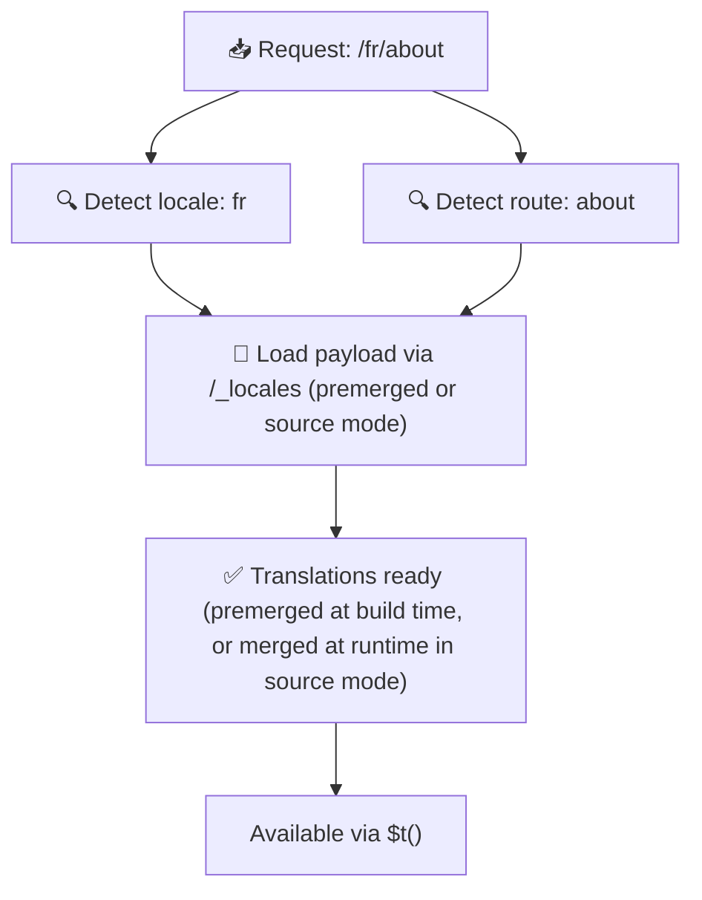

# 📂 Panduan Struktur Folder

## 📖 Pendahuluan

Mengorganisir file terjemahan Anda secara efektif sangat penting untuk mempertahankan sistem internasionalisasi (i18n) yang skalabel dan efisien. `Nuxt I18n Micro` menyederhanakan proses ini dengan menawarkan pendekatan yang jelas untuk mengelola terjemahan tingkat root dan per halaman. Panduan ini akan memandu Anda melalui struktur folder yang direkomendasikan dan menjelaskan cara `Nuxt I18n Micro` menangani terjemahan tersebut.

## 🗂️ Struktur Folder yang Direkomendasikan

`Nuxt I18n Micro` mengorganisir terjemahan menjadi file tingkat root dan file per halaman di dalam direktori `pages`. Dengan `translationPayloads.mode: 'premerged'` (default), terjemahan tingkat root otomatis digabungkan ke setiap file halaman saat build, sehingga setiap halaman memiliki set terjemahan yang lengkap tanpa overhead penggabungan pada runtime.

Dengan `mode: 'source'`, file sumber tetap terpisah di aset Nitro dan digabungkan pada runtime melalui rute `/_locales`. Lihat [Serverless Payload Output](/guides/performance#serverless-payload-output).

### 🔧 Struktur Dasar

Berikut contoh dasar struktur folder yang harus Anda ikuti:

```text
locales/
├── pages/
│   ├── index/
│   │   ├── en.json
│   │   ├── fr.json
│   │   └── ar.json
│   ├── about/
│   │   ├── en.json
│   │   ├── fr.json
│   │   └── ar.json
├── en.json
├── fr.json
└── ar.json

```

### 📄 Penjelasan Struktur

#### 1. 🌍 File Terjemahan Tingkat Root

- **Jalur:** `/locales/\{locale\}.json` (mis. `/locales/en.json`)
- **Tujuan:** File-file ini berisi terjemahan yang digunakan bersama di seluruh aplikasi (menu navigasi, header, footer, dll.). Dengan `mode: 'premerged'` (default), file ini secara otomatis digabungkan ke setiap file per halaman saat build, sehingga server mengembalikan satu file yang telah di-build untuk setiap halaman.

  **Contoh Konten (`/locales/en.json`):**

  ```json
  {
    "menu": {
      "home": "Home",
      "about": "About Us",
      "contact": "Contact"
    },
    "footer": {
      "copyright": "© 2024 Your Company"
    }
  }
  ```

#### 2. 📄 File Terjemahan Per Halaman

- **Jalur:** `/locales/pages/\{routeName\}/\{locale\}.json` (mis. `/locales/pages/index/en.json`)
- **Tujuan:** File-file ini berisi terjemahan spesifik untuk halaman individu. Dengan `mode: 'premerged'` (default), terjemahan tingkat root digabungkan sebagai basis saat build, sehingga setiap file halaman menjadi mandiri.

  **Contoh Konten (`/locales/pages/index/en.json`):**

  ```json
  {
    "title": "Welcome to Our Website",
    "description": "We offer a wide range of products and services to meet your needs."
  }
  ```

  **Contoh Konten (`/locales/pages/about/en.json`):**

  ```json
  {
    "title": "About Us",
    "description": "Learn more about our mission, vision, and values."
  }
  ```

### 📂 Menangani Rute Dinamis dan Jalur Bersarang

`Nuxt I18n Micro` otomatis mengubah segmen dinamis dan jalur bersarang di rute menjadi struktur folder yang datar menggunakan konvensi penamaan tertentu. Ini memastikan semua terjemahan disimpan secara konsisten dan mudah diakses.

#### Struktur Folder Terjemahan untuk Rute Dinamis

Saat menangani rute dinamis, seperti `/products/[id]`, modul mengonversi segmen dinamis `[id]` menjadi format statis pada struktur file.

**Contoh Struktur Folder untuk Rute Dinamis:**

Untuk rute seperti `/products/[id]`, file terjemahan akan disimpan di folder bernama `products-id`:

```text
locales/pages/
├── products-id/
│   ├── en.json
│   ├── fr.json
│   └── ar.json

```

**Contoh Struktur Folder untuk Rute Dinamis Bersarang:**

Untuk rute bersarang seperti `/products/key/[id]`, file terjemahan akan disimpan di folder bernama `products-key-id`:

```text
locales/pages/
├── products-key-id/
│   ├── en.json
│   ├── fr.json
│   └── ar.json

```

**Contoh Struktur Folder untuk Rute Bersarang Multi-Level:**

Untuk rute bersarang yang lebih kompleks seperti `/products/category/[id]/details`, file terjemahan akan disimpan di folder bernama `products-category-id-details`:

```text
locales/pages/
├── products-category-id-details/
│   ├── en.json
│   ├── fr.json
│   └── ar.json

```

### 🛠 Menyesuaikan Struktur Direktori

Jika Anda lebih memilih menyimpan terjemahan di direktori yang berbeda, `Nuxt I18n Micro` memungkinkan Anda menyesuaikan direktori tempat file terjemahan disimpan. Anda dapat mengonfigurasinya di file `nuxt.config.ts`.

**Contoh: Menyesuaikan Direktori Terjemahan**

```typescript
export default defineNuxtConfig({
  i18n: {
    translationDir: 'i18n', // Custom directory path
  },
})
```

Ini akan menginstruksikan `Nuxt I18n Micro` mencari file terjemahan di direktori `/i18n` alih-alih direktori default `/locales`.

## ⚙️ Bagaimana Terjemahan Dimuat

### 🌍 Rute Lokal Dinamis

`Nuxt I18n Micro` menggunakan rute lokal dinamis untuk memuat terjemahan secara efisien. Saat pengguna mengunjungi halaman, modul menentukan lokal yang sesuai dan memuat file terjemahan yang terkait berdasarkan rute dan lokal saat ini.



Contohnya:

- Mengunjungi `/en/index` akan memuat terjemahan dari `/locales/pages/index/en.json`.
- Mengunjungi `/fr/about` akan memuat terjemahan dari `/locales/pages/about/fr.json`.

Metode ini memastikan hanya terjemahan yang diperlukan yang dimuat, mengoptimalkan beban server maupun performa sisi klien.

### 💾 Caching dan Pre-rendering

Untuk meningkatkan performa lebih lanjut, `Nuxt I18n Micro` mendukung caching dan pre-rendering file terjemahan:

- **Caching**: Setelah file terjemahan dimuat, file tersebut di-cache untuk permintaan berikutnya, mengurangi kebutuhan untuk mengambil data yang sama berulang kali.
- **Pre-rendering**: Selama proses build, Anda dapat me-render terlebih dahulu file terjemahan untuk semua lokal dan rute yang dikonfigurasi, memungkinkan file tersebut disajikan langsung dari server tanpa penundaan runtime.

## 📝 Praktik Terbaik

### 📂 Gunakan File Per Halaman dengan Bijak

Manfaatkan file per halaman untuk menjaga terjemahan tetap terorganisir. Ini menjaga terjemahan setiap halaman tetap ramping dan cepat dimuat, yang sangat penting untuk halaman dengan konten kompleks atau besar.

### 🔑 Jaga Kunci Terjemahan Tetap Konsisten

Gunakan konvensi penamaan yang konsisten untuk kunci terjemahan Anda di semua file. Ini membantu menjaga kejelasan dan mencegah masalah saat mengelola terjemahan, terutama saat aplikasi Anda berkembang.

### 🗂️ Organisir Terjemahan Berdasarkan Konteks

Kelompokkan terjemahan terkait dalam file Anda. Misalnya, kelompokkan semua label tombol di bawah kunci `buttons` dan semua teks yang berhubungan dengan formulir di bawah kunci `forms`. Ini tidak hanya meningkatkan keterbacaan tetapi juga mempermudah pengelolaan terjemahan di berbagai lokal.

### ⚠️ Batas Kedalaman Nesting (Direkomendasikan 2 Level)

Selama navigasi sisi klien, `Nuxt I18n Micro` menggunakan deep merge yang dioptimalkan 2 level untuk menggabungkan terjemahan dari halaman yang ditinggalkan dan halaman yang dituju. Ini memastikan bahwa kunci bersarang yang tumpang tindih (mis. kedua halaman memiliki kunci di bawah `common.*`) dipertahankan selama animasi transisi.

**Ini berfungsi dengan benar untuk struktur standar `Section → Key → Value` (2 level):**

```json
// Page A translations
{ "common": { "fromA": "Text A" } }

// Page B translations
{ "common": { "fromB": "Text B" } }

// During transition, both are available:
// { "common": { "fromA": "Text A", "fromB": "Text B" } }
```

**Namun, jika Anda menggunakan 3+ level nesting, kunci yang lebih dalam mungkin ditimpa selama transisi:**

```json
// Page A translations
{ "auth": { "form": { "login": "Login" } } }

// Page B translations
{ "auth": { "form": { "register": "Register" } } }

// During transition: "login" key is lost
// { "auth": { "form": { "register": "Register" } } }
```

<Tip>

</Tip>

### 🧹 Bersihkan Terjemahan yang Tidak Digunakan Secara Rutin

Seiring waktu, aplikasi Anda mungkin mengumpulkan kunci terjemahan yang tidak digunakan, terutama jika fitur dihapus atau direstrukturisasi. Tinjau dan bersihkan file terjemahan Anda secara berkala agar tetap ramping dan mudah dipelihara.
