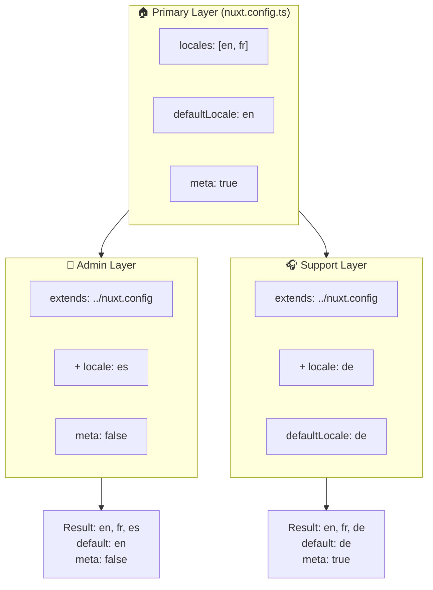

# 🗂️ Layer di `Nuxt I18n Micro`

## 📖 Pengenalan Layer

Layer di `Nuxt I18n Micro` memungkinkan Anda mengelola dan menyesuaikan pengaturan lokalisasi secara fleksibel di berbagai bagian aplikasi Anda. Dengan mendefinisikan layer yang berbeda, Anda dapat menyesuaikan konfigurasi untuk berbagai konteks, seperti menimpa pengaturan untuk bagian tertentu situs Anda atau membuat konfigurasi dasar yang dapat digunakan kembali oleh bagian lain aplikasi Anda.

### Alur Pewarisan Layer



## 🛠️ Layer Konfigurasi Utama

**Layer Konfigurasi Utama** adalah tempat Anda menyiapkan pengaturan lokalisasi default untuk seluruh aplikasi Anda. Layer ini penting karena mendefinisikan konfigurasi global, termasuk lokal yang didukung, bahasa default, dan pengaturan i18n penting lainnya.

### 📄 Contoh: Mendefinisikan Layer Konfigurasi Utama

Berikut contoh bagaimana Anda dapat mendefinisikan layer konfigurasi utama di file `nuxt.config.ts` Anda:

```typescript
export default defineNuxtConfig({
  i18n: {
    locales: [
      { code: 'en', iso: 'en-EN', dir: 'ltr' },
      { code: 'fr', iso: 'fr-FR', dir: 'ltr' },
      { code: 'ar', iso: 'ar-SA', dir: 'rtl' },
    ],
    defaultLocale: 'en', // The default locale for the entire app
    translationDir: 'locales', // Directory where translations are stored
    meta: true, // Automatically generate SEO-related meta tags like `alternate`
    autoDetectLanguage: true, // Automatically detect and use the user's preferred language
  },
})
```

## 🌱 Layer Anak

Layer anak digunakan untuk memperluas atau menimpa konfigurasi utama untuk bagian tertentu aplikasi Anda. Misalnya, Anda mungkin ingin menambahkan lokal lain atau mengubah lokal default untuk suatu bagian situs. Layer anak sangat berguna dalam aplikasi modular di mana bagian yang berbeda mungkin memiliki kebutuhan lokalisasi yang berbeda pula.

### 📄 Contoh: Memperluas Layer Utama di Layer Anak

Misalkan Anda memiliki bagian situs yang perlu mendukung lokal tambahan, atau Anda ingin menonaktifkan lokal tertentu dalam konteks tertentu. Berikut cara mencapai hal itu dengan memperluas layer konfigurasi utama:

```typescript
// basic/nuxt.config.ts (Primary Layer)
export default defineNuxtConfig({
  i18n: {
    locales: [
      { code: 'en', iso: 'en-EN', dir: 'ltr' },
      { code: 'fr', iso: 'fr-FR', dir: 'ltr' },
    ],
    defaultLocale: 'en',
    meta: true,
    translationDir: 'locales',
  },
})
```

```typescript
// extended/nuxt.config.ts (Child Layer)
export default defineNuxtConfig({
  extends: '../basic', // Inherit the base configuration from the 'basic' layer
  i18n: {
    locales: [
      { code: 'en', iso: 'en-EN', dir: 'ltr' }, // Inherited from the base layer
      { code: 'fr', iso: 'fr-FR', dir: 'ltr' }, // Inherited from the base layer
      { code: 'de', iso: 'de-DE', dir: 'ltr' }, // Added in the child layer
    ],
    defaultLocale: 'fr', // Override the default locale to French for this section
    autoDetectLanguage: false, // Disable automatic language detection in this section
  },
})
```

### 🌐 Menggunakan Layer di Aplikasi Modular

Di aplikasi Nuxt yang lebih besar dan modular, Anda mungkin memiliki beberapa bagian, masing-masing membutuhkan pengaturan i18n-nya sendiri. Dengan memanfaatkan layer, Anda dapat mempertahankan struktur konfigurasi yang bersih dan skalabel.

### 📄 Contoh: Konfigurasi Berlapis di Aplikasi Modular

Bayangkan Anda memiliki situs e-commerce dengan bagian-bagian yang berbeda seperti situs web utama, panel admin, dan portal dukungan pelanggan. Setiap bagian mungkin membutuhkan set lokal atau pengaturan i18n yang berbeda.

#### **Layer Utama (Konfigurasi Global):**

```typescript
// nuxt.config.ts
export default defineNuxtConfig({
  i18n: {
    locales: [
      { code: 'en', iso: 'en-EN', dir: 'ltr' },
      { code: 'fr', iso: 'fr-FR', dir: 'ltr' },
    ],
    defaultLocale: 'en',
    meta: true,
    translationDir: 'locales',
    autoDetectLanguage: true,
  },
})
```

#### **Layer Anak untuk Panel Admin:**

```typescript
// admin/nuxt.config.ts
export default defineNuxtConfig({
  extends: '../nuxt.config', // Inherit the global settings
  i18n: {
    locales: [
      { code: 'en', iso: 'en-EN', dir: 'ltr' }, // Inherited
      { code: 'fr', iso: 'fr-FR', dir: 'ltr' }, // Inherited
      { code: 'es', iso: 'es-ES', dir: 'ltr' }, // Specific to the admin panel
    ],
    defaultLocale: 'en',
    meta: false, // Disable automatic meta generation in the admin panel
  },
})
```

#### **Layer Anak untuk Portal Dukungan Pelanggan:**

```typescript
// support/nuxt.config.ts
export default defineNuxtConfig({
  extends: '../nuxt.config', // Inherit the global settings
  i18n: {
    locales: [
      { code: 'en', iso: 'en-EN', dir: 'ltr' }, // Inherited
      { code: 'fr', iso: 'fr-FR', dir: 'ltr' }, // Inherited
      { code: 'de', iso: 'de-DE', dir: 'ltr' }, // Specific to the support portal
    ],
    defaultLocale: 'de', // Default to German in the support portal
    autoDetectLanguage: false, // Disable automatic language detection
  },
})
```

Pada contoh modular ini:

- Setiap bagian (admin, dukungan) memiliki pengaturan i18n-nya sendiri, tetapi semuanya mewarisi konfigurasi dasar.
- Panel admin menambahkan bahasa Spanyol (`es`) sebagai lokal dan menonaktifkan pembuatan tag meta.
- Portal dukungan menambahkan bahasa Jerman (`de`) sebagai lokal dan defaultnya ke Jerman untuk antarmuka pengguna.

## 📝 Praktik Terbaik untuk Menggunakan Layer

- **🔧 Jaga Layer Utama Tetap Sederhana:** Layer utama sebaiknya berisi pengaturan yang paling sering digunakan yang berlaku secara global di aplikasi Anda. Jaga agar tetap sederhana untuk memastikan konsistensi.
- **⚙️ Gunakan Layer Anak untuk Kustomisasi Spesifik:** Timpa atau perluas pengaturan pada layer anak hanya jika diperlukan. Pendekatan ini menghindari kerumitan yang tidak perlu pada konfigurasi Anda.
- **📚 Dokumentasikan Layer Anda:** Dokumentasikan tujuan dan spesifikasi setiap layer di proyek Anda dengan jelas. Ini akan menjaga kejelasan dan mempermudah orang lain (atau Anda di masa depan) memahami konfigurasi tersebut.
