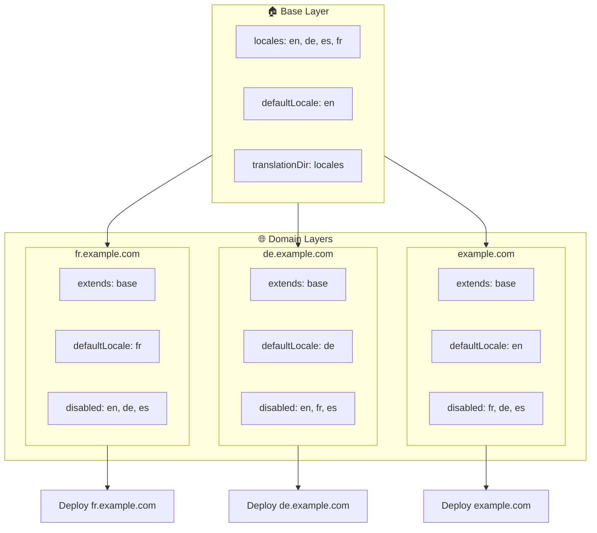

# 🌍 Menyiapkan Lokal Multi-Domain dengan `Nuxt I18n Micro` Menggunakan Layer

## 📝 Pendahuluan

Dengan memanfaatkan layer di `Nuxt I18n Micro`, Anda dapat membuat pengaturan lokalisasi multi-domain yang fleksibel dan mudah dipelihara. Pendekatan ini tidak hanya menyederhanakan manajemen domain dengan menghilangkan kebutuhan akan fungsionalitas yang kompleks, tetapi juga memungkinkan distribusi beban yang efisien dan mengurangi kompleksitas proyek. Dengan menjalankan proyek terpisah untuk lokal yang berbeda, aplikasi Anda dapat dengan mudah diskalakan dan disesuaikan dengan berbagai kebutuhan lokal di banyak domain, menawarkan solusi yang kuat dan dapat diskalakan untuk aplikasi global.

## 🎯 Tujuan

Untuk membuat pengaturan di mana domain yang berbeda menyajikan lokal tertentu dengan menyesuaikan konfigurasi pada layer anak. Metode ini memanfaatkan sistem layering Nuxt, memungkinkan Anda mempertahankan konfigurasi dasar sambil memperluas atau memodifikasinya untuk setiap domain.

### Arsitektur Multi-Domain



## 🛠 Langkah untuk Mengimplementasikan Lokal Multi-Domain

### 1. **Buat Base Layer**

Mulailah dengan membuat layer konfigurasi dasar yang mencakup semua pengaturan lokal umum untuk aplikasi Anda. Konfigurasi ini akan berfungsi sebagai fondasi untuk konfigurasi khusus domain lainnya.

#### **Konfigurasi Base Layer**

Buat file konfigurasi dasar `base/nuxt.config.ts`:

```typescript
// base/nuxt.config.ts

export default defineNuxtConfig({
  i18n: {
    locales: [
      { code: 'en', iso: 'en-US', dir: 'ltr' },
      { code: 'de', iso: 'de-DE', dir: 'ltr' },
      { code: 'es', iso: 'es-ES', dir: 'ltr' },
    ],
    defaultLocale: 'en',
    translationDir: 'locales',
    meta: true,
    autoDetectLanguage: true,
  },
})
```

### 2. **Buat Layer Anak Khusus Domain**

Untuk setiap domain, buat layer anak yang memodifikasi konfigurasi dasar agar sesuai dengan kebutuhan spesifik domain tersebut. Anda dapat menonaktifkan lokal yang tidak diperlukan untuk domain tertentu.

#### **Contoh: Konfigurasi untuk Domain Prancis**

Buat konfigurasi layer anak untuk domain Prancis di `fr/nuxt.config.ts`:

```typescript
// fr/nuxt.config.ts

export default defineNuxtConfig({
  extends: '../base', // Inherit from the base configuration

  i18n: {
    locales: [
      { code: 'en', iso: 'en-US', dir: 'ltr', disabled: true }, // Disable English
      { code: 'fr', iso: 'fr-FR', dir: 'ltr' }, // Add and enable the French locale
      { code: 'de', iso: 'de-DE', dir: 'ltr', disabled: true }, // Disable German
      { code: 'es', iso: 'es-ES', dir: 'ltr', disabled: true }, // Disable Spanish
    ],
    defaultLocale: 'fr', // Set French as the default locale
    autoDetectLanguage: false, // Disable automatic language detection
  },
})
```

#### **Contoh: Konfigurasi untuk Domain Jerman**

Serupa, buat konfigurasi layer anak untuk domain Jerman di `de/nuxt.config.ts`:

```typescript
// de/nuxt.config.ts

export default defineNuxtConfig({
  extends: '../base', // Inherit from the base configuration

  i18n: {
    locales: [
      { code: 'en', iso: 'en-US', dir: 'ltr', disabled: true }, // Disable English
      { code: 'fr', iso: 'fr-FR', dir: 'ltr', disabled: true }, // Disable French
      { code: 'de', iso: 'de-DE', dir: 'ltr' }, // Use the German locale
      { code: 'es', iso: 'es-ES', dir: 'ltr', disabled: true }, // Disable Spanish
    ],
    defaultLocale: 'de', // Set German as the default locale
    autoDetectLanguage: false, // Disable automatic language detection
  },
})
```

### 3. **Deploy Aplikasi untuk Setiap Domain**

Deploy aplikasi dengan konfigurasi yang sesuai untuk setiap domain. Contohnya:

- Deploy konfigurasi layer `fr` ke `fr.example.com`.
- Deploy konfigurasi layer `de` ke `de.example.com`.

### 4. **Siapkan Beberapa Proyek untuk Lokal yang Berbeda**

Untuk setiap lokal dan domain, Anda akan perlu menjalankan instance aplikasi yang terpisah. Ini memastikan bahwa setiap domain menyajikan konfigurasi lokal yang benar, mengoptimalkan distribusi beban dan menyederhanakan struktur proyek. Dengan menjalankan beberapa proyek yang disesuaikan untuk setiap lokal, Anda dapat mempertahankan pemisahan yang bersih antar konfigurasi dan mengurangi kompleksitas pengaturan keseluruhan.

### 5. **Konfigurasikan Perutean Berdasarkan Domain**

Pastikan perutean Anda dikonfigurasi untuk mengarahkan pengguna ke proyek yang benar berdasarkan domain yang mereka akses. Ini akan memastikan setiap domain menyajikan lokal yang sesuai, meningkatkan pengalaman pengguna, dan mempertahankan konsistensi di berbagai wilayah.

### 6. **Deploy dan Verifikasi**

Setelah mengonfigurasi layer dan men-deploy-nya ke domain masing-masing, pastikan setiap domain menyajikan lokal yang benar. Uji aplikasi secara menyeluruh untuk mengonfirmasi bahwa lokal yang benar dimuat sesuai domain.

## 📝 Praktik Terbaik

- **Jaga Konfigurasi Dasar Tetap Generik**: Konfigurasi dasar sebaiknya mencakup pengaturan umum yang berlaku untuk semua domain.
- **Isolasi Logika Khusus Domain**: Simpan konfigurasi khusus domain di layer masing-masing untuk menjaga kejelasan dan pemisahan tanggung jawab.

## 🎉 Kesimpulan

Dengan memanfaatkan layer di `Nuxt I18n Micro`, Anda dapat membuat pengaturan lokalisasi multi-domain yang fleksibel dan mudah dipelihara. Pendekatan ini tidak hanya menghilangkan kebutuhan akan fungsionalitas manajemen domain yang kompleks, tetapi juga memungkinkan Anda mendistribusikan beban secara efisien dan mengurangi kompleksitas proyek. Menjalankan proyek terpisah untuk lokal yang berbeda memastikan aplikasi Anda dapat diskalakan dengan mudah dan disesuaikan dengan berbagai kebutuhan lokal di berbagai domain, memberikan solusi yang kuat dan dapat diskalakan untuk aplikasi global.
