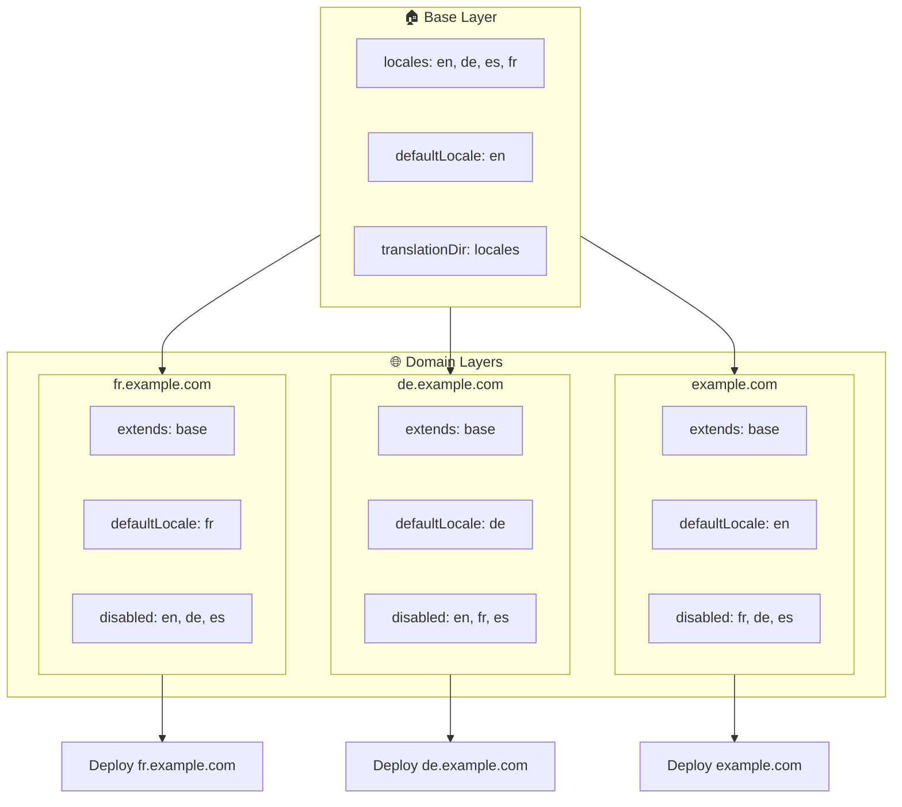

# 🌍 Setting Up Multi-Domain Locales dengan `Nuxt I18n Micro` Using Layers

## 📝 Introduction

By leveraging layers in `Nuxt I18n Micro`, you can create a flexible dan maintainable multi-domain localization setup. Thadalahpproach not only simplifies domain management by eliminating the need untuk complex functionalities tetapi also allows untuk efficient load distribution dan reduced project complexity. By running separate projects untuk different locales, your application can easily scale dan adapt to varying locale requirements across multiple domains, offering a robust dan scalable solution untuk global applications.

## 🎯 Objective

To create a setup where different domains serve specific locales by customizing configurations in child layers. This method leverages Nuxt's layering system, allowing you to maintain a base configuration while extending atau modifying it untuk each domain.

### Multi-Domain Architecture



## 🛠 Steps to Implement Multi-Domain Locales

### 1. **Create the Base Layer**

Start by creating a base configuration layer that includes all the common locale settings untuk your application. This configuration will serve as the foundation untuk other domain-specific configurations.

#### **Base Layer Configuration**

Create the base configuration file `base/nuxt.config.ts`:

```typescript
// base/nuxt.config.ts

export default defineNuxtConfig({
  i18n: {
    locales: [
      { code: 'en', iso: 'en-US', dir: 'ltr' },
      { code: 'de', iso: 'de-DE', dir: 'ltr' },
      { code: 'es', iso: 'es-ES', dir: 'ltr' },
    ],
    defaultLocale: 'en',
    translationDir: 'locales',
    meta: true,
    autoDetectLanguage: true,
  },
})
```

### 2. **Create Domain-Specific Child Layers**

For each domain, create a child layer that modifies the base configuration to meet the specific requirements of that domain. Anda dapat disable locales that are not diperlukan untuk a specific domain.

#### **Example: Configuration untuk the French Domain**

Create a child layer configuration untuk the French domain in `fr/nuxt.config.ts`:

```typescript
// fr/nuxt.config.ts

export default defineNuxtConfig({
  extends: '../base', // Inherit from the base configuration

  i18n: {
    locales: [
      { code: 'en', iso: 'en-US', dir: 'ltr', disabled: true }, // Disable English
      { code: 'fr', iso: 'fr-FR', dir: 'ltr' }, // Add and enable the French locale
      { code: 'de', iso: 'de-DE', dir: 'ltr', disabled: true }, // Disable German
      { code: 'es', iso: 'es-ES', dir: 'ltr', disabled: true }, // Disable Spanish
    ],
    defaultLocale: 'fr', // Set French as the default locale
    autoDetectLanguage: false, // Disable automatic language detection
  },
})
```

#### **Example: Configuration untuk the German Domain**

Similarly, create a child layer configuration untuk the German domain in `de/nuxt.config.ts`:

```typescript
// de/nuxt.config.ts

export default defineNuxtConfig({
  extends: '../base', // Inherit from the base configuration

  i18n: {
    locales: [
      { code: 'en', iso: 'en-US', dir: 'ltr', disabled: true }, // Disable English
      { code: 'fr', iso: 'fr-FR', dir: 'ltr', disabled: true }, // Disable French
      { code: 'de', iso: 'de-DE', dir: 'ltr' }, // Use the German locale
      { code: 'es', iso: 'es-ES', dir: 'ltr', disabled: true }, // Disable Spanish
    ],
    defaultLocale: 'de', // Set German as the default locale
    autoDetectLanguage: false, // Disable automatic language detection
  },
})
```

### 3. **Deploy the Application untuk Each Domain**

Deploy the application dengan the appropriate configuration untuk each domain. Sebagai contoh:

- Deploy the `fr` layer configuration to `fr.example.com`.
- Deploy the `de` layer configuration to `de.example.com`.

### 4. **Set Up Multiple Projects untuk Different Locales**

For each locale dan domain, you'll need to run a separate instance of the application. Ini memastikan that each domain serves the correct locale configuration, optimizing the load distribution dan simplifying the project's structure. By running multiple projects tailored to each locale, you can maintain a clean separation between configurations dan reduce the complexity of the overall setup.

### 5. **Konfigurasikan Routing Based on Domain**

Pastikan bahwa your routing is configured to direct users ke correct project based on the domain they are accessing. Ini akan ensure that each domain serves the appropriate locale, enhancing user experience dan maintaining consistency across different regions.

### 6. **Deploy dan Verify**

After configuring the layers dan deploying them to their respective domains, ensure each domain is serving the correct locale. Test the application thoroughly to confirm that the correct locale is loaded depending on the domain.

## 📝 Best Practices

- **Keep Base Configuration Generic**: The base configuration should cover general settings applicable to all domains.
- **Isolate Domain-Specific Logic**: Keep domain-specific configurations in their respective layers to maintain clarity dan separation of concerns.

## 🎉 Conclusion

By leveraging layers in `Nuxt I18n Micro`, you can create a flexible dan maintainable multi-domain localization setup. Thadalahpproach not only eliminates the need untuk complex domain management functionalities tetapi also memungkinkan Anda distribute the load efficiently dan reduce project complexity. Running separate projects untuk different locales ensures that your application can scale easily dan adapt to different locale requirements across various domains, providing a robust dan scalable solution untuk global applications.
