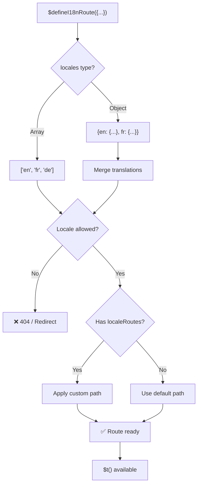
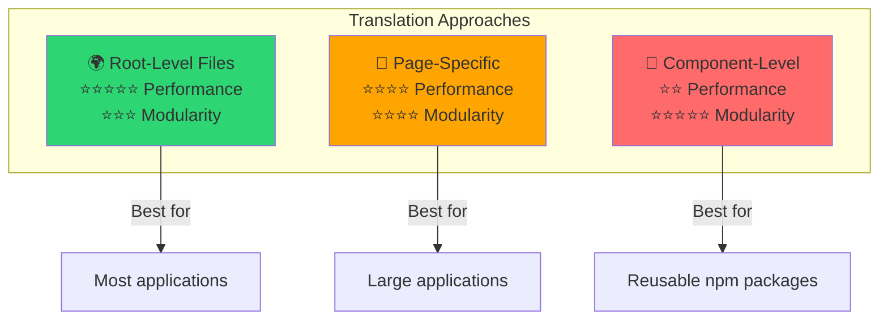

# 📖 Terjemahan Per Komponen

Pelajari cara mendefinisikan terjemahan langsung di dalam komponen Vue menggunakan `$defineI18nRoute` untuk lokalisasi yang modular dan mudah dipelihara.

## 📖 Ikhtisar

Terjemahan Per Komponen di `Nuxt I18n Micro` memungkinkan Anda mendefinisikan terjemahan langsung di dalam komponen atau halaman tertentu menggunakan fungsi `$defineI18nRoute`. Pendekatan ini ideal untuk mengelola konten terlokalisasi yang unik untuk komponen individual, memberikan metode yang lebih modular dan mudah dipelihara untuk menangani terjemahan.

## 🚀 Mulai Cepat

### Penggunaan Dasar

```vue
<template>
  <div>
    <h1>{{ $t('greeting') }}</h1>
    <p>{{ $t('farewell') }}</p>
  </div>
</template>

<script setup lang="ts">
import { useNuxtApp } from '#imports'

const { $defineI18nRoute, $t } = useNuxtApp()

$defineI18nRoute({
  locales: {
    en: { greeting: 'Hello', farewell: 'Goodbye' },
    fr: { greeting: 'Bonjour', farewell: 'Au revoir' },
    de: { greeting: 'Hallo', farewell: 'Auf Wiedersehen' },
  },
})
</script>
```

### Pengaturan yang Diperlukan (`script setup`)

`$defineI18nRoute` adalah injeksi aplikasi Nuxt, bukan macro global.  
Selalu ambil dari `useNuxtApp()` sebelum memanggilnya.

```ts
import { useNuxtApp } from '#imports'

const { $defineI18nRoute } = useNuxtApp()
```

## 🏗️ Meta Rute Saat Build

Saat build, unplugin Vite memindai file `.vue` halaman untuk panggilan `defineI18nRoute(...)` / `$defineI18nRoute(...)` dan mengekstrak pembatasan lokal, `localeRoutes`, serta `disableMeta` ke metadata rute yang digunakan oleh `@i18n-micro/route-strategy`.

- **Build**: unplugin (`src/unplugin-define-i18n-route.ts`) berjalan selama Vite transform dan menulis `i18n-route-meta.json` di direktori build Nuxt
- **Runtime**: plugin define (`03.define.ts`) tetap mengekspos `$defineI18nRoute` pada `script setup` untuk dev dan konfigurasi inline

Biasanya Anda hanya memanggil `$defineI18nRoute` di halaman — modul menangani ekstraksi saat build secara otomatis.

## 🔧 Fungsi `$defineI18nRoute`

Fungsi `$defineI18nRoute` mengonfigurasi perilaku rute berdasarkan lokal saat ini, menawarkan solusi yang serbaguna untuk:

- Mengontrol akses ke rute tertentu berdasarkan lokal yang tersedia
- Menyediakan terjemahan untuk lokal tertentu
- Menetapkan rute kustom untuk lokal yang berbeda
- Mengontrol pembuatan tag meta

### Cara Kerjanya



### Signature Method

```typescript
const { $defineI18nRoute } = useNuxtApp();
$defineI18nRoute(routeDefinition: DefineI18nRouteConfig);
```

### Parameter

| Parameter      | Tipe                                       | Deskripsi                        |
| -------------- | ------------------------------------------ | ---------------------------------- |
| `locales`      | `string[] \| Record<string, Translations>` | Lokal yang tersedia untuk rute    |
| `localeRoutes` | `Record<string, string>`                   | Rute kustom untuk lokal tertentu |
| `disableMeta`  | `boolean \| string[]`                      | Mengontrol pembuatan tag meta i18n   |

### Deskripsi Parameter Terperinci

#### `locales`

Mendefinisikan lokal mana yang tersedia untuk rute:

<CodeGroup>
```typescript Array Format
$defineI18nRoute({
  locales: ['en', 'fr', 'de'], // Simple array of locale codes
})
```

```typescript Object Format
$defineI18nRoute({
  locales: {
    en: { greeting: 'Hello', farewell: 'Goodbye' },
    fr: { greeting: 'Bonjour', farewell: 'Au revoir' },
    de: { greeting: 'Hallo', farewell: 'Auf Wiedersehen' },
    ru: {}, // Russian locale allowed but no translations provided
  },
})
```
</CodeGroup>

#### `localeRoutes`

Memungkinkan rute kustom untuk lokal tertentu:

```typescript
$defineI18nRoute({
  localeRoutes: {
    en: '/welcome',
    fr: '/bienvenue',
    de: '/willkommen',
    ru: '/privet', // Custom route path for Russian locale
  },
})
```

#### `disableMeta`

Mengontrol pembuatan tag meta i18n:

<CodeGroup>
```typescript Disable All Meta
$defineI18nRoute({
  locales: ['en', 'fr', 'de'],
  disableMeta: true, // Disables all i18n meta tags
})
```

```typescript Disable Specific Locales
$defineI18nRoute({
  locales: ['en', 'fr', 'de'],
  disableMeta: ['en', 'fr'], // Only English and French won't have meta tags
})
```
</CodeGroup>

## 💡 Kasus Penggunaan

### 1. Mengontrol Akses Berdasarkan Lokal

Definisikan lokal mana yang diizinkan untuk rute tertentu:

```typescript
$defineI18nRoute({
  locales: ['en', 'fr', 'de'], // Only these locales are allowed for this route
})
```

### 2. Menyediakan Terjemahan Khusus Komponen

Gunakan objek `locales` untuk menyediakan terjemahan spesifik untuk setiap rute:

```typescript
$defineI18nRoute({
  locales: {
    en: {
      greeting: 'Hello',
      farewell: 'Goodbye',
      description: 'Welcome to our application',
    },
    fr: {
      greeting: 'Bonjour',
      farewell: 'Au revoir',
      description: 'Bienvenue dans notre application',
    },
    de: {
      greeting: 'Hallo',
      farewell: 'Auf Wiedersehen',
      description: 'Willkommen in unserer Anwendung',
    },
  },
})
```

### 3. Perutean Kustom untuk Lokal

Definisikan jalur kustom untuk lokal tertentu:

```typescript
$defineI18nRoute({
  locales: ['en', 'fr', 'de'],
  localeRoutes: {
    en: '/welcome',
    fr: '/bienvenue',
    de: '/willkommen',
  },
})
```

### 4. Menonaktifkan Tag Meta

Kontrol pembuatan tag meta SEO untuk rute atau lokal tertentu:

```typescript
// Disable meta tags for all locales
$defineI18nRoute({
  locales: ['en', 'fr', 'de'],
  disableMeta: true,
})

// Disable meta tags only for specific locales
$defineI18nRoute({
  locales: ['en', 'fr', 'de'],
  disableMeta: ['en', 'fr'],
})
```

## ✅ Format Konfigurasi yang Didukung

Parser `$defineI18nRoute` mendukung berbagai konfigurasi JavaScript:

### Konfigurasi Statis

<CodeGroup>
```typescript Static Arrays
$defineI18nRoute({
  locales: ['en', 'de', 'fr'],
})
```

```typescript Static Objects
$defineI18nRoute({
  locales: {
    en: { greeting: 'Hello' },
    de: { greeting: 'Hallo' },
  },
  localeRoutes: {
    en: '/welcome',
    de: '/willkommen',
  },
})
```
</CodeGroup>

### Konfigurasi Dinamis

<CodeGroup>
```typescript Variables and Functions
const locales = ['en', 'de', 'fr']
const routes = { en: '/welcome', de: '/willkommen' }

$defineI18nRoute({
  locales: locales,
  localeRoutes: routes,
})
```

```typescript Template Literals
const prefix = 'api'

$defineI18nRoute({
  locales: [`${prefix}-en`, `${prefix}-de`],
  localeRoutes: {
    [`${prefix}-en`]: `/api/welcome`,
    [`${prefix}-de`]: `/api/willkommen`,
  },
})
```
</CodeGroup>

### Konfigurasi Lanjutan

<CodeGroup>
```typescript Spread Operator
const baseLocales = ['en', 'de']
const additionalLocales = ['fr', 'es']

$defineI18nRoute({
  locales: [...baseLocales, ...additionalLocales],
})
```

```typescript Array of Objects
$defineI18nRoute({
  locales: [
    { code: 'en', name: 'English' },
    { code: 'de', name: 'German' },
  ],
})
```
</CodeGroup>

### Logika Kondisional

```typescript
$defineI18nRoute({
  locales: process.env.NODE_ENV === 'production' ? ['en', 'de'] : ['en', 'de', 'fr', 'es'],
})
```

### Objek Bersarang yang Kompleks

```typescript
$defineI18nRoute({
  locales: {
    'en-us': {
      region: 'US',
      currency: 'USD',
      format: {
        date: 'MM/DD/YYYY',
        time: '12h',
      },
    },
    'de-de': {
      region: 'DE',
      currency: 'EUR',
      format: {
        date: 'DD.MM.YYYY',
        time: '24h',
      },
    },
  },
})
```

### Komentar dan Pemformatan

```typescript
$defineI18nRoute({
  // Supported locales for this component
  locales: [
    'en', // English
    'de', // German
    'fr', // French
  ],
  // Custom routes for each locale
  localeRoutes: {
    en: '/welcome',
    de: '/willkommen',
    fr: '/bienvenue',
  },
})
```

## ❌ Tidak Didukung

Parser memiliki keterbatasan dan tidak dapat menangani:

- **Impor eksternal** (pernyataan `import`)
- **Fungsi async/await**
- **Method kelas**
- **Alur kontrol yang kompleks** (loop, try-catch, switch)
- **Arrow function** dalam konfigurasi
- **Fungsi generator**

## 📝 Contoh Lengkap

Berikut contoh komprehensif yang menampilkan semua fitur:

```vue
<template>
  <div class="welcome-page">
    <header>
      <h1>{{ $t('title') }}</h1>
      <p>{{ $t('subtitle') }}</p>
    </header>

    <main>
      <section>
        <h2>{{ $t('features.title') }}</h2>
        <ul>
          <li v-for="feature in $t('features.list')" :key="feature">
            {{ feature }}
          </li>
        </ul>
      </section>

      <section>
        <h2>{{ $t('contact.title') }}</h2>
        <p>{{ $t('contact.description') }}</p>
        <a :href="$t('contact.email')">{{ $t('contact.email') }}</a>
      </section>
    </main>

    <footer>
      <p>{{ $t('footer.copyright') }}</p>
    </footer>
  </div>
</template>

<script setup lang="ts">
import { useNuxtApp } from '#imports'

const { $defineI18nRoute, $t } = useNuxtApp()

// Define comprehensive i18n route configuration
$defineI18nRoute({
  locales: {
    en: {
      title: 'Welcome to Our Platform',
      subtitle: 'The best solution for your needs',
      features: {
        title: 'Key Features',
        list: ['High Performance', 'Easy to Use', 'Scalable Architecture'],
      },
      contact: {
        title: 'Get in Touch',
        description: "We'd love to hear from you",
        email: 'mailto:contact@example.com',
      },
      footer: {
        copyright: '© 2024 Example Company. All rights reserved.',
      },
    },
    fr: {
      title: 'Bienvenue sur Notre Plateforme',
      subtitle: 'La meilleure solution pour vos besoins',
      features: {
        title: 'Fonctionnalités Clés',
        list: ['Haute Performance', 'Facile à Utiliser', 'Architecture Évolutive'],
      },
      contact: {
        title: 'Contactez-Nous',
        description: 'Nous aimerions avoir de vos nouvelles',
        email: 'mailto:contact@example.com',
      },
      footer: {
        copyright: '© 2024 Example Company. Tous droits réservés.',
      },
    },
    de: {
      title: 'Willkommen auf Unserer Plattform',
      subtitle: 'Die beste Lösung für Ihre Bedürfnisse',
      features: {
        title: 'Hauptfunktionen',
        list: ['Hohe Leistung', 'Einfach zu Verwenden', 'Skalierbare Architektur'],
      },
      contact: {
        title: 'Kontaktieren Sie Uns',
        description: 'Wir würden gerne von Ihnen hören',
        email: 'mailto:contact@example.com',
      },
      footer: {
        copyright: '© 2024 Example Company. Alle Rechte vorbehalten.',
      },
    },
  },
  localeRoutes: {
    en: '/welcome',
    fr: '/bienvenue',
    de: '/willkommen',
  },
  disableMeta: false, // Enable SEO meta tags
})
</script>

<style scoped>
.welcome-page {
  max-width: 800px;
  margin: 0 auto;
  padding: 2rem;
}

header {
  text-align: center;
  margin-bottom: 3rem;
}

section {
  margin-bottom: 2rem;
}

footer {
  text-align: center;
  margin-top: 3rem;
  padding-top: 2rem;
  border-top: 1px solid #eee;
}
</style>
```

## ⚡ Pertimbangan Performa

Menyematkan terjemahan di Single File Components (SFC) dapat memengaruhi performa:

### Potensi Masalah

- **Ukuran file meningkat**: Semua lokal berada di dalam SFC, tidak seperti file terjemahan terpisah yang memungkinkan pemuatan berbasis lokal
- **Rendering lebih lambat**: Terjemahan in-file diproses pada runtime
- **Penggunaan memori**: Semua terjemahan dimuat terlepas dari lokal saat ini

### Praktik Terbaik

- **Gunakan terjemahan per halaman** untuk performa optimal
- **Cadangkan terjemahan tingkat komponen** untuk kasus tertentu seperti:
  - Komponen yang dapat digunakan kembali dan dipublikasikan di npm
  - Terjemahan yang tidak cocok untuk file tingkat root
  - Komponen yang perlu bersifat mandiri

### Performa vs Modularitas

Seimbangkan kebutuhan proyek Anda saat memilih pendekatan:



| Pendekatan             | Performa | Modularitas | Kasus Penggunaan            |
| -------------------- | ----------- | ---------- | ------------------- |
| **File Tingkat Root** | ⭐⭐⭐⭐⭐  | ⭐⭐⭐     | Sebagian besar aplikasi   |
| **Per Halaman**    | ⭐⭐⭐⭐    | ⭐⭐⭐⭐   | Aplikasi besar  |
| **Tingkat Komponen**  | ⭐⭐        | ⭐⭐⭐⭐⭐ | Komponen yang dapat digunakan kembali |

## 🎯 Praktik Terbaik

### 1. Jaga Terjemahan Dekat dengan Komponen

Definisikan terjemahan langsung di dalam komponen yang relevan untuk menjaga konten terlokalisasi tetap terorganisir dan mudah dipelihara.

### 2. Gunakan Objek Lokal untuk Fleksibilitas

Gunakan format objek untuk properti `locales` saat terjemahan spesifik atau kontrol akses berdasarkan lokal diperlukan.

### 3. Dokumentasikan Rute Kustom

Dokumentasikan dengan jelas setiap rute kustom yang disetel untuk berbagai lokal agar tetap jelas dan menyederhanakan pengembangan serta pemeliharaan.

### 4. Pertimbangkan Dampak Performa

Evaluasi apakah terjemahan tingkat komponen diperlukan untuk kasus penggunaan Anda, dengan mempertimbangkan implikasi performa.

### 5. Gunakan TypeScript

Manfaatkan TypeScript untuk keamanan tipe yang lebih baik dan dukungan IntelliSense:

```typescript
interface ComponentTranslations {
  title: string
  subtitle: string
  features: {
    title: string
    list: string[]
  }
}

$defineI18nRoute({
  locales: {
    en: {
      title: 'Welcome',
      subtitle: 'Subtitle',
      features: {
        title: 'Features',
        list: ['Feature 1', 'Feature 2'],
      },
    } as ComponentTranslations,
  },
})
```

## 📚 Topik Terkait

- **[Mulai Cepat](/quickstart)** - Pengaturan dan konfigurasi dasar
- **[Referensi API](/api/methods)** - Dokumentasi method lengkap
- **[Contoh](/examples)** - Contoh penggunaan dunia nyata

## Ringkasan

Fitur Terjemahan Per Komponen, yang didukung oleh fungsi `$defineI18nRoute`, menawarkan cara yang kuat dan fleksibel untuk mengelola lokalisasi di dalam aplikasi Nuxt Anda. Dengan memungkinkan konten terlokalisasi dan perutean didefinisikan di tingkat komponen, ini membantu menciptakan pengalaman yang sangat dikustomisasi dan ramah pengguna yang disesuaikan dengan preferensi bahasa dan regional audiens Anda.

Pilih pendekatan yang paling sesuai dengan kebutuhan proyek Anda, dengan mempertimbangkan persyaratan performa dan kekhawatiran pemeliharaan.
