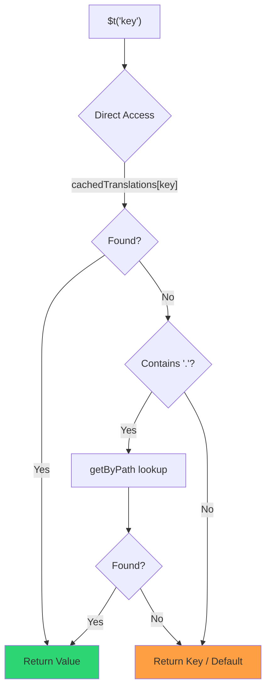

# 🚀 Panduan Performa

## 📖 Pendahuluan

`Nuxt I18n Micro` dirancang dengan mempertimbangkan performa, menawarkan peningkatan signifikan dibandingkan modul internasionalisasi (i18n) tradisional seperti `nuxt-i18n`. Panduan ini memberikan pembahasan mendalam tentang manfaat performa dari penggunaan `Nuxt I18n Micro`, dan bagaimana perbandingannya dengan solusi lain.

## 🤔 Mengapa Fokus pada Performa?

Pada proyek berskala besar dan lingkungan bertrafik tinggi, hambatan performa dapat mengakibatkan waktu build yang lambat, peningkatan penggunaan memori, dan waktu respons server yang buruk. Masalah-masalah ini menjadi lebih menonjol pada pengaturan i18n kompleks yang melibatkan file terjemahan besar. `Nuxt I18n Micro` dibangun untuk mengatasi tantangan ini secara langsung dengan mengoptimalkan kecepatan, efisiensi memori, dan dampak minimal pada ukuran bundle aplikasi Anda.

## 📊 Perbandingan Performa

Kami melakukan serangkaian pengujian pada fixture identik melalui `pnpm test:performance` (`pnpm -C scripts cli performance`) terhadap **`@nuxtjs/i18n@10.6.0`**. Metodologi lengkap dan bagan: [Hasil Uji Performa](/guides/performance-results).

Profil default CLI: **4 locales** × **2 pages** (`index`, `page`) × ~10k kunci leaf index. Naikkan `--locales` / `--keys` untuk beban radar-regresi yang lebih berat. Laporan memisahkan **code**, **translations** (termasuk `chunks/raw/*` `@nuxtjs/i18n`), dan output **total** yang dapat di-deploy.

```bash
pnpm test:performance
pnpm -C scripts cli performance --only micro --skip-stress
pnpm -C scripts cli performance --locales 12 --keys 100000 --runs 3
```

### ⏱️ Waktu Build dan Konsumsi Sumber Daya

<Accordion title="**@nuxtjs/i18n v10.6**">
- **Bundle Kode**: 2.16 MB
- **Terjemahan**: 7.21 MB (message chunks + payload lokal)
- **Total yang dapat di-deploy**: 9.37 MB
- **Penggunaan Memori Maks**: 1.821 MB
- **Waktu**: 8,34s (rata-rata dari 3)
</Accordion>

<Tip>
- **Bundle Kode**: 1,74 MB — **~19% kode lebih kecil dibandingkan `@nuxtjs/i18n` v10.6**
- **Terjemahan**: 6,8 MB (JSON dimuat secara lazy)
- **Total yang dapat di-deploy**: 8,54 MB
- **Penggunaan Memori Maks**: 1.065 MB — **~41% memori lebih sedikit dibandingkan `@nuxtjs/i18n` v10.6**
- **Waktu**: 5,34s — **~36% lebih cepat dibandingkan `@nuxtjs/i18n` v10.6** (≈ baseline plain-nuxt)
</Tip>

> Dokumentasi lama yang menunjukkan `@nuxtjs/i18n` "code ≈ 15 MB / translations 0 B" menghitung file pesan `chunks/raw` sebagai kode aplikasi. Klasifikator saat ini memisahkannya; selisih pada **code** lebih kecil, dan micro tetap unggul dalam waktu build, puncak RSS, dan uji beban.

Lihat [laporan benchmark lengkap](/guides/performance-results) untuk bagan, hasil Autocannon, dan detail fixture.

### 🌐 Performa Server di Bawah Beban

Artillery (6s@6 + 60s@60) dan Autocannon (10c / 10s), rata-rata 3 kali eksekusi berturut-turut per fixture.

<Accordion title="**@nuxtjs/i18n v10.6**">
- **Requests per Second (Artillery)**: 143 [#/sec]
- **Rata-rata Waktu Respons**: 956 ms
- **RPS Autocannon / avg latency**: 72 / 139 ms
</Accordion>

<Tip>
- **Requests per Second (Artillery)**: 275 [#/sec] — **~93% lebih dari `@nuxtjs/i18n` v10.6**
- **Rata-rata Waktu Respons**: 483 ms — **~49% lebih cepat dibandingkan `@nuxtjs/i18n` v10.6**
- **RPS Autocannon / avg latency**: 162 / 62 ms
</Tip>

### 📈 Perbandingan Visual

<Note>
Bagan interaktif dihilangkan dalam dokumen Mintlify. Lihat tabel benchmark pada halaman ini atau [dokumen VitePress](https://s00d.github.io/nuxt-i18n-micro/guide/performance-results) untuk bagan: `chart`.
</Note>

<Note>
Bagan interaktif dihilangkan dalam dokumen Mintlify. Lihat tabel benchmark pada halaman ini atau [dokumen VitePress](https://s00d.github.io/nuxt-i18n-micro/guide/performance-results) untuk bagan: `chart`.
</Note>

| Metrik          | @nuxtjs/i18n v10.6 | i18n-micro | Peningkatan        |
| --------------- | ------------------ | ---------- | ------------------ |
| Waktu Build      | 8,34s              | 5,34s      | **~36% lebih cepat**    |
| Memori (build)  | 1.821 MB           | 1.065 MB   | **~41% lebih sedikit**      |
| Bundle Kode     | 2,16 MB            | 1,74 MB    | **~19% lebih kecil**   |
| Waktu Respons   | 956 ms             | 483 ms     | **~49% lebih cepat**    |
| RPS (Artillery) | 143                | 275        | **~93% lebih**      |

### 🔍 Interpretasi Hasil

Melawan `@nuxtjs/i18n` **v10.6** saat ini (profil default CLI, rata-rata 3):

- 🗜️ **Grafik kode lebih kecil**: ~1,74 MB vs ~2,16 MB setelah message chunks tidak salah label sebagai "code".
- 🧠 **RSS build lebih rendah**: puncak ~1,1 GB vs ~1,8 GB.
- 🕒 **Build lebih cepat**: ~5,3s vs ~8,3s (micro cocok dengan baseline plain-Nuxt pada profil ini).
- ⚡ **Jauh lebih baik di bawah beban**: ~275 vs ~143 RPS Artillery, ~162 vs ~72 RPS Autocannon, latensi rata-rata lebih rendah.

Angka absolut berbeda dari tabel lama yang dipublikasikan (kamus lebih kecil, Nuxt yang lebih lama, dan pemisahan "0 B translations" yang tidak adil untuk `@nuxtjs/i18n`). Arahnya sama: micro tetap unggul dalam biaya build dan throughput permintaan.

## ⚙️ Optimalisasi Utama

### 🛠️ Desain Minimalis

`Nuxt I18n Micro` dibangun di sekitar arsitektur minimalis dengan inti kecil dan paket strategi khusus. Ini mengurangi overhead dan menyederhanakan logika internal, sehingga meningkatkan performa.

### 🚦 Perutean Efisien

Pada v3, pembuatan rute dan logika jalur runtime dibagi menjadi paket khusus untuk tree-shaking optimal:

- **`@i18n-micro/route-strategy`** — Pembuatan rute saat build: memperluas halaman Nuxt dengan rute terlokalisasi. Hanya strategi yang dipilih (`no_prefix`, `prefix`, `prefix_except_default`, `prefix_and_default`) yang disertakan.
- **`@i18n-micro/path-strategy`** — Resolusi jalur runtime, pengalihan, dan pembuatan tautan. Menggunakan fungsi murni dan flag konteks yang telah dihitung sebelumnya untuk meminimalkan alokasi pada jalur panas. Ekspor sub-path (`/prefix`, `/no-prefix`, dll.) memastikan hanya implementasi yang dipilih yang di-bundle.

Pendekatan ini menjaga konfigurasi perutean tetap ringan dan memastikan resolusi rute yang cepat terlepas dari jumlah lokal.

### 📂 Pemuatan Terjemahan yang Efisien

Modul hanya mendukung file JSON untuk terjemahan, dengan pemisahan yang jelas antara file global dan per halaman. Ini memastikan hanya data terjemahan yang diperlukan yang dimuat pada waktu tertentu, semakin meningkatkan performa.

### 🔒 GlobalThis Singleton Cache

Mulai dari v3.0.0, modul menggunakan pola singleton `globalThis` dengan `Symbol.for` untuk menjamin satu instance cache di seluruh proses Node.js. Ini mencegah:

- Duplikasi cache saat modul yang sama di-bundle beberapa kali
- Pembuatan objek per permintaan yang menyebabkan tekanan pengumpul sampah
- Kebocoran memori dari instance cache yang terlantar

```mermaid
flowchart LR
    subgraph Process["Node.js Process"]
        G["globalThis[Symbol.for('CACHE')]"]

        subgraph R1["SSR Request 1"]
            P1[Plugin Instance] --> G
        end

        subgraph R2["SSR Request 2"]
            P2[Plugin Instance] --> G
        end

        subgraph R3["SSR Request 3"]
            P3[Plugin Instance] --> G
        end
    end

    G --> Cache["Single Map Instance"]
    Cache --> D1["en:index → translations"]
    Cache --> D2["en:about → translations"
```

```typescript
// Internal implementation pattern
const CACHE_KEY = Symbol.for('__NUXT_I18N_STORAGE_CACHE__')
if (!globalThis[CACHE_KEY]) {
  globalThis[CACHE_KEY] = new Map()
}
```

### ⚡ Fungsi Terjemahan yang Dioptimalkan (tFast)

Fungsi `$t()` menggunakan strategi pencarian langsung yang dioptimalkan untuk kecepatan:

1. **Konteks yang telah dihitung sebelumnya**: Lokal dan nama rute dihitung sekali selama navigasi, bukan pada setiap panggilan `$t()`
2. **Pencarian sumber tunggal**: Semua terjemahan (root + per halaman + fallback) sudah digabungkan sebelumnya saat build menjadi satu file per halaman — tidak perlu pencarian berlapis
3. **Cumulative deep merge saat navigasi**: Saat navigasi dalam lokal yang sama, terjemahan halaman baru di-deep-merge (kedalaman 2 level) ke kamus aktif, sehingga kunci dari halaman sebelumnya tetap terlihat selama animasi transisi — bahkan saat halaman berbagi awalan bersarang yang tumpang tindih (mis. kedua halaman memiliki kunci di bawah `common.*`)
4. **Garbage collection via `page:transition:finish`**: Setelah animasi transisi sepenuhnya selesai, kamus yang digabungkan digantikan dengan terjemahan bersih untuk halaman baru saja, membebaskan memori dari kunci halaman lama
5. **Akses properti langsung**: Menggunakan `obj[key]` alih-alih pencarian Map untuk jalur panas



```typescript
// Simplified lookup logic — single active dictionary
let val = cachedTranslations[key]
if (val === undefined && key.includes('.')) {
  val = getByPath(cachedTranslations, key)
}
```

### 💉 Pemuatan sisi server (tanpa embed HTML)

Terjemahan yang dimuat selama SSR tetap berada di **memori server** untuk `$t` selama render. Terjemahan **tidak** disalin ke `nuxtApp.payload` / dokumen HTML (ide yang sama dengan `@nuxtjs/i18n` dengan `experimental.preload: false`).

Di klien, `01.plugin.ts` `await` pada `switchContext`, yang memuat `/\{apiBaseUrl\}/:page/:locale/data.json` sebelum aplikasi berlanjut — satu permintaan, bukan blob inline 8 MB.

`NuxtI18n` tetap menyimpan kamus gabungan aktif (`cachedTranslations`) untuk `$t()` / `$has()`. Navigasi dalam lokal yang sama melakukan deep-merge chunk halaman hingga `page:transition:finish` membersihkan kunci basi.

#### Kondisi saat ini

Angka-angka di bawah dibaca dari file anggaran yang diukur dan diberlakukan oleh `pnpm run budget:payload`.

{/* generated:payload-budget — do not edit; run `pnpm run docs:generate` */}

Diukur pada `playground` di seluruh `/`, `/de`:

| Pengukuran | Ukuran |
| --- | --- |
| Sumber terjemahan di disk | 15,2 MB |
| Disajikan sebagai file payload terpisah | 76,3 MB |
| `__NUXT_DATA__` inline terbesar | 6,9 MB |
| Aset klien | 449,5 KB |

Playground membawa kamus yang sengaja dibuat berukuran berlebihan, jadi angka-angka ini bukan angka yang diharapkan dari
aplikasi nyata — angka-angka ini adalah titik tetap untuk diukur. Anggaran gagal saat angka-angka ini tumbuh secara tak terduga,
yang menjadi cara perubahan tidak disengaja pada apa yang dibawa payload diketahui.

{/* /generated:payload-budget */}

### 💾 Caching dan Pre-rendering

Terjemahan melewati beberapa cache, dan mengetahui yang mana yang menjawab suatu permintaan adalah
perbedaan antara sesi debug lima menit dan lima jam. Ada empat, dalam
urutan yang ditemui permintaan:

| Lapisan | Di mana | Umur | Dibersihkan oleh |
| --- | --- | --- | --- |
| Browser / CDN | `Cache-Control` pada `/\{apiBaseUrl\}/**` | `httpCacheDuration`, `immutable` | `?v=` baru — yakni deploy yang mengubah terjemahan |
| Cache rute Nitro | `routeRules['/\{apiBaseUrl\}/**'].cache` | 60 detik, stale-while-revalidate | server restart |
| Loader server | `CacheControl` in-process, dengan kunci `locale:routeName` | umur proses, atau `cacheTtl` | server restart, HMR di dev |
| Store klien | `translationStorage` + chunk aktif pada `NuxtI18n` | umur halaman | reload |

Dua aturan menjaga agar mereka tidak saling bertentangan:

- **Cache rute Nitro ada hanya jika `?v=` ada.** Dengan cache-buster setiap URL bersifat
  unik terhadap kontennya, jadi meng-cache-nya di sisi server bebas dari kondisi basi. Setel
  `dateBuild: 0` dan lapisan itu dimatikan, karena URL kemudian stabil dan
  respons berkata `must-revalidate` — cache sisi server akan menjawab dari entri basi
  hingga satu menit dan diam-diam mengalahkannya.
- **`immutable` juga membutuhkan `?v=`.** Tanpa buster, headernya menjadi
  `public, max-age=0, must-revalidate`, apa pun kata `httpCacheDuration`: `max-age` yang
  panjang pada URL yang tidak pernah berubah akan mengunci respons pertama yang pernah dilihat browser.

<Warning>
Dengan `translationPayloads.publicAssets` (default pada mode premerged), payload disalin ke
`public/<apiBaseUrl>/\{page\}/\{locale\}/data.json`. Platform yang menyajikan direktori itu sendiri
(Cloudflare Pages, Firebase Hosting, `npx serve`) menerapkan header-nya sendiri — header
`routeRules` Nitro hanya mencapai respons yang melalui server. Setel kebijakan cache untuk
file statis tersebut di konfigurasi platform itu sendiri.
</Warning>

🏁 **Pre-rendering**: pada mode premerged, `publicAssets` sudah menulis pohon URL klien ke
`public/`. Aktifkan `prerenderRoutes` hanya jika Anda memerlukan Nitro untuk mematerialisasi rute handler saat
salinan tersebut dinonaktifkan.

### 🗜️ Payload Publik Terkompresi

Saat `nitro.compressPublicAssets` diaktifkan, payload terjemahan yang disalin ke direktori publik
juga mendapatkan sibling `.gz` dan `.br`:

```ts
export default defineNuxtConfig({
  nitro: { compressPublicAssets: true },
})
```

Nitro mengompres aset publik sebelum hook yang menyalin payload, jadi tanpa ini mereka akan
menjadi satu-satunya bagian yang tidak terkompresi dari build statis. Modul tidak mengaktifkan kompresi sendiri —
ia hanya menerapkan pengaturan yang Anda pilih. Pemilihan per encoding (`\{ gzip: true, brotli: false \}`)
tetap dihormati.

Playground index payload: 6 651 984 B raw, 1 012 831 B gzip, 821 617 B brotli.

### ☁️ Output Payload Serverless

Pada **Node**, SSR membaca JSON terjemahan dari `public/<apiBaseUrl>` (`readFile`, tanpa `serverAssets` Nitro / Rollup `raw:`). Pada **Edge**, `serverAssets` Nitro menyematkan pohon yang sama (sebaiknya `mode: 'source'` untuk katalog besar).

```typescript
export default defineNuxtConfig({
  i18n: {
    translationPayloads: {
      serverAssets: true, // default — Node → public copy; Edge → serverAssets embed
      publicAssets: true, // default in premerged mode
    },
  },
})
```

Gunakan `translationPayloads.mode: 'source'` untuk embed Edge yang ringkas (dan salinan publik yang ringkas opsional):

```typescript
export default defineNuxtConfig({
  i18n: {
    translationPayloads: {
      mode: 'source',
    },
  },
})
```

`mode: 'source'` menjaga file sumber yang telah digabungkan dari layer tetap ringkas dan menggabungkan root/page/fallback pada runtime melalui rute bawaan `/_locales` (atau `assets:i18n` Edge). Secara default menonaktifkan salinan aset publik dan rute payload prerender.

<Warning>
`prerenderRoutes` default ke `false`. Dengan `mode: 'source'`, `publicAssets` juga default ke `false`. Hosting statis murni tanpa runtime Nitro/edge oleh karena itu tidak dapat memuat terjemahan pada klien kecuali Anda mengaktifkan salah satu output ini, mempertahankan `serverHandler` tersedia pada runtime, atau meng-host payload secara eksternal.

Default premerged + `publicAssets` sudah menempatkan `/\{apiBaseUrl\}/\{page\}/\{locale\}/data.json` di bawah `public/`, sehingga host statis dapat menyajikan fetch klien tanpa Nitro.
</Warning>

<Warning>
Menetapkan `apiBaseServerHost` atau `apiBaseClientHost` memindahkan penyajian payload ke origin tersebut, yang datang dengan persyaratannya sendiri — lihat [Konfigurasi → Host CDN eksternal](/guides/configuration#external-cdn-hosts).
</Warning>

Atau nonaktifkan output HTTP/publik individual dan host payload secara eksternal:

```typescript
export default defineNuxtConfig({
  i18n: {
    apiBaseClientHost: 'https://cdn.example.com',
    apiBaseServerHost: 'https://cdn.example.com',
    translationPayloads: {
      serverHandler: false,
      publicAssets: false,
      prerenderRoutes: false,
    },
  },
})
```

Pertahankan `serverHandler` aktif saat Anda mengandalkan rute lokal bawaan `/\{apiBaseUrl\}/:page/:locale/data.json`. Nonaktifkan saat payload di-host secara eksternal dan `apiBaseServerHost` mengarah ke origin eksternal tersebut. Aktifkan `prerenderRoutes` hanya saat Anda memerlukan Nitro untuk mematerialisasi rute payload statis dan `publicAssets` belum menuliskannya.

Selama build, modul memberi peringatan saat output payload yang dihasilkan melebihi `translationPayloads.warnFileCount` (default 500) atau `translationPayloads.warnSizeBytes` (default 10 MB). Ia juga memberi peringatan saat semua output lokal dinonaktifkan tanpa host payload eksternal yang dikonfigurasi.

## 📝 Tips untuk Memaksimalkan Performa

Berikut beberapa tips untuk memastikan Anda mendapatkan performa terbaik dari `Nuxt I18n Micro`:

- 📉 **Batasi Data Lokal**: Hanya sertakan lokal yang Anda perlukan di proyek Anda untuk menjaga ukuran bundle tetap kecil.
- 🗂️ **Gunakan Terjemahan Per Halaman**: Organisir file terjemahan Anda berdasarkan halaman untuk menghindari pemuatan data yang tidak perlu.
- 💾 **Aktifkan Caching**: Manfaatkan fitur caching untuk mengurangi beban server dan meningkatkan waktu respons.
- 🏁 **Manfaatkan Pre-rendering**: Pre-render terjemahan Anda untuk mempercepat pemuatan halaman dan mengurangi overhead runtime.

Untuk hasil rinci uji performa, silakan merujuk ke [Hasil Uji Performa](/guides/performance-results).
