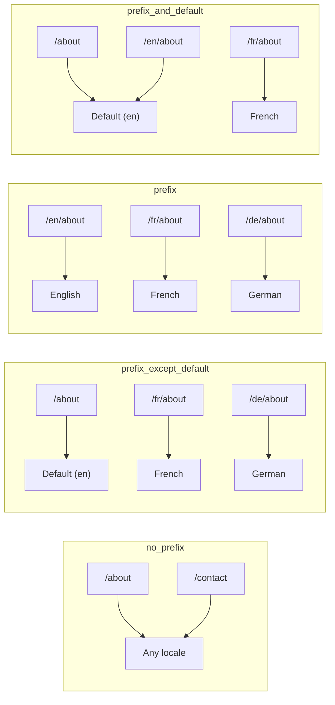
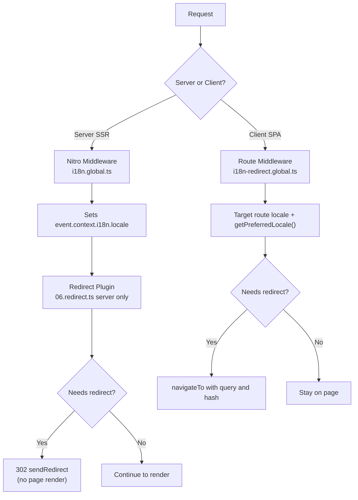

# 🗂️ Strategi Perutean di Nuxt I18n Micro

## 📖 Ikhtisar

Nuxt I18n Micro mengontrol bagaimana awalan lokal muncul di URL melalui opsi `strategy`. Di bawah kap mesin, dua paket mengimplementasikan hal ini:

- **`@i18n-micro/route-strategy`** — pembuatan rute pada saat build (memperluas halaman Nuxt dengan rute terlokalisasi)
- **`@i18n-micro/path-strategy`** — resolusi jalur pada runtime, pengalihan, atribut SEO, dan pembuatan tautan

Modul Nuxt memilih kelas strategi yang benar pada saat build dan mengaliaskannya melalui `#i18n-strategy`, sehingga hanya implementasi yang dipilih yang di-bundle.

## 🚦 Strategi yang Tersedia

{/* generated:option:strategy — do not edit; run `pnpm run docs:generate` */}

**Tipe** `Strategies` · **Default** `'prefix_except_default'`

Strategi perutean URL untuk awalan lokal.

- `'no_prefix'` — tidak ada lokal di URL; lokal disimpan di cookie.
- `'prefix_except_default'` — beri awalan pada semua lokal kecuali default.
- `'prefix'` — selalu beri awalan, termasuk lokal default.
- `'prefix_and_default'` — seperti `prefix`, tetapi lokal default juga dapat diakses tanpa awalan.

{/* /generated:option:strategy */}

### Perbandingan Strategi



### 🛑 `no_prefix`

URL tidak memiliki segmen lokal. Lokal ditentukan oleh cookie, state `useI18nLocale()`, atau deteksi peramban.

- **Rute**: `/about`, `/contact` — pola URL yang sama untuk semua lokal (tanpa awalan `/en/`, `/fr/`)
- **Persistensi lokal**: Melalui `localeCookie` (otomatis disetel ke `'user-locale'` jika tidak ditentukan)
- **Jalur kustom**: Didukung melalui [`globalLocaleRoutes`](/guides/configuration#globallocaleroutes) dan [`defineI18nRoute`](/guides/custom-locale-routes) — slug terlokalisasi dihasilkan tanpa menambahkan awalan lokal pada URL (mis. `/about` vs `/ueber-uns`). Rute bersarang, alias, dan pembatasan per lokal lebih sederhana dibandingkan pada `prefix_except_default`.

<Tip>
Saat menggunakan `no_prefix`, `localeCookie` secara otomatis disetel ke `'user-locale'` jika tidak ditentukan. Ini diperlukan karena URL tidak mengandung informasi lokal.
</Tip>

```typescript
i18n: {
  strategy: 'no_prefix'
  // localeCookie is automatically set to 'user-locale'
}
```

### 🚧 `prefix_except_default`

Semua rute memiliki awalan lokal **kecuali** lokal default.

- **Lokal default**: `/about`, `/contact`
- **Lokal lain**: `/fr/about`, `/de/contact`
- **Lokal default dengan awalan mengembalikan 404**: `/en/about` → 404 (ketika `en` adalah default)

```typescript
i18n: {
  strategy: 'prefix_except_default' // This is the default
}
```

### 🌍 `prefix`

Setiap rute memiliki awalan lokal, termasuk lokal default.

- **Semua lokal**: `/en/about`, `/fr/about`, `/de/about`
- **Root `/`**: Mengalihkan ke `/\{locale\}/` berdasarkan preferensi pengguna

```typescript
i18n: {
  strategy: 'prefix'
}
```

### 🔄 `prefix_and_default`

Lokal default tersedia baik dengan atau tanpa awalan. Lokal non-default selalu memiliki awalan.

- **Lokal default**: baik `/about` maupun `/en/about` valid
- **Lokal lain**: `/fr/about`, `/de/about`
- **Tidak ada pengalihan dari `/`**: Baik `/` maupun `/en/` menyajikan lokal default

```typescript
i18n: {
  strategy: 'prefix_and_default'
}
```

## 🔀 Arsitektur Pengalihan (v3)

Pada v3, logika pengalihan dibagi menjadi dua lapisan untuk performa optimal:

### Cara Kerjanya



### Sisi Server (Tanpa Flash)

1. **Middleware Nitro** (`i18n.global.ts`) berjalan terlebih dahulu — mendeteksi lokal dari URL, cookie, atau header `Accept-Language` dan menyetel `event.context.i18n.locale`
2. **Plugin pengalihan** (`06.redirect.ts`, hanya server) memeriksa apakah jalur saat ini memerlukan pengalihan menggunakan `i18nStrategy.getClientRedirect()` dan mengeluarkan 302 **sebelum** perenderan halaman terjadi
3. Ini mencegah "flash kesalahan" di mana pengguna sebentar melihat halaman yang salah sebelum pengalihan

### Sisi Klien (Navigasi SPA)

1. Middleware rute global (`i18n-redirect.global.ts`) berjalan pada setiap navigasi klien saat `redirects` diaktifkan
2. Menurunkan lokal yang disukai dari **rute target** terlebih dahulu, lalu jatuh kembali ke `useI18nLocale().getPreferredLocale()`
3. Menggunakan `i18nStrategy.getClientRedirect()` untuk memutuskan apakah pengalihan diperlukan
4. Mempertahankan `query` dan `hash` saat mengalihkan

### Urutan Prioritas Lokal

Pada server, plugin pengalihan menentukan lokal yang disukai dalam urutan ini:

1. **`useState('i18n-locale')`** — prioritas tertinggi (disetel secara programatik melalui `useI18nLocale().setLocale()`)
2. **Cookie** — jika `localeCookie` dikonfigurasi
3. **Header `Accept-Language`** — jika `autoDetectLanguage: true`
4. **`defaultLocale`** — fallback akhir

Pada klien, middleware rute lebih memilih lokal dari rute target, lalu menggunakan rantai fallback state/cookie yang sama.

### Perilaku Pengalihan per Strategi

| Strategi                | Perilaku `GET /`                              | Perlu cookie? |
| ----------------------- | --------------------------------------------- | ---------------- |
| `no_prefix`             | Tidak ada pengalihan (lokal dari cookie/state)        | Otomatis disetel         |
| `prefix`                | 302 → `/\{locale\}/`                            | Direkomendasikan      |
| `prefix_except_default` | 302 → `/\{locale\}/` jika lokal ≠ default        | Direkomendasikan      |
| `prefix_and_default`    | Tidak ada pengalihan (baik `/` dan `/\{locale\}/` valid) | Opsional         |

### Menonaktifkan Pengalihan

```typescript
i18n: {
  redirects: false // Disables automatic locale redirects
}
```

Ketika `redirects: false`, pengalihan lokal otomatis dinonaktifkan:

- **Server**: plugin pengalihan (`06.redirect.ts`, hanya server) tetap terdaftar tetapi melewati logika pengalihan. Ia masih melakukan **pemeriksaan 404** untuk awalan lokal yang tidak valid (mis. `/xx/about` di mana `xx` bukan lokal yang valid) dan **sinkronisasi cookie** dari awalan URL (mis. mengunjungi `/fr/about` menyinkronkan cookie ke `fr`)
- **Klien**: middleware rute global `i18n-redirect` **tidak terdaftar** — tidak ada auto-redirect SPA

## 🍪 Persistensi Lokal Berbasis Cookie

<Warning>
Saat menggunakan `prefix` atau `prefix_except_default` dengan `redirects: true` (default), Anda **harus** menyetel `localeCookie` agar pengalihan bekerja dengan benar. Tanpa cookie, plugin pengalihan tidak dapat mengingat preferensi lokal pengguna di seluruh reload halaman.

```typescript
i18n: {
  strategy: 'prefix_except_default',
  localeCookie: 'user-locale' // Required for redirects to work properly
}
```
</Warning>

**Cara kerja `localeCookie` di v3:**

- Dikelola secara internal oleh `useI18nLocale()` — **jangan setel secara manual** melalui `useCookie()`
- Ketika pengguna mengunjungi URL dengan awalan (mis. `/fr/about`), cookie otomatis disinkronkan ke `fr`
- Pada kunjungan berikutnya ke `/`, nilai cookie digunakan untuk mengalihkan ke `/\{locale\}/`
- Jika cookie berisi lokal yang tidak valid (tidak ada dalam daftar `locales`), akan jatuh kembali ke `defaultLocale`

| Strategi                | Default `localeCookie` | Catatan                                |
| ----------------------- | ---------------------- | ------------------------------------ |
| `no_prefix`             | Otomatis: `'user-locale'`  | Diperlukan; disetel otomatis          |
| `prefix`                | `null` (dinonaktifkan)      | Setel ke `'user-locale'` untuk pengalihan |
| `prefix_except_default` | `null` (dinonaktifkan)      | Setel ke `'user-locale'` untuk pengalihan |
| `prefix_and_default`    | `null` (dinonaktifkan)      | Opsional                             |

## 🔍 `autoDetectLanguage` dan `autoDetectPath`

### `autoDetectLanguage`

{/* generated:option:autoDetectLanguage — do not edit; run `pnpm run docs:generate` */}

**Tipe** `boolean` · **Default** `true`

Secara otomatis mendeteksi bahasa yang disukai pengguna dari header HTTP `Accept-Language`.
Digunakan bersama `autoDetectPath` untuk memutuskan kapan deteksi terjadi.

{/* /generated:option:autoDetectLanguage */}

Pemeriksaan berjalan di middleware server dan bersifat fallback: cookie atau state yang ada menang.

```typescript
i18n: {
  autoDetectLanguage: true
}
```

### `autoDetectPath`

{/* generated:option:autoDetectPath — do not edit; run `pnpm run docs:generate` */}

**Tipe** `string` · **Default** `'/'`

Di mana pengalihan preferensi cookie / Accept-Language dapat berjalan (saat `redirects` diaktifkan).

- `'/'` — hanya `/` (tautan langsung pada lokal default tetap dapat dijangkau; default)
- `'no_prefix'` — hanya jalur tanpa awalan lokal
- `'*'` — setiap jalur, termasuk menulis ulang awalan lokal eksplisit
  (mis. `/fr/about` → `/de/about` ketika cookie memilih `de`)

- string lain apa pun — pencocokan jalur persis (mis. `'/welcome'`)

Pembersihan strategi dengan awalan (mis. `/en` → `/` di bawah `prefix_except_default`) tidak dibatasi.

{/* /generated:option:autoDetectPath */}

```typescript
i18n: {
  autoDetectPath: '/' // Default: only root
  // autoDetectPath: '*' // All paths — redirects even /fr/about to /de/about
}
```

<Warning>
Dengan `autoDetectPath: '*'`, bahkan URL dengan awalan lokal eksplisit (mis. `/fr/about`) akan dialihkan jika lokal yang disukai pengguna berbeda. Ini dapat berguna untuk pengaturan berbasis domain, tetapi mungkin membingungkan pengguna yang berbagi URL.
</Warning>

Dengan default `autoDetectPath: '/'` dan cookie lokal:

| permintaan | cookie | hasil |
| --- | --- | --- |
| `/` | `de` | 302 → `/de` |
| `/about` | `de` | 200, lokal default (tanpa penulisan ulang) |

```typescript
i18n: {
  localeCookie: 'user-locale',
  strategy: 'prefix_except_default',
  // Default — remember language on entry, keep deep links stable
  autoDetectPath: '/',
  // Or redirect on every unprefixed path (but not /de/… → /fr/…):
  // autoDetectPath: 'no_prefix',
}
```

## ⚠️ Masalah yang Diketahui dan Praktik Terbaik

### 1. Hydration Mismatch pada Strategi `no_prefix`

Saat menggunakan `no_prefix`, lokal ditentukan secara dinamis. Jika server dan klien tidak sepakat tentang lokalnya, Anda akan melihat hydration mismatch.

**Solusi**: Gunakan `useI18nLocale().setLocale()` di plugin server (dengan `order: -10`) untuk menyetel lokal sebelum inisialisasi i18n:

```ts
// plugins/i18n-loader.server.ts
export default defineNuxtPlugin({
  name: 'i18n-custom-loader',
  enforce: 'pre',
  order: -10,
  setup() {
    const { setLocale } = useI18nLocale()
    setLocale('ja') // Your detection logic here
  },
})
```

Lihat [Deteksi Bahasa Kustom](/guides/custom-language-detection) untuk contoh yang lebih rinci.

### 2. Gunakan Rute Bernama dengan `localeRoute`

Perutean berbasis jalur dapat menyebabkan masalah pada resolusi rute:

```typescript
// May cause issues
$localeRoute('/page')

// Preferred approach
$localeRoute({ name: 'page' })
```

### 3. Menggunakan `pages: false` dengan i18n

Saat menggunakan Nuxt dengan `pages: false`:

```typescript
export default defineNuxtConfig({
  pages: false,
  i18n: {
    strategy: 'no_prefix', // Recommended
    disablePageLocales: true, // Required
    localeCookie: 'user-locale', // Required for persistence
  },
})
```

**Keterbatasan dengan `pages: false`:**

- Tidak ada pengalihan otomatis
- Tidak ada deteksi lokal berbasis URL
- Peralihan lokal sisi klien memerlukan reload halaman atau pemuatan terjemahan secara manual

### 4. Penanganan Cookie yang Tidak Valid

Jika cookie berisi lokal yang tidak valid (tidak ada dalam daftar `locales`), modul dengan lancar akan jatuh kembali ke `defaultLocale`. Tidak ada kesalahan yang dilemparkan.

## 📝 Ringkasan Praktik Terbaik

| Rekomendasi            | Detail                                                                             |
| ------------------------- | ----------------------------------------------------------------------------------- |
| **Setel `localeCookie`**    | Selalu setel untuk strategi awalan dengan `redirects: true`                             |
| **Gunakan `useI18nLocale()`** | Cara terpusat untuk mengelola state lokal (menggantikan `useState`/`useCookie` manual) |
| **Gunakan rute bernama**      | `$localeRoute(\{ name: 'page' \})` daripada `$localeRoute('/page')`                       |
| **Lokal programatik**   | Gunakan `useI18nLocale().setLocale()` di plugin server dengan `order: -10`              |
| **Hindari cookie manual**  | Jangan gunakan `useCookie('user-locale')` secara langsung — `useI18nLocale()` mengelola ini      |
