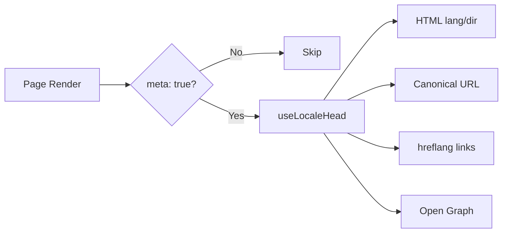

# 🌐 Panduan SEO untuk Nuxt I18n Micro

## 📖 Pendahuluan

SEO (Search Engine Optimization) yang efektif sangat penting untuk memastikan bahwa situs multibahasa Anda dapat diakses dan terlihat oleh pengguna di seluruh dunia melalui mesin pencari. `Nuxt I18n Micro` menyederhanakan proses pengelolaan SEO untuk situs multibahasa dengan secara otomatis menghasilkan tag meta dan atribut penting yang memberi tahu mesin pencari tentang struktur dan konten situs Anda.

Panduan ini menjelaskan bagaimana `Nuxt I18n Micro` menangani SEO untuk meningkatkan visibilitas situs Anda dan pengalaman pengguna tanpa memerlukan konfigurasi tambahan.

## ⚙️ Penanganan SEO Otomatis

### Alur Pembuatan Meta SEO



**Tag yang dihasilkan:**

| Tag             | Contoh                                                  |
| --------------- | -------------------------------------------------------- |
| Atribut HTML | `<html lang="en" dir="ltr">`                             |
| Canonical       | `<link rel="canonical" href="...">`                      |
| hreflang        | `<link rel="alternate" hreflang="en" href="...">`        |
| x-default       | `<link rel="alternate" hreflang="x-default" href="...">` |
| Open Graph      | `<meta property="og:locale" content="en_US">`            |

#### `og` per lokal (`og:locale` vs BCP 47)

`<html lang>` dan `hreflang` menggunakan **BCP 47** melalui `locale.iso` (mis. `ar-AE`).  
Open Graph memerlukan **`language_TERRITORY`** dengan **underscore** (`ar_AE`), sesuai [protokol OG](https://ogp.me/).

Secara default, `og:locale` diturunkan dari `iso` saat pemetaannya tidak ambigu (`en-US` → `en_US`).  
Setel string **`og`** yang eksplisit saat Anda membutuhkan nilai kustom (mis. `zh-Hans` → `zh_CN`).  
Jika tidak ada `og` maupun `iso` yang dapat dikonversi, tag `og:locale` tidak dihasilkan — di development Anda mendapat peringatan konsol (menghormati `missingWarn`).

```typescript
i18n: {
  meta: true,
  locales: [
    { code: 'ar', iso: 'ar-AE', og: 'ar_AE', dir: 'rtl' },
    { code: 'en', iso: 'en-US' }, // og:locale → en_US
    { code: 'zh', iso: 'zh-Hans', og: 'zh_CN' }, // script tags need explicit og
  ],
}
```

### 🔑 Fitur SEO Utama

Saat opsi `meta` diaktifkan di `Nuxt I18n Micro`, modul secara otomatis mengelola aspek SEO berikut:

1. **🌍 Atribut Bahasa dan Arah**:
   - Modul menyetel atribut `lang` dan `dir` pada tag `<html>` sesuai dengan lokal saat ini dan arah teks (mis. `ltr` untuk bahasa Inggris atau `rtl` untuk bahasa Arab).

2. **🔗 URL Canonical**:
   - Modul menghasilkan tautan canonical (`<link rel="canonical">`) untuk setiap halaman, memastikan bahwa mesin pencari mengenali versi utama konten.

3. **🌐 Tautan Bahasa Alternatif (`hreflang`)**:
   - Modul secara otomatis menghasilkan tag `<link rel="alternate" hreflang="">` untuk semua lokal yang tersedia. Ini membantu mesin pencari memahami versi bahasa mana yang tersedia untuk konten Anda, meningkatkan pengalaman pengguna untuk audiens global.
   - Setiap lokal mengeluarkan **satu** tag: `hreflang = iso || code`. Saat `iso` disetel, `code` perutean tidak pernah digunakan sebagai `hreflang` (sehingga kunci pasar seperti `mx` tidak menjadi tag bahasa yang tidak valid).
   - Opsional `hreflangBaseLanguage: true` juga mengeluarkan tag bahasa polos yang diturunkan dari `iso` (mis. `es-ES` → `es`), diklaim oleh lokal regional pertama di `locales`.

4. **🌏 Hreflang `x-default`**:
   - Modul secara otomatis menghasilkan tag `<link rel="alternate" hreflang="x-default">` yang menunjuk ke URL lokal default. Ini memberi tahu mesin pencari URL mana yang harus ditampilkan kepada pengguna yang bahasanya tidak cocok dengan lokal yang didefinisikan. Tidak diperlukan konfigurasi tambahan — ini bekerja secara otomatis saat `meta: true` disetel.

5. **🔖 Metadata Open Graph**:
   - Modul menghasilkan tag meta Open Graph (`og:locale`, `og:url`, dll.) untuk setiap lokal, yang sangat berguna untuk berbagi di media sosial dan pengindeksan mesin pencari.

### 🛠️ Konfigurasi

Untuk mengaktifkan fitur SEO ini, pastikan opsi `meta` disetel ke `true` di file `nuxt.config.ts` Anda:

```typescript
export default defineNuxtConfig({
  modules: ['nuxt-i18n-micro'],
  i18n: {
    locales: [
      { code: 'en', iso: 'en-US', dir: 'ltr' },
      { code: 'fr', iso: 'fr-FR', dir: 'ltr' },
      { code: 'ar', iso: 'ar-SA', dir: 'rtl' },
    ],
    defaultLocale: 'en',
    translationDir: 'locales',
    meta: true, // Enables automatic SEO management
  },
})
```

### 🌍 `metaBaseUrl` Dinamis untuk Deployment Multi-Domain

Saat `metaBaseUrl` tidak disetel, URL SEO absolut diselesaikan dalam urutan ini (#240):

1. `site.url` dari [`nuxt-site-config`](https://nuxtseo.com/docs/site-config) (jika modul tersebut hadir — mis. melalui `@nuxtjs/seo`)
2. Jika tidak, hostname dari permintaan saat ini (`useRequestURL()` / `window.location.origin`)

Fallback origin permintaan menghormati header reverse proxy (`X-Forwarded-Host`, `X-Forwarded-Proto`), sehingga bekerja dengan benar di belakang nginx, Cloudflare, AWS ALB, dan proxy serupa.

Ini berarti aplikasi yang sudah menyetel `site.url` untuk sitemap / robots / schema.org **tidak** memerlukan deklarasi `metaBaseUrl` kedua:

```typescript
export default defineNuxtConfig({
  site: {
    url: process.env.NUXT_SITE_URL, // also used by micro for canonical / og:url / hreflang
  },
  i18n: {
    meta: true,
    // metaBaseUrl omitted — picks up site.url, then request origin
  },
})
```

Tanpa `site.url`, satu instance aplikasi masih dapat melayani **beberapa domain** dengan tag SEO yang benar untuk masing-masing melalui origin permintaan:

```typescript
export default defineNuxtConfig({
  i18n: {
    meta: true,
    // metaBaseUrl is undefined by default — resolved dynamically from the request
  },
})
```

Contohnya, permintaan ke `https://site-a.com/en/about` akan menghasilkan:

```html
<link rel="canonical" href="https://site-a.com/en/about" /> <meta property="og:url" content="https://site-a.com/en/about" />
```

Sedangkan aplikasi yang sama yang melayani `https://site-b.com/en/about` akan menghasilkan:

```html
<link rel="canonical" href="https://site-b.com/en/about" /> <meta property="og:url" content="https://site-b.com/en/about" />
```

Jika Anda membutuhkan URL dasar tetap yang selalu menang atas `site.url`, oper string statis:

```typescript
metaBaseUrl: 'https://example.com'
```

### 🔍 Whitelist Query Canonical

Secara default, parameter query dihapus dari canonical dan `og:url` untuk menghindari konten duplikat. Anda dapat mem-whitelist parameter query tertentu yang harus dipertahankan:

```typescript
i18n: {
  canonicalQueryWhitelist: ['page', 'sort', 'filter', 'search', 'q', 'query', 'tag']
}
```

Hanya parameter yang terdaftar di `canonicalQueryWhitelist` yang akan muncul di URL canonical. Semua parameter query lainnya (mis. tracking, ID sesi) dihapus.

### 🚫 Menonaktifkan Tag Meta per Halaman

Anda dapat menonaktifkan pembuatan tag meta SEO untuk halaman tertentu menggunakan `defineI18nRoute()`:

```vue
<script setup>
// Disable all SEO meta tags for this page
defineI18nRoute({
  disableMeta: true,
})
</script>
```

Anda juga dapat menonaktifkan meta hanya untuk lokal tertentu:

```vue
<script setup>
// Disable meta tags only for English locale on this page
defineI18nRoute({
  disableMeta: ['en'],
})
</script>
```

Saat `disableMeta` aktif, tidak ada tag `hreflang`, `canonical`, `og:locale`, `og:url`, atau `x-default` yang dihasilkan untuk halaman/lokal yang terpengaruh.

### 🔇 Lokal yang Dinonaktifkan

Lokal dengan `disabled: true` secara otomatis dikecualikan dari semua pembuatan tag SEO — tidak ada `hreflang`, `og:locale:alternate`, atau tautan alternatif yang dibuat untuknya:

```typescript
i18n: {
  locales: [
    { code: 'en', iso: 'en-US' },
    { code: 'fr', iso: 'fr-FR', disabled: true }, // excluded from SEO tags
  ]
}
```

### 🙈 Opt-out lokal (`seo: false`)

Untuk lokal yang harus tetap dapat dirutekan dan diterjemahkan tetapi tidak boleh muncul di tag penemuan lintas lokal, setel `seo: false`. Lokal tersebut dihilangkan dari alternatif `hreflang` dan `og:locale:alternate`. Jika lokal **default** yang dikonfigurasi memiliki `seo: false`, tautan `x-default` juga tidak dikeluarkan.

```typescript
i18n: {
  locales: [
    { code: 'en', iso: 'en-US' },
    { code: 'ru', iso: 'ru-RU', seo: false }, // internal / non-indexed locale
  ]
}
```

### 📌 Perilaku Spesifik Strategi

| Strategi                | Tautan hreflang   | x-default             | canonical      | og:url |
| ----------------------- | ---------------- | --------------------- | -------------- | ------ |
| `prefix`                | ✅ Semua lokal   | ✅ URL lokal default | ✅ URL saat ini | ✅     |
| `prefix_except_default` | ✅ Semua lokal   | ✅ URL tanpa awalan     | ✅ URL saat ini | ✅     |
| `prefix_and_default`    | ✅ Semua lokal   | ✅ URL lokal default | ✅ URL saat ini | ✅     |
| `no_prefix`             | ❌ Tidak dihasilkan | ❌ Tidak dihasilkan      | ✅ URL saat ini | ✅     |

Untuk strategi `no_prefix`, hanya `canonical`, `og:url`, `og:locale`, dan atribut `html` (`lang`, `dir`) yang dihasilkan. Tautan bahasa alternatif (`hreflang`) dan `x-default` tidak dihasilkan karena tidak ada URL yang berbeda per lokal.

## Override tingkat halaman (`useI18nHead`)

Untuk **artikel, panduan, atau konten CMS apa pun** di mana tidak setiap lokal ada atau URL berasal dari API, gunakan [`useI18nHead`](/api/composables/use-i18n-head) pada halaman alih-alih plugin head i18n kustom.

### Artikel dengan terjemahan sebagian

```vue
<script setup lang="ts">
const article = await loadArticle()
// article.locales = { en: '...', de: '...' } — only translated locales

useI18nHead({
  meta: [{ property: 'og:title', content: article.title }],
  replace: {
    hreflang: Object.entries(article.locales).map(([locale, href]) => ({
      rel: 'alternate',
      hreflang: locale,
      href,
    })),
    ogAlternates: Object.keys(article.locales),
  },
})
</script>
```

### Slug per lokal dengan `$setI18nRouteParams`

Saat slug berbeda per bahasa, setel parameter rute terlebih dahulu, lalu timpa alternatif dengan URL yang sebenarnya:

```vue
<script setup lang="ts">
const { $defineI18nRoute, $setI18nRouteParams } = useNuxtApp()
const { data: article } = await useFetch(`/api/articles/${slug}`)

$defineI18nRoute({
  localeRoutes: { en: '/blog/[slug]', de: '/de/blog/[slug]' },
})

$setI18nRouteParams({
  en: { slug: article.value.slugEn },
  de: { slug: article.value.slugDe },
})

useI18nHead({
  replace: {
    hreflang: ['en', 'de'].map((locale) => ({
      rel: 'alternate',
      hreflang: locale,
      href: article.value.urls[locale],
    })),
    ogAlternates: ['en', 'de'],
  },
})
</script>
```

### Origin HTTPS di belakang proxy

Untuk URL absolut yang benar pada SSR tanpa composable origin kustom:

```ts
i18n: {
  meta: true,
  metaBaseUrl: undefined,
  metaTrustForwardedHost: true,
  metaTrustForwardedProto: true,
}
```

Contoh lebih banyak (canonical override, `x-default`, fetch reaktif, helper bersama): [composable useI18nHead](/api/composables/use-i18n-head).

### ⚠️ Trailing Slash

Modul menghasilkan URL canonical dan `hreflang` berdasarkan jalur aktual dari `useRoute().fullPath`. Jika aplikasi Anda menggunakan trailing slash (mis. melalui `router.options` Nuxt), URL yang dihasilkan akan mencerminkan hal ini. Namun, `$switchLocalePath` dapat menormalkan jalur dan menghapus trailing slash. Jika konsistensi trailing slash penting untuk SEO Anda, verifikasi bahwa URL yang dihasilkan cocok dengan struktur URL aplikasi Anda.

### 🎯 Manfaat

Dengan mengaktifkan opsi `meta`, Anda mendapatkan manfaat:

- **📈 Peringkat Mesin Pencari yang Lebih Baik**: Mesin pencari dapat mengindeks situs Anda dengan lebih baik, memahami hubungan antar versi bahasa yang berbeda.
- **👥 Pengalaman Pengguna yang Lebih Baik**: Pengguna disajikan versi bahasa yang benar berdasarkan preferensi mereka, mengarah pada pengalaman yang lebih dipersonalisasi.
- **🔧 Konfigurasi Manual Berkurang**: Modul menangani tugas SEO secara otomatis, membebaskan Anda dari kebutuhan menambahkan tag meta dan atribut yang berhubungan dengan SEO secara manual.

## 🔗 Nuxt SEO (`@nuxtjs/seo`)

[`@nuxtjs/seo`](https://nuxtseo.com/) menyatukan sitemap, robots, schema.org, gambar OG, dan modul terkait. Ia terintegrasi dengan **nuxt-i18n-micro** melalui [`nuxt-site-config`](https://nuxtseo.com/docs/site-config/guides/i18n) (v4+).

### Persyaratan

- **`@nuxtjs/seo` 3+** (rilis saat ini menggunakan `nuxt-site-config` 4+, yang mendaftarkan plugin `nuxt-site-config:i18n` untuk micro)
- **`i18n.meta: true`** (direkomendasikan — micro menyediakan tag head yang sadar lokal; Nuxt SEO menambahkan sitemap, schema.org, dll.)

### Urutan modul

Daftarkan **nuxt-i18n-micro sebelum `@nuxtjs/seo`** agar site config dapat membaca pengaturan lokal Anda:

```typescript
export default defineNuxtConfig({
  modules: ['nuxt-i18n-micro', '@nuxtjs/seo'],
  site: {
    url: 'https://example.com',
    name: 'My Site',
  },
  i18n: {
    meta: true,
    defaultLocale: 'en',
    locales: [
      { code: 'en', iso: 'en-US' },
      { code: 'de', iso: 'de-DE' },
    ],
  },
})
```

### Nama situs & deskripsi yang diterjemahkan

Nuxt Site Config membaca kunci terjemahan opsional dari file lokal Anda:

```json
{
  "nuxtSiteConfig": {
    "name": "My Site",
    "description": "My site description"
  }
}
```

Nilai per lokal di `locales/en.json`, `locales/de.json`, dan sebagainya akan diambil secara otomatis.

### Pemecahan Masalah

Jika Anda melihat `Plugin nuxt-seo:defaults depends on nuxt-site-config:i18n but they are not registered`, upgrade **`@nuxtjs/seo` ke 3+** (lihat [issue #133](https://github.com/s00d/nuxt-i18n-micro/issues/133)). `nuxt-site-config` 3.x yang lebih lama hanya menghubungkan i18n untuk `@nuxtjs/i18n`, bukan micro.

Lebih lanjut: [Panduan i18n Sitemap](https://nuxtseo.com/docs/sitemap/guides/i18n), [Panduan i18n Site Config](https://nuxtseo.com/docs/site-config/guides/i18n).
