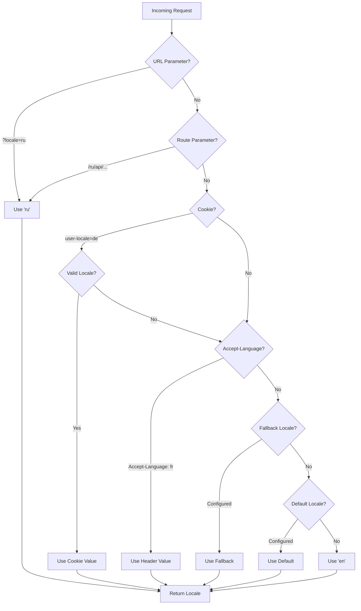

# 🌍 Terjemahan Sisi Server dan Informasi Lokal di Nuxt I18n Micro

## 📖 Ikhtisar

Nuxt I18n Micro mendukung terjemahan sisi server dan informasi lokal, memungkinkan Anda menerjemahkan konten dan mengakses detail lokal di server. Ini sangat berguna untuk API atau aplikasi yang dirender server yang membutuhkan lokalisasi sebelum mencapai klien.

Terjemahan menggunakan pesan lokal yang didefinisikan di konfigurasi Nuxt I18n dan diselesaikan secara dinamis berdasarkan lokal yang terdeteksi.

Secara default (`translationPayloads.mode: 'premerged'`), file tingkat root di-bake ke setiap payload halaman saat build sebagai `\{page\}/\{locale\}/data.json`. Server memuat file yang telah di-build yang sama seperti yang diambil klien di bawah `/\{apiBaseUrl\}/...`, sehingga semua kunci (baik bersama maupun per halaman) tersedia di handler server.

Dengan `translationPayloads.mode: 'source'`, file sumber yang ringkas digabungkan pada runtime saat `loadTranslationsFromServer()` (atau rute `/_locales`) dipanggil — pada **Edge** melalui `serverAssets` Nitro, pada **Node** dari salinan publik opsional. Lihat [Panduan Performa — Serverless Payload Output](/guides/performance#serverless-payload-output) dan [Arsitektur Cache & Penyimpanan](/api/cache) untuk detailnya.

Untuk daftar konsolidasi API runtime dan server, lihat [Referensi API](/api/overview).

## 🛠️ Menyiapkan Middleware Sisi Server

Untuk mengaktifkan terjemahan sisi server dan informasi lokal, gunakan fungsi middleware yang disediakan:

- `useTranslationServerMiddleware` - untuk menerjemahkan konten
- `useLocaleServerMiddleware` - untuk mengakses informasi lokal

Kedua fungsi middleware ini secara otomatis tersedia di semua rute server.

Logika deteksi lokal dibagikan antara kedua fungsi middleware ini melalui fungsi utilitas `detectCurrentLocale` untuk memastikan konsistensi di seluruh modul.

## ✨ Menggunakan Terjemahan di Handler Server

Anda dapat menerjemahkan konten dengan mulus di `eventHandler` mana pun dengan menggunakan middleware terjemahan.

### Contoh: Penggunaan Terjemahan Dasar

```typescript
import { defineEventHandler } from 'h3'

export default defineEventHandler(async (event) => {
  const t = await useTranslationServerMiddleware(event)
  return {
    message: t('greeting'), // Returns the translated value for the key "greeting"
  }
})
```

Pada contoh ini:

- Lokal pengguna dideteksi secara otomatis dari parameter query, cookie, atau header.
- Fungsi `t` mengambil terjemahan yang sesuai untuk lokal yang terdeteksi.

## 🌍 Menggunakan Informasi Lokal di Handler Server

### Penggunaan Informasi Lokal Dasar

```typescript
import { defineEventHandler } from 'h3'

export default defineEventHandler((event) => {
  const localeInfo = useLocaleServerMiddleware(event)

  return {
    success: true,
    data: localeInfo,
    timestamp: new Date().toISOString(),
  }
})
```

### Memberikan Parameter Lokal Kustom

```typescript
import { defineEventHandler } from 'h3'

export default defineEventHandler((event) => {
  // Force specific locale with custom default
  const localeInfo = useLocaleServerMiddleware(event, 'en', 'ru')

  return {
    success: true,
    data: localeInfo,
    timestamp: new Date().toISOString(),
  }
})
```

### Struktur Respons

Middleware lokal mengembalikan objek `LocaleInfo` dengan properti berikut:

```typescript
interface LocaleInfo {
  current: string // Current detected locale code
  default: string // Default locale code
  fallback: string // Fallback locale code
  available: string[] // Array of all available locale codes
  locale: Locale | null // Full locale configuration object
  isDefault: boolean // Whether current locale is the default
  isFallback: boolean // Whether current locale is the fallback
}
```

### Contoh Respons

```json
{
  "success": true,
  "data": {
    "current": "ru",
    "default": "en",
    "fallback": "en",
    "available": ["en", "ru", "de"],
    "locale": {
      "code": "ru",
      "iso": "ru-RU",
      "dir": "ltr",
      "displayName": "Русский"
    },
    "isDefault": false,
    "isFallback": false
  },
  "timestamp": "2024-01-15T10:30:00.000Z"
}
```

## 🌐 Menyediakan Lokal Kustom

Jika Anda perlu menentukan lokal secara manual (misalnya, untuk pengujian atau permintaan tertentu), Anda dapat mengopernya ke middleware terjemahan:

### Contoh: Lokal Kustom

```typescript
import { defineEventHandler } from 'h3'

function detectLocale(event): string | null {
  const urlSearchParams = new URLSearchParams(event.node.req.url?.split('?')[1])
  const localeFromQuery = urlSearchParams.get('locale')
  if (localeFromQuery) return localeFromQuery

  return 'en'
}

export default defineEventHandler(async (event) => {
  const t = await useTranslationServerMiddleware(event, 'en', detectLocale(event)) // Force French local, en - default locale
  return {
    message: t('welcome'), // Returns the French translation for "welcome"
  }
})
```

## 📋 Logika Deteksi Lokal

Kedua fungsi middleware secara otomatis menentukan lokal pengguna dengan urutan prioritas berikut:



1. **Parameter URL**: `?locale=ru`
2. **Parameter Rute**: `/ru/api/endpoint`
3. **Cookie**: cookie `user-locale`
4. **Header HTTP**: header `Accept-Language`
5. **Lokal Fallback**: Sebagaimana dikonfigurasi pada opsi modul
6. **Lokal Default**: Sebagaimana dikonfigurasi pada opsi modul
7. **Fallback Hardcoded**: `'en'`

> **Catatan**: Logika deteksi lokal dibagikan antara `useLocaleServerMiddleware` dan `useTranslationServerMiddleware` untuk memastikan konsistensi di seluruh modul.

## 📋 Contoh Penggunaan Lanjutan

### Respons Bersyarat Berdasarkan Lokal

```typescript
import { defineEventHandler } from 'h3'

export default defineEventHandler((event) => {
  const { current, isDefault, locale } = useLocaleServerMiddleware(event)

  // Return different content based on locale
  if (current === 'ru') {
    return {
      message: 'Привет, мир!',
      locale: current,
      isDefault,
    }
  }

  if (current === 'de') {
    return {
      message: 'Hallo, Welt!',
      locale: current,
      isDefault,
    }
  }

  // Default English response
  return {
    message: 'Hello, World!',
    locale: current,
    isDefault,
  }
})
```

### Deteksi Lokal Kustom

```typescript
import { defineEventHandler } from 'h3'

export default defineEventHandler((event) => {
  // Force German locale with English as fallback
  const { current, isDefault, locale } = useLocaleServerMiddleware(event, 'en', 'de')

  return {
    message: 'Hallo, Welt!',
    locale: current,
    isDefault: false, // Will be false since we forced German
  }
})
```

### API yang Sadar Lokal dengan Validasi

```typescript
import { defineEventHandler, createError } from 'h3'

export default defineEventHandler((event) => {
  const { current, available, locale } = useLocaleServerMiddleware(event)

  // Validate if the detected locale is supported
  if (!available.includes(current)) {
    throw createError({
      statusCode: 400,
      statusMessage: `Unsupported locale: ${current}. Available locales: ${available.join(', ')}`,
    })
  }

  // Return locale-specific configuration
  return {
    locale: current,
    direction: locale?.dir || 'ltr',
    displayName: locale?.displayName || current,
    availableLocales: available,
  }
})
```

### Integrasi dengan Middleware Terjemahan

Anda dapat menggabungkan informasi lokal dengan middleware terjemahan untuk internasionalisasi yang komprehensif:

```typescript
import { defineEventHandler } from 'h3'

export default defineEventHandler(async (event) => {
  const localeInfo = useLocaleServerMiddleware(event)
  const t = await useTranslationServerMiddleware(event)

  return {
    locale: localeInfo.current,
    message: t('welcome_message'),
    availableLocales: localeInfo.available,
    isDefault: localeInfo.isDefault,
  }
})
```

## 📝 Praktik Terbaik

1. **Selalu validasi lokal**: Periksa apakah lokal yang terdeteksi ada di daftar lokal yang tersedia
2. **Gunakan logika fallback**: Berikan default yang masuk akal saat deteksi lokal gagal
3. **Cache informasi lokal**: Untuk aplikasi yang kritis performa, pertimbangkan untuk meng-cache hasil deteksi lokal
4. **Tangani kasus tepi**: Perhitungkan lokal yang tidak didukung dan berikan respons kesalahan yang sesuai
5. **Gabungkan dengan terjemahan**: Gunakan informasi lokal bersama middleware terjemahan untuk dukungan i18n yang lengkap

## 🚀 Pertimbangan Performa

- Kedua fungsi middleware ringan dan dirancang untuk eksekusi cepat
- Deteksi lokal menggunakan rantai fallback yang efisien
- Tidak ada panggilan API eksternal yang dilakukan selama deteksi lokal
- Hasil dihitung secara sinkron untuk performa yang optimal
