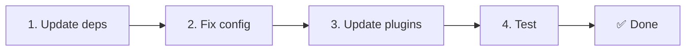

# 📦 Pemutakhiran dari v2.x ke v3.x

<Tip>
Lihat [Migrasi dari nuxt-i18n](/migration/from-nuxtjs-i18n) — panduan tersebut mencakup perpindahan dari ekosistem vue-i18n, bukan dari nuxt-i18n-micro v2.
</Tip>

v3.0.0 memperkenalkan perubahan arsitektur mendasar: paket strategi, sistem caching baru, manajemen lokal terpusat melalui `useI18nLocale()`, dan pipeline pengalihan yang dirancang ulang. Bagian ini mencakup semua perubahan yang menghancurkan dan cara memperbarui kode Anda.

## Langkah migrasi



## Ringkasan perubahan yang menghancurkan

- **State lokal** — `useState` / `useCookie` secara manual → composable `useI18nLocale()`
- **Akses konfigurasi** — `useRuntimeConfig().public.i18nConfig` → `getI18nConfig()` dari `#build/i18n.strategy.mjs`
- **Komponen pengalihan** — opsi `fallbackRedirectComponentPath` → Plugin pengalihan server + middleware rute klien (otomatis)
- **`includeDefaultLocaleRoute`** — Didukung (usang) → Dihapus, gunakan opsi `strategy`
- **`experimental.hmr`** — Di bawah `experimental` → Opsi tingkat root
- **`previousPageFallback`** — Dihapus sepenuhnya (strategi penggabungan kumulatif menangani ini secara otomatis)
- **Caching** — `useStorage('cache')` → Singleton `TranslationStorage` (`Symbol.for` pada `globalThis`)
- **Transfer SSR** — Konfigurasi runtime → Payload Nuxt (v3 menggunakan `useState`; chunk sekarang berada di `payload.data`, lihat [Kinerja](/guides/performance#server-side-payload-transfer))
- **Kelas strategi** — Internal → Paket terpisah (`@i18n-micro/route-strategy`, `@i18n-micro/path-strategy`)

## Dihapus: `fallbackRedirectComponentPath`

Opsi `fallbackRedirectComponentPath` dan komponen fallback `locale-redirect.vue` telah dihapus. Logika pengalihan sekarang ditangani oleh:

1. **Middleware server** (`i18n.global.ts`) — mengatur `event.context.i18n.locale`
2. **Plugin pengalihan server** (`06.redirect.ts`, khusus server) — pengalihan 302 sebelum render
3. **Middleware rute klien** (`i18n-redirect.global.ts`) — pengalihan SPA setelah hidrasi

```diff
 i18n: {
   strategy: 'prefix_except_default',
-  fallbackRedirectComponentPath: '~/components/MyRedirect.vue',
 }
```

Jika Anda memiliki logika pengalihan kustom di komponen fallback, terapkan di plugin server sebagai gantinya:

```ts
// plugins/i18n-loader.server.ts
export default defineNuxtPlugin({
  name: 'i18n-custom-redirect',
  enforce: 'pre',
  order: -10,
  setup() {
    const { setLocale } = useI18nLocale()
    // Your custom detection logic
    setLocale(detectedLocale)
  },
})
```

## Dihapus: `includeDefaultLocaleRoute`

Gunakan opsi `strategy` sebagai gantinya:

- `includeDefaultLocaleRoute: true` → `strategy: 'prefix'`
- `includeDefaultLocaleRoute: false` → `strategy: 'prefix_except_default'` (default)

```diff
 i18n: {
-  includeDefaultLocaleRoute: true,
+  strategy: 'prefix',
 }
```

## Akses konfigurasi: `getI18nConfig()` menggantikan `useRuntimeConfig`

```diff
- const config = useRuntimeConfig()
- const cookieName = config.public.i18nConfig?.localeCookie || 'user-locale'
+ import { getI18nConfig } from '#build/i18n.strategy.mjs'
+ const { localeCookie: configCookie } = getI18nConfig()
+ const cookieName = configCookie ?? 'user-locale'
```

## Manajemen lokal: `useI18nLocale()` menggantikan state manual

Di v2, Anda mungkin menggunakan `useState('i18n-locale')` atau `useCookie('user-locale')` secara langsung. Di v3, gunakan composable `useI18nLocale()` terpusat:

```diff
- const locale = useState('i18n-locale')
- const cookie = useCookie('user-locale')
- locale.value = 'fr'
- cookie.value = 'fr'
+ const { setLocale } = useI18nLocale()
+ setLocale('fr') // Updates both state and cookie atomically
```

Lihat [Deteksi bahasa kustom](/guides/custom-language-detection) untuk contoh rinci.

## Opsi eksperimental dipindahkan / dihapus

`hmr` telah dipindahkan dari `experimental` ke tingkat root. `previousPageFallback` telah dihapus sepenuhnya — modul sekarang menggunakan strategi penggabungan mendalam kumulatif (kedalaman 2 tingkat) yang secara otomatis mempertahankan terjemahan dari halaman sebelumnya selama animasi transisi, bahkan saat halaman berbagi kunci bersarang yang tumpang tindih. Setelah animasi transisi selesai, hook `page:transition:finish` membersihkan kunci halaman lama dari memori.

```diff
 i18n: {
-  experimental: {
-    hmr: true,
-    previousPageFallback: true
-  }
+  hmr: true,
+  // previousPageFallback removed — handled automatically
 }
```

## Arsitektur pengalihan (v3)

Pengalihan sekarang ditangani secara otomatis oleh dua komponen:

1. **Sisi server** (`06.redirect.ts`, khusus server): Berjalan selama SSR, mengeluarkan pengalihan 302 sebelum rendering halaman — tanpa "error flash"
2. **Sisi klien** (`i18n-redirect.global.ts`): Middleware rute global pada navigasi SPA; mempertahankan string kueri dan hash

Prioritas lokal untuk pengalihan:

1. `useState('i18n-locale')` — diatur melalui `useI18nLocale().setLocale()`
2. Cookie — jika `localeCookie` dikonfigurasi
3. Header `Accept-Language` — jika `autoDetectLanguage: true`
4. `defaultLocale` — fallback

Tidak ada perubahan kode yang diperlukan untuk pengaturan standar.

<Warning>
Untuk strategi `prefix` dan `prefix_except_default` dengan `redirects: true`, atur `localeCookie: 'user-locale'` untuk mengaktifkan persistensi lokal di seluruh pemuatan ulang halaman. Tanpa itu, pengalihan hanya menggunakan `Accept-Language` atau `defaultLocale`.
</Warning>

## TypeScript: tipe modul internal (opsional)

Jika Anda mengalami kesalahan tipe terkait impor internal seperti `#i18n-internal/plural`, `#i18n-internal/strategy`, atau `#i18n-internal/config`, tambahkan bagian `imports` ke `package.json` proyek Anda:

```json
{
  "imports": {
    "#i18n-internal/plural": "nuxt-i18n-micro/internals",
    "#i18n-internal/strategy": "nuxt-i18n-micro/internals",
    "#i18n-internal/config": "nuxt-i18n-micro/internals"
  }
}
```
