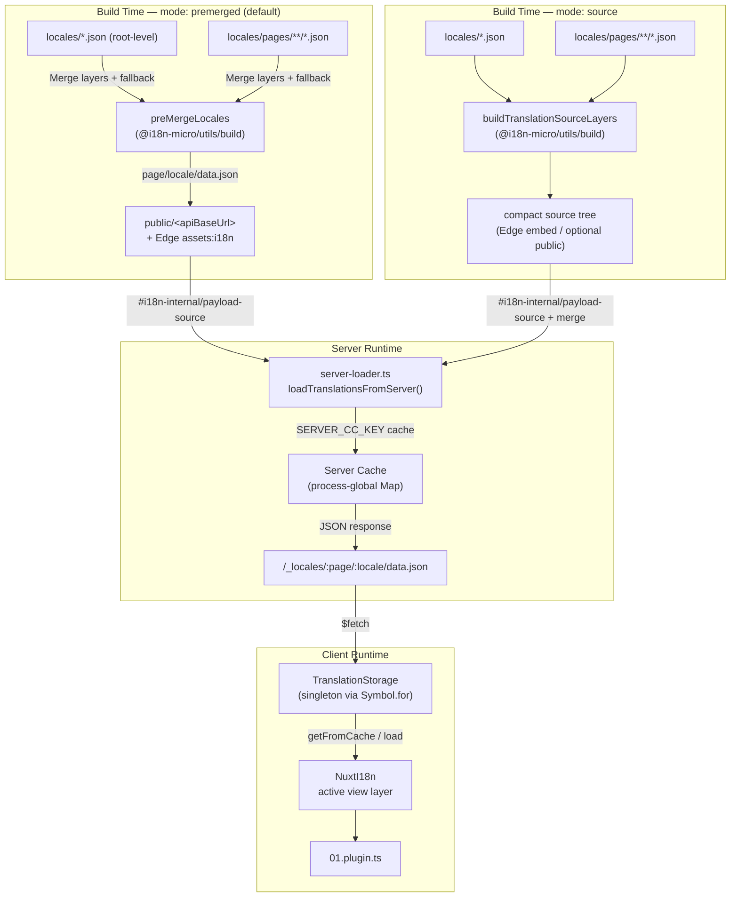

# 🗄️ Architettura di cache e storage delle traduzioni

## 📖 Panoramica

Nuxt I18n Micro v3 utilizza un'architettura di caching multi-livello per le traduzioni. Il caricamento dei payload dipende da `translationPayloads.mode`:

- **`premerged`** (predefinito) — file root, di pagina, di fallback e di layer vengono uniti in fase di build tramite `@i18n-micro/utils/build` in `\{page\}/\{locale\}/data.json`
- **`source`** — i file sorgente compatti vengono mantenuti per il merge a runtime tramite `@i18n-micro/utils/source-loader` e `@i18n-micro/utils/merge-source` (Edge li incorpora nei `serverAssets` Nitro; Node li legge da `public/` quando copiati)

Questa pagina descrive come funziona la cache integrata e come estenderla per casi d'uso personalizzati (strumenti di amministrazione, API esterne, invalidazione della cache).

## 📊 Panoramica dell'architettura

### Flusso dei dati



## 🧱 Componenti principali

### 1. `TranslationStorage` (Client + Server)

**File**: `src/runtime/utils/storage.ts`

Una classe singleton che fornisce uno storage unificato delle traduzioni sia per il client che per il server. Utilizza `Symbol.for('__NUXT_I18N_STORAGE_CACHE__')` su `globalThis` per garantire che esista una sola istanza, anche quando vengono caricati più bundle.

**Metodi principali:**

| Metodo                              | Descrizione                                                              |
| ----------------------------------- | ------------------------------------------------------------------------ |
| `getFromCache(locale, routeName?)`  | Controllo sincrono: restituisce i dati in memoria dalla cache o `null`   |
| `load(locale, routeName?, options)` | Caricamento asincrono con caching: controlla prima la cache, poi effettua fetch via `$fetch` |
| `clear()`                           | Svuota l'intera cache                                                    |

**Formato della chiave di cache**: `\{locale\}:\{routeName\}` (ad esempio, `en:index`, `fr:about`)

```typescript
import { translationStorage } from '../utils/storage'

// Synchronous cache check
const cached = translationStorage.getFromCache('en', 'index')

// Async load (with automatic caching)
const result = await translationStorage.load('en', 'index', {
  apiBaseUrl: '_locales',
  baseURL: '/',
  dateBuild: '2024-01-01',
})
// result.data — merged translations
// result.cacheKey — cache key used
```

### ⚙️ Cache busting deterministico (`i18n.dateBuild`)

Per impostazione predefinita, questo modulo genera `dateBuild` in fase di build usando `Date.now()`. Viene poi incorporato nel file generato `#build/i18n.strategy.mjs` e utilizzato come parametro di query (`?v=...`) per invalidare le cache di fetch delle traduzioni dopo le rebuild.

Se hai bisogno di build riproducibili (ad esempio, per migliorare i tassi di cache hit dei chunk nei deploy rolling), imposta un valore stabile in `nuxt.config`:

```ts
export default defineNuxtConfig({
  i18n: {
    // Any stable string/number (git SHA, CI build number, release tag, etc.)
    dateBuild: process.env.GIT_SHA ?? 'local-dev',
  },
})
```

### 2. `loadTranslationsFromServer()` (solo server)

**File**: `src/runtime/server/utils/server-loader.ts`

Carica le traduzioni per una coppia locale/pagina e memorizza il risultato unito in una mappa `CacheControl` globale del processo, con chiave da `@i18n-micro/hmr/cache-keys` (`SERVER_CC_KEY`).

Comportamento: SSR carica da `#i18n-internal/payload-source`. **Node** usa `readFile` sotto `public/<apiBaseUrl>` (`\{page\}/\{locale\}/data.json` in modalità premerged), **Edge** usa `assets:i18n`. `premerged` legge un file; `source` unisce root/page/fallback tramite `@i18n-micro/utils/source-loader`.

```typescript
import { loadTranslationsFromServer } from '../server/utils/server-loader'

// Returns { data: Translations, json: string }
const { data, json } = await loadTranslationsFromServer('en', 'index')
```

### 3. Caricamento client (nessun embed HTML)

I dizionari **non** vengono scritti in `nuxtApp.payload`. Il server li mantiene in memoria per il
rendering SSR; il plugin client fa `await` su `switchContext`, che carica `/\{apiBaseUrl\}/:page/:locale/data.json`
(stessa posizione predefinita di `@nuxtjs/i18n` con `experimental.preload: false`).

`NuxtI18n` mantiene il dizionario dello strato di view attivo usato da `$t()` e `$has()`. `NuxtTranslationLoader` cambia il contesto locale/route e unisce i chunk in quel layer.

### 4. Route API del server

**Route**: `/_locales/\{page\}/\{locale\}/data.json`

**File**: `src/runtime/server/routes/i18n.ts`

Questa route Nitro serve le traduzioni unite per la modalità di payload attiva. Chiama `loadTranslationsFromServer()` e restituisce il risultato come JSON.

In produzione imposta anche:

```http
Cache-Control: public, max-age={httpCacheDuration}, immutable
```

Il valore predefinito di `httpCacheDuration` è `31536000` (1 anno). Questo è sicuro perché i client richiedono i payload con cache-busting `?v=\{dateBuild\}`. Imposta `httpCacheDuration: 0` per omettere l'header. L'header non viene applicato in sviluppo.

## 📥 Estensione: caricamento personalizzato delle traduzioni

### Leggere dalla cache (route server)

```ts
// server/api/i18n/load-cache.[post].ts
import { defineEventHandler, readBody } from 'h3'
import { loadTranslationsFromServer } from '#imports'

export default defineEventHandler(async (event) => {
  const { page, locale } = await readBody<{ page: string; locale: string }>(event)
  const { data } = await loadTranslationsFromServer(locale, page)
  return { locale, page, data }
})
```

### Aggiornare le traduzioni (file + invalidazione cache)

```ts
// server/api/i18n/update.[post].ts
import { defineEventHandler, readBody, createError } from 'h3'
import { join } from 'node:path'
import { readFile, writeFile } from 'node:fs/promises'
import { deepMergeTranslations } from '@i18n-micro/utils/deep-merge'

export default defineEventHandler(async (event) => {
  const { path, updates } = await readBody<{ path: string; updates: Record<string, unknown> }>(event)

  if (!path || !updates) {
    throw createError({ statusCode: 400, statusMessage: 'Missing path or updates' })
  }

  const fullPath = join('locales', path)
  let existing: Record<string, unknown> = {}

  try {
    const content = await readFile(fullPath, 'utf-8')
    existing = JSON.parse(content) as Record<string, unknown>
  } catch {
    // File does not exist — create new
  }

  const merged = deepMergeTranslations(existing, updates)
  await writeFile(fullPath, JSON.stringify(merged, null, 2), 'utf-8')

  return { success: true, path, updated: merged }
})
```


## 🧹 Svuotamento della cache

### Svuotamento programmatico della cache (client)

Usa il metodo integrato `$clearCache`:

```vue
<script setup>
const { $clearCache } = useNuxtApp()

// Clears both TranslationStorage and plugin-level cache
$clearCache()
</script>
```

### Comportamento della cache server

La cache lato server (`loadTranslationsFromServer`) è globale del processo e persiste finché:

- Il processo del server non si riavvia
- Non viene rilevato un nuovo deploy (valore diverso di `dateBuild`)

Per ambienti serverless, ogni cold start ha una cache pulita.

## ⚙️ Configurazione serverless

Per ambienti serverless (Cloudflare Workers, AWS Lambda), la cache integrata utilizza oggetti `Map` in memoria. Non è necessaria alcuna configurazione di storage esterna per la cache delle traduzioni.

Tuttavia, lo storage Nitro per i file sorgente delle traduzioni potrebbe richiedere configurazione:

```ts
export default defineNuxtConfig({
  nitro: {
    storage: {
      // Only needed if default file-system storage is unavailable
      'assets:server': {
        driver: 'cloudflare-kv-binding',
        binding: 'MY_KV_NAMESPACE',
      },
    },
  },
})
```

## 💡 Differenze principali rispetto a v2

| Aspetto              | v2                            | v3                                                                       |
| -------------------- | ----------------------------- | ------------------------------------------------------------------------ |
| Cache client         | `useStorage('cache')`         | Singleton `TranslationStorage` (Symbol.for su globalThis)                |
| Trasferimento SSR    | Runtime config                | Chunk completi via `payload.data` (v3.0 usava `useState`)                |
| Cache server         | Storage cache Nitro           | `Map` globale del processo via `Symbol.for`                              |
| Logica di merge      | Lato client                   | In fase di build (`premerged`) o runtime (`source`) tramite `@i18n-micro/utils/*` |
| Formato chiave cache | `i18n:merged:\{page\}:\{locale\}` | `\{locale\}:\{routeName\}`                                                   |

## 📚 Correlati

- [Guida alle performance](/guides/performance) — Come il caching influenza le prestazioni
- [Traduzioni lato server](/guides/server-side-translations) — Utilizzare le traduzioni nelle route server
- [Deploy su Firebase](/guides/firebase) — Considerazioni specifiche sulla cache per il deploy
