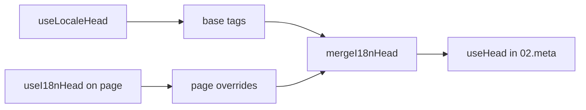

# Composable `useI18nHead`

`useI18nHead` ti permette di personalizzare i tag SEO i18n **per pagina** senza un plugin meta personalizzato. Quando `meta: true`, il modulo unisce il tuo input sopra l'output di [`useLocaleHead`](/api/composables/use-locale-head).

Casi tipici:

- **CMS / articoli di blog** — solo alcune locale sono tradotte; gli URL alternate differiscono per lingua (slug o percorsi diversi).
- **Canonical dinamico** — l'URL canonico deve corrispondere all'URL dell'articolo dall'API, non a `$switchLocalePath`.
- **Open Graph aggiuntivo** — `og:title`, `og:description`, `og:image` accanto a `og:locale` / `og:url` generati automaticamente.
- **Controllo parziale** — mantieni canonical e `og:url` generati dal modulo, ma sostituisci solo `hreflang` e `og:locale:alternate`.

---

## Firma

{/* generated:symbol:useI18nHead — do not edit; run `pnpm run docs:generate` */}

```ts
useI18nHead(input?: MaybeRefOrGetter<I18nHeadInput | null>): { pageHead: any; resetPageHead: () => void }
```

Registra override a livello di pagina per i tag head SEO i18n.
Uniti sopra l'output di `useLocaleHead` dal plugin `02.meta`.

| Parametro | Tipo | Descrizione |
| --- | --- | --- |
| `input` *(opzionale)* | `MaybeRefOrGetter<I18nHeadInput \| null>` |  |

{/* /generated:symbol:useI18nHead */}

## Come si inserisce nella pipeline



Chiami `useI18nHead` in un componente di pagina. Il plugin `02.meta` applica gli override dopo ogni `updateMeta()` (cambio di route, `$setI18nRouteParams`, `page:finish` sul client).

---

## Esempio 1 — Articolo con traduzioni solo in alcune locale

Uno schema comune: l'API restituisce quali locale esistono e i loro URL assoluti o relativi.

```ts
interface Article {
  title: string
  slug: string
  /** Locale code → page URL (absolute or site-relative) */
  locales: Record<string, string>
}
```

```vue
<script setup lang="ts">
const route = useRoute()
const { data: article } = await useFetch<Article>(`/api/articles/${route.params.slug}`)

const localeCodes = computed(() => Object.keys(article.value?.locales ?? {}))

useI18nHead(() => {
  if (!article.value) return null

  return {
    meta: [
      { property: 'og:title', content: article.value.title },
      { property: 'og:type', content: 'article' },
    ],
    replace: {
      hreflang: localeCodes.value.map((locale) => ({
        rel: 'alternate',
        hreflang: locale,
        href: article.value!.locales[locale]!,
      })),
      ogAlternates: localeCodes.value,
    },
  }
})
</script>
```

`ogAlternates` prende i **codici locale** dalla tua config `i18n.locales`. I valori per `og:locale:alternate` vengono risolti tramite `locale.og` o `iso` (formato Open Graph `en_US`).

---

## Esempio 2 — Articolo con slug per locale (`$defineI18nRoute` + `$setI18nRouteParams`)

Quando gli URL sono costruiti da template di route localizzati e parametri dinamici:

```vue
<script setup lang="ts">
const { $defineI18nRoute, $setI18nRouteParams } = useNuxtApp()
const route = useRoute()

const { data: article } = await useFetch(`/api/articles/${route.params.slug}`)

$defineI18nRoute({
  localeRoutes: {
    en: '/blog/[slug]',
    de: '/de/blog/[slug]',
    fr: '/fr/blog/[slug]',
  },
})

if (article.value) {
  $setI18nRouteParams({
    en: { slug: article.value.slugEn },
    de: { slug: article.value.slugDe },
    fr: { slug: article.value.slugFr },
  })

  const availableLocales = article.value.availableLocales as string[]

  useI18nHead({
    meta: [{ property: 'og:title', content: article.value.title }],
    replace: {
      hreflang: availableLocales.map((locale) => ({
        rel: 'alternate',
        hreflang: locale,
        href: article.value!.urls[locale],
      })),
      ogAlternates: availableLocales,
    },
  })
}
</script>
```

Gli alternate generati dal modulo elencherebbero **tutte** le locale configurate. `replace.hreflang` limita i tag alle locale che hanno effettivamente una traduzione.

---

## Esempio 3 — `x-default` personalizzato per l'URL dell'articolo nella locale predefinita

Per impostazione predefinita, `x-default` punta all'URL della locale predefinita da `$switchLocalePath`. Per gli articoli, puntalo all'URL della traduzione predefinita:

```vue
<script setup lang="ts">
const { $defaultLocale } = useNuxtApp()
const article = await loadArticle()

const defaultLocale = $defaultLocale() ?? 'en'
const defaultHref = article.locales[defaultLocale]

useI18nHead({
  replace: {
    hreflang: Object.entries(article.locales).map(([locale, href]) => ({
      rel: 'alternate',
      hreflang: locale,
      href,
    })),
    xDefault: defaultHref ? { rel: 'alternate', hreflang: 'x-default', href: defaultHref } : false,
    ogAlternates: Object.keys(article.locales),
  },
})
</script>
```

---

## Esempio 4 — Sostituire canonical e `og:url` con dati API

Quando il canonical deve corrispondere a un URL fornito dal CMS (multi-dominio, path personalizzato o URL assoluto pre-costruito):

```vue
<script setup lang="ts">
const article = await loadArticle()
const canonical = article.canonicalUrl // e.g. https://www.example.com/en/blog/my-post

useI18nHead({
  replace: {
    canonical,
    ogUrl: canonical,
    hreflang: buildAlternateLinks(article),
    ogAlternates: Object.keys(article.locales),
  },
  meta: [
    { property: 'og:title', content: article.title },
    { name: 'description', content: article.excerpt },
  ],
})
</script>
```

---

## Esempio 5 — Mantenere canonical / `og:url` automatici, sostituire solo gli alternate

Se `$switchLocalePath` + `$setI18nRouteParams` producono già canonical e `og:url` corretti, sostituisci solo i tag di discovery:

```vue
<script setup lang="ts">
const article = await loadArticle()

useI18nHead({
  replace: {
    hreflang: buildAlternateLinks(article),
    ogAlternates: Object.keys(article.locales),
  },
})
</script>
```

---

## Esempio 6 — Head completo per una pagina di dettaglio contenuto (meta + link)

Schema simile a quello di separare "meta di pagina" e "link alternate" in helper diversi, combinato in un'unica chiamata:

```vue
<script setup lang="ts">
const article = await loadArticle()
const alternates = Object.entries(article.locales).map(([locale, href]) => ({
  rel: 'alternate' as const,
  hreflang: locale,
  href: normalizeSeoUrl(href), // strip ?query and #hash if needed
}))

useI18nHead({
  meta: [
    { property: 'og:title', content: article.title },
    { property: 'og:description', content: article.description },
    { property: 'og:image', content: article.imageUrl },
    { name: 'twitter:card', content: 'summary_large_image' },
    { name: 'twitter:title', content: article.title },
  ],
  replace: {
    canonical: article.canonicalUrl,
    ogUrl: article.canonicalUrl,
    hreflang: alternates,
    ogAlternates: Object.keys(article.locales),
  },
})
</script>
```

```ts
/** Remove query and hash — useful when CMS URLs must be clean for SEO */
function normalizeSeoUrl(href: string): string {
  try {
    const url = new URL(href, 'https://placeholder.local')
    url.search = ''
    url.hash = ''
    return href.startsWith('http') ? url.href : `${url.pathname}`
  } catch {
    return href.split(/[?#]/)[0] ?? href
  }
}
```

---

## Esempio 7 — Due tipi di contenuto, stesso schema (news vs guides)

Stesso shape di API, nomi di route diversi. Riusa un piccolo helper:

```ts
// composables/useArticleHead.ts
import type { I18nHeadInput } from '@i18n-micro/types'

interface LocalizedContent {
  title: string
  locales: Record<string, string>
  canonicalUrl?: string
}

export function buildArticleHead(content: LocalizedContent): I18nHeadInput {
  const localeCodes = Object.keys(content.locales)
  const canonical = content.canonicalUrl ?? content.locales.en

  return {
    meta: [{ property: 'og:title', content: content.title }],
    replace: {
      canonical,
      ogUrl: canonical,
      hreflang: localeCodes.map((locale) => ({
        rel: 'alternate',
        hreflang: locale,
        href: content.locales[locale]!,
      })),
      ogAlternates: localeCodes,
    },
  }
}
```

```vue
<!-- pages/blog/[slug].vue -->
<script setup lang="ts">
const article = await loadArticle()
useI18nHead(buildArticleHead(article))
</script>
```

```vue
<!-- pages/guides/[slug].vue -->
<script setup lang="ts">
const guide = await loadGuide()
useI18nHead(buildArticleHead(guide))
</script>
```

---

## Esempio 8 — Disabilitare gli alternate integrati e fornire il proprio elenco

Equivalente a disabilitare il generatore di hreflang del modulo e passare un elenco personalizzato (senza set duplicati di alternate):

```vue
<script setup lang="ts">
const article = await loadArticle()

useI18nHead({
  disable: ['hreflang', 'x-default', 'og-alternates'],
  link: Object.entries(article.locales).map(([locale, href]) => ({
    rel: 'alternate',
    hreflang: locale,
    href,
  })),
  replace: {
    ogAlternates: Object.keys(article.locales),
  },
})
</script>
```

Oppure preferisci `replace.hreflang` senza `disable`. Sostituisce tutti i link `rel="alternate"` in un solo passaggio.

---

## Esempio 9 — Landing page: solo OG aggiuntivi, mantenendo tutti i tag i18n

```vue
<script setup lang="ts">
const { t } = useI18n()

useI18nHead({
  meta: [
    { property: 'og:title', content: t('landing.ogTitle') },
    { property: 'og:description', content: t('landing.ogDescription') },
  ],
})
</script>
```

---

## Esempio 10 — Pagina prodotto: disabilita hreflang per un esperimento su una singola locale

```vue
<script setup lang="ts">
useI18nHead({
  disable: ['hreflang', 'x-default'],
  // canonical, og:locale, og:url still generated
})
</script>
```

---

## Esempio 11 — Aggiornamenti reattivi dopo un fetch lato client

```vue
<script setup lang="ts">
const article = ref<Article | null>(null)

onMounted(async () => {
  article.value = await $fetch('/api/articles/latest')
})

useI18nHead(() => {
  if (!article.value) return null
  return {
    meta: [{ property: 'og:title', content: article.value.title }],
    replace: {
      hreflang: Object.entries(article.value.locales).map(([locale, href]) => ({
        rel: 'alternate',
        hreflang: locale,
        href,
      })),
    },
  }
})
</script>
```

L'head si aggiorna su `page:finish` e quando cambia lo stato `pageHead`.

---

## Esempio 12 — Origine HTTPS dietro un reverse proxy

Se in precedenza risolvevi un composable "origine pubblica" per URL canonici / alternate assoluti, usa invece la config del modulo:

```ts
// nuxt.config.ts
export default defineNuxtConfig({
  i18n: {
    meta: true,
    // undefined = origin from current request (multi-domain friendly)
    metaBaseUrl: undefined,
    metaTrustForwardedHost: true,
    metaTrustForwardedProto: true,
  },
})
```

Poi passa **percorsi o URL completi** in `replace.hreflang` / `replace.canonical`. Il modulo usa `useRequestURL` con `X-Forwarded-Host` / `X-Forwarded-Proto` in SSR.

---

## Riferimento API

### `meta`

Tag `<meta>` aggiuntivi. Deduplicati per `id`, `property` o `name`.

### `link`

Tag `<link>` aggiuntivi. Deduplicati per `id` o `rel` + `hreflang`.

### `htmlAttrs`

Uniti agli attributi di `<html>` da `useLocaleHead` (`lang`, `dir`).

### `replace`

| Chiave         | Tipo                      | Effetto                                        |
| -------------- | ------------------------- | ---------------------------------------------- |
| `canonical`    | `string \| false`         | Sostituisce o rimuove il link canonical        |
| `hreflang`     | `I18nHeadLink[] \| false` | Sostituisce o rimuove tutti i link `rel="alternate"` |
| `xDefault`     | `I18nHeadLink \| false`   | Sostituisce o rimuove `hreflang="x-default"`   |
| `ogLocale`     | `string \| false`         | Sostituisce o rimuove `og:locale`              |
| `ogUrl`        | `string \| false`         | Sostituisce o rimuove `og:url`                 |
| `ogAlternates` | `string[] \| false`       | Ricostruisce `og:locale:alternate` per codici locale |

### `disable`

| Valore          | Rimuove                                          |
| --------------- | ------------------------------------------------ |
| `hreflang`      | Link alternate di locale (non `x-default`)       |
| `x-default`     | Link `hreflang="x-default"`                      |
| `canonical`     | Link canonical                                   |
| `og`            | `og:locale` e `og:url`                           |
| `og-alternates` | Tag `og:locale:alternate`                        |
| `html`          | `lang` / `dir` su `<html>`                       |

---

## `useLocaleHead` vs `useI18nHead`

| Composable      | Ambito                       | Quando usarlo                              |
| --------------- | ---------------------------- | ------------------------------------------ |
| `useLocaleHead` | Globale / head manuale       | `meta: false`, setup `useHead` completamente custom |
| `useI18nHead`   | Override per pagina          | `meta: true`, personalizzare pagine specifiche |

Quando `meta: true`, **non** hai bisogno di `useLocaleHead` su pagine che usano solo `useI18nHead`.

---

## Migrazione da un plugin head i18n personalizzato

Molti progetti mantengono un plugin custom che:

- unisce link alternate specifici della pagina da uno stato condiviso;
- filtra voci `hreflang` regionali duplicate;
- normalizza i valori di `og:locale`;
- rimuove le query string dagli URL SEO.

Puoi sostituirlo con `useI18nHead` su ogni pagina di contenuto e i valori predefiniti del modulo.

| Approccio precedente                                        | Con `useI18nHead`                                    |
| ----------------------------------------------------------- | ---------------------------------------------------- |
| Stato condiviso + "quali locale esistono per questo articolo" | `replace: \{ ogAlternates: localeCodes \}`           |
| Helper separato che costruisce link `rel="alternate"`       | `replace: \{ hreflang: links \}`                     |
| Plugin custom che unisce lo stato della pagina nell'head    | Merge integrato in `02.meta`                         |
| "Origine pubblica" personalizzata per URL assoluti          | `metaBaseUrl` + header forwarded (vedi Esempio 12)   |
| `og:locale` breve (`en` invece di `en_US`)                  | Imposta `locale.og` o usa `iso` → `en_US` (protocollo OG) |

**`hreflang` da `iso`:** ogni locale emette un alternate con `hreflang = iso || code`. Il `code` di routing non viene mai usato quando `iso` è impostato (evita tag non validi come `hreflang="mx"`). Attiva i fallback per lingua base (`es-ES` → anche `es`) con `hreflangBaseLanguage: true`. Derivati da `iso`, non da `code`. Per elenchi completamente personalizzati, usa `replace.hreflang`.

**JSON-LD:** `useI18nHead` non genera dati strutturati. Mantieni `useHead(\{ script: [...] \})` o un helper JSON-LD dedicato accanto ad esso.

---

## Vedi anche

- [Guida SEO](/guides/seo) — generazione automatica dei meta e override a livello di pagina
- [`useLocaleHead`](/api/composables/use-locale-head) — API head di basso livello
