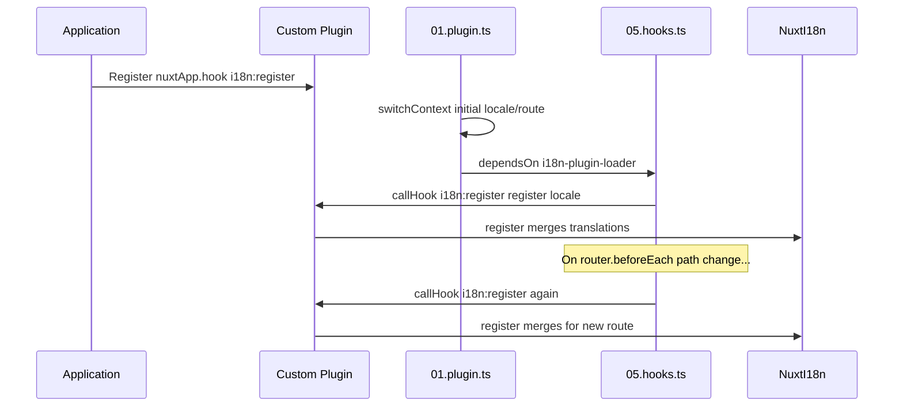

# 📢 Eventi

## 🔄 `i18n:register`

L'evento `i18n:register` in `Nuxt I18n Micro` consente l'aggiunta dinamica di traduzioni al contesto i18n della tua applicazione, rendendo il processo di internazionalizzazione trasparente e flessibile. Questo evento ti permette di integrare nuove traduzioni al bisogno, potenziando le capacità di localizzazione della tua applicazione.

### 📝 Dettagli dell'evento

- **Scopo**:
  - Consente l'incorporazione dinamica di traduzioni aggiuntive nell'insieme esistente per una locale specifica.

- **Payload**:
  - **`register`**:
    - Una funzione fornita dall'evento che accetta due argomenti:
      - **`translations`** (`Translations`):
        - Un oggetto contenente coppie chiave-valore che rappresentano traduzioni, organizzate secondo l'interfaccia `Translations`.
      - **`locale`** (`string`, opzionale):
        - Il codice della locale (ad es. `'en'`, `'ru'`) per la quale vengono registrate le traduzioni. Predefinito alla locale fornita dall'evento se non specificata.

- **Comportamento**:
  - Quando attivato, la funzione `register` unisce le nuove traduzioni nel contesto corrente per la locale specificata, aggiornando le traduzioni disponibili nell'applicazione.

### ⏱️ Quando viene emesso

Il plugin degli hook del modulo (`05.hooks.ts`, `dependsOn: ['i18n-plugin-loader']`) chiama `nuxtApp.callHook('i18n:register', …)`:

1. **Una volta all'avvio** — dopo che il plugin i18n principale (`01.plugin.ts`) ha caricato le traduzioni per la rotta iniziale
2. **Alla navigazione** — in `router.beforeEach` quando il percorso cambia, o ad ogni navigazione quando `strategy: 'no_prefix'`

Registra il tuo listener in un normale plugin Nuxt con `nuxtApp.hook('i18n:register', …)`. Il plugin degli hook viene eseguito dopo che il loader è pronto, così il tuo callback viene invocato quando le traduzioni devono essere estese.

Imposta `hooks: false` in `nuxt.config` per disabilitare le chiamate automatiche `i18n:register` (consulta [Configurazione — `hooks`](/guides/configuration#hooks)).

### 💡 Esempio di utilizzo

L'esempio seguente dimostra come usare l'evento `i18n:register` per aggiungere dinamicamente traduzioni:

```typescript
nuxt.hook('i18n:register', async (register: (translations: unknown, locale?: string) => void, locale: string) => {
  register(
    {
      greeting: 'Hello',
      farewell: 'Goodbye',
    },
    locale,
  )
})
```

### 🛠️ Spiegazione



- **Attivazione dell'evento**:
  - Il plugin degli hook (`05.hooks.ts`) emette `i18n:register` dopo che il loader principale è pronto e sulle navigazioni rilevanti.

- **Aggiunta di traduzioni**:
  - L'esempio registra traduzioni inglesi per `"greeting"` e `"farewell"`.
  - La funzione `register` unisce queste traduzioni nell'insieme esistente per la locale fornita.

### 🔗 Vantaggi principali

- **Aggiornamenti dinamici**:
  - Aggiorna o aggiungi facilmente traduzioni senza bisogno di rideployare l'intera applicazione.

- **Flessibilità di localizzazione**:
  - Supporta aggiustamenti di localizzazione in tempo reale in base alle esigenze dell'utente o dell'applicazione.

Usando l'evento `i18n:register`, puoi assicurarti che la strategia di localizzazione della tua applicazione rimanga flessibile e adattabile, migliorando l'esperienza utente complessiva.

---

## 🛠️ Modifica delle traduzioni con i plugin

Per modificare dinamicamente le traduzioni nella tua applicazione Nuxt, si consiglia l'uso dei plugin. I plugin forniscono un modo strutturato per gestire gli aggiornamenti di localizzazione, specialmente quando si lavora con moduli o file di traduzione esterni.

### **Registrazione del plugin**

Se stai usando un modulo, registra il plugin dove avverranno le modifiche di traduzione aggiungendolo alla configurazione del tuo modulo:

```javascript
addPlugin({
  src: resolve('./plugins/extend_locales'),
})
```

Questo registra il plugin situato in `./plugins/extend_locales`, che gestirà il caricamento e la registrazione dinamici delle traduzioni.

### **Implementazione del plugin**

Nel plugin, puoi gestire le modifiche di locale. Ecco un esempio di implementazione in un plugin Nuxt:

```typescript
import { defineNuxtPlugin } from '#app'

export default defineNuxtPlugin(async (nuxtApp) => {
  // Function to load translations from JSON files and register them
  const loadTranslations = async (lang: string) => {
    try {
      const translations = await import(`../locales/${lang}.json`)
      return translations.default
    } catch (error) {
      console.error(`Error loading translations for language: ${lang}`, error)
      return null
    }
  }

  // Hook into the 'i18n:register' event to dynamically add translations
  // eslint-disable-next-line @typescript-eslint/ban-ts-comment
  // @ts-expect-error
  nuxtApp.hook('i18n:register', async (register: (translations: unknown, locale?: string) => void, locale: string) => {
    const translations = await loadTranslations(locale)
    if (translations) {
      register(translations, locale)
    }
  })
})
```

### 📝 Spiegazione dettagliata

1. **Caricamento delle traduzioni**:

- La funzione `loadTranslations` importa dinamicamente file di traduzione in base alla locale. Ci si aspetta che i file siano nella directory `locales` e denominati secondo i codici locale (ad es. `en.json`, `de.json`).
- Al caricamento riuscito le traduzioni vengono restituite; altrimenti viene loggato un errore.

2. **Registrazione delle traduzioni**:

- Il plugin si aggancia all'evento `i18n:register` usando `nuxtApp.hook`.
- Quando l'evento viene attivato, viene chiamata la funzione `register` con le traduzioni caricate e la locale corrispondente.
- Ciò unisce le nuove traduzioni nel contesto i18n per la locale specificata, aggiornando le traduzioni disponibili nell'intera applicazione.

### 🔗 Vantaggi dell'uso dei plugin per le modifiche di traduzione

- **Separazione delle responsabilità**:
  - Incapsula la logica di localizzazione separatamente dal codice principale dell'applicazione, rendendo più facili gestione e manutenzione.

- **Dinamico e scalabile**:
  - Caricando e registrando dinamicamente le traduzioni, puoi aggiornare i contenuti senza richiedere un ridispiegamento completo dell'applicazione, particolarmente utile per applicazioni con contenuti aggiornati di frequente o multilingue.

- **Flessibilità di localizzazione migliorata**:
  - I plugin ti consentono di modificare o estendere le traduzioni al bisogno, fornendo una strategia di localizzazione più adattabile e reattiva che soddisfa le preferenze dell'utente o i requisiti aziendali.

Adottando questo approccio, puoi espandere e modificare in modo efficiente la localizzazione della tua applicazione tramite un processo strutturato e manutenibile usando i plugin, mantenendo l'internazionalizzazione adattiva alle esigenze mutevoli e migliorando l'esperienza utente complessiva.
