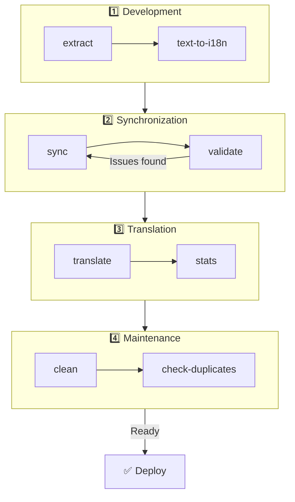

# 🌐 Guida a nuxt-i18n-micro-cli

## 📖 Introduzione

`nuxt-i18n-micro-cli` è uno strumento a riga di comando progettato per semplificare il processo di localizzazione e internazionalizzazione nei progetti Nuxt.js che utilizzano il modulo `nuxt-i18n-micro` (Nuxt I18n Micro). Fornisce utility per estrarre chiavi di traduzione dal tuo codice, gestire i file di traduzione, sincronizzare le traduzioni tra locale e automatizzare il processo di traduzione utilizzando servizi di traduzione esterni.

Questa guida ti accompagnerà attraverso installazione, configurazione e uso di `nuxt-i18n-micro-cli` per gestire efficacemente le traduzioni del tuo progetto. Pacchetto su [npmjs.com](https://www.npmjs.com/package/nuxt-i18n-micro-cli).

## 🔧 Installazione e configurazione

### 📦 Installazione di nuxt-i18n-micro-cli

Installalo globalmente o come dipendenza di sviluppo nel tuo progetto Nuxt (consigliato per CI):

```bash
# global
npm install -g nuxt-i18n-micro-cli

# or per project
pnpm add -D nuxt-i18n-micro-cli
pnpm exec i18n-micro text-to-i18n --dryRun
```

Usa **`nuxt-i18n-micro-cli` ≥ 2.1.1** se il tuo progetto usa la directory `app/` di Nuxt 4 (`app/pages`, `app/components`, …). Le versioni CLI più vecchie scansionavano solo `pages/` nella root del progetto.

### 🛠 Inizializzazione nel progetto

Dopo l'installazione, puoi eseguire i comandi `i18n-micro` nella directory del tuo progetto Nuxt.js.

Assicurati che il tuo progetto sia configurato con `nuxt-i18n-micro` e abbia la configurazione necessaria in `nuxt.config.ts` (o `nuxt.config.js`).

### 📄 Argomenti comuni

- `--cwd`: Specifica la directory di lavoro corrente (predefinito: `.`).
- `--logLevel`: Imposta il livello di log (`silent`, `info`, `verbose`).
- `--translationDir`: Directory contenente i file JSON di traduzione (predefinito: `locales`).

## 📊 Panoramica del flusso di lavoro CLI



### Passi del flusso di lavoro

| Fase           | Comandi                    | Scopo                           |
| --------------- | --------------------------- | --------------------------------- |
| **Sviluppo** | `extract`, `text-to-i18n`   | Trova ed estrai le chiavi di traduzione |
| **Sync**        | `sync`, `validate`          | Assicura che tutte le locale abbiano le stesse chiavi |
| **Traduci**   | `translate`, `stats`        | Traduci automaticamente le chiavi mancanti       |
| **Manutenzione** | `clean`, `check-duplicates` | Mantieni le traduzioni ordinate            |

## 📋 Comandi

### 🔄 Comando `text-to-i18n`

Pacchetto CLI: [`nuxt-i18n-micro-cli`](https://www.npmjs.com/package/nuxt-i18n-micro-cli)

**Descrizione**: Scansiona i file Vue/TS/JS alla ricerca di stringhe hardcoded rivolte all'utente, le sostituisce con `$t('...')` e unisce le nuove chiavi nel tuo file JSON di traduzione. Esegui dalla **root del progetto Nuxt** (dove risiede `nuxt.config`).

**Utilizzo**:

```bash
i18n-micro text-to-i18n [options]
```

**Opzioni**:

| Opzione                  | Predefinito           | Descrizione                                                           |
| ----------------------- | ----------------- | --------------------------------------------------------------------- |
| `--translationFile`     | `locales/en.json` | File JSON per le nuove chiavi (relativo alla root del progetto).                    |
| `--path`                | —                 | Elabora solo un file o directory (ad es. `app/pages/about.vue`).      |
| `--context`             | —                 | Prefisso della chiave (ad es. `auth` → `auth.*`).                                  |
| `--dryRun`              | `false`           | Anteprima senza scrivere file.                                        |
| `--verbose`             | `false`           | Log aggiuntivi.                                                        |
| `--interactive`         | `false`           | Conferma o modifica ogni chiave prima di applicarla.                             |
| `--extractOnlyDirs`     | `plugins`         | Directory in cui le chiavi vengono estratte ma i file sorgente **non** vengono riscritti. |
| `--extractOnlyPatterns` | —                 | Pattern extract-only in stile glob (ad es. `**/*.plugin.ts`).              |

**Esempio**:

```bash
i18n-micro text-to-i18n --translationFile locales/en.json --context auth --dryRun
```

#### Quali cartelle vengono scansionate?

<Info>
Dalla CLI **v2.1.1**, `text-to-i18n` scansiona sia le cartelle classiche di root sia gli equivalenti `app/*`. Esegui il comando dalla **root del progetto** — non fare `cd app`.
</Info>

Raccoglie `*.vue`, `*.js` e `*.ts` sotto:

| Nuxt 3 (root del progetto) | Nuxt 4 (directory `app/`) |
| --------------------- | ------------------------- |
| `pages/`              | `app/pages/`              |
| `components/`         | `app/components/`         |
| `plugins/`            | `app/plugins/`            |
| `layouts/`            | `app/layouts/`            |

Altre cartelle (`server/`, `composables/`, `middleware/`, …) vengono saltate a meno che tu non usi `--path`. Per Nuxt 4, esegui dalla root del progetto (non serve fare `cd app`). Fai corrispondere `i18n.translationDir` in `--translationFile` se non è `locales/`.

```bash
i18n-micro text-to-i18n --path app/pages
```

#### Come funziona

1. Raccoglie i file dalle directory sopra (o da `--path`).
2. Sostituisce i literal / il testo dei template con `$t('generated.key')` (`plugins/` è extract-only per impostazione predefinita).
3. Unisce le nuove chiavi in `--translationFile` senza rimuovere le voci esistenti.

**Esempi di trasformazione**:

Prima:

```vue
<template>
  <div>
    <h1>Welcome to our site</h1>
    <p>Please sign in to continue</p>
  </div>
</template>
```

Dopo:

```vue
<template>
  <div>
    <h1>{{ $t('pages.home.welcome_to_our_site') }}</h1>
    <p>{{ $t('pages.home.please_sign_in') }}</p>
  </div>
</template>
```

**Best practice**: esegui prima un dry run; committa prima di un'esecuzione completa; allinea `--translationFile` con `i18n.translationDir` in `nuxt.config`; mantieni `--extractOnlyDirs plugins` per il codice di bootstrap.

**Limitazioni**: pacchetto npm separato (non incluso con il modulo); non legge `nuxt.config` automaticamente; produce `$t(...)`; le stringhe dinamiche complesse potrebbero richiedere `extract` / `search`.

### 📊 Comando `stats`

**Descrizione**: Il comando `stats` viene usato per mostrare statistiche di traduzione per ciascuna locale nel tuo progetto Nuxt.js. Ti aiuta a comprendere il progresso delle tue traduzioni mostrando quante chiavi sono tradotte rispetto al totale delle chiavi disponibili.

**Utilizzo**:

```bash
i18n-micro stats [options]
```

**Opzioni**:

- `--full`: Mostra solo le statistiche di traduzioni combinate (predefinito: `false`).

**Esempio**:

```bash
i18n-micro stats --full
```

### 🌍 Comando `translate`

**Descrizione**: Il comando `translate` traduce automaticamente le chiavi mancanti utilizzando servizi di traduzione esterni. Questo comando semplifica il processo di traduzione sfruttando le API di servizi come Google Translate, DeepL e altri per compilare le traduzioni mancanti.

**Utilizzo**:

```bash
i18n-micro translate [options]
```

**Opzioni**:

- `--service`: Servizio di traduzione da usare (ad es. `google`, `deepl`, `yandex`). Se non specificato, il comando ti chiederà di sceglierne uno.
- `--token`: Chiave API corrispondente al servizio di traduzione scelto. Se non fornita, ti verrà chiesto di inserirla.
- `--options`: Opzioni aggiuntive per il servizio di traduzione, fornite come coppie chiave:valore separate da virgole (ad es. `model:gpt-3.5-turbo,max_tokens:1000`).
- `--replace`: Traduci tutte le chiavi, sostituendo le traduzioni esistenti (predefinito: `false`).

**Esempio**:

```bash
i18n-micro translate --service deepl --token YOUR_DEEPL_API_KEY
```

#### 🌐 Servizi di traduzione supportati

Il comando `translate` supporta molteplici servizi di traduzione. Alcuni dei servizi supportati sono:

- **Google Translate** (`google`)
- **DeepL** (`deepl`)
- **Yandex Translate** (`yandex`)
- **OpenAI** (`openai`)
- **Azure Translator** (`azure`)
- **IBM Watson** (`ibm`)
- **Baidu Translate** (`baidu`)
- **LibreTranslate** (`libretranslate`)
- **MyMemory** (`mymemory`)
- **Lingva Translate** (`lingvatranslate`)
- **Papago** (`papago`)
- **Tencent Translate** (`tencent`)
- **Systran Translate** (`systran`)
- **Yandex Cloud Translate** (`yandexcloud`)
- **ModernMT** (`modernmt`)
- **Lilt** (`lilt`)
- **Unbabel** (`unbabel`)
- **Reverso Translate** (`reverso`)

#### ⚙️ Configurazione del servizio

Alcuni servizi richiedono configurazioni specifiche o chiavi API. Quando usi il comando `translate`, puoi specificare il servizio e fornire il `--token` richiesto (chiave API) e ulteriori `--options` se necessario.

Ad esempio:

```bash
i18n-micro translate --service openai --token YOUR_OPENAI_API_KEY --options openaiModel:gpt-3.5-turbo,max_tokens:1000
```

### 🛠️ Comando `extract`

**Descrizione**: Estrae le chiavi di traduzione dal tuo codice e le organizza per ambito.

**Utilizzo**:

```bash
i18n-micro extract [options]
```

**Opzioni**:

- `--prod, -p`: Esegui in modalità produzione.

**Esempio**:

```bash
i18n-micro extract
```

### 🔄 Comando `sync`

**Descrizione**: Sincronizza i file di traduzione tra locale, assicurando che tutte le locale abbiano le stesse chiavi.

**Utilizzo**:

```bash
i18n-micro sync [options]
```

**Esempio**:

```bash
i18n-micro sync
```

### ✅ Comando `validate`

**Descrizione**: Valida i file di traduzione per chiavi mancanti o in eccesso rispetto alla locale di riferimento.

**Utilizzo**:

```bash
i18n-micro validate [options]
```

**Esempio**:

```bash
i18n-micro validate
```

### 🧹 Comando `clean`

**Descrizione**: Rimuove le chiavi di traduzione inutilizzate dai file di traduzione.

**Utilizzo**:

```bash
i18n-micro clean [options]
```

**Esempio**:

```bash
i18n-micro clean
```

### 📤 Comando `import`

**Descrizione**: Converte i file PO in formato JSON e li salva nella directory delle traduzioni.

**Utilizzo**:

```bash
i18n-micro import [options]
```

**Opzioni**:

- `--potsDir`: Directory contenente i file PO (predefinito: `pots`).

**Esempio**:

```bash
i18n-micro import --potsDir pots
```

### 📥 Comando `export`

**Descrizione**: Esporta le traduzioni in file PO per la gestione esterna delle traduzioni.

**Utilizzo**:

```bash
i18n-micro export [options]
```

**Opzioni**:

- `--potsDir`: Directory in cui salvare i file PO (predefinito: `pots`).

**Esempio**:

```bash
i18n-micro export --potsDir pots
```

### 🗂️ Comando `export-csv`

**Descrizione**: Il comando `export-csv` esporta le chiavi e i valori di traduzione dai file JSON, inclusi i loro percorsi di file, in formato CSV. Questo comando è utile per i team che preferiscono lavorare con i dati di traduzione in software di fogli di calcolo.

**Utilizzo**:

```bash
i18n-micro export-csv [options]
```

**Opzioni**:

- `--csvDir`: Directory in cui verranno salvati i file CSV esportati.
- `--delimiter`: Specifica un delimitatore per il file CSV (predefinito: `,`).

**Esempio**:

```bash
i18n-micro export-csv --csvDir csv_files
```

### 📑 Comando `import-csv`

**Descrizione**: Il comando `import-csv` importa dati di traduzione dai file CSV, aggiornando i file JSON corrispondenti. Ciò è utile per applicare aggiornamenti di traduzione in blocco dai fogli di calcolo.

**Utilizzo**:

```bash
i18n-micro import-csv [options]
```

**Opzioni**:

- `--csvDir`: Directory contenente i file CSV da importare.
- `--delimiter`: Specifica un delimitatore usato nel file CSV (predefinito: `,`).

**Esempio**:

```bash
i18n-micro import-csv --csvDir csv_files
```

### 🧾 Comando `diff`

**Descrizione**: Confronta i file di traduzione tra la locale predefinita e altre locale nella stessa directory (comprese le sottodirectory). Il comando identifica le chiavi mancanti e i loro valori nella locale predefinita rispetto alle altre locale, rendendo più facile tracciare il progresso delle traduzioni o le discrepanze.

**Utilizzo**:

```bash
i18n-micro diff [options]
```

**Esempio**:

```bash
i18n-micro diff
```

### 🔍 Comando `check-duplicates`

**Descrizione**: Il comando `check-duplicates` verifica la presenza di valori di traduzione duplicati all'interno di ogni locale in tutti i file di traduzione, inclusi sia quelli di root sia quelli specifici per pagina. Assicura che chiavi diverse all'interno della stessa lingua non condividano valori di traduzione identici, aiutando a mantenere chiarezza e coerenza nelle tue traduzioni.

**Utilizzo**:

```bash
i18n-micro check-duplicates [options]
```

**Esempio**:

```bash
i18n-micro check-duplicates
```

**Come funziona**:

- Il comando controlla sia i file di traduzione di root sia quelli specifici per pagina per ciascuna locale.
- Se un valore di traduzione appare in più posizioni (all'interno delle traduzioni di root o tra pagine differenti), riporta i valori duplicati insieme al file e alla chiave in cui vengono trovati.
- Se non vengono trovati duplicati, il comando conferma che la locale è priva di valori di traduzione duplicati.

Questo comando aiuta a garantire che le chiavi di traduzione mantengano valori unici, prevenendo ripetizioni accidentali all'interno della stessa locale.

### 🔄 Comando `replace-values`

**Descrizione**: Il comando `replace-values` ti permette di eseguire sostituzioni in blocco di valori di traduzione in tutte le locale. Supporta sia sostituzioni di testo semplici sia sostituzioni avanzate tramite espressioni regolari (regex). Puoi anche usare gruppi di cattura nei pattern regex e referenziarli nella stringa di sostituzione, rendendolo ideale per scenari di sostituzione più complessi.

**Utilizzo**:

```bash
i18n-micro replace-values [options]
```

**Opzioni**:

- `--search`: Il testo o il pattern regex da cercare nelle traduzioni. Questa opzione è richiesta.
- `--replace`: Il testo di sostituzione da usare per le traduzioni trovate. Questa opzione è richiesta.
- `--useRegex`: Abilita la ricerca con un pattern di espressione regolare (predefinito: `false`).

**Esempio 1**: Sostituzione semplice

Sostituisci la stringa "Hello" con "Hi" in tutte le locale:

```bash
i18n-micro replace-values --search "Hello" --replace "Hi"
```

**Esempio 2**: Sostituzione con regex

Abilita la ricerca regex e sostituisci qualsiasi stringa che inizi con "Hello" seguita da numeri (ad es. "Hello123") con "Hi" in tutte le locale:

```bash
i18n-micro replace-values --search "Hello\\d+" --replace "Hi" --useRegex
```

**Esempio 3**: Uso di gruppi di cattura regex

Usa i gruppi di cattura per inserire dinamicamente parte della stringa corrispondente nella sostituzione. Ad esempio, sostituisci "Hello [name]" con "Hi [name]" mantenendo intatto il nome:

```bash
i18n-micro replace-values --search "Hello (\\w+)" --replace "Hi $1" --useRegex
```

In questo caso, `$1` si riferisce al primo gruppo di cattura, che corrisponde alla parte `[name]` dopo "Hello". La sostituzione manterrà il nome dalla stringa originale.

**Come funziona**:

- Il comando scansiona tutti i file di traduzione (sia globali sia specifici per pagina).
- Quando viene trovata una corrispondenza in base alla stringa di ricerca o al pattern regex, sostituisce il testo corrispondente con la sostituzione fornita.
- Quando si usa regex, i gruppi di cattura possono essere usati nella stringa di sostituzione facendo riferimento con `$1`, `$2`, ecc.
- Tutte le modifiche vengono loggate, mostrando il percorso del file, la chiave di traduzione e lo stato before/after del valore di traduzione.

**Logging**:
Per ogni sostituzione, il comando registra dettagli che includono:

- Locale e percorso del file
- La chiave di traduzione che viene modificata
- Il vecchio valore e il nuovo valore dopo la sostituzione
- Se si usa regex con gruppi di cattura, i log mostreranno le corrispondenze dei gruppi e come sono state sostituite.

Ciò ti permette di tracciare esattamente dove e cosa è stato modificato durante l'operazione di sostituzione, fornendo una chiara storia delle modifiche nei tuoi file di traduzione.

## 🛠 Esempi

- **Estrazione delle traduzioni**:

  ```bash
  i18n-micro extract
  ```

- **Traduzione delle chiavi mancanti usando Google Translate**:

  ```bash
  i18n-micro translate --service google --token YOUR_GOOGLE_API_KEY
  ```

- **Traduzione di tutte le chiavi, sostituendo le traduzioni esistenti**:

  ```bash
  i18n-micro translate --service deepl --token YOUR_DEEPL_API_KEY --replace
  ```

- **Validazione dei file di traduzione**:

  ```bash
  i18n-micro validate
  ```

- **Pulizia delle chiavi di traduzione inutilizzate**:

  ```bash
  i18n-micro clean
  ```

- **Sincronizzazione dei file di traduzione**:

  ```bash
  i18n-micro sync
  ```

## ⚙️ Guida alla configurazione

`nuxt-i18n-micro-cli` si affida alla configurazione i18n di Nuxt.js in `nuxt.config.ts` (o `nuxt.config.js`). Assicurati di avere installato e configurato il modulo `nuxt-i18n-micro`.

### 🔑 Esempio di nuxt.config.js

```ts
export default defineNuxtConfig({
  modules: ['nuxt-i18n-micro'],
  i18n: {
    locales: [
      { code: 'en', iso: 'en-US' },
      { code: 'fr', iso: 'fr-FR' },
    ],
    defaultLocale: 'en',
    fallbackLocale: 'en',
    translationDir: 'locales', // or 'app/locales' for Nuxt 4 colocation
  },
})
```

Assicurati che `translationDir` corrisponda alla directory usata da `nuxt-i18n-micro-cli` (predefinito: `locales`).

## 📝 Best practice

### 🔑 Denominazione coerente delle chiavi

Assicurati che le chiavi di traduzione siano coerenti e descrittive per evitare confusione e duplicazioni.

### 🧹 Manutenzione regolare

Usa regolarmente il comando `clean` per rimuovere le chiavi di traduzione inutilizzate e mantenere puliti i tuoi file di traduzione.

### 🛠 Automatizza il flusso di traduzione

Integra i comandi `nuxt-i18n-micro-cli` nel tuo flusso di sviluppo o nella pipeline CI/CD per automatizzare estrazione, traduzione, validazione e sincronizzazione dei file di traduzione.

### 🛡️ Proteggi le chiavi API

Quando usi servizi di traduzione che richiedono chiavi API, assicurati che le tue chiavi siano tenute al sicuro e non vengano committate nei sistemi di controllo versione. Considera l'uso di variabili d'ambiente o soluzioni sicure di gestione delle chiavi.

## 📞 Supporto e contributi

Se riscontri problemi o hai suggerimenti per miglioramenti, sentiti libero di contribuire al progetto o aprire una issue nel repository del progetto.

---

Seguendo questa guida, sarai in grado di gestire efficacemente le traduzioni nel tuo progetto Nuxt.js usando `nuxt-i18n-micro-cli`, semplificando i tuoi sforzi di internazionalizzazione e garantendo un'esperienza fluida per gli utenti in diverse locale.
