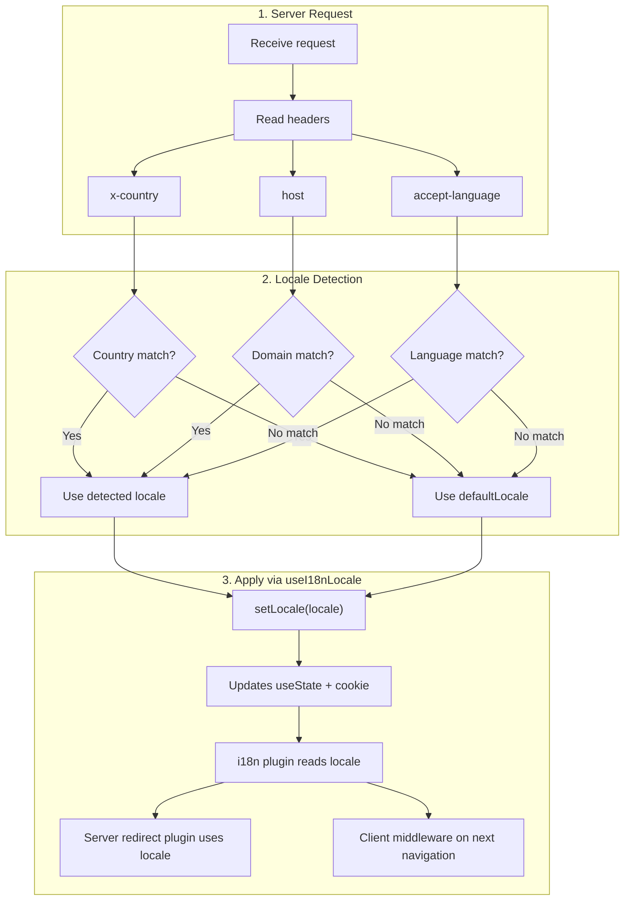

# 🔧 Rilevamento personalizzato della lingua in Nuxt I18n Micro

## 📖 Panoramica

Nuxt I18n Micro v3 fornisce un composable centralizzato — `useI18nLocale()` — per tutta la gestione delle locale. Sostituisce i pattern manuali con `useState`/`useCookie` di v2. Usando `useI18nLocale().setLocale()` in un plugin server, puoi implementare qualsiasi logica di rilevamento personalizzata mantenendo la piena compatibilità con i sistemi di redirect e cookie del modulo.

## 🏗️ Architettura

```mermaid
flowchart TB
    subgraph Plugins["Plugin Execution Order"]
        A["Your plugin<br/>order: -10"] -->|setLocale()| B["01.plugin.ts<br/>order: -5"]
        B --> C["06.redirect.ts server<br/>order: 10"]
    end

    subgraph Client["Client SPA Navigation"]
        D["i18n-redirect.global.ts<br/>route middleware"]
    end

    subgraph State["Locale State"]
        E["useState('i18n-locale')"]
        F["localeCookie"]
    end

    A -->|"setLocale() updates both"| E
    A -->|"setLocale() updates both"| F
    B -->|reads| E
    C -->|reads| E
    C -->|reads| F
    D -->|reads target route +| E
```

**Principio chiave**: Chiama `useI18nLocale().setLocale()` in un plugin server con `order: -10`. Questo aggiorna sia `useState('i18n-locale')` sia il cookie della locale in modo atomico, così il plugin i18n (`order: -5`) e il plugin di redirect server (`order: 10`) vedono la locale corretta alla prima richiesta SSR. I redirect automatici lato client vengono eseguiti nel middleware di rotta globale nelle navigazioni successive.

## 🛠️ Disabilitare il rilevamento automatico integrato

Se vuoi il pieno controllo sul rilevamento della locale, disabilita il meccanismo integrato:

```ts
export default defineNuxtConfig({
  i18n: {
    autoDetectLanguage: false,
  },
})
```

## ✨ Esempio: Rilevamento lato server con `useI18nLocale`

Questo è l'**approccio consigliato** per tutte le strategie.

### Passo 1: Configura `nuxt.config.ts`

```ts
export default defineNuxtConfig({
  modules: ['nuxt-i18n-micro'],
  i18n: {
    strategy: 'no_prefix', // Works with ANY strategy
    defaultLocale: 'en',
    localeCookie: 'user-locale',
    autoDetectLanguage: false,
    locales: [
      { code: 'en', iso: 'en-US' },
      { code: 'de', iso: 'de-DE' },
      { code: 'ja', iso: 'ja-JP' },
    ],
  },
})
```

### Passo 2: Crea `plugins/i18n-loader.server.ts`

```ts
import { defineNuxtPlugin, useRequestHeaders } from '#imports'

export default defineNuxtPlugin({
  name: 'i18n-custom-loader',
  enforce: 'pre',
  order: -10, // Execute BEFORE the i18n plugin (which has order -5)

  setup() {
    const { setLocale } = useI18nLocale()
    const headers = useRequestHeaders(['host', 'x-country', 'accept-language'])
    let detectedLocale = 'en'

    // --- YOUR DETECTION LOGIC ---

    // Example 1: By domain
    const host = headers['host']
    if (host?.includes('example.de')) {
      detectedLocale = 'de'
    }
    // Example 2: By custom header
    else if (headers['x-country'] === 'JP') {
      detectedLocale = 'ja'
    }
    // Example 3: By Accept-Language header
    else if (headers['accept-language']?.includes('de')) {
      detectedLocale = 'de'
    }

    // --- APPLY THE LOCALE ---
    setLocale(detectedLocale)
  },
})
```

### Come funziona



1. **Il plugin viene eseguito per primo** (`order: -10`) — rileva la locale da header, dominio o altre fonti
2. **`setLocale()` aggiorna entrambi** `useState('i18n-locale')` e il cookie — garantisce visibilità immediata a tutti i plugin successivi
3. **Il plugin i18n** (`order: -5`) legge la locale e carica le traduzioni corrette
4. **Il plugin di redirect server** (`order: 10`) usa la locale per le decisioni di redirect in SSR
5. **Il middleware di rotta client** (`i18n-redirect`) applica i redirect nella navigazione SPA quando la locale nell'URL non corrisponde alla preferenza

## 🌐 Comportamento specifico per strategia

`useI18nLocale().setLocale()` funziona con **tutte le strategie**. Il comportamento di redirect dipende dalla strategia:

<Tip>
| Strategia | Effetto di `setLocale('de')` |
|----------|---------------------------|
| `no_prefix` | Renderizza in tedesco, nessun cambio di URL |
| `prefix` | 302 → `/de/` (redirect lato server) |
| `prefix_except_default` | 302 → `/de/` se `de` ≠ default; nessun redirect se `de` = default |
| `prefix_and_default` | Nessun redirect (sia `/` sia `/de/` sono validi) |
</Tip>

**Note importanti:**

- Il rilevamento della locale basato su cookie è disabilitato per impostazione predefinita (`localeCookie: null`)
- Imposta `localeCookie: 'user-locale'` per abilitare la persistenza tramite cookie
- Se il valore del cookie/stato non è nell'elenco `locales`, ricade su `defaultLocale`

## 🏢 Avanzato: Rilevamento basato sul dominio

Per configurazioni multi-dominio in cui ogni dominio serve una locale differente:

```ts
import { defineNuxtPlugin, useRequestHeaders } from '#imports'

export default defineNuxtPlugin({
  name: 'i18n-domain-loader',
  enforce: 'pre',
  order: -10,

  setup() {
    const { setLocale } = useI18nLocale()
    const headers = useRequestHeaders(['host'])
    const host = headers['host'] || ''

    let detectedLocale = 'en'

    if (host.endsWith('.de') || host.includes('german.')) {
      detectedLocale = 'de'
    } else if (host.endsWith('.fr') || host.includes('french.')) {
      detectedLocale = 'fr'
    } else if (host.endsWith('.jp') || host.includes('japanese.')) {
      detectedLocale = 'ja'
    }

    setLocale(detectedLocale)
  },
})
```

## 🔄 Avanzato: Rispettare la preferenza utente

Se gli utenti possono cambiare manualmente lingua, rispetta la loro scelta rispetto al rilevamento automatico:

```ts
import { defineNuxtPlugin, useRequestHeaders } from '#imports'

export default defineNuxtPlugin({
  name: 'i18n-smart-loader',
  enforce: 'pre',
  order: -10,

  setup() {
    const { getLocale, setLocale } = useI18nLocale()

    // If user already has a preference (from cookie), respect it
    if (getLocale()) {
      return
    }

    // Otherwise, detect locale from headers
    const headers = useRequestHeaders(['accept-language'])
    let detectedLocale = 'en'

    const acceptLanguage = headers['accept-language'] || ''
    if (acceptLanguage.includes('de')) {
      detectedLocale = 'de'
    } else if (acceptLanguage.includes('ja')) {
      detectedLocale = 'ja'
    }

    setLocale(detectedLocale)
  },
})
```

## ⚙️ Plugin solo server o solo client

Usa le [convenzioni sui nomi file di Nuxt](https://nuxt.com/docs/getting-started/directory-structure#plugins) per controllare dove viene eseguito il tuo plugin:

- **Solo server**: `i18n-loader.server.ts` — viene eseguito solo durante l'SSR (consigliato per il rilevamento basato su header)
- **Solo client**: `i18n-loader.client.ts` — viene eseguito solo nel browser (per rilevamento basato su `localStorage` o DOM)

<Tip>

</Tip>

## ✅ Riepilogo

| Funzionalità                            | Descrizione                                                       |
| -------------------------------------- | ----------------------------------------------------------------- |
| `useI18nLocale().setLocale()`          | Aggiorna `useState` + cookie in modo atomico; funziona con tutte le strategie |
| `useI18nLocale().getLocale()`          | Restituisce la locale corrente dallo stato o dal cookie           |
| `useI18nLocale().getPreferredLocale()` | Restituisce la locale preferita (validata rispetto all'elenco `locales`) |
| Plugin `order: -10`                    | Assicura che il tuo plugin venga eseguito prima dell'inizializzazione di i18n |
| `enforce: 'pre'`                       | Viene eseguito nel gruppo di plugin "pre"                          |

**NON fare:**

- Usare `useCookie('user-locale')` direttamente — `useI18nLocale()` gestisce internamente i cookie
- Usare `useState('i18n-locale')` direttamente — usa invece `useI18nLocale().setLocale()`
- Impostare `order` >= -5 — il tuo plugin deve essere eseguito prima del plugin i18n
