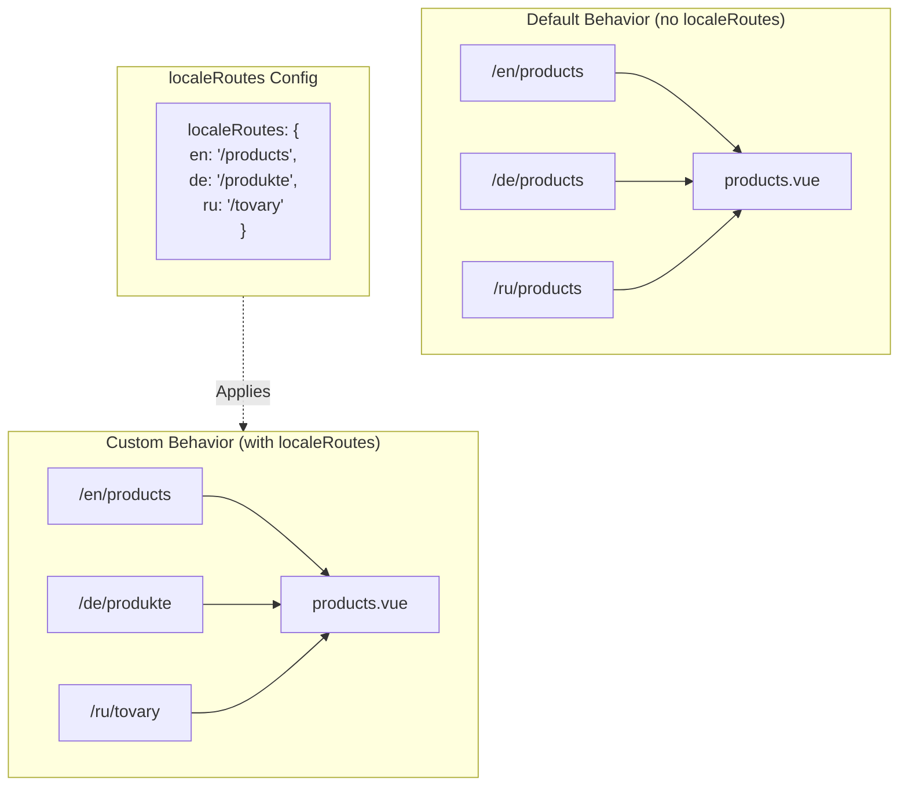

# 🔗 Rotte localizzate personalizzate con `localeRoutes` in `Nuxt I18n Micro`

## 📖 Introduzione a `localeRoutes`

La funzionalità `localeRoutes` in `Nuxt I18n Micro` ti permette di definire rotte personalizzate per locale specifiche, offrendo flessibilità e controllo sulla struttura di routing della tua applicazione. Questa funzionalità è particolarmente utile quando alcune locale richiedono strutture URL differenti, percorsi personalizzati o devono seguire specifiche convenzioni regionali o linguistiche.

## 🚀 Caso d'uso principale di `localeRoutes`

Il caso d'uso principale di `localeRoutes` è fornire rotte distinte per diverse locale, migliorando l'esperienza utente assicurando che gli URL siano intuitivi e rilevanti per il pubblico di destinazione. Ad esempio, potresti avere percorsi diversi per le versioni inglese e russa di una pagina, dove la locale russa segue un formato URL localizzato.

### 📄 Esempio: Definizione di `localeRoutes` in `$defineI18nRoute`

Ecco un esempio di come potresti definire rotte personalizzate per locale specifiche usando `localeRoutes` nella funzione `$defineI18nRoute`:

```typescript
import { useNuxtApp } from '#imports'

const { $defineI18nRoute } = useNuxtApp()

$defineI18nRoute({
  localeRoutes: {
    ru: '/localesubpage', // Custom route path for the Russian locale
    de: '/lokaleseite', // Custom route path for the German locale
  },
})
```

> [!IMPORTANT]
> `$defineI18nRoute` non è una funzione globale. In `script setup`, ottienila da `useNuxtApp()` prima, poi chiamala.

### 🔄 Come funziona `localeRoutes`



- **Comportamento predefinito**: Senza `localeRoutes`, tutte le locale usano una struttura di rotta comune definita dal percorso principale.
- **Comportamento personalizzato**: Con `localeRoutes`, locale specifiche possono avere le proprie rotte, sovrascrivendo il percorso predefinito con rotte specifiche per locale definite nella configurazione.

## 🌱 Casi d'uso per `localeRoutes`

### 📄 Esempio: Uso di `localeRoutes` in una pagina

Ecco un semplice componente Vue che dimostra l'uso di `$defineI18nRoute` con `localeRoutes`:

```vue
<template>
  <div>
    <!-- Display greeting message based on the current locale -->
    <p>{{ $t('greeting') }}</p>

    <!-- Navigation links -->
    <div>
      <NuxtLink :to="$localeRoute({ name: 'index' })"> Go to Index </NuxtLink>
      |
      <NuxtLink :to="$localeRoute({ name: 'about' })"> Go to About Page </NuxtLink>
    </div>
  </div>
</template>

<script setup>
import { useNuxtApp } from '#imports'

const { $getLocale, $switchLocale, $getLocales, $localeRoute, $t, $defineI18nRoute } = useNuxtApp()

// Define translations and custom routes for specific locales
$defineI18nRoute({
  localeRoutes: {
    ru: '/localesubpage', // Custom route path for Russian locale
  },
})
</script>
```

### 🛠️ Uso di `localeRoutes` in diversi contesti

- **Landing page**: Usa rotte personalizzate per localizzare gli URL delle landing page, assicurandoti che siano allineate alle campagne di marketing.
- **Siti di documentazione**: Fornisci rotte distinte per ciascuna locale per adattarsi meglio alla struttura del contenuto localizzato.
- **Siti e-commerce**: Personalizza gli URL di prodotti o categorie per locale per migliorare SEO ed esperienza utente.

## Uso della navigazione con `localeRoutes`

Poiché le rotte localizzate non corrispondono direttamente ai nomi dei file nella directory delle pagine, devi fare riferimento alla tua navigazione tramite oggetto piuttosto che tramite nome.

```vue
<template>
  /**
   * Exemple page: /pages/about-us.vue
   * EN /about-us
   * ES /sobre-nosotros
   * FR /a-propos
   */

  // Using NuxtLink
  <NuxtLink :to="$localeRoute({ name: 'about-us' })">
    Go to About Page
  </NuxtLink>

  // Using I18nLink
  <I18nLink :to="{ name: 'about-us' }">
    Go to About Page
  </NuxtLink>

  // The string literal navigation wouldn't work for any locale but english
  <I18nLink to="/about-us">
    Go to About Page
  </NuxtLink>
</template>
```

### Denominazione di pagine annidate

Per impostazione predefinita, le tue pagine sono denominate in base al loro nome file e percorso. Ecco cosa significa:

- `/pages/about-us.vue` può essere raggiunto con `$localeRoute(\{ name: 'about-us' \})`
- `/pages/about-us/physical-stores.vue` può essere raggiunto con `$localeRoute(\{ name: 'about-us-physical-stores' \})`

Per sovrascrivere questo comportamento, denomina esplicitamente la tua pagina con `definePageMeta`.

```vue
// /pages/about-us/physical-stores.vue
<script setup>
definePageMeta({
  name: 'our-stores'
})
```

Questa pagina ora può essere referenziata con `$localeRoute` o `I18nLink` tramite il suo nome `:to='\{ name: "our-stores" \}'`.

## 🎯 Rotte dinamiche con slug e `$setI18nRouteParams`

Quando lavori con rotte dinamiche che contengono slug o parametri, puoi usare `localeRoutes` con segmenti dinamici e `$setI18nRouteParams` per fornire slug specifici per ciascuna locale.

### Parametri di rotta dinamici in `localeRoutes`

Puoi definire rotte dinamiche usando la sintassi dei parametri di rotta di Nuxt (`[...slug]` per rotte catch-all, `[param]` per singoli parametri o `:param()` per parametri con nome):

```vue
<script setup lang="ts">
import { useNuxtApp, useRoute, useFetch, createError } from '#imports'

const { $defineI18nRoute, $setI18nRouteParams } = useNuxtApp()

// Define custom routes with dynamic segments
$defineI18nRoute({
  localeRoutes: {
    en: '/our-products/[...slug]',
    es: '/nuestros-productos/[...slug]',
  },
})
</script>
```

### Impostazione di parametri di rotta specifici per locale

La funzione `$setI18nRouteParams` ti permette di impostare valori di parametri differenti (come slug) per ciascuna locale. Questo è particolarmente utile quando il tuo contenuto ha URL specifici per locale.

**Importante**: `$setI18nRouteParams` dovrebbe essere chiamata dopo aver recuperato i dati che contengono gli slug specifici per locale, tipicamente all'interno di `useFetch` o `useAsyncData`.

```vue
<script setup lang="ts">
import { useNuxtApp, useRoute, useFetch, createError } from '#imports'

interface Product {
  title: string
  price: string
  urlEn: string // English slug
  urlEs: string // Spanish slug
}

const { $defineI18nRoute, $setI18nRouteParams } = useNuxtApp()

const route = useRoute()
const slug = Array.isArray(route.params.slug) ? route.params.slug[0] : route.params.slug

// Fetch product data that includes locale-specific slugs
const { data: product, error } = await useFetch<Product>(`/api/product/${slug}`)
if (error.value)
  throw createError({
    statusCode: error.value?.statusCode,
    statusMessage: error.value?.statusMessage,
    fatal: true,
  })

// Define custom routes with dynamic segments
$defineI18nRoute({
  localeRoutes: {
    en: '/our-products/[...slug]',
    es: '/nuestros-productos/[...slug]',
  },
})

// Set different slugs for different locales
if (product.value) {
  $setI18nRouteParams({
    en: { slug: product.value.urlEn },
    es: { slug: product.value.urlEs },
  })
}
</script>
```

### Esempio completo: Pagine di prodotto con slug specifici per locale

Ecco un esempio completo che mostra come usare insieme `localeRoutes` e `$setI18nRouteParams` per una pagina di dettaglio del prodotto:

```vue
<template>
  <div v-if="product">
    <h1>{{ product.title }}</h1>
    <p>{{ $t('price') }}: {{ product.price }}</p>
    <div class="locale-switcher">
      <a :href="$switchLocalePath('en')">English</a>
      <a :href="$switchLocalePath('es')">Español</a>
    </div>
  </div>
</template>

<script setup lang="ts">
import { useNuxtApp, useRoute, useFetch, createError } from '#imports'

interface Product {
  title: string
  price: string
  urlEn: string
  urlEs: string
}

const { $t, $defineI18nRoute, $setI18nRouteParams, $switchLocalePath } = useNuxtApp()

// Set page name for easier navigation
definePageMeta({ name: 'product-slug' })

const route = useRoute()
const slug = Array.isArray(route.params.slug) ? route.params.slug[0] : route.params.slug

// Fetch product data
const { data: product, error } = await useFetch<Product>(`/api/product/${slug}`)
if (error.value)
  throw createError({
    statusCode: error.value?.statusCode,
    statusMessage: error.value?.statusMessage,
    fatal: true,
  })

// Define locale-specific routes with dynamic segments
$defineI18nRoute({
  localeRoutes: {
    en: '/our-products/[...slug]',
    es: '/nuestros-productos/[...slug]',
  },
})

// Set locale-specific slugs so $switchLocalePath works correctly
if (product.value) {
  $setI18nRouteParams({
    en: { slug: product.value.urlEn },
    es: { slug: product.value.urlEs },
  })
}
</script>
```

### Esempio: Pagina elenco prodotti

Quando linki a rotte dinamiche da una pagina elenco, usa il nome della rotta con i parametri:

```vue
<template>
  <div>
    <h1>{{ $t('title') }}</h1>
    <ul>
      <li v-for="product in products?.[$getLocale()] || []" :key="product.id">
        <I18nLink :to="{ name: 'product-slug', params: { slug: product.url } }"> {{ product.title }} – {{ product.price }} </I18nLink>
      </li>
    </ul>
  </div>
</template>

<script setup lang="ts">
import { useNuxtApp, useFetch, createError } from '#imports'

interface Product {
  id: string
  title: string
  price: string
  url: string
}

type ProductsByLocale = Record<string, Product[]>

const { $t, $defineI18nRoute, $getLocale } = useNuxtApp()

const { data: products, error } = await useFetch<ProductsByLocale>('/api/product')
if (error.value)
  throw createError({
    statusCode: error.value?.statusCode,
    statusMessage: error.value?.statusMessage,
    fatal: true,
  })

$defineI18nRoute({
  locales: {
    en: {
      title: 'Our Product Range',
      description: 'Discover our collection of high-quality products.',
    },
    es: {
      title: 'Nuestra Gama de Productos',
      description: 'Descubra nuestra colección de productos de alta calidad.',
    },
  },
  localeRoutes: {
    en: '/our-products',
    es: '/nuestros-productos',
  },
})
</script>
```

### Come funziona

1. **Definizione della rotta**: `localeRoutes` definisce la struttura del percorso di base per ciascuna locale, inclusi segmenti dinamici come `[...slug]` o `[id]`.

2. **Impostazione dei parametri**: `$setI18nRouteParams` imposta i valori effettivi dei parametri per ciascuna locale. Quando un utente cambia locale usando `$switchLocalePath`, il modulo usa questi parametri per costruire l'URL corretto.

3. **Formato dei parametri**: L'oggetto dei parametri deve corrispondere alla struttura:

   ```typescript
   {
     [localeCode]: {
       [paramName]: paramValue
     }
   }
   ```

4. **Navigazione**: Usa `I18nLink` o `$localeRoute` con il nome della rotta e i parametri per navigare tra le versioni localizzate delle rotte dinamiche.

### Note importanti

- **Tempistica**: `$setI18nRouteParams` dovrebbe essere chiamata dopo aver recuperato i dati che contengono gli slug specifici per locale, tipicamente all'interno di `useFetch` o `useAsyncData`.

- **Nomi dei parametri**: I nomi dei parametri in `$setI18nRouteParams` devono corrispondere ai nomi dei parametri di rotta (ad es. `slug` per `[...slug]` o `id` per `[id]`).

- **Nomi delle rotte**: Quando usi `definePageMeta(\{ name: 'route-name' \})`, usa questo nome quando linki alla rotta con `I18nLink` o `$localeRoute`.

- **Rotte catch-all**: Per le rotte catch-all (`[...slug]`), il parametro slug dovrebbe essere un array o una stringa che verrà convertita in array.

## 🧩 Rotte programmatiche (`pages:extend`) — #244

Le rotte create in `pages:extend` non hanno un posto per `defineI18nRoute()`, e diverse rotte spesso condividono un SFC wrapper. La scansione con chiavi per file quindi le collassa in un'unica voce.

**Non** mettere percorsi localizzati in `route.meta` (finirebbero nella tabella delle rotte client). Mantieni un registro unico e proiettalo due volte:

1. in `pages:extend` (crea le rotte Nuxt)
2. in `i18n.globalLocaleRoutes` con chiave sul **nome** della rotta (non sul percorso del file)

Usa `splitLocaleRoutes` da `@i18n-micro/utils/split-locale-routes`:

```typescript
import { splitLocaleRoutes } from '@i18n-micro/utils/split-locale-routes'

const dynamic = splitLocaleRoutes([
  {
    name: 'products_tag',
    path: '/products/:tag',
    file: '~/pages/_dynamic.vue',
    paths: { fr: '/produits/:tag', de: '/produkte/:tag' },
  },
  {
    name: 'products_category',
    path: '/products/category/:category',
    file: '~/pages/_dynamic.vue',
    paths: { fr: '/produits/categorie/:category' },
  },
  // Disable localization for a programmatic route:
  // { name: 'internal', path: '/internal', file: '~/pages/_dynamic.vue', paths: false },
])

export default defineNuxtConfig({
  hooks: {
    'pages:extend'(pages) {
      pages.push(...dynamic.pages)
    },
  },
  i18n: {
    globalLocaleRoutes: dynamic.globalLocaleRoutes,
  },
})
```

Entrambe le metà restano in sincronia; i wrapper condivisi non si sovrascrivono più a vicenda. `globalLocaleRoutes` da solo non è sufficiente — personalizza solo i percorsi per rotte che esistono già nella tabella delle pagine di Nuxt.

## 📝 Best practice per l'uso di `localeRoutes`

- **🚀 Usa per locale rilevanti**: Applica `localeRoutes` principalmente dove la struttura URL ha un impatto significativo sull'esperienza utente o sul SEO. Evita l'uso eccessivo per differenze minori.
- **🔧 Mantieni la coerenza**: Mantieni un pattern di routing coerente tra le locale a meno che non ci sia una forte ragione per divergere. Questo approccio aiuta a mantenere chiarezza e ridurre la complessità.
- **📚 Documenta le rotte personalizzate**: Documenta chiaramente qualsiasi rotta personalizzata definita con `localeRoutes`, specialmente nelle applicazioni modulari, per garantire che i membri del team comprendano la logica di routing.
