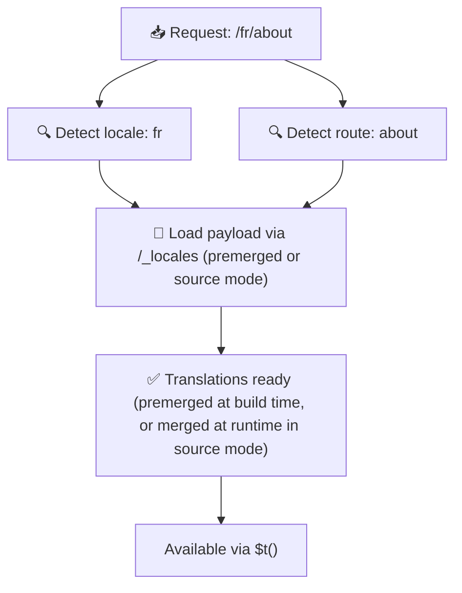

# 📂 Guida alla struttura delle cartelle

## 📖 Introduzione

Organizzare i file di traduzione in modo efficace è essenziale per mantenere un sistema di internazionalizzazione (i18n) scalabile ed efficiente. `Nuxt I18n Micro` semplifica questo processo offrendo un approccio chiaro alla gestione delle traduzioni root e specifiche per pagina. Questa guida ti accompagnerà attraverso la struttura di cartelle consigliata e spiegherà come `Nuxt I18n Micro` gestisce queste traduzioni.

## 🗂️ Struttura di cartelle consigliata

`Nuxt I18n Micro` organizza le traduzioni in file root e file specifici per pagina all'interno della directory `pages`. Con `translationPayloads.mode: 'premerged'` (predefinito), le traduzioni root vengono unite automaticamente in ogni file di pagina in fase di build, così ogni pagina ha un set completo di traduzioni senza overhead di merge a runtime.

Con `mode: 'source'`, i file sorgente restano separati negli asset Nitro e vengono uniti a runtime tramite la route `/_locales`. Consulta [Output dei payload serverless](/guides/performance#serverless-payload-output).

### 🔧 Struttura di base

Ecco un esempio di base della struttura di cartelle da seguire:

```text
locales/
├── pages/
│   ├── index/
│   │   ├── en.json
│   │   ├── fr.json
│   │   └── ar.json
│   ├── about/
│   │   ├── en.json
│   │   ├── fr.json
│   │   └── ar.json
├── en.json
├── fr.json
└── ar.json

```

### 📄 Spiegazione della struttura

#### 1. 🌍 File di traduzione root

- **Percorso:** `/locales/\{locale\}.json` (ad esempio, `/locales/en.json`)
- **Scopo:** questi file contengono traduzioni condivise nell'intera applicazione (menu di navigazione, header, footer, ecc.). Con `mode: 'premerged'` (predefinito), vengono uniti automaticamente in ogni file specifico per pagina in fase di build, così il server restituisce un unico file pre-costruito per pagina.

  **Esempio di contenuto (`/locales/en.json`):**

  ```json
  {
    "menu": {
      "home": "Home",
      "about": "About Us",
      "contact": "Contact"
    },
    "footer": {
      "copyright": "© 2024 Your Company"
    }
  }
  ```

#### 2. 📄 File di traduzione specifici per pagina

- **Percorso:** `/locales/pages/\{routeName\}/\{locale\}.json` (ad esempio, `/locales/pages/index/en.json`)
- **Scopo:** questi file contengono traduzioni specifiche per singole pagine. Con `mode: 'premerged'` (predefinito), le traduzioni root vengono unite come base in fase di build, così ogni file di pagina diventa autosufficiente.

  **Esempio di contenuto (`/locales/pages/index/en.json`):**

  ```json
  {
    "title": "Welcome to Our Website",
    "description": "We offer a wide range of products and services to meet your needs."
  }
  ```

  **Esempio di contenuto (`/locales/pages/about/en.json`):**

  ```json
  {
    "title": "About Us",
    "description": "Learn more about our mission, vision, and values."
  }
  ```

### 📂 Gestire route dinamiche e percorsi annidati

`Nuxt I18n Micro` trasforma automaticamente i segmenti dinamici e i percorsi annidati nelle route in una struttura di cartelle piatta usando una convenzione di rinomina specifica. Questo garantisce che tutte le traduzioni siano memorizzate in modo coerente e facilmente accessibile.

#### Struttura di cartelle per traduzioni di route dinamiche

Quando si gestiscono route dinamiche, come `/products/[id]`, il modulo converte il segmento dinamico `[id]` in un formato statico nella struttura dei file.

**Esempio di struttura di cartelle per route dinamiche:**

Per una route come `/products/[id]`, i file di traduzione verrebbero memorizzati in una cartella chiamata `products-id`:

```text
locales/pages/
├── products-id/
│   ├── en.json
│   ├── fr.json
│   └── ar.json

```

**Esempio di struttura di cartelle per route dinamiche annidate:**

Per una route annidata come `/products/key/[id]`, i file di traduzione verrebbero memorizzati in una cartella chiamata `products-key-id`:

```text
locales/pages/
├── products-key-id/
│   ├── en.json
│   ├── fr.json
│   └── ar.json

```

**Esempio di struttura di cartelle per route annidate su più livelli:**

Per una route annidata più complessa come `/products/category/[id]/details`, i file di traduzione verrebbero memorizzati in una cartella chiamata `products-category-id-details`:

```text
locales/pages/
├── products-category-id-details/
│   ├── en.json
│   ├── fr.json
│   └── ar.json

```

### 🛠 Personalizzare la struttura della directory

Se preferisci memorizzare le traduzioni in una directory diversa, `Nuxt I18n Micro` ti permette di personalizzare la directory in cui vengono memorizzati i file di traduzione. Puoi configurarlo nel tuo file `nuxt.config.ts`.

**Esempio: personalizzare la directory di traduzione**

```typescript
export default defineNuxtConfig({
  i18n: {
    translationDir: 'i18n', // Custom directory path
  },
})
```

Questo istruirà `Nuxt I18n Micro` a cercare i file di traduzione nella directory `/i18n` invece che nella directory predefinita `/locales`.

## ⚙️ Come vengono caricate le traduzioni

### 🌍 Route locale dinamiche

`Nuxt I18n Micro` usa route di locale dinamiche per caricare le traduzioni in modo efficiente. Quando un utente visita una pagina, il modulo determina la locale appropriata e carica i file di traduzione corrispondenti in base alla route e alla locale correnti.



Ad esempio:

- Visitando `/en/index` verranno caricate le traduzioni da `/locales/pages/index/en.json`.
- Visitando `/fr/about` verranno caricate le traduzioni da `/locales/pages/about/fr.json`.

Questo metodo garantisce che vengano caricate solo le traduzioni necessarie, ottimizzando sia il carico del server sia le prestazioni lato client.

### 💾 Caching e pre-rendering

Per migliorare ulteriormente le prestazioni, `Nuxt I18n Micro` supporta il caching e il pre-rendering dei file di traduzione:

- **Caching**: una volta caricato un file di traduzione, viene memorizzato in cache per le richieste successive, riducendo la necessità di scaricare ripetutamente gli stessi dati.
- **Pre-rendering**: durante il processo di build, puoi eseguire il pre-render dei file di traduzione per tutte le locale e le route configurate, permettendo che vengano serviti direttamente dal server senza ritardi a runtime.

## 📝 Best practice

### 📂 Usa i file specifici per pagina con giudizio

Sfrutta i file specifici per pagina per mantenere le traduzioni organizzate. Questo mantiene le traduzioni di ogni pagina leggere e veloci da caricare, cosa particolarmente importante per pagine con contenuti complessi o di grandi dimensioni.

### 🔑 Mantieni coerenti le chiavi di traduzione

Usa convenzioni di denominazione coerenti per le tue chiavi di traduzione nei file. Questo aiuta a mantenere chiarezza e previene problemi nella gestione delle traduzioni, specialmente man mano che l'applicazione cresce.

### 🗂️ Organizza le traduzioni per contesto

Raggruppa le traduzioni correlate nei tuoi file. Ad esempio, raggruppa tutte le etichette dei pulsanti sotto una chiave `buttons` e tutti i testi relativi ai form sotto una chiave `forms`. Questo non solo migliora la leggibilità ma rende anche più facile gestire le traduzioni tra le diverse locale.

### ⚠️ Limite di profondità di annidamento (2 livelli consigliati)

Durante la navigazione lato client, `Nuxt I18n Micro` usa un deep merge ottimizzato a 2 livelli per combinare le traduzioni delle pagine uscenti ed entranti. Questo garantisce che le chiavi annidate sovrapposte (ad esempio entrambe le pagine hanno chiavi sotto `common.*`) siano preservate durante le animazioni di transizione.

**Funziona correttamente per la struttura standard `Section → Key → Value` (2 livelli):**

```json
// Page A translations
{ "common": { "fromA": "Text A" } }

// Page B translations
{ "common": { "fromB": "Text B" } }

// During transition, both are available:
// { "common": { "fromA": "Text A", "fromB": "Text B" } }
```

**Tuttavia, se usi 3 o più livelli di annidamento, le chiavi più profonde possono essere sovrascritte durante le transizioni:**

```json
// Page A translations
{ "auth": { "form": { "login": "Login" } } }

// Page B translations
{ "auth": { "form": { "register": "Register" } } }

// During transition: "login" key is lost
// { "auth": { "form": { "register": "Register" } } }
```


### 🧹 Pulisci regolarmente le traduzioni non utilizzate

Nel tempo, la tua applicazione potrebbe accumulare chiavi di traduzione non usate, specialmente se vengono rimosse o ristrutturate funzionalità. Rivedi e ripulisci periodicamente i tuoi file di traduzione per mantenerli snelli e manutenibili.
