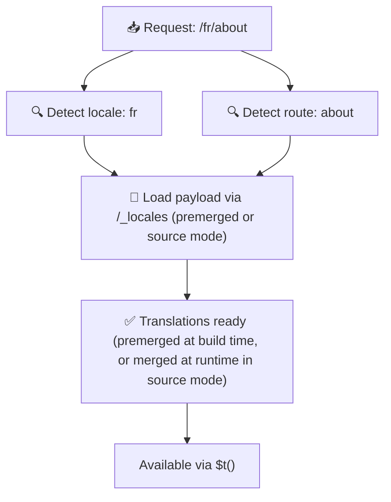

# 📂 Guida alla struttura delle cartelle

## 📖 Introduzione

Organizzare i file di traduzione in modo efficace è essenziale per mantenere un sistema di internazionalizzazione (i18n) scalabile ed efficiente. `Nuxt I18n Micro` semplifica questo processo offrendo un approccio chiaro alla gestione delle traduzioni di root e specifiche per pagina. Questa guida ti mostrerà la struttura di cartelle consigliata e spiegherà come `Nuxt I18n Micro` gestisce queste traduzioni.

## 🗂️ Struttura di cartelle consigliata

`Nuxt I18n Micro` organizza le traduzioni in file di root e file specifici per pagina all'interno della directory `pages`. Con `translationPayloads.mode: 'premerged'` (predefinito), le traduzioni di root vengono unite automaticamente in ogni file di pagina in fase di build, così ogni pagina dispone di un set completo di traduzioni senza overhead di fusione a runtime.

Con `mode: 'source'`, i file sorgente rimangono separati negli asset Nitro e vengono uniti a runtime tramite la rotta `/_locales`. Vedi [Serverless Payload Output](/guides/performance#serverless-payload-output).

### 🔧 Struttura di base

Ecco un esempio di base della struttura di cartelle da seguire:

```text
locales/
├── pages/
│   ├── index/
│   │   ├── en.json
│   │   ├── fr.json
│   │   └── ar.json
│   ├── about/
│   │   ├── en.json
│   │   ├── fr.json
│   │   └── ar.json
├── en.json
├── fr.json
└── ar.json

```

### 📄 Spiegazione della struttura

#### 1. 🌍 File di traduzione di root

- **Percorso:** `/locales/\{locale\}.json` (ad es., `/locales/en.json`)
- **Scopo:** Questi file contengono traduzioni condivise nell'intera applicazione (menu di navigazione, header, footer, ecc.). Con `mode: 'premerged'` (predefinito), vengono unite automaticamente in ogni file specifico per pagina in fase di build, in modo che il server restituisca un unico file precompilato per pagina.

  **Contenuto di esempio (`/locales/en.json`):**

  ```json
  {
    "menu": {
      "home": "Home",
      "about": "About Us",
      "contact": "Contact"
    },
    "footer": {
      "copyright": "© 2024 Your Company"
    }
  }
  ```

#### 2. 📄 File di traduzione specifici per pagina

- **Percorso:** `/locales/pages/\{routeName\}/\{locale\}.json` (ad es., `/locales/pages/index/en.json`)
- **Scopo:** Questi file contengono traduzioni specifiche per singole pagine. Con `mode: 'premerged'` (predefinito), le traduzioni di root vengono unite come base in fase di build, quindi ogni file di pagina diventa autonomo.

  **Contenuto di esempio (`/locales/pages/index/en.json`):**

  ```json
  {
    "title": "Welcome to Our Website",
    "description": "We offer a wide range of products and services to meet your needs."
  }
  ```

  **Contenuto di esempio (`/locales/pages/about/en.json`):**

  ```json
  {
    "title": "About Us",
    "description": "Learn more about our mission, vision, and values."
  }
  ```

### 📂 Gestione di rotte dinamiche e percorsi annidati

`Nuxt I18n Micro` trasforma automaticamente i segmenti dinamici e i percorsi annidati delle rotte in una struttura di cartelle piatta usando una convenzione di rinominazione specifica. Ciò garantisce che tutte le traduzioni siano memorizzate in modo coerente e facilmente accessibile.

#### Struttura delle cartelle di traduzione per rotte dinamiche

Quando si trattano rotte dinamiche, come `/products/[id]`, il modulo converte il segmento dinamico `[id]` in un formato statico nella struttura dei file.

**Struttura di cartelle di esempio per rotte dinamiche:**

Per una rotta come `/products/[id]`, i file di traduzione verrebbero memorizzati in una cartella chiamata `products-id`:

```text
locales/pages/
├── products-id/
│   ├── en.json
│   ├── fr.json
│   └── ar.json

```

**Struttura di cartelle di esempio per rotte dinamiche annidate:**

Per una rotta annidata come `/products/key/[id]`, i file di traduzione verrebbero memorizzati in una cartella chiamata `products-key-id`:

```text
locales/pages/
├── products-key-id/
│   ├── en.json
│   ├── fr.json
│   └── ar.json

```

**Struttura di cartelle di esempio per rotte annidate a più livelli:**

Per una rotta annidata più complessa come `/products/category/[id]/details`, i file di traduzione verrebbero memorizzati in una cartella chiamata `products-category-id-details`:

```text
locales/pages/
├── products-category-id-details/
│   ├── en.json
│   ├── fr.json
│   └── ar.json

```

### 🛠 Personalizzazione della struttura di directory

Se preferisci memorizzare le traduzioni in una directory diversa, `Nuxt I18n Micro` ti permette di personalizzare la directory dove vengono memorizzati i file di traduzione. Puoi configurarlo nel tuo file `nuxt.config.ts`.

**Esempio: Personalizzazione della directory delle traduzioni**

```typescript
export default defineNuxtConfig({
  i18n: {
    translationDir: 'i18n', // Custom directory path
  },
})
```

Questo indicherà a `Nuxt I18n Micro` di cercare i file di traduzione nella directory `/i18n` invece che nella directory predefinita `/locales`.

## ⚙️ Come vengono caricate le traduzioni

### 🌍 Rotte dinamiche di locale

`Nuxt I18n Micro` usa rotte dinamiche di locale per caricare le traduzioni in modo efficiente. Quando un utente visita una pagina, il modulo determina la locale appropriata e carica i file di traduzione corrispondenti in base alla rotta e alla locale correnti.



Ad esempio:

- Visitando `/en/index` verranno caricate le traduzioni da `/locales/pages/index/en.json`.
- Visitando `/fr/about` verranno caricate le traduzioni da `/locales/pages/about/fr.json`.

Questo metodo garantisce che vengano caricate solo le traduzioni necessarie, ottimizzando sia il carico del server sia le prestazioni lato client.

### 💾 Caching e pre-rendering

Per migliorare ulteriormente le prestazioni, `Nuxt I18n Micro` supporta il caching e il pre-rendering dei file di traduzione:

- **Caching**: Una volta caricato un file di traduzione, viene memorizzato in cache per le richieste successive, riducendo la necessità di recuperare ripetutamente gli stessi dati.
- **Pre-rendering**: Durante il processo di build puoi pre-renderizzare i file di traduzione per tutte le locale e le rotte configurate, permettendo loro di essere serviti direttamente dal server senza ritardi a runtime.

## 📝 Best practice

### 📂 Usa i file specifici per pagina con criterio

Sfrutta i file specifici per pagina per tenere organizzate le traduzioni. Ciò mantiene le traduzioni di ogni pagina snelle e veloci da caricare, il che è particolarmente importante per pagine con contenuti complessi o corposi.

### 🔑 Mantieni coerenti le chiavi di traduzione

Usa convenzioni di denominazione coerenti per le tue chiavi di traduzione tra i vari file. Questo aiuta a mantenere la chiarezza e a prevenire problemi durante la gestione delle traduzioni, soprattutto man mano che la tua applicazione cresce.

### 🗂️ Organizza le traduzioni per contesto

Raggruppa insieme le traduzioni correlate nei tuoi file. Ad esempio, raggruppa tutte le etichette dei pulsanti sotto una chiave `buttons` e tutti i testi relativi ai form sotto una chiave `forms`. Ciò non solo migliora la leggibilità, ma rende anche più facile gestire le traduzioni tra diverse locale.

### ⚠️ Limite di profondità di annidamento (consigliati 2 livelli)

Durante la navigazione lato client, `Nuxt I18n Micro` usa un merge profondo ottimizzato a 2 livelli per combinare le traduzioni della pagina in uscita e di quella in entrata. Ciò garantisce che le chiavi annidate sovrapposte (ad es. entrambe le pagine hanno chiavi sotto `common.*`) siano preservate durante le animazioni di transizione.

**Funziona correttamente per la struttura standard `Section → Key → Value` (2 livelli):**

```json
// Page A translations
{ "common": { "fromA": "Text A" } }

// Page B translations
{ "common": { "fromB": "Text B" } }

// During transition, both are available:
// { "common": { "fromA": "Text A", "fromB": "Text B" } }
```

**Tuttavia, se usi 3 o più livelli di annidamento, le chiavi più profonde potrebbero essere sovrascritte durante le transizioni:**

```json
// Page A translations
{ "auth": { "form": { "login": "Login" } } }

// Page B translations
{ "auth": { "form": { "register": "Register" } } }

// During transition: "login" key is lost
// { "auth": { "form": { "register": "Register" } } }
```

<Tip>

</Tip>

### 🧹 Pulisci regolarmente le traduzioni inutilizzate

Nel tempo la tua applicazione potrebbe accumulare chiavi di traduzione inutilizzate, soprattutto se vengono rimosse o ristrutturate delle funzionalità. Rivedi e pulisci periodicamente i tuoi file di traduzione per mantenerli snelli e manutenibili.
